<div style="font-size: 16px; line-height: 1.65;">

<br/>
<div align="center">
  
</div>
<br/>
<h2 align="center"><strong>Universidad Peruana de Ciencias Aplicadas</strong></h2>
<h2 align="center"><strong>Carrera de Ingeniería de Software</strong></h2>

<h2 align="center"><strong>1ASI0730</strong></h2>
<h2 align="center"><strong>Aplicaciones Web</strong></h2>
<h2 align="center">NRC</h2>
<h2 align="center"><strong>12206</strong></h2>
<h2 align="center"><strong>Informe del Trabajo Final</strong></h2>
<h2 align="center">Docente</h2>
<h2 align="center"><strong>Velásquez Núñez, Ángel Augusto</strong></h2>
<h2 align="center">Equipo</h2>
<h2 align="center"><strong>NexumDevs</strong></h2>
<h2 align="center">Proyecto</h2>
<h2 align="center"><strong>VitalTrek</strong></h2>

<h2 align="center"><strong>Integrantes:</strong></h2>


<div align="center">
  <table align="center">
    <thead>
      <tr>
        <th align="center" >Código</th>
        <th align="center" >Nombre</th>
      </tr>
    </thead>
    <tbody>
      <tr>
        <td align="center" >U20241A267</td>
        <td align="center" >Alfaro Mallma, Alberto Joaquin</td>
      </tr>
      <tr>
        <td align="center" >U202324623</td>
        <td align="center" >Quispe Perez, Eder Edu</td>
      </tr>
      <tr>
        <td align="center" >U20241A827</td>
        <td align="center" >Rodriguez Rojas, Miler Alexander</td>
      </tr>
      <tr>
        <td align="center" >U202419483</td>
        <td align="center" >Verastigue Martinez, Giancarlo Jose</td>
      </tr>
      <tr>
        <td align="center" >U202416903</td>
        <td align="center" >Vilchez Vite, Gabriel Alejandro</td>
      </tr>
    </tbody>
  </table>
</div>

<h2 align="center"><strong>Período 202610</strong></h2>
<h2 align="center"><strong>Julio 2026</strong></h2>

<div style="page-break-before: always;"></div>

---

# Registro de Versiones del Informe

| Versión | Fecha       | Autor                               | Descripción de modificación                                                                                                                                                                                                                                                    |
|---------|-------------|-------------------------------------|--------------------------------------------------------------------------------------------------------------------------------------------------------------------------------------------------------------------------------------------------------------------------------|
| 0.1     | 15/04/2026  | Rodriguez Rojas, Miler Alexander    | Se añadio la Carátula, el registro de versiones, la tabla con los Colaboration Insights, el Student Outcome, la descripción del startup, los perfiles de los integrantes y la sección de antecedentes y problematicas.                                                         |
| 0.2     | 16/04/2026  | Alfaro Mallma, Alberto Joaquin      | Se añadio la sección de competidores, el análisis competitivo, las estrategias y las táticas frente a los competidores, el diseño de las entrevistas y las consideraciones metodológicas.                                                                                      |
| 0.3     | 16/04/2026  | Verastigue Martinez, Giancarlo Jose | Se añadieron los Lean UX Problem Statements, los Lean UX Assumptions, el Lean UX Hypothesis Statements y el Lean Ux Canvas.                                                                                                                                                    |
| 0.4     | 18/04/2026  | Alfaro Mallma, Alberto Joaquin      | Se actualizó el análisis competitivo, las estrategias y tácticas frente a Competidores; aparte, se añadio el registro de la 1ra, 2da y 3ra entrevista.                                                                                                                         |
| 0.5     | 19/04/2026  | Vilchez Vite, Gabriel Alejandro     | Se añadio el registro de la 4ta entrevista.                                                                                                                                                                                                                                    |
| 0.6     | 20/04/2026  | Rodriguez Rojas, Miler Alexander    | Se actualizó el registro de las primeras 4 entrevistas.                                                                                                                                                                                                                        |
| 0.7     | 21/04/2026  | Verastigue Martinez, Giancarlo Jose | Se añadieron los User Stories, Impact Mapping y el Product Backlog.                                                                                                                                                                                                            |
| 0.8     | 21/04/2026  | Quispe Perez, Eder Edu              | Se añadieron los User Persona.                                                                                                                                                                                                                                                 |
| 0.9     | 22/04/2026  | Quispe Perez, Eder Edu              | Se añadieron los Style Guidelines.                                                                                                                                                                                                                                             |
| 0.10    | 22/04/2026  | Vilchez Vite, Gabriel Alejandro     | Se añadieron los User Journey Mapping, los Empathy Mapping y el Big Picture Event Storming.                                                                                                                                                                                    |
| 0.11    | 22/04/2026  | Verastigue Martinez, Giancarlo Jose | Se actualizó los Lean UX Problem Statements, los Lean UX Assumptions, los Lean UX Hypothesis Statements y los segmentos objetivo.                                                                                                                                              |
| 0.12    | 22/04/2026  | Rodriguez Rojas, Miler Alexander    | Se añadio la sección de Landing Page Wireframe.                                                                                                                                                                                                                                |
| 0.13    | 23/04/2026  | Rodriguez Rojas, Miler Alexander    | Se añadio la sección de Landing Page Mock-up.                                                                                                                                                                                                                                  |
| 0.14    | 23/04/2026  | Quispe Perez, Eder Edu              | Se añadio el registro de la 5ta entrevista, el análisis de entrevistas y los User Task Matrix; aparte, se actualizó los General Style Guidelines.                                                                                                                              |
| 0.15    | 23/04/2026  | Vilchez Vite, Gabriel Alejandro     | Se añadio el Ubiquitous Language.                                                                                                                                                                                                                                              |
| 0.16    | 24/04/2026  | Quispe Perez, Eder Edu              | Se añadio el Labeling Systems, el SEO Tags and Meta Tags, los Searching Systems y los Navigation Systems.                                                                                                                                                                      |
| 0.17    | 25/04/2026  | Verastigue Martinez, Giancarlo Jose | Se añadio la sección de Software Configuration Management, la sección de Source Code Management, los Software Architecture Context Diagram, los Software Architecture Components Diagrams, los Class Diagrams y los Database Diagrams. Aparte, se actualizo el Lean Ux Canvas. |
| 0.18    | 26/04/2026  | Verastigue Martinez, Giancarlo Jose | Se actualizó los User Stories y el Product Backlog; además, se añadio el Source Code Managment.                                                                                                                                                                                |
| 0.19    | 26/04/2026  | Vilchez Vite, Gabriel Alejandro     | Se actualizó los User Journey Mapping y los Empathy Mapping; aparte, se añadio el Design Level EventStorming.                                                                                                                                                                  |
| 0.20    | 26/04/2026  | Quispe Perez, Eder Edu              | Se actualizó la introducción y se añadio las secciones de Source Code Style Guide & Coding Conventions, Software Deployment Configuration, Landing Page, Services & Applications Implementation; aparte, se añadio el Sprint 1.                                                |
| 0.21    | 26/04/2026  | Alfaro Mallma, Alberto Joaquin      | Se añadieron los Web Applications Wireframes, los Web Applications Mock-ups, los Web Applications User Flow Diagrams y los Web Applications Prototyping.                                                                                                                       |
| 0.22    | 09/05/2026  | Verastigue Martinez, Giancarlo Jose | Se corrigió el contenido del contenido del Cápitulo 1, el Lean UX Process, los User Journey Mapping y los Empathy Mapping                                                                                                                                                      |
| 0.23    | 09/05/2026  | Alfaro Mallma, Alberto Joaquin      | Se corrigió la sección de los Segmentos Objetivo, el Startup Profile, la sección de los Competidores, el Registro de Versiones del Informe, el Project Report Collaboration Insights y la sección de las entrevistas.                                                          |
| 0.24    | 09/05/2026  | Vilchez Vite, Gabriel Alejandro     | Se corrigió los Lean UX Problem Statements, los Lean UX Assumptions, el Big Picture Event Storming y el Ubiquitous Language.                                                                                                                                                   |
| 0.25    | 09/05/2026  | Rodriguez Rojas, Miler Alexander    | Se corrigió el Solution Profile, la sección de Antecedentes y problemática, los User Stories, los Impact Mapping y el Product Backlog.                                                                                                                                         |
| 0.26    | 10/05/2026  | Verastigue Martinez, Giancarlo Jose | Se corrigió los Empathy Maps.                                                                                                                                                                                                                                                  |
| 0.27    | 10/05/2026  | Rodriguez Rojas, Miler Alexander    | Se corrigió el Product Backlog.                                                                                                                                                                                                                                                |
| 0.28    | 11/05/2026  | Rodriguez Rojas, Miler Alexander    | Se añadio la tabla de Software Configuration Management, el Source Code Management y el Software Deployment Configuration; aparte, se actualizó los User Stories.                                                                                                              |
| 0.29    | 11/05/2026  | Vilchez Vite, Gabriel Alejandro     | Se añadio los Web Applications User Flow Diagrams.                                                                                                                                                                                                                             |
| 0.30    | 11/05/2026  | Alfaro Mallma, Alberto Joaquin      | Se actualizó los User Stories.                                                                                                                                                                                                                                                 |
| 0.31    | 12/05/2026  | Verastigue Martinez, Giancarlo Jose | Se añadio el Software Architecture Context Diagram, el Software Architecture Container Diagrams y el Software Architecture Components Diagrams.                                                                                                                                |
| 0.32    | 12/05/2026  | Rodriguez Rojas, Miler Alexander    | Se actualizó el Product Backlog.                                                                                                                                                                                                                                               |
| 0.33    | 13/05/2026  | Alfaro Mallma, Alberto Joaquin      | Se actualizó el registro de las 3 primeras entrevistas; aparte, se añadio los Landing Page Wireframes, los Landing Page Mock-ups y el registro de la entrevista a Rodrigo Quispe Mendoza.                                                                                      |
| 0.34    | 13/05/2026  | Vilchez Vite, Gabriel Alejandro     | Se actualizó los User Goals.                                                                                                                                                                                                                                                   |
| 0.35    | 15/05/2026  | Rodriguez Rojas, Miler Alexander    | Se actualizó el Software Configuration Managment.                                                                                                                                                                                                                              |
| 0.36    | 15/05/2026  | Alfaro Mallma, Alberto Joaquin      | Se añadio el Web Applications Prototyping y el Sprint 2; aparte, se actualizó el Student Outcome, el Web Applications UX/UI Design, el Source Code Management y el Sprint 1.                                                                                                   |
| 0.37    | 15/05/2026  | Vilchez Vite, Gabriel Alejandro     | Se actualizó el Software Configuration Management.                                                                                                                                                                                                                             |
| 0.38    | 26/05/2026  | Verastigue Martinez, Giancarlo Jose | Se corrigió el Sprint Backlog 1 y 2, el Development Evidence for Sprint Review, el Execution Evidence for Sprint Review, el Services Documentation Evidence for Sprint Review, el Team Collaboration Insights during Sprint y el Design-Level EventStorming.                   |
| 0.39    | 07/06/2025  | Verastigue Martinez, Giancarlo Jose | Se actualizó las Tecnical Stories.                                                                                                                                                                                                                                             |
| 0.40    | 16/06/2026  | Alfaro Mallma, Alberto Joaquin      | Se actualizó la sección de Configuración de Firebase y de Publicación de la aplicación.                                                                                                                                                                                        |
| 0.41    | 16/06/2026  | Verastigue Martinez, Giancarlo Jose | Se añadio el Sprint 3.                                                                                                                                                                                                                                                         |
| 0.42    | 20/06/2026  | Quispe Perez, Eder Edu              | Se añadio la 1ra entrevista de validación, las Evaluaciones según heurísticas y el video de demostración; aparte, se actualizó el Sprint 3 y el Execution Evidence for Sprint Review.                                                                                          |
| 0.43    | 20/06/2026  | Vilchez Vite, Gabriel Alejandro     | Se añadio la 2da entrevista de evaluación.                                                                                                                                                                                                                                     |
| 0.44    | 20/06/2026  | Verastigue Martinez, Giancarlo Jose | Se añadio la 3ra entrevista de validación, el Team Collaboration Insights during Sprint, los Validation Interviews y el Video About The Product.                                                                                                                               |
| 0.45    | 20/06/2026  | Rodriguez Rojas, Miler Alexander    | Se añadio la 4ta entrevista de validación.                                                                                                                                                                                                                                     |
| 0.46    | 20/06/2026  | Alfaro Mallma, Alberto Joaquin      | Se aãdio la sección de Software Deployment Evidence for Sprint Review y la sección de Services Documentation Evidence for Sprint Review.                                                                                                                                       |

# Project Report Collaboration Insights

Enlace del repositorio: https://github.com/VitalTrek-Project

| Integrante                            | Tareas Designadas                                                                                                                                                                                                |
|---------------------------------------|------------------------------------------------------------------------------------------------------------------------------------------------------------------------------------------------------------------|
| Alberto Joaquin Alfaro Mallma         | Capítulo I (2.1. Competidores, 2.1.1. Análisis competitivo, 2.1.2. Estrategias y tácticas frente a competidores, 2.2. Entrevistas, 2.2.1. Diseño de entrevistas), Capítulo II ()                                 |
| Vilchez Vite, Gabriel Alejandro       | Capítulo I (2.3.3. User Journey Mapping, 2.3.4. Empathy Mapping, 2.4. Big Picture EventStorming, 2.5. Ubiquitous Language), Capítulo II ()                                                                       |
| Eder Edu Quispe Perez                 | Capítulo I (2.2.3. Análisis de entrevistas, 2.3. Needfinding, 2.3.1. User Personas, 2.3.2. User Task Matrix), Capítulo II ()                                                                                     |
| Miler Alexander Rodriguez Rojas       | Capítulo I (1.1. Startup Profile, 1.1.1. Descripción de la Startup, 1.1.2. Perfiles de integrantes del equipo, 1.2. Solution Profile, 1.2.1 Antecedentes y problemática), Capítulo II ()                         |
| Eduardo David Velasquez Laquihuanaco  | Capítulo I (1.2.2 Lean UX Process, 1.2.2.1. Lean UX Problem Statements, 1.2.2.2. Lean UX Assumptions, 1.2.2.3. Lean UX Hypothesis Statements, 1.2.2.4. Lean UX Canvas, 1.3. Segmentos objetivo.), Capítulo II () |

# Student outcome 

En esta sección se describe cómo las actividades desarrolladas durante el proyecto **VitalTrek** contribuyen al logro del **Student Outcome 5 de ABET**, el cual establece la capacidad de funcionar efectivamente en un equipo cuyos miembros proporcionan liderazgo, crean un entorno colaborativo e inclusivo, establecen objetivos, planifican tareas y cumplen metas. Para evidenciar este resultado, se presentan las contribuciones realizadas por cada integrante durante las diferentes entregas del proyecto (**AV1, TB1, AV2 y TB2**), así como las conclusiones obtenidas para cada criterio evaluado.

| Criterio específico | Acciones realizadas | Conclusiones |
| :- | :- | :- |
| **Trabaja en equipo para proporcionar liderazgo en forma conjunta.** | **AV1:**<br><br>**Alberto Joaquin Alfaro Mallma:** Participé en la elaboración del Capítulo IV del informe, apoyando en el diseño de la arquitectura de software y colaborando en el desarrollo de la primera versión de la Landing Page.<br><br>**Eder Edu Quispe Perez:** Participé en la elaboración del Capítulo II y colaboré en el desarrollo de la primera versión de la Landing Page, aportando en la organización del contenido y la propuesta de valor del producto.<br><br>**Miler Alexander Rodriguez Rojas:** Participé en la elaboración del Capítulo III y colaboré en la implementación de la primera versión de la Landing Page, apoyando en la estructura general del proyecto.<br><br>**Giancarlo Jose Verastigue Martinez:** Participé en la elaboración del Capítulo I y colaboré en el desarrollo de la primera versión de la Landing Page, aportando en la organización de la información del proyecto.<br><br>**Gabriel Alejandro Vilchez Vite:** Participé en la elaboración del Capítulo V y colaboré en la implementación inicial de la Landing Page, apoyando en la integración del proyecto.<br><br>**TB1:**<br><br>**Alberto Joaquin Alfaro Mallma:** Implementé el Bounded Context **Dashboard** de la Web Application v1.0.0 y colaboré en la integración del Frontend.<br><br>**Eder Edu Quispe Perez:** Lideré la mejora de la segunda versión de la Landing Page, actualizando la identidad visual y optimizando la redacción para mejorar la comprensión de la propuesta de valor de VitalTrek.<br><br>**Miler Alexander Rodriguez Rojas:** Implementé el Bounded Context **Tour Management**, colaborando en la integración de la primera versión funcional de la Web Application.<br><br>**Giancarlo Jose Verastigue Martinez:** Implementé el Bounded Context **Monitoring**, apoyando en el desarrollo de la arquitectura del Frontend.<br><br>**Gabriel Alejandro Vilchez Vite:** Implementé el Bounded Context **Navigation and Expedition**, colaborando con el equipo en la integración de los diferentes módulos de la aplicación.<br><br>**AV2:**<br><br>**Alberto Joaquin Alfaro Mallma:** Continué la evolución del Bounded Context **Dashboard**, participé en el desarrollo colaborativo del Backend y lideré el despliegue (deployment) de la Landing Page, la Web Application y la API del proyecto.<br><br>**Eder Edu Quispe Perez:** Implementé el Bounded Context **Loyalty & Engagement** del Backend y colaboré en el desarrollo conjunto de la arquitectura Backend basada en Domain-Driven Design.<br><br>**Miler Alexander Rodriguez Rojas:** Continué el desarrollo del Bounded Context **Tour Management**, participé en el desarrollo colaborativo del Backend e implementé la sección **Call to Action (CTA)** en la tercera versión de la Landing Page.<br><br>**Giancarlo Jose Verastigue Martinez:** Mejoré el Bounded Context **Monitoring**, colaboré en la implementación del Backend e incorporé el **video About Us** en la Landing Page.<br><br>**Gabriel Alejandro Vilchez Vite:** Continué el desarrollo del Bounded Context **Navigation and Expedition** y colaboré en la implementación conjunta de los diferentes Bounded Contexts del Backend.<br><br>**TB2:**<br><br>**Alberto Joaquin Alfaro Mallma:** Lideré el despliegue final de la plataforma, apoyé en la integración de las mejoras de la Web Application y colaboré en la revisión y corrección de la documentación técnica del proyecto.<br><br>**Eder Edu Quispe Perez:** Participé en la implementación y mejora del Backend, colaborando en la integración del módulo **IAM**, la **pasarela de pagos** y la optimización de funcionalidades de la plataforma, además de apoyar en la revisión del informe.<br><br>**Miler Alexander Rodriguez Rojas:** Colaboré en la mejora continua de la Web Application, apoyando en la implementación de nuevas funcionalidades, la integración de la pasarela de pagos y la corrección de la documentación del proyecto.<br><br>**Giancarlo Jose Verastigue Martinez:** Participé en la optimización de los módulos implementados durante las entregas anteriores, colaborando en la mejora del Backend, la integración de nuevas funcionalidades y la revisión técnica del informe.<br><br>**Gabriel Alejandro Vilchez Vite:** Contribuí en la mejora de la plataforma mediante la implementación y validación de funcionalidades adicionales, apoyando en la integración de componentes y en la revisión final de la documentación. | **AV1:**<br>El equipo ejerció liderazgo conjunto al distribuir responsabilidades para la elaboración del informe y el desarrollo de la primera versión de la Landing Page, estableciendo una base sólida para el proyecto.<br><br>**TB1:**<br>Durante el Sprint 2, el liderazgo colaborativo permitió mejorar la Landing Page e implementar la primera versión funcional de la Web Application mediante la distribución de los diferentes Bounded Contexts entre los integrantes del equipo.<br><br>**AV2:**<br>En el Sprint 3, el liderazgo conjunto se fortaleció mediante el desarrollo colaborativo del Backend, la evolución de la Web Application, la incorporación de nuevas funcionalidades en la Landing Page y el despliegue de la solución, permitiendo consolidar una arquitectura basada en Domain-Driven Design.<br><br>**TB2:**<br>Durante la entrega final, el equipo consolidó el desarrollo de VitalTrek mediante la integración de mejoras funcionales en la plataforma, la implementación de la pasarela de pagos, la incorporación del módulo de autenticación (IAM), el despliegue definitivo de la solución y la revisión integral de la documentación, evidenciando un liderazgo compartido y el cumplimiento de los objetivos planteados. |
| **Crea un entorno colaborativo e inclusivo, establece metas, planifica tareas y cumple objetivos.** | **AV1:**<br><br>**Alberto Joaquin Alfaro Mallma:** Colaboré en la planificación de las actividades relacionadas con la arquitectura del sistema y el desarrollo de la Landing Page, promoviendo la comunicación constante con el equipo.<br><br>**Eder Edu Quispe Perez:** Participé en la organización del contenido del proyecto y en la planificación de las actividades para la implementación inicial de la Landing Page.<br><br>**Miler Alexander Rodriguez Rojas:** Apoyé en la planificación del desarrollo del proyecto y en la organización de las actividades relacionadas con la implementación inicial del producto.<br><br>**Giancarlo Jose Verastigue Martinez:** Colaboré en la revisión de los primeros capítulos del informe y participé en la planificación de las actividades del equipo.<br><br>**Gabriel Alejandro Vilchez Vite:** Participé en la coordinación de las tareas relacionadas con el desarrollo inicial del proyecto y la integración de la Landing Page.<br><br>**TB1:**<br><br>**Alberto Joaquin Alfaro Mallma:** Planifiqué el desarrollo del Bounded Context **Dashboard**, coordinando su integración con el resto de módulos del Frontend.<br><br>**Eder Edu Quispe Perez:** Coordiné las mejoras de la Landing Page, promoviendo una comunicación más clara de la propuesta de valor y una identidad visual consistente.<br><br>**Miler Alexander Rodriguez Rojas:** Planifiqué e implementé el Bounded Context **Tour Management**, manteniendo la integración con los demás componentes de la aplicación.<br><br>**Giancarlo Jose Verastigue Martinez:** Participé en la planificación e implementación del Bounded Context **Monitoring**, asegurando su coherencia con la arquitectura del sistema.<br><br>**Gabriel Alejandro Vilchez Vite:** Colaboré en la planificación e implementación del Bounded Context **Navigation and Expedition**, integrándolo con el resto de la Web Application.<br><br>**AV2:**<br><br>**Alberto Joaquin Alfaro Mallma:** Coordiné las actividades relacionadas con el despliegue de la plataforma y colaboré en la integración de los servicios implementados.<br><br>**Eder Edu Quispe Perez:** Participé en la planificación del desarrollo del Backend, colaborando en la implementación del módulo **IAM** y del Bounded Context **Loyalty & Engagement**.<br><br>**Miler Alexander Rodriguez Rojas:** Colaboré en la planificación de las mejoras funcionales del sistema y en el desarrollo del Backend y la Landing Page.<br><br>**Giancarlo Jose Verastigue Martinez:** Participé en la revisión de la arquitectura implementada y colaboré en la integración del Backend y las mejoras de la Landing Page.<br><br>**Gabriel Alejandro Vilchez Vite:** Apoyé en la planificación de las actividades relacionadas con el desarrollo del Backend y la integración de los diferentes módulos implementados por el equipo.<br><br>**TB2:**<br><br>**Alberto Joaquin Alfaro Mallma:** Coordiné el despliegue final de la solución y apoyé la integración de las mejoras implementadas en la plataforma.<br><br>**Eder Edu Quispe Perez:** Participé en la planificación de las mejoras finales del Backend, colaborando en la implementación del módulo IAM, la pasarela de pagos y la validación de las funcionalidades desarrolladas por el equipo.<br><br>**Miler Alexander Rodriguez Rojas:** Colaboré en la planificación e implementación de nuevas funcionalidades de la plataforma, apoyando la integración de la pasarela de pagos y la actualización de la documentación.<br><br>**Giancarlo Jose Verastigue Martinez:** Participé en la validación técnica de las mejoras implementadas durante la etapa final y colaboré en la revisión de la documentación del proyecto.<br><br>**Gabriel Alejandro Vilchez Vite:** Apoyé en la planificación de las actividades finales del proyecto, colaborando en la revisión del código, la validación de funcionalidades y las correcciones de la documentación. | **AV1:**<br>La planificación conjunta permitió organizar eficientemente las responsabilidades del equipo para desarrollar la documentación inicial y la primera versión de la Landing Page, cumpliendo los objetivos definidos para la primera entrega.<br><br>**TB1:**<br>La coordinación del equipo permitió mejorar significativamente la Landing Page e implementar la primera versión funcional de la Web Application mediante una adecuada distribución de responsabilidades y una comunicación constante entre los integrantes.<br><br>**AV2:**<br>La planificación colaborativa permitió evolucionar el proyecto mediante el desarrollo simultáneo de la tercera versión de la Landing Page, la Web Application v2.0.0 y el Backend v1.0.0, favoreciendo una integración eficiente de todos los componentes implementados.<br><br>**TB2:**<br>El equipo cumplió satisfactoriamente los objetivos planteados para la entrega final mediante la integración de las mejoras de la plataforma, la implementación de la pasarela de pagos, el módulo IAM, el despliegue definitivo de la solución y la actualización de la documentación, evidenciando un entorno de trabajo colaborativo, organizado y orientado al cumplimiento de metas.
|

# Tabla de Contenido

- [Registro de Versiones del Informe](#registro-de-versiones-del-informe)
- [Project Report Collaboration Insights](#project-report-collaboration-insights)
- [Student Outcome](#student-outcome)

- [Capítulo I: Introducción](#capítulo-i-introducción)
  - [1.1. Startup Profile](#11-startup-profile)
    - [1.1.1. Descripción de la Startup](#111-descripción-de-la-startup)
    - [1.1.2. Perfiles de integrantes del equipo](#112-perfiles-de-integrantes-del-equipo)
  - [1.2. Solution Profile](#12-solution-profile)
    - [1.2.1. Antecedentes y problemática](#121-antecedentes-y-problemática)
    - [1.2.2. Lean UX Process](#122-lean-ux-process)
      - [1.2.2.1. Lean UX Problem Statements](#1221-lean-ux-problem-statements)
      - [1.2.2.2. Lean UX Assumptions](#1222-lean-ux-assumptions)
      - [1.2.2.3. Lean UX Hypothesis Statements](#1223-lean-ux-hypothesis-statements)
      - [1.2.2.4. Lean UX Canvas](#1224-lean-ux-canvas)
  - [1.3. Segmentos objetivo](#13-segmentos-objetivo)

- [Capítulo II: Requirements Elicitation & Analysis](#capítulo-ii-requirements-elicitation--analysis)
  - [2.1. Competidores](#21-competidores)
    - [2.1.1. Análisis competitivo](#211-análisis-competitivo)
    - [2.1.2. Estrategias y tácticas frente a competidores](#212-estrategias-y-tácticas-frente-a-competidores)
  - [2.2. Entrevistas](#22-entrevistas)
    - [2.2.1. Diseño de entrevistas](#221-diseño-de-entrevistas)
    - [2.2.2. Registro de entrevistas](#222-registro-de-entrevistas)
    - [2.2.3. Análisis de entrevistas](#223-análisis-de-entrevistas)
  - [2.3. Needfinding](#23-needfinding)
    - [2.3.1. User Personas](#231-user-personas)
    - [2.3.2. User Task Matrix](#232-user-task-matrix)
    - [2.3.3. User Journey Mapping](#233-user-journey-mapping)
    - [2.3.4. Empathy Mapping](#234-empathy-mapping)
    - [2.3.5. As-is Scenario Mapping](#235-as-is-scenario-mapping)
  - [2.4. Big Picture Event Storming](#24-big-picture-event-storming)
  - [2.5. Ubiquitous Language](#25-ubiquitous-language)

- [Capítulo III: Requirements Specification](#capítulo-iii-requirements-specification)
  - [3.1. User Stories](#31-user-stories)
  - [3.2. Impact Mapping](#32-impact-mapping)
  - [3.3. Product Backlog](#33-product-backlog)

- [Capítulo IV: Product Design](#capítulo-iv-product-design)
  - [4.1. Style Guidelines](#41-style-guidelines)
    - [4.1.1. General Style Guidelines](#411-general-style-guidelines)
    - [4.1.2. Web Style Guidelines](#412-web-style-guidelines)
  - [4.2. Information Architecture](#42-information-architecture)
    - [4.2.1. Organization Systems](#421-organization-systems)
    - [4.2.2. Labeling Systems](#422-labeling-systems)
    - [4.2.3. SEO Tags and Meta Tags](#423-seo-tags-and-meta-tags)
    - [4.2.4. Searching Systems](#424-searching-systems)
    - [4.2.5. Navigation Systems](#425-navigation-systems)
  - [4.3. Landing Page UI Design](#43-landing-page-ui-design)
    - [4.3.1. Landing Page Wireframe](#431-landing-page-wireframe)
    - [4.3.2. Landing Page Mock-up](#432-landing-page-mock-up)
  - [4.4. Web Applications UX/UI Design](#44-web-applications-uxui-design)
    - [4.4.1. Web Applications Wireframes](#441-web-applications-wireframes)
    - [4.4.2. Web Applications Wireflow Diagrams](#442-web-applications-wireflow-diagrams)
    - [4.4.3. Web Applications Mock-ups](#443-web-applications-mock-ups)
    - [4.4.4. Web Applications User Flow Diagrams](#444-web-applications-user-flow-diagrams)
  - [4.5. Web Applications Prototyping](#45-web-applications-prototyping)
  - [4.6. Domain-Driven Software Architecture](#46-domain-driven-software-architecture)
    - [4.6.1. Design-Level EventStorming](#461-design-level-eventstorming)
    - [4.6.2. Software Architecture Context Diagram](#462-software-architecture-context-diagram)
    - [4.6.3. Software Architecture Container Diagrams](#463-software-architecture-container-diagrams)
    - [4.6.4. Software Architecture Components Diagrams](#464-software-architecture-components-diagrams)
  - [4.7. Software Object-Oriented Design](#47-software-object-oriented-design)
    - [4.7.1. Class Diagrams](#471-class-diagrams)
  - [4.8. Database Design](#48-database-design)
    - [4.8.1. Database Diagrams](#481-database-diagrams)

- [Capítulo V: Product Implementation, Validation & Deployment](#capítulo-v-product-implementation-validation--deployment)
  - [5.1. Software Configuration Management](#51-software-configuration-management)
    - [5.1.1. Software Development Environment Configuration](#511-software-development-environment-configuration)
    - [5.1.2. Source Code Management](#512-source-code-management)
    - [5.1.3. Source Code Style Guide & Conventions](#513-source-code-style-guide--conventions)
    - [5.1.4. Software Deployment Configuration](#514-software-deployment-configuration)
  - [5.2. Landing Page, Services & Applications Implementation](#52-landing-page-services--applications-implementation)
    - [5.2.1. Sprint 1](#521-sprint-1)
      - [5.2.1.1. Sprint Planning 1](#5211-sprint-planning-1)
      - [5.2.1.2. Aspect Leaders and Collaborators](#5212-aspect-leaders-and-collaborators)
      - [5.2.1.3. Sprint Backlog 1](#5213-sprint-backlog-1)
      - [5.2.1.4. Development Evidence for Sprint Review](#5214-development-evidence-for-sprint-review)
      - [5.2.1.5. Execution Evidence for Sprint Review](#5215-execution-evidence-for-sprint-review)
      - [5.2.1.6. Services Documentation Evidence for Sprint Review](#5216-services-documentation-evidence-for-sprint-review)
      - [5.2.1.7. Software Deployment Evidence for Sprint Review](#5217-software-deployment-evidence-for-sprint-review)
      - [5.2.1.8. Team Collaboration Insights during Sprint](#5218-team-collaboration-insights-during-sprint)
    - [5.2.2. Sprint 2](#522-sprint-2)
      - [5.2.2.1. Sprint Planning 2](#5221-sprint-planning-2)
      - [5.2.2.2. Aspect Leaders and Collaborators](#5222-aspect-leaders-and-collaborators)
      - [5.2.2.3. Sprint Backlog 2](#5223-sprint-backlog-2)
      - [5.2.2.4. Development Evidence for Sprint Review](#5224-development-evidence-for-sprint-review)
      - [5.2.2.5. Execution Evidence for Sprint Review](#5225-execution-evidence-for-sprint-review)
      - [5.2.2.6. Services Documentation Evidence for Sprint Review](#5226-services-documentation-evidence-for-sprint-review)
      - [5.2.2.7. Software Deployment Evidence for Sprint Review](#5227-software-deployment-evidence-for-sprint-review)
      - [5.2.2.8. Team Collaboration Insights during Sprint](#5228-team-collaboration-insights-during-sprint)
    - [5.2.3. Sprint 3](#523-sprint-3)
      - [5.2.3.1. Sprint Planning 3](#5231-sprint-planning-3)
      - [5.2.3.2. Aspect Leaders and Collaborators](#5232-aspect-leaders-and-collaborators)
      - [5.2.3.3. Sprint Backlog 3](#5233-sprint-backlog-3)
      - [5.2.3.4. Development Evidence for Sprint Review](#5234-development-evidence-for-sprint-review)
      - [5.2.3.5. Execution Evidence for Sprint Review](#5235-execution-evidence-for-sprint-review)
      - [5.2.3.6. Services Documentation Evidence for Sprint Review](#5236-services-documentation-evidence-for-sprint-review)
      - [5.2.3.7. Software Deployment Evidence for Sprint Review](#5237-software-deployment-evidence-for-sprint-review)
      - [5.2.3.8. Team Collaboration Insights during Sprint](#5238-team-collaboration-insights-during-sprint)
    - [5.2.4. Sprint 4](#524-sprint-4)
      - [5.2.4.1. Sprint Planning 4](#5241-sprint-planning-4)
      - [5.2.4.2. Aspect Leaders and Collaborators](#5242-aspect-leaders-and-collaborators)
      - [5.2.4.3. Sprint Backlog 4](#5243-sprint-backlog-4)
      - [5.2.4.4. Development Evidence for Sprint Review](#5244-development-evidence-for-sprint-review)
      - [5.2.4.5. Execution Evidence for Sprint Review](#5245-execution-evidence-for-sprint-review)
      - [5.2.4.6. Services Documentation Evidence for Sprint Review](#5246-services-documentation-evidence-for-sprint-review)
      - [5.2.4.7. Software Deployment Evidence for Sprint Review](#5247-software-deployment-evidence-for-sprint-review)
      - [5.2.4.8. Team Collaboration Insights during Sprint](#5248-team-collaboration-insights-during-sprint)
  - [5.3. Validation Interviews](#53-validation-interviews)
    - [5.3.1. Diseño de Entrevistas](#531-diseño-de-entrevistas)
    - [5.3.2. Registro de Entrevistas](#532-registro-de-entrevistas)
    - [5.3.3. Evaluaciones según heurísticas](#533-evaluaciones-según-heurísticas)
  - [5.4. Video About-the-Product](#54-video-about-the-product)

- [Conclusiones](#conclusiones)
- [Bibliografía](#bibliografía)
- [Anexos](#anexos)


<div style="page-break-before: always;"></div>

---

# Capítulo I: Introducción

## 1.1. Startup Profile

### 1.1.1. Descripción de la Startup

Nexum Devs es una startup tecnológica enfocada en el desarrollo de soluciones para el turismo de aventura en el Perú, orientada a mejorar la seguridad, trazabilidad y gestión operativa en entornos de baja conectividad. Surge para cubrir la falta de sistemas que permitan el monitoreo en tiempo real de turistas en zonas remotas.

Su producto principal, VitalTrek, es una plataforma web y móvil que centraliza la gestión de tours, permitiendo a las agencias supervisar la ubicación, estado y progreso de sus grupos mediante dashboards y alertas ante anomalías. A su vez, los turistas acceden a herramientas de navegación offline, registro de su experiencia y visualización de información contextual del recorrido.

A nivel técnico, VitalTrek integra un ecosistema IoT con dispositivos wearables y checkpoints Bluetooth que capturan datos de geolocalización y signos vitales. Estos se sincronizan de forma asincrónica, asegurando operatividad incluso sin conexión continua, lo que permite un sistema escalable, resiliente y orientado a la prevención de riesgos.


### 1.1.2 Perfiles de integrantes del equipo

| Foto | Integrante |
|------|-----------|
|  | **Alfaro Mallma, Alberto Joaquin** — Código de Estudiante: U20241A267. Soy estudiante de Ingeniería de Software de quinto ciclo, enfocado en el desarrollo de soluciones web creativas y funcionales. Me considero una persona creativa, responsable y con capacidad para trabajar en equipo, aportando ideas innovadoras y adaptándome a las necesidades del proyecto. Cuento con conocimientos en HTML, CSS, JavaScript, Angular 7 y Node.js, que aplico en proyectos académicos y personales. |
|  | **Quispe Perez, Eder Edu** — Código de Estudiante: U202324623. Soy estudiante de Ingeniería de Software en la UPC, manejo Python y C++, y en mi tiempo libre me gusta ver películas y series. |
|  | **Rodriguez Rojas, Miler Alexander** — Código de Estudiante: U20241A827. Soy estudiante de Ingeniería de Software de quinto ciclo, enfocado en soluciones tecnológicas eficientes. Me considero una persona con liderazgo, capaz de trabajar en equipo y adaptarme rápidamente a distintos entornos. Tengo conocimientos en SQL Server, C++, HTML, CSS y Python. |
|  | **Vilchez Vite, Gabriel Alejandro** — Código de Estudiante: U202416903. Estudio Ingeniería de Software en mi 5to ciclo. Soy responsable, ordenado y tengo conocimientos en matemáticas, C++ y Matlab. |
|  | **Verastigue Martinez, Giancarlo Jose** — Código de Estudiante: U202419483. Soy estudiante de Ingeniería de Software con experiencia trabajando en equipo y bajo presión. Me considero organizado y detallista, con habilidades para afrontar problemas de manera exitosa. |
---
## 1.2. Solution Profile

### 1.2.1. Antecedentes y problemática

En los últimos años, el turismo de aventura en el Perú ha presentado un crecimiento constante debido al interés de turistas nacionales e internacionales por actividades como trekking, montañismo y exploración en zonas naturales. El Ministerio de Comercio Exterior y Turismo ([MINCETUR](https://www.gob.pe/institucion/mincetur/noticias/563063-se-aprueban-veintidos-modalidades-de-turismo-de-aventura)) reconoce al turismo de aventura como un segmento importante dentro de la actividad turística nacional y ha aprobado diversas modalidades para fortalecer su desarrollo y regulación.

Muchas de estas actividades se desarrollan en áreas alejadas de centros urbanos, donde la cobertura de red móvil es limitada o inexistente debido a las condiciones geográficas del territorio peruano. Según reportes del Organismo Supervisor de Inversión Privada en Telecomunicaciones ([OSIPTEL](https://www.osiptel.gob.pe/portal-del-usuario/noticias/checa-tu-senal-asi-puedes-verificar-la-cobertura-movil-en-tu-distrito/)), todavía existen zonas del país con limitaciones de cobertura móvil y variaciones en la calidad del servicio, especialmente en áreas rurales y de difícil acceso.

Actualmente, las agencias de turismo y los guías dependen principalmente de teléfonos móviles y aplicaciones convencionales de comunicación y geolocalización para coordinar recorridos y mantener contacto con los grupos. Sin embargo, estas herramientas presentan limitaciones en zonas sin señal, generando dificultades para el monitoreo continuo de los turistas y la atención oportuna ante situaciones de emergencia. Esta problemática evidencia la necesidad de implementar soluciones tecnológicas adaptadas al contexto geográfico y operativo del turismo de aventura en el país.

| Pregunta | Formulación | Respuesta |
|----------|-------------|-----------|
| **Who?** | ¿Quiénes son los afectados? | Las agencias de turismo de aventura, los guías turísticos y los turistas nacionales e internacionales que realizan expediciones en zonas remotas del Perú, donde la limitada cobertura móvil dificulta el monitoreo y la comunicación durante el recorrido. |
| **What?** | ¿Cuál es el problema? | La falta de un sistema integrado de monitoreo en tiempo real de ubicación y signos vitales limita la capacidad de respuesta ante emergencias y reduce la seguridad de los turistas durante actividades de aventura en zonas sin cobertura de red. |
| **Where?** | ¿Dónde ocurre? | El problema se presenta en rutas de turismo de aventura ubicadas en zonas remotas del Perú, especialmente en circuitos de trekking de los Andes, selva alta y áreas naturales con geografía compleja y cobertura móvil limitada o inexistente. |
| **When?** | ¿Cuándo se hace más evidente? | Durante el desarrollo de las expediciones, principalmente en situaciones de separación de grupos, cambios climáticos bruscos, recorridos de alta dificultad o ante emergencias médicas como fatiga extrema, deshidratación o mal de altura. |
| **Why?** | ¿Por qué ocurre? | Debido a que las herramientas de comunicación y geolocalización utilizadas actualmente dependen de conexión móvil o internet para funcionar correctamente. En zonas remotas del Perú, la cobertura es limitada o inexistente, lo que genera pérdida de comunicación y dificultades para el monitoreo en tiempo real. |
| **How?** | ¿Cómo se manifiesta? | Se manifiesta mediante pérdida de comunicación entre integrantes del grupo, dificultades para ubicar turistas en tiempo real, retrasos en la atención de emergencias y dependencia de aplicaciones móviles que dejan de funcionar correctamente en zonas sin cobertura. |
| **How Much?** | ¿Cuánta es la magnitud? | El crecimiento sostenido del turismo de aventura en el Perú ha incrementado la cantidad de expediciones realizadas en zonas de difícil acceso. Sin embargo, gran parte de estas áreas presenta limitaciones de conectividad, lo que incrementa los riesgos de accidentes, extravíos y retrasos en la respuesta ante emergencias, afectando tanto la seguridad de los turistas como la capacidad operativa de las agencias. |

---

### 1.2.2. Lean UX Process

#### 1.2.2.1. Lean UX Problem Statements

*Domain*

VitalTrek opera en la intersección de la gestión logística turística, la seguridad preventiva y la telemetría IoT. El entorno de acción se ubica en el turismo de aventura y expediciones al aire libre, específicamente en geografías caracterizadas por la ausencia o intermitencia de infraestructura de telecomunicaciones tradicionales.

*Customer Segments*

El modelo de servicio atiende a dos actores fundamentales en el ecosistema turístico:

- *Segmento B2B (Operativo):* Agencias de turismo de aventura, operadores logísticos, directores de ruta y guías de montaña que gestionan expediciones en zonas remotas del Perú.
- *Segmento B2C (Usuario Final):* Turistas, senderistas y exploradores, nacionales e internacionales, que contratan estos servicios y transitan por rutas de baja o nula conectividad.

*Pain Points*

- *Para las agencias:* La supervisión actual depende de reportes manuales o radiocomunicaciones inestables, generando una ceguera operativa. Desconocen la ubicación exacta y el estado fisiológico de sus clientes en tiempo real, lo que provoca tiempos de reacción lentos ante emergencias, elevando los costos de rescate y exponiendo a la empresa a riesgos legales y reputacionales.
- *Para los turistas:* La desconexión total en zonas remotas genera ansiedad e inseguridad. La incapacidad de acceder a mapas interactivos o información del entorno sin conexión disminuye la autonomía y empobrece la experiencia general del recorrido.

*Gap*

Existe una clara desconexión entre la necesidad de seguridad continua y las herramientas disponibles. Las soluciones satelitales actuales son financieramente prohibitivas para equipar a cada turista de forma individual. Las aplicaciones móviles estándar quedan completamente inoperativas al perder la señal celular. No existe actualmente un sistema híbrido y accesible que integre monitoreo biométrico y geolocalización de forma autónoma, sin depender de redes 4G/5G en tiempo real.

*Vision / Strategy*

Nuestra visión es establecer a VitalTrek como el estándar tecnológico para la gestión de riesgo en el turismo de aventura en el Perú. La estrategia se basa en desplegar una arquitectura de hardware y software resiliente: un ecosistema IoT asincrónico mediante wearables de bajo costo y checkpoints Bluetooth estratégicamente ubicados, que capturen signos vitales y datos de ubicación sincronizados en ráfagas. Esto permitirá transformar la gestión de las agencias de un modelo reactivo a uno predictivo, mediante dashboards centralizados y alertas automatizadas, mientras se dota al turista de herramientas robustas de navegación offline.

*Initial Segment*

El despliegue inicial apuntará a agencias de turismo de aventura de tamaño mediano a grande que operan rutas de trekking de alta exigencia, como circuitos de alta montaña o selva densa. Estas agencias manejan volúmenes considerables de turistas, enfrentan los mayores riesgos operativos por la nula conectividad de sus zonas de trabajo y tienen urgencia por elevar sus estándares internacionales de seguridad.

¿Cómo podemos mejorar la capacidad de respuesta y supervisión en rutas de aventura, logrando que las agencias actúen de manera preventiva y los turistas se sientan seguros incluso sin conexión?

#### 1.2.2.2. Lean UX Assumptions

*Assumptions Worksheet*

*Business Assumptions*

- *Creo que mis clientes tienen la necesidad de* mantener una supervisión constante sobre la ubicación y el estado de salud de los grupos de turistas en zonas remotas, reduciendo la incertidumbre y los tiempos de respuesta ante emergencias, sin depender de redes de telecomunicaciones tradicionales.

- *Estas necesidades pueden resolverse con* VitalTrek, una plataforma web integrada con un ecosistema IoT (wearables y checkpoints Bluetooth) que captura y sincroniza de forma asincrónica datos biométricos y de geolocalización, dotando a las agencias de dashboards de control y a los turistas de herramientas de navegación offline.

- *Mis clientes iniciales son:*
    - *Segmento B2B:* Agencias de turismo de aventura y guías de alta montaña que gestionan rutas en zonas de baja o nula conectividad.
    - *Segmento B2C:* Turistas y senderistas que buscan experiencias al aire libre seguras y desean registrar su progreso.

- *El principal valor que un cliente quiere obtener de mi servicio es* seguridad preventiva y visibilidad operativa en tiempo real de toda la expedición, con autonomía total frente a la falta de cobertura celular.

- *También pueden obtener estos beneficios adicionales:*
    - Para las agencias: reducción de costos en misiones de búsqueda y rescate, y mejora en certificaciones de seguridad internacionales.
    - Para los turistas: acceso a mapas interactivos offline, información contextual del recorrido y registro digital de su experiencia.

- *Adquiriré la mayoría de mis clientes a través de* venta directa B2B a agencias consolidadas, alianzas con asociaciones de guías de montaña y federaciones de andinismo, y presencia en ferias de turismo de aventura.

- *Ganaré dinero mediante* un modelo híbrido HaaS/SaaS: venta o alquiler de infraestructura física (wearables y checkpoints Bluetooth) combinado con suscripción mensual o anual por el uso de la plataforma, almacenamiento en la nube y gestión de alertas.

- *Mi principal competencia en el mercado será* sistemas de comunicación por radio (VHF/UHF), dispositivos de mensajería satelital como Garmin inReach, y la gestión logística puramente manual.

- *Superaremos a la competencia debido a* nuestro enfoque escalable y preventivo: a diferencia de los dispositivos satelitales costosos por usuario, VitalTrek permite monitorear automáticamente a decenas de turistas simultáneamente, detectando anomalías fisiológicas antes de que se conviertan en emergencias críticas.

- *El mayor riesgo de mi producto es* que la latencia en la sincronización asincrónica sea demasiado alta para ser útil en una emergencia médica aguda, o que el hardware sufra averías en condiciones climáticas extremas.

- *Lo resolveremos mediante* un diseño de arquitectura de red que priorice la transmisión de alertas críticas en ráfagas cortas de datos, y certificaciones de resistencia industrial para todo el hardware IoT.

- *Otras suposiciones que, si se demuestran falsas, harán que nuestro negocio fracase:*
    - Que las agencias de turismo estén dispuestas a invertir en infraestructura tecnológica preventiva.
    - Que los turistas acepten utilizar wearables de la agencia sin percibir invasión a su privacidad.

*User Assumptions*

- *¿Quién es el usuario?*
    - El operador (B2B): directores de agencias y guías líderes que necesitan herramientas logísticas para garantizar el retorno seguro de sus grupos.
    - El turista (B2C): personas apasionadas por el trekking que valoran la seguridad y exigen herramientas digitales modernas para enriquecer su viaje.

- *¿Dónde encaja nuestro producto en su vida?* En la fase de ejecución operativa del turismo. Para el guía y la agencia, es su centro de comando durante las expediciones. Para el turista, es su herramienta de navegación y seguridad mientras recorre la ruta.

- *¿Qué problemas soluciona nuestro producto?*
    - La ceguera operativa de las agencias sobre la ubicación exacta de sus grupos.
    - La incapacidad de detectar a tiempo problemas de salud como hipotermia, mal de altura o taquicardia.
    - La desorientación del turista por la inutilidad de aplicaciones tradicionales sin señal.

- *¿Cuándo y cómo se utiliza nuestro producto?*
    - En campo (continuo): los turistas llevan el wearable que recopila datos automáticamente y consultan la app para navegación offline.
    - En base (monitoreo): el personal de la agencia visualiza el dashboard web recibiendo actualizaciones asincrónicas conforme los grupos pasan por los checkpoints.

- *¿Qué características son importantes?* Robustez y tolerancia a fallos de red (offline-first), alertas automatizadas configurables por rangos de signos vitales, sincronización Bluetooth de baja energía transparente, y mapas topográficos descargables optimizados para dispositivos móviles.

- *¿Cómo debe verse y comportarse nuestro producto?* Diseño minimalista, profesional y funcional, con interfaces de alto contraste para facilitar la lectura en exteriores, priorizando la claridad de datos de salud, ubicación y cartografía sin elementos visuales superfluos.

*Feature Assumptions*

- Creemos que nuestros clientes necesitan una plataforma que opere sin conexión continua a internet, sincronizando datos de forma asincrónica mediante checkpoints Bluetooth, para garantizar la trazabilidad logística en zonas de nula o baja conectividad.

- Estas necesidades se pueden resolver con una arquitectura offline-first que capture signos vitales y geolocalización mediante wearables IoT, los almacene localmente y los sincronice en ráfagas cuando el turista pase por un checkpoint BLE.

- El valor principal que un cliente quiere de nuestro servicio es la capacidad de monitorear en tiempo cuasi-real la ubicación y el estado de salud de múltiples grupos simultáneos desde un dashboard centralizado, sin depender de cobertura celular.

- El cliente también puede obtener estos beneficios adicionales: generación automática de reportes de expedición, registro digital de la experiencia del turista compartible en redes sociales, y alertas tempranas configurables por umbrales de signos vitales que permiten intervención preventiva antes de que ocurra una emergencia.

- Vamos a adquirir la mayoría de nuestros clientes a través de pilotos gratuitos de tres meses con agencias de turismo de aventura en Cusco y Áncash, demostraciones en campo y alianzas con DIRCETUR y asociaciones gremiales del sector.

- Haremos dinero a través de un modelo híbrido: suscripción mensual o anual por el uso de la plataforma según el volumen de turistas gestionados, combinado con alquiler o venta de la infraestructura física de wearables y checkpoints Bluetooth.

- Nuestra competencia principal en el mercado serán TrekkSoft, AllTrails y Garmin inReach, además de métodos tradicionales como radiocomunicación VHF/UHF, coordinación por WhatsApp y seguimiento manual por parte de los guías.

- Los venceremos debido a que VitalTrek es la única plataforma que integra gestión operativa para agencias, navegación offline para turistas e IoT biométrico en un solo ecosistema diseñado específicamente para el contexto peruano de baja conectividad.

- Nuestro mayor riesgo de producto es que la latencia entre checkpoints sea demasiado alta para responder oportunamente ante una emergencia médica aguda, o que las agencias rechacen la inversión inicial en hardware por considerarla elevada.

- Resolveremos esto a través de una arquitectura de red que priorice la transmisión de alertas críticas, un modelo de alquiler de hardware que elimine la barrera de inversión inicial, y validaciones tempranas en campo con usuarios reales de los segmentos objetivo.

- Otra suposición es que los turistas estarán dispuestos a utilizar los wearables proporcionados por la agencia durante todo el recorrido. Si esto resulta falso, el sistema de monitoreo biométrico no podrá operar, lo que afectaría la propuesta de valor central de la plataforma.

*Business Outcomes*

- Reducción del 40% en evacuaciones médicas de emergencia durante los primeros seis meses de uso en campo.
- Registro exitoso del paso del 95% de los turistas por los puntos de control con una pérdida de paquetes de datos inferior al 5%.
- Tasa de conversión del 25% de agencias que pasan de piloto gratuito a suscripción anual pagada dentro de los primeros 3 meses.
- Calificación de sensación de seguridad como "Alta" o "Muy Alta" por al menos el 85% de los turistas en encuestas post-tour.

#### 1.2.2.3. Lean UX Hypothesis Statements

### Hypothesis Statement 01

**Creemos que** lograremos mejorar la seguridad y la capacidad de respuesta ante emergencias durante las rutas de trekking.

**Si** los turistas y las agencias de turismo de aventura

**Obtienen** un monitoreo continuo de los signos vitales y la ubicación de los excursionistas durante todo el recorrido,

**Con** un ecosistema de dispositivos IoT y una plataforma web que permita visualizar la información en tiempo real.

---

### Hypothesis Statement 02

**Creemos que** lograremos garantizar el seguimiento de los excursionistas incluso en zonas sin cobertura de red.

**Si** las agencias de turismo de aventura

**Obtienen** la sincronización automática de los datos recopilados durante la ruta sin depender de una conexión a Internet,

**Con** una infraestructura basada en tecnología Bluetooth Low Energy (BLE) y puntos de sincronización estratégicamente ubicados.

---

### Hypothesis Statement 03

**Creemos que** lograremos incrementar la confianza y autonomía de los turistas durante las rutas de trekking.

**Si** los excursionistas

**Obtienen** acceso a mapas topográficos, información relevante de la ruta y herramientas de navegación sin necesidad de conexión a Internet,

**Con** una aplicación móvil que funcione completamente en modo offline.

---

### Hypothesis Statement 04

**Creemos que** lograremos optimizar la gestión operativa de las agencias de turismo de aventura.

**Si** los operadores turísticos

**Obtienen** una visualización centralizada del estado de todos los grupos de excursionistas y alertas automáticas ante posibles incidentes,

**Con** un dashboard web inteligente que consolide la información y genere notificaciones en tiempo real.

---

### Hypothesis Statement 05

**Creemos que** lograremos aumentar la satisfacción de los turistas y fortalecer la visibilidad de las agencias de turismo.

**Si** los excursionistas

**Obtienen** un resumen digital de su experiencia con la ruta recorrida, estadísticas del viaje y logros alcanzados,

**Con** una plataforma que genere automáticamente un historial interactivo y fácil de compartir en redes sociales.

---

### Hypothesis Statement 06

**Creemos que** lograremos facilitar la adopción de VitalTrek por parte de las agencias de turismo de aventura.

**Si** las agencias de turismo

**Obtienen** acceso a una solución tecnológica escalable sin realizar una alta inversión inicial en infraestructura,

**Con** un modelo híbrido de suscripción SaaS y alquiler de dispositivos IoT según la demanda de sus operaciones.

#### 1.2.2.4. Lean UX Canvas

| 1. Business Problem | 5. Solutions | 2. Business Outcomes |
|---|---|---|
| Las agencias de turismo de aventura del Perú carecen de herramientas accesibles para monitorear en tiempo real la ubicación y el estado de salud de sus clientes en zonas remotas con baja o nula conectividad celular. Esto genera ceguera operativa, tiempos de respuesta lentos ante emergencias médicas y extravíos, y expone a las agencias a riesgos legales y reputacionales. Los turistas, por su parte, no cuentan con herramientas de navegación funcionales sin señal, lo que incrementa su ansiedad y reduce su autonomía durante el recorrido. | - Plataforma web con dashboard centralizado para monitoreo de múltiples grupos en tiempo cuasi-real y alertas automatizadas ante anomalías; - Wearables IoT de bajo costo para captura continua de signos vitales y geolocalización; - Checkpoints Bluetooth para sincronización asincrónica de datos sin necesidad de cobertura celular; - Aplicación móvil para turistas con mapas topográficos interactivos y navegación 100% offline; - Generación automática de resumen digital de la experiencia del recorrido al finalizar el tour. | - Reducción del 40% en evacuaciones médicas de emergencia en los primeros 6 meses de uso; - Registro exitoso del 95% de turistas en puntos de control con pérdida de datos inferior al 5%; - Tasa de conversión del 25% de agencias de piloto gratuito a suscripción anual en 3 meses; - El 85% de turistas califica su sensación de seguridad como "Alta" o "Muy Alta" en encuestas post-tour. |

| 3. Users & Customers | 4. User Outcomes & Benefits |
|---|---|
| *B2B (Operativo):* Agencias de turismo de aventura, directores de ruta y guías de montaña que gestionan expediciones en zonas remotas del Perú; *B2C (Usuario Final):* Turistas nacionales e internacionales, senderistas y exploradores que contratan estos servicios y transitan por rutas de baja o nula conectividad. | - Respuesta inmediata ante emergencias de salud como taquicardia, hipotermia o fatiga extrema gracias a alertas preventivas; - Navegación segura y autónoma sin dependencia de red móvil mediante mapas offline; - Registro digital interactivo de la experiencia del recorrido compartible en redes sociales; - Reducción de costos logísticos en misiones de búsqueda y rescate; - Escalabilidad en la gestión simultánea de múltiples rutas y grupos desde un solo dashboard. |

| 6. Hypotheses | 7. What's the Most Important Thing We Need to Learn First? | 8. What's the Least Amount of Work We Need to Do to Learn the Next Most Important Thing? |
|---|---|---|
| - El monitoreo biométrico continuo mediante wearables permitirá reducir en un 40% las evacuaciones de emergencia; - La sincronización asincrónica BLE garantizará trazabilidad del 95% de turistas sin cobertura celular; - La navegación offline reducirá la ansiedad del turista y logrará que el 85% califique su seguridad como alta; - Los dashboards centralizados reducirán el tiempo de respuesta ante alertas a menos de 5 minutos; - El modelo híbrido HaaS/SaaS logrará una conversión del 25% de pilotos a suscripciones pagadas en 3 meses. | ¿Es la precisión y latencia de los datos capturados por los wearables y sincronizados mediante checkpoints Bluetooth suficiente para activar alertas de rescate confiables en entornos de clima extremo y geografía compleja? | Desarrollar un MVP consistente en un wearable básico conectado a un checkpoint BLE, y realizar una prueba de campo en una ruta de senderismo conocida con 5 usuarios reales, midiendo la latencia de sincronización de datos y la tasa de pérdida de paquetes bajo condiciones climáticas variables. |

## 1.3 Segmentos Objetivo
 
A partir del análisis del dominio del problema, la falta de sistemas de monitoreo en tiempo real para turismo de aventura en zonas remotas del Perú, se han identificado dos segmentos objetivo claramente diferenciados a los que VitalTrek dirige su propuesta de valor. El primero corresponde a las agencias y operadores turísticos de aventura que requieren herramientas de gestión, supervisión y trazabilidad operativa de sus tours; el segundo corresponde a los turistas de aventura nacionales y extranjeros que demandan experiencias seguras, guiadas y enriquecidas en entornos naturales del país. A continuación se describen ambos segmentos junto con sus características demográficas y la información estadística que sustenta su relevancia.
 
*Segmento 1: Agencias y Operadores de Turismo de Aventura*
 
**Descripción**
 
Empresas formalmente constituidas, registradas en el Directorio Nacional de Prestadores de Servicios Turísticos del MINCETUR, dedicadas a la organización y operación de tours de aventura: trekking, montañismo, canotaje, ciclismo de montaña, escalada y actividades de ecoturismo. Su operación se concentra principalmente en regiones con alto potencial de turismo de aventura como Cusco, Áncash, Arequipa, Puno, Madre de Dios y San Martín, donde la conectividad celular es intermitente o inexistente. Estas agencias enfrentan limitaciones operativas para supervisar el estado y la ubicación de sus grupos durante los recorridos, así como para responder de forma oportuna ante anomalías o emergencias.
 
**Características demográficas y de negocio**
 
- Tipo de empresa: Micro y pequeñas empresas (MYPEs) en su mayoría, con entre 5 y 50 colaboradores entre guías, choferes y personal administrativo.
- Ubicación geográfica: Cusco, Áncash (Huaraz), Arequipa, Puno, Madre de Dios, Lima y San Martín.
- Antigüedad operativa: Mayoritariamente con más de 3 años en el mercado y registradas en DIRCETUR/GERCETUR.
- Capacidad operativa: Atienden grupos de entre 4 y 20 turistas por tour, con frecuencia diaria o semanal según temporada.
- Perfil tecnológico: Adopción digital baja a media, con uso predominante de WhatsApp y radios para comunicación, y escaso uso de plataformas integradas de gestión.

**Información estadística de sustento**
 
- Solo en Cusco, la Asociación de Agencias de Turismo del Cusco (AATC) representa a más de 190 agencias activas dedicadas a turismo de aventura, místico, ecológico y tradicional, lo que evidencia la concentración del mercado objetivo en regiones específicas.
- Según MINCETUR, en el 2025 se registraron 14.1 millones de visitas a sitios turísticos del país, un crecimiento del 33.2% frente al 2024, con una recuperación del 95.4% respecto al nivel prepandemia, lo que se traduce en una mayor demanda de servicios para los operadores.
- El 83% de los operadores turísticos del segmento aventura reportó incremento de ingresos en 2025, y un 46% indicó que estos crecieron por encima del 26% según el estudio anual de la Adventure Travel Trade Association (ATTA), lo que demuestra capacidad de inversión en herramientas tecnológicas.
- El sector turismo aportó aproximadamente el 2.9% del PBI nacional en 2025, según estimaciones del MINCETUR a partir de las Cuentas Satélite del Turismo, consolidando a las agencias como un mercado de alto valor económico.

*Segmento 2: Turistas de Aventura*
 
**Descripción**
 
Personas que viajan al Perú, ya sea desde el extranjero o desde otras regiones del país, motivadas por experiencias de naturaleza, deporte y exploración en entornos remotos. Buscan vivir recorridos como el Camino Inca, Salkantay, Choquequirao, Huayhuash, Colca o la Amazonía, contratando agencias formales que les brinden seguridad, organización y guías especializados. Demandan herramientas digitales que les permitan navegar offline, registrar su experiencia y acceder a información contextual del recorrido sin depender de conectividad continua.
 
**Características demográficas**
 
- Edad: El 49% de los viajeros de aventura a nivel mundial se ubica entre los 41 y 60 años; en Sudamérica esta franja sube al 54%, mientras que un 26% tiene menos de 40 años.
- Género: Predominio femenino, con 53% de mujeres frente a 46% de hombres realizando viajes de aventura, según ATTA 2024.
- Composición del grupo de viaje: El 36% viaja en pareja, 24% en grupo y 21% en familia. En Sudamérica, la familia (26%) supera a los grupos como segunda modalidad más popular.
- Procedencia: Mayoritariamente turistas extranjeros provenientes de Sudamérica (51.7%), Norteamérica (23.8%) y Europa (16.8%), complementados por turistas nacionales que viajan dentro del territorio peruano.
- Nivel socioeconómico: Medio-alto y alto, con capacidad de pagar paquetes turísticos completos y seguros de viaje con cobertura para deportes de riesgo.

**Información estadística de sustento**
 
- En el 2025, el Perú recibió 3.2 millones de turistas internacionales, un crecimiento del 29% frente al 2024, con proyecciones de alcanzar las cifras prepandemia de 4.4 millones en los próximos años.
- Se estima que el país alcanzará 43.5 millones de viajes por turismo interno al cierre de 2025, un 16.9% más que en 2024, ampliando significativamente la base potencial de turistas nacionales que demandan experiencias de aventura.
- El segmento global de turismo de aventura registró un crecimiento del 65% en número de viajeros atendidos respecto al 2019, y un 54% adicional respecto al 2022, consolidándose como uno de los nichos de mayor expansión a nivel mundial.
- El 51.5% de las visitas registradas en sitios turísticos peruanos en 2025 corresponde a turistas internacionales y el 48.5% a nacionales, lo que confirma que la propuesta de VitalTrek debe atender a ambos perfiles bajo experiencias multilingües y adaptadas culturalmente.
- Regiones clave para el turismo de aventura como Cusco e Ica ya están a solo 2.6% y 3.6% de alcanzar sus cifras prepandemia, evidenciando la consolidación de los destinos donde opera el segmento.

<div style="page-break-before: always;"></div>

---

# Capítulo II: Requirements Elicitation & Analysis

## 2.1. Competidores

En esta sección se identifican y describen los principales competidores directos que operan en el dominio del problema que VitalTrek aborda: la gestión, monitoreo y trazabilidad de tours de aventura mediante productos digitales similares. Los tres competidores seleccionados comparten con VitalTrek el modelo de negocio basado en plataformas digitales orientadas al turismo de aventura, con funcionalidades superpuestas en gestión de tours, navegación, seguimiento en tiempo real y experiencia del turista.

**TrekkSoft:** Empresa suiza fundada en 2010 en Interlaken, conocida como la capital europea de la aventura. Ofrece una plataforma de reservas y gestión operativa orientada a operadores turísticos de aventura, con módulos de pago, sincronización con OTAs, gestión de inventario y panel administrativo. Su enfoque comercial está dirigido a agencias pequeñas y medianas en mercados europeos y latinoamericanos.

**Wayward:** Plataforma estadounidense especializada en software para operadores de turismo de aventura, rallies y experiencias outdoor. Combina en una sola solución gestión de reservas, seguimiento de viaje en vivo (Live Trip Tracking), chat en tiempo real entre guías y turistas, waivers digitales, itinerarios personalizados y comunicación con contactos de emergencia. Es uno de los competidores directos más cercanos a VitalTrek por su enfoque integral en seguridad y trazabilidad durante el recorrido.

**AllTrails:** Aplicación móvil desarrollada en Estados Unidos, líder mundial en navegación para senderismo y trekking. Posee un catálogo superior a 500,000 rutas en todo el mundo, navegación GPS giro a giro, mapas offline para suscriptores premium y una comunidad activa de senderistas. Se posiciona como la herramienta de referencia para turistas que realizan rutas de aventura por su cuenta o con agencias.

### 2.1.1. Análisis Competitivo

**Competitive Analysis Landscape**

A continuación se presenta el cuadro Competitive Analysis Landscape, en el cual se contrasta el perfil de Nexum Devs y su producto VitalTrek frente a los tres competidores directos identificados, considerando dimensiones de perfil, marketing, producto y análisis SWOT.

| ¿Por qué llevar a cabo este análisis? | El objetivo es comprender el posicionamiento real de los competidores en el mercado de gestión y monitoreo de turismo de aventura, identificar brechas en sus propuestas de valor y validar los espacios de oportunidad que VitalTrek puede ocupar en el mercado peruano. |
|---|---|

| Dimensión | Categoría | VitalTrek (Nexum Devs) | TrekkSoft | Wayward | AllTrails |
|---|---|---|---|---|---|
| Perfil | Overview | Plataforma web y móvil peruana que centraliza la gestión de tours de aventura para agencias y ofrece a turistas navegación offline, registro de experiencia e información contextual del recorrido, integrando un ecosistema IoT con wearables y checkpoints Bluetooth. | Plataforma suiza de software como servicio para reservas y gestión operativa de operadores turísticos, con foco en pagos online y conexión con OTAs. | Plataforma estadounidense todo en uno para operadores de aventura, con énfasis en seguimiento de viaje en vivo, chat en tiempo real entre guías y viajeros, waivers digitales e itinerarios personalizados. | Aplicación móvil estadounidense con el mayor catálogo mundial de rutas de senderismo, navegación GPS y comunidad de usuarios. |
| Perfil | Ventaja competitiva. ¿Qué valor ofrece a los clientes? | Solución integral con sincronización asincrónica que opera sin conexión continua, dashboards de monitoreo en tiempo real para agencias, alertas ante anomalías y captura de signos vitales mediante wearables. Diseñada específicamente para el contexto peruano. | Reduce la fricción del proceso de reserva y centraliza pagos. Permite a agencias vender sus tours en múltiples canales desde una sola plataforma. | Unifica reservas, comunicación, seguridad y experiencia del viajero en una sola interfaz. Permite a las agencias mostrar la marca propia sin que aparezca el branding de Wayward, y comparte la ubicación con contactos de emergencia. | Acceso instantáneo a más de 500,000 rutas verificadas con reseñas, fotografías y mapas offline en versión premium. |
| Perfil de Marketing | Mercado objetivo | Agencias formales de turismo de aventura y turistas nacionales y extranjeros que realizan rutas en regiones del Perú con baja conectividad como Cusco, Áncash, Arequipa, Puno y Madre de Dios. | Operadores turísticos de actividades y tours en Europa y Latinoamérica, principalmente pequeñas y medianas empresas con foco en ventas online. | Operadores de turismo de aventura, organizadores de rallies, retiros outdoor y organizaciones turísticas regionales (DMOs) en Norteamérica y Europa. | Senderistas, ciclistas, corredores y turistas de aventura individuales a nivel global, mayoritariamente en Norteamérica y Europa. |
| Perfil de Marketing | Estrategias de marketing | Marketing digital orientado a segmentos B2B mediante alianzas con DIRCETUR, asociaciones de agencias como AATC y participación en ferias de turismo. Estrategia B2C centrada en redes sociales, contenido de valor sobre rutas peruanas y posicionamiento SEO local. | Marketing de contenidos en blog corporativo, webinars para operadores, presencia en plataformas de reseñas como Capterra y participación en eventos de la industria turística europea. | Marketing basado en casos de éxito de operadores reales, alianzas con DMOs regionales, contenido educativo para gestores de turismo y enfoque en testimonios sobre seguridad y conexión con viajeros. | Modelo freemium con conversión a suscripción AllTrails Plus. Crecimiento basado en comunidad de usuarios, contenido generado por usuarios y posicionamiento orgánico en buscadores. |
| Perfil de Producto | Productos y Servicios | Plataforma web para agencias con dashboard de monitoreo, gestión de tours y alertas. Aplicación móvil para turistas con mapas offline y registro de experiencia. Wearables IoT y checkpoints Bluetooth para captura de geolocalización y signos vitales. | Software de reservas, gestión de pagos, sincronización con OTAs como Viator y GetYourGuide, panel de control y aplicación para guías. | Plataforma con seguimiento de ubicación en vivo, chat instantáneo entre guías y viajeros, waivers digitales, encuestas posteriores al viaje, mapas con itinerarios destacados y módulo de reservas con marca personalizada. | Aplicación móvil con búsqueda de rutas, navegación GPS giro a giro, mapas offline en plan Plus, registro de actividad y comunidad social. |
| Perfil de Producto | Precios y Costos | Modelo de suscripción mensual diferenciado para agencias según tamaño y volumen de tours. Aplicación móvil gratuita para turistas con funciones premium opcionales. Costo adicional por hardware de wearables y checkpoints. | Planes mensuales para operadores turísticos con comisión sobre reservas. Tarifas variables según volumen y módulos contratados. | Precios bajo cotización personalizada según tamaño del operador y módulos contratados. Modelo SaaS sin comisión por reserva. | Versión gratuita con funciones básicas. Suscripción AllTrails Plus alrededor de 35.99 dólares anuales para mapas offline y funcionalidades avanzadas. |
| Perfil de Producto | Canales de distribución (Web y/o Móvil) | Plataforma web responsive para agencias y aplicación móvil nativa Android e iOS para turistas. Distribución directa a través del sitio web corporativo y alianzas con asociaciones de agencias. | Aplicación web SaaS y aplicación móvil para guías. Distribución mediante sitio corporativo, comparadores de software y partnerships. | Plataforma web SaaS y experiencia móvil para viajeros sin necesidad de descargar aplicación adicional, accesible vía enlace directo. Distribución a través del sitio web corporativo. | Aplicación móvil Android e iOS, sitio web complementario. Distribución a través de App Store, Google Play y posicionamiento orgánico. |
| Análisis SWOT | Fortalezas | Solución integral única en el mercado peruano que combina gestión para agencias, experiencia para turistas e integración IoT. Funcionamiento offline mediante sincronización asincrónica. Conocimiento profundo del contexto local y rutas peruanas. Captura de signos vitales para prevención de riesgos. | Plataforma robusta y madura con más de quince años en el mercado. Integración consolidada con OTAs líderes. Reconocimiento en el sector europeo de actividades de aventura. | Propuesta integral que une seguridad, comunicación y reservas. Live Tracking validado por operadores de rallies y aventuras de varios días. Experiencia móvil sin fricción, sin login para el viajero. | Comunidad masiva de usuarios y volumen de rutas inigualable. Marca reconocida globalmente. Interfaz intuitiva y experiencia de usuario altamente pulida. |
| Análisis SWOT | Debilidades | Marca nueva sin reconocimiento en el mercado. Necesidad de inversión inicial en desarrollo y despliegue de hardware. Curva de adopción tecnológica en agencias con baja madurez digital. | Plataforma orientada principalmente a reservas, sin capacidades de monitoreo en tiempo real ni integración con dispositivos de tracking en campo. Interfaz no diseñada para uso en zonas sin conectividad. | Su tracking depende de la conectividad celular del dispositivo del viajero, lo que limita su utilidad en zonas remotas sin señal. No incorpora hardware IoT propio ni captura de signos vitales. Presencia inexistente en el mercado peruano. | No ofrece herramientas de gestión para agencias ni dashboards de supervisión. Cobertura limitada de rutas peruanas. Mapas offline restringidos a la versión de pago. Sin integración con dispositivos IoT. |
| Análisis SWOT | Oportunidades | Crecimiento sostenido del turismo de aventura en el Perú con 14.1 millones de visitas a sitios turísticos en 2025 y aumento del 33.2 por ciento respecto a 2024. Alta demanda de soluciones de seguridad por parte de turistas y agencias. Bajo nivel de digitalización del sector permite posicionarse como referente. | Expansión hacia mercados latinoamericanos donde su presencia es limitada. Demanda creciente de digitalización en operadores turísticos. | Expansión hacia mercados emergentes de turismo de aventura como Sudamérica y Asia. Integración futura con dispositivos satelitales o IoT podría ampliar su propuesta de valor. | Incorporación de funcionalidades para agencias podría ampliar su mercado. Crecimiento del turismo experiencial a nivel global. |
| Análisis SWOT | Amenazas | Llegada de competidores internacionales con mayor capital al mercado peruano. Adopción masiva de tecnologías satelitales como Starlink Direct to Cell que reduzcan la barrera de la conectividad. Competencia con plataformas globales con mayor presupuesto de marketing. | Aparición de competidores locales con propuestas adaptadas culturalmente. Posible canibalización por parte de plataformas como Bokun o FareHarbor en mercados emergentes. | Competidores con soluciones más completas que integren hardware propio. Saturación del mercado norteamericano de software para turismo. | Competidores especializados en navegación offline regional con mejor cobertura local. Apps de mapas gratuitos como Google Maps incorporando funciones similares. |

### 2.1.2. Estrategias y Tácticas frente a Competidores

A partir del análisis competitivo realizado, hemos definido un conjunto de estrategias y tácticas preliminares orientadas a afrontar las fortalezas de los competidores, aprovechar sus debilidades y posicionar a VitalTrek como la solución de referencia para turismo de aventura en el Perú.

**Estrategia de diferenciación por integralidad:** Mientras los competidores actuales atacan únicamente uno de los frentes del problema, ya sea reservas, navegación o seguimiento dependiente de conectividad celular, VitalTrek se posiciona como la única plataforma que integra los tres componentes en un solo ecosistema con respaldo de hardware IoT propio. La táctica asociada consiste en comunicar de forma clara este diferencial mediante demostraciones en vivo durante visitas comerciales a agencias, casos de uso documentados y material audiovisual que muestre el flujo completo desde la gestión del tour hasta la finalización del recorrido por parte del turista.

**Estrategia de penetración local con conocimiento del contexto:** Frente a la presencia internacional de TrekkSoft, Wayward y AllTrails, la ventaja competitiva más relevante de Nexum Devs es el conocimiento profundo del mercado peruano y de sus rutas específicas. La táctica consiste en establecer alianzas estratégicas con asociaciones gremiales como la AATC en Cusco y entidades regionales de DIRCETUR, validar el producto con agencias piloto en Áncash y Cusco, y construir un repositorio de rutas peruanas verificadas con información contextual cultural e histórica que ningún competidor global ofrece.

**Estrategia de precios accesible para MYPEs:** Considerando que el mercado objetivo está compuesto principalmente por micro y pequeñas empresas con capacidad limitada de inversión tecnológica, VitalTrek aplicará un modelo de precios escalonado y accesible. La táctica consiste en ofrecer planes diferenciados según tamaño de la agencia y volumen de tours, periodos de prueba gratuita de tres meses para agencias pioneras y financiamiento del hardware IoT mediante esquemas de leasing o suscripción combinada.

**Estrategia de funcionamiento offline como ventaja estructural:** Mientras AllTrails restringe los mapas offline a su plan de pago, TrekkSoft no opera sin conexión y Wayward depende de la cobertura celular del dispositivo del viajero, la sincronización asincrónica de VitalTrek se convierte en su mayor fortaleza estructural. La táctica consiste en posicionar la operatividad sin internet como mensaje principal de la propuesta de valor en todo el material comercial, demostrando funcionalidad real en zonas remotas durante demos comerciales y certificando el desempeño en escenarios de baja conectividad mediante pruebas en campo.

**Estrategia de mitigación frente a la amenaza satelital emergente:** Ante el avance de tecnologías como Starlink Direct to Cell que podrían reducir la dependencia de hardware satelital costoso, VitalTrek prevé mantener una arquitectura modular que permita integrar futuras tecnologías de conectividad sin rediseñar la plataforma. La táctica consiste en diseñar la capa de comunicaciones bajo principios de abstracción que permitan reemplazar o complementar wearables Bluetooth con módulos satelitales económicos cuando estos estén disponibles en el mercado peruano, manteniendo la propuesta de valor centrada en software y datos más que en el dispositivo.

**Estrategia de captación de turistas mediante experiencia enriquecida:** Frente a AllTrails, cuya propuesta es funcional pero impersonal, y a Wayward, que se concentra en la dimensión operativa, VitalTrek apunta a ofrecer una experiencia turística enriquecida con información cultural, registro fotográfico contextualizado y narrativa del recorrido. La táctica consiste en colaborar con guías locales certificados para construir contenido auténtico, integrar elementos de gamificación que motiven al turista a completar la ruta y generar memorias digitales compartibles que sirvan también como herramienta de marketing orgánico para las agencias asociadas.

## 2.2. Entrevistas

#### 2.2.1. Diseño de Entrevistas

Las entrevistas constituyen la principal técnica de investigación cualitativa para la validación del problema y la propuesta de valor de VitalTrek. El objetivo es comprender en profundidad las necesidades, frustraciones, comportamientos actuales y expectativas de los dos segmentos de usuario identificados: los **dueños o responsables de agencias de turismo de aventura** y los **turistas de aventura**.

---

##### Objetivos Generales del Proceso de Entrevistas

1. Validar la existencia y criticidad del problema de monitoreo y seguridad en tours de aventura en zonas remotas del Perú.
2. Comprender cómo gestionan actualmente sus operaciones las agencias de turismo de aventura, identificando herramientas utilizadas, brechas y puntos de dolor.
3. Explorar la disposición de las agencias a adoptar una solución tecnológica integrada y su sensibilidad al precio.
4. Entender la experiencia del turista durante el tour: qué información desearía tener, qué situaciones de riesgo ha vivido y qué herramientas digitales ya usa.
5. Identificar funcionalidades prioritarias y posibles fricciones en la adopción del producto desde la perspectiva de ambos segmentos.

---

##### Segmento 1: Dueños o Responsables de Agencias de Turismo de Aventura

**Perfil del entrevistado:** propietarios, directores de operaciones o guías principales de agencias que operen rutas de trekking, montañismo, expediciones o turismo de naturaleza en zonas remotas del Perú. Preferiblemente agencias medianas o pequeñas con operaciones activas en sierra, selva alta o circuitos andinos.


---

**Preguntas de apertura y contexto**

1. ¿Podría contarme brevemente cómo funciona su agencia? ¿Qué tipo de tours opera y en qué zonas del país?
2. ¿Cuántos guías y turistas maneja típicamente en una temporada alta? ¿Cuántos grupos simultáneos puede llegar a tener activos?

**Preguntas sobre gestión operativa actual**

3. ¿Cómo realiza actualmente el seguimiento de sus grupos de turistas cuando están en campo? ¿Qué herramientas o medios utiliza (radio, celular, reportes manuales, apps)?
4. ¿Con qué frecuencia sus guías o grupos se quedan sin señal durante el recorrido? ¿Cómo manejan esa situación actualmente?
5. ¿Cómo coordina internamente a su equipo (guías, base de operaciones, contactos de emergencia) durante el desarrollo de un tour?
6. ¿Lleva algún registro de los recorridos realizados, incidentes ocurridos o datos de los turistas durante el tour? ¿De qué forma?

**Preguntas sobre seguridad y gestión de emergencias**

7. ¿Ha vivido alguna situación de emergencia o incidente grave durante algún tour? ¿Cómo fue la respuesta? ¿Qué falló o qué hubiera necesitado tener disponible en ese momento?
8. ¿Cómo determina si un turista está en una condición de riesgo (fatiga extrema, mal de altura, extravío) cuando no está físicamente con el guía?
9. ¿Qué protocolos de seguridad tiene establecidos actualmente? ¿Los considera suficientes?
10. ¿Ha recibido alguna vez una queja, reclamo o acción legal relacionada con un incidente de seguridad? ¿Cómo afectó eso a su operación?

**Preguntas sobre tecnología y adopción**

11. ¿Utiliza actualmente alguna herramienta digital o software para gestionar sus operaciones (reservas, logística, comunicación con guías)? ¿Cuál es su experiencia con ella?
12. ¿Ha intentado implementar alguna solución tecnológica para el monitoreo en campo? ¿Qué resultó y qué no?
13. ¿Qué barreras considera que existen para que agencias como la suya adopten soluciones tecnológicas de monitoreo?

**Preguntas sobre disposición y expectativas**

14. Si existiera una plataforma que le permitiera ver en tiempo real la ubicación y estado de todos sus grupos activos desde un panel centralizado, ¿qué tan valiosa sería para usted? ¿Qué condiciones necesitaría para adoptarla?
15. ¿Estaría dispuesto a pagar una suscripción mensual por una solución así? ¿Qué rango de precio consideraría razonable?
16. ¿Qué funcionalidades consideraría indispensables y cuáles serían un plus? ¿Qué debería tener sí o sí desde el primer día?

---

##### Segmento 2: Turistas de Aventura

**Perfil del entrevistado:** personas que hayan realizado al menos una actividad de turismo de aventura en el Perú en los últimos dos años (trekking, montañismo, expedición en selva o ruta de naturaleza en zonas remotas), ya sean nacionales o extranjeros residentes en el país.


---

**Preguntas de apertura y contexto**

1. ¿Podría contarme sobre la última actividad de aventura que realizó en el Perú? ¿A dónde fue, qué ruta hizo y con quién?
2. ¿Con qué frecuencia realiza este tipo de actividades? ¿Suele contratar agencias o prefiere organizar sus propias expediciones?

**Preguntas sobre seguridad y experiencias previas**

3. Durante ese recorrido, ¿hubo momentos en los que se sintió inseguro o sin saber bien dónde estaba o cómo pedir ayuda? ¿Puede contarme ese momento?
4. ¿Alguna vez ha vivido o presenciado una emergencia o incidente durante un tour de aventura? ¿Cómo respondió la agencia o el guía?
5. ¿Siente que las agencias con las que ha viajado tienen mecanismos adecuados para garantizar su seguridad en caso de emergencia? ¿Por qué?
6. ¿Le preocupa la falta de conectividad o la dificultad para pedir ayuda cuando está en zonas remotas? ¿Cómo lo maneja actualmente?

**Preguntas sobre herramientas y tecnología usada**

7. ¿Qué aplicaciones o dispositivos utiliza durante sus actividades de aventura? (GPS, mapas offline, reloj deportivo, etc.) ¿Cuál es su experiencia con ellas?
8. ¿Comparte su ubicación con alguien (familiar, contacto de emergencia) durante el recorrido? ¿Cómo lo hace?
9. ¿Ha usado alguna aplicación que le permita ver su recorrido, registrar datos de salud (ritmo cardíaco, altitud) o documentar su experiencia durante el tour?

**Preguntas sobre expectativas e información durante el tour**

10. Durante un tour, ¿qué información le gustaría tener disponible en todo momento? (su posición en el mapa, distancia recorrida, signos vitales, clima, información sobre el lugar, etc.)
11. ¿Le resultaría útil poder ver en su teléfono información contextual del recorrido, como datos históricos del lugar, puntos de interés o alertas de riesgo específicas de la ruta?
12. ¿Cómo le gustaría registrar su experiencia durante el tour? ¿Fotos georreferenciadas, registros automáticos, notas de voz?

**Preguntas sobre confianza y adopción**

13. Si la agencia que contrató le ofreciera un dispositivo wearable que monitoree su ubicación y signos vitales durante el tour, ¿lo usaría? ¿Qué preguntas o dudas tendría al respecto?
14. ¿Tiene alguna preocupación sobre la privacidad de sus datos si una agencia monitorea su ubicación y salud en tiempo real?
15. ¿Cuánto influiría en su decisión de contratar una agencia el hecho de que esta cuente con tecnología de monitoreo en tiempo real y protocolos de emergencia avanzados?

---

##### Consideraciones Metodológicas

**Cantidad de entrevistas:** mínimo 3 y máximo 5 entrevistas por segmento (total: entre 6 y 10 entrevistas) para alcanzar saturación temática en una etapa de descubrimiento.

**Registro:** Las entrevistas deben ser grabadas con consentimiento del entrevistado para su posterior análisis. Se recomienda el uso de una guía de toma de notas que permita capturar citas textuales relevantes.

**Análisis:** Los resultados serán procesados mediante agrupamiento de respuestas por temática, identificando patrones comunes, necesidades no cubiertas y citas representativas para validar o refutar las hipótesis de problema y solución.

**Ética:** Antes de cada entrevista se informará al participante sobre el propósito de la investigación, la confidencialidad de sus respuestas y su derecho a retirarse en cualquier momento. No se recopilará información personal identificable más allá de la necesaria para el reclutamiento.

---

### 2.2.2. Registro de Entrevistas

##### Segmento 1: Dueños o Responsables de Agencias de Turismo de Aventura


**Entrevista N° 1**

| **Nombres y apellidos** | **Edad** | **Distrito** |
|---|---|---|
| Mateo León Paredes | 25 | Lima |

| **Segmento** | **URL** | **Inicio** | **Duración** |
|---|---|---|---|
| Dueño o responsable de agencia de turismo de aventura | [ttps://surl.li/aghnmp](https://upcedupe-my.sharepoint.com/:v:/g/personal/u20241a267_upc_edu_pe/IQCNVCnGAkBaRLaCzBnng6gTAbgU4zD7UFwS-wKDqt4aTbA) | 00:00 | 11:30 min |

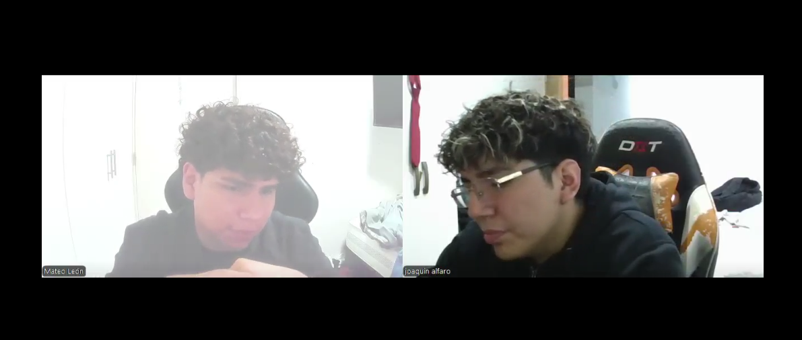

**Resumen:** Mateo León Paredes, 25 años, opera como encargado logístico de transporte turístico desde Lima, gestionando hasta 10 vehículos y entre 80-120 turistas semanales en rutas hacia Cusco, Arequipa y selva central. Su mayor problema es el seguimiento de flota: el GPS instalado está desactualizado y pierde señal en sierra, por lo que todo depende de WhatsApp y un Excel manual, con zonas de hasta 2 horas sin cobertura que han generado fricciones comerciales con agencias clientes. Vivió un incidente crítico con 12 turistas extranjeros varados de noche sin señal, lo que evidenció la fragilidad total del sistema. Necesita una solución con funcionamiento offline, botón de emergencia para conductores y panel en tiempo real desde Lima, y estaría dispuesto a pagar entre 60-120 USD/mes si puede justificar el ROI ante el dueño, quien representa la principal barrera para adoptar nueva tecnología.

---

**Entrevista N° 2**

| **Nombres y apellidos** | **Edad** | **Distrito** |
|---|---|---|
| Rodrigo Quispe Mendoza | 29 | Miraflores |

| **Segmento** | **URL** | **Inicio** | **Duración** |
|---|---|---|---|
| Dueño o responsable de agencia de turismo de aventura | [https://surl.li/bxfsht](https://upcedupe-my.sharepoint.com/:v:/g/personal/u20241a267_upc_edu_pe/IQCNVCnGAkBaRLaCzBnng6gTAcslNAeBLBagBhTF8qiFCRs?e=JWQzWU&nav=eyJyZWZlcnJhbEluZm8iOnsicmVmZXJyYWxBcHAiOiJTdHJlYW1XZWJBcHAiLCJyZWZlcnJhbFZpZXciOiJTaGFyZURpYWxvZy1MaW5rIiwicmVmZXJyYWxBcHBQbGF0Zm9ybSI6IldlYiIsInJlZmVycmFsTW9kZSI6InZpZXcifX0%3D) | 00:00 | 10:55 min |

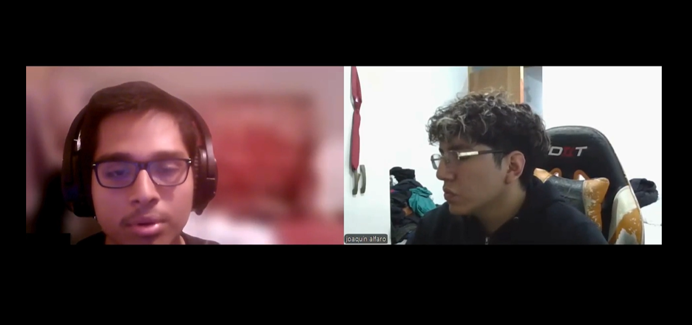

**Resumen:** Rodrigo Quispe Mendoza, 29 años, es cofundador y responsable de operaciones de Cumbres Vivas Expediciones, agencia boutique de trekking y montañismo en Miraflores con cuatro años de operación, grupos máximos de ocho personas y presencia en Cusco, Puno y selva alta de Amazonas. En temporada alta gestiona hasta cinco grupos simultáneos con ocho a diez guías en campo y entre treinta y cuarenta turistas activos. El seguimiento es completamente manual vía WhatsApp desde puntos de señal, con silencios de hasta seis a ocho horas en zonas altas donde entre el 60-70% del recorrido no tiene cobertura. Vivió un incidente crítico en el Ausangate donde un turista con mal de altura se deterioró de noche y el guía tardó casi cuatro horas en conseguir señal para pedir ayuda, exponiendo la ausencia de protocolos claros de escalamiento. Ha probado GPS de mano y apps de rastreo sin éxito por problemas de batería, falta de transmisión en tiempo real y dependencia de señal. Sus necesidades indispensables son ubicación en tiempo real con conectividad satelital y alertas de emergencia activables por el guía, y pagaría entre 80-150 USD/mes por una solución robusta. Usa Bokun, WhatsApp y Google Sheets, y tiene alta conciencia del riesgo operativo y legal.

---

**Entrevista N° 3**

| **Nombres y apellidos** | **Edad** | **Distrito** |
|---|---|---|
| Paola Paz Collazos | 38 | Lima |

| **Segmento** | **URL** | **Inicio** | **Duración** |
|---|---|---|---|
| Dueño o responsable de agencia de turismo de aventura | [https://goo.su/ANC6ox](https://upcedupe-my.sharepoint.com/:v:/g/personal/u20241a267_upc_edu_pe/IQBgLcL1AU8bQpt6G5qxCLSuAZYq8UmbUTzux0Ck11ZWVq8) | 00:00 | 10:25 min |

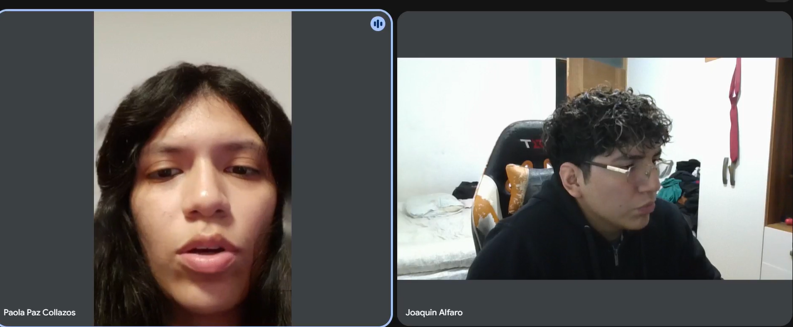

**Resumen:** Paola Paz Collazos, 38 años, es fundadora y dueña de una empresa de transporte turístico con doce unidades y ocho años de operación en Lima, atendiendo rutas hacia Cusco, Arequipa y selva central con hasta diez vehículos activos simultáneos y entre cien y ciento cuarenta turistas semanales. El seguimiento actual combina un GPS de flota inestable en sierra, WhatsApp y un Excel manual que actualiza su encargado, con tramos de hasta dos horas sin señal que ya le generaron fricciones comerciales y casi la pérdida de un contrato con una agencia grande. Vivió un incidente de avería mecánica nocturna con doce turistas extranjeros sin señal por más de una hora, donde la incapacidad de informar a los clientes fue el mayor daño. Como dueña reconoce que depender del celular en esas rutas no es un sistema sino suerte, y esa responsabilidad le pesa. Ha probado soluciones de rastreo sin éxito por costo y falta de funcionalidad offline, e identifica como barreras la conectividad, la simplicidad necesaria para conductores mayores sin habilidades digitales y el costo justificable. Ve valor no solo operativo sino comercial en la solución: poder mostrar a las agencias en tiempo real dónde está su grupo como argumento de diferenciación frente a otros transportistas. Sus funcionalidades indispensables son operatividad offline, alerta de emergencia simple y panel en tiempo real desde Lima, y pagaría entre 85-150 USD/mes.

---

##### Segmento 2: Turistas de Aventura

**Entrevista N° 1**

| **Nombres y apellidos** | **Edad** | **Distrito** |
|---|---|---|
| Tamara Velasquez | 20 | Lima |

| **Segmento** | **URL** | **Inicio** | **Duración** |
|---|---|---|---|
| Turista de aventura | [https://surl.li/wtbakg](https://upcedupe-my.sharepoint.com/:v:/g/personal/u20241a267_upc_edu_pe/IQDmL-DP2xwmQ4BbvtwR-lGLAS0P8EhgPotM1JXGatn2fwg?e=TgCalk&nav=eyJyZWZlcnJhbEluZm8iOnsicmVmZXJyYWxBcHAiOiJTdHJlYW1XZWJBcHAiLCJyZWZlcnJhbFZpZXciOiJTaGFyZURpYWxvZy1MaW5rIiwicmVmZXJyYWxBcHBQbGF0Zm9ybSI6IldlYiIsInJlZmVycmFsTW9kZSI6InZpZXcifX0%3D) | 00:00 | 5:49 min |

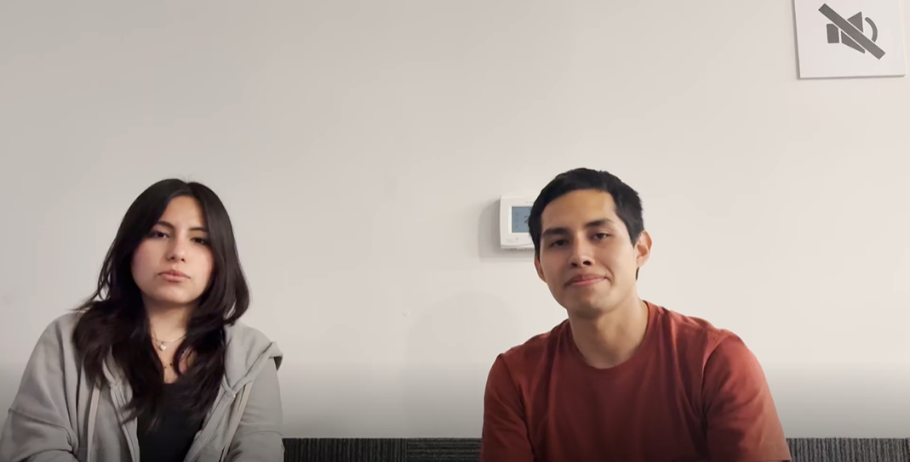

**Resumen:** Tamara, residente de Lima, es una aficionada a los deportes de aventura que realiza parapente anualmente y expediciones de montañismo o escalada. Utiliza principalmente el GPS de su celular y comparte su ubicación con familiares para mantenerse comunicada, mientras que la organización de las actividades la delega a su prima o a guías de confianza. Durante sus recorridos se guía por la información de los instructores, pero ha experimentado desorientación y miedo al quedarse sin señal telefónica en zonas remotas. Reconoce que manipular el celular en plena actividad extrema resulta poco práctico y riesgoso, y se apoya mucho en el seguimiento constante de sus guías para sentirse segura. Le gustaría contar con una herramienta en formato smartwatch que registre su ubicación, signos vitales y recorrido de forma automática, siempre que sea más segura de llevar que un celular y respete la privacidad de sus datos. Su dispositivo principal es el celular Android y utiliza Google Maps como aplicación de referencia.

---

**Entrevista N° 2**

| **Nombres y apellidos** | **Edad** | **Distrito** |
|---|---|---|
| Gaby Valencia | 20 | Lima |

| **Segmento** | **URL** | **Inicio** | **Duración** |
|---|---|---|---|
| Turista de aventura | [https://surl.li/wrchlv](https://upcedupe-my.sharepoint.com/:v:/g/personal/u20241a267_upc_edu_pe/IQAFRDJfQqYVS4y0Y-mceqLcAXUAkL-9vmY98O6DfQsNapw?e=iSQlI5&nav=eyJyZWZlcnJhbEluZm8iOnsicmVmZXJyYWxBcHAiOiJTdHJlYW1XZWJBcHAiLCJyZWZlcnJhbFZpZXciOiJTaGFyZURpYWxvZy1MaW5rIiwicmVmZXJyYWxBcHBQbGF0Zm9ybSI6IldlYiIsInJlZmVycmFsTW9kZSI6InZpZXcifX0%3D) | 00:00 | 4:03 min |

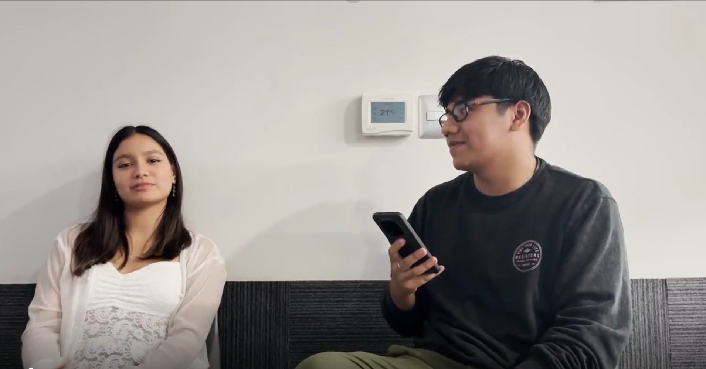

**Resumen:** Gabriela, aficionada a conocer lugares nuevos y realizar actividades fuera de lo común, suele organizar expediciones como escalada en nevados con amigos del trabajo aprovechando fechas especiales o promociones en redes sociales. Utiliza principalmente Google Maps para ubicarse y comparte su ruta con sus padres. Durante su última experiencia en el nevado Rajuntay experimentó miedo y dificultades respiratorias al quedarse rezagada, notando que los mecanismos de seguridad de la agencia eran deficientes y los guías estaban muy distanciados para atender emergencias a tiempo. Le preocupa enormemente la falta de señal en zonas remotas, ya que esto le impidió comunicarse con la agencia cuando una de sus compañeras necesitó ayuda médica. Aunque el uso de tecnología para emergencias podría serle útil, muestra una fuerte desconfianza respecto a la privacidad de sus datos, temiendo que las agencias hagan un mal uso de su información personal. Su dispositivo principal es el celular iPhone y su canal digital preferido es Instagram para descubrir actividades de aventura.

---

**Entrevista N° 3**

| **Nombres y apellidos** | **Edad** | **Distrito** |
|---|---|---|
| Antonella Chavez | 20 | Lima |

| **Segmento** | **URL** | **Inicio** | **Duración** |
|---|---|---|---|
| Turista de aventura | [https://surl.li/scgbfh](https://upcedupe-my.sharepoint.com/:v:/g/personal/u20241a267_upc_edu_pe/IQAzzJK1Z2EjRKwAnDDhYymlASIYaE0KOMWSH67esO8b9GA?e=Aav4mr&nav=eyJyZWZlcnJhbEluZm8iOnsicmVmZXJyYWxBcHAiOiJTdHJlYW1XZWJBcHAiLCJyZWZlcnJhbFZpZXciOiJTaGFyZURpYWxvZy1MaW5rIiwicmVmZXJyYWxBcHBQbGF0Zm9ybSI6IldlYiIsInJlZmVycmFsTW9kZSI6InZpZXcifX0%3D) | 00:00 | 4:05 min |

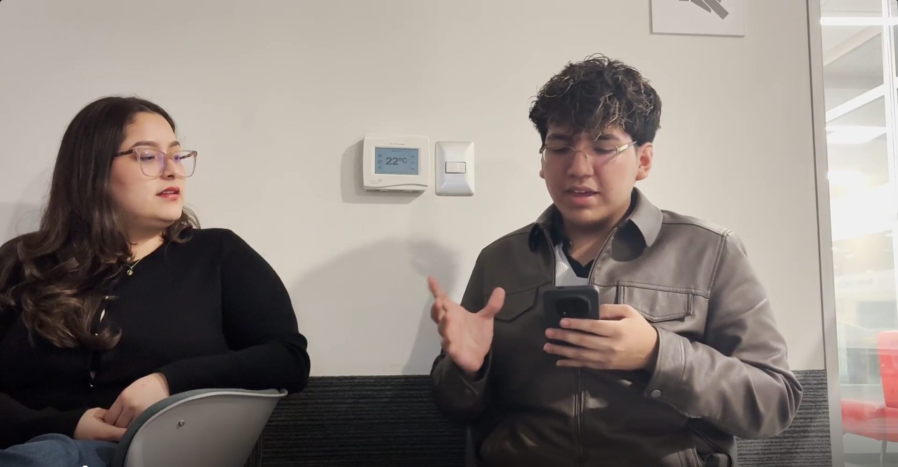

**Resumen:** Antonella, estudiante de publicidad de 20 años y apasionada por conocer nuevos lugares, suele realizar actividades de aventura como esquiar en el extranjero o hacer trekking en Huaraz. Utiliza principalmente Google Maps para ubicarse y comparte su ubicación con su padre. Está muy familiarizada con el uso de su Apple Watch para registrar rutas y medir su salud, siendo uno de los perfiles más tecnológicamente maduros del segmento. Durante sus expediciones en el Perú ha presenciado emergencias médicas por la altura y percibe que las agencias locales carecen de la preparación y el personal experto necesarios para atender incidentes en zonas remotas, contando apenas con botiquines básicos. Aunque la falta de señal en estas áreas le resulta un inconveniente habitual, afirma que su mayor prioridad durante un tour es el monitoreo constante de sus signos vitales, considerando fundamental controlar su salud al someter su cuerpo a altitudes y entornos extremos a los que no está acostumbrada. Sus dispositivos principales son iPhone y Apple Watch, y su canal digital de referencia es Instagram.

---

**Entrevista N° 4**

| **Nombres y apellidos** | **Edad** | **Distrito** |
|---|---|---|
| Miguel Morales | 38 | Lima |

| **Segmento** | **URL** | **Inicio** | **Duración** |
|---|---|---|---|
| Turista de aventura | [https://surl.li/qqabud](https://upcedupe-my.sharepoint.com/:v:/g/personal/u202416903_upc_edu_pe/IQDH0cMptlBfRIQ0xnwLJmCxAaaNZU0UNPGppb0A9gLqCO0?nav=eyJyZWZlcnJhbEluZm8iOnsicmVmZXJyYWxBcHAiOiJTdHJlYW1XZWJBcHAiLCJyZWZlcnJhbFZpZXciOiJTaGFyZURpYWxvZy1MaW5rIiwicmVmZXJyYWxBcHBQbGF0Zm9ybSI6IldlYiIsInJlZmVycmFsTW9kZSI6InZpZXcifX0%3D&e=bINUkT) | 00:00 | 9:49 min |


**Resumen:** Miguel Ángel Morales, paramédico de 38 años, realiza actividades de aventura de forma ocasional y es conocido por organizar viajes grupales a Paracas con amigos. Aunque antes organizaba sus viajes de forma independiente, actualmente prefiere contratar agencias por la mayor organización, seguridad e itinerario definido que ofrecen. Por su formación en emergencias, mantiene una mirada crítica sobre la preparación de las agencias y advierte la invisibilización de protocolos mínimos, la falta de personal capacitado y la ausencia de equipamiento básico como botiquines durante las excursiones. En sus viajes utiliza Google Maps como única herramienta de orientación y no lleva dispositivos de rastreo adicionales. Le gustaría contar con información contextual en tiempo real como clima, puntos de interés y estado del entorno, así como la posibilidad de monitorear signos vitales, principalmente en situaciones de alta demanda física. Considera que la incorporación de tecnología de monitoreo y mejores protocolos de seguridad impactaría positivamente en su elección de agencia. Su dispositivo principal es el celular Android y se comunica principalmente por WhatsApp.

---

**Entrevista N° 5**

| **Nombres y apellidos** | **Edad** | **Distrito** |
|---|---|---|
| Valeria Quiliano | 21 | Lima |

| **Segmento** | **URL** | **Inicio** | **Duración** |
|---|---|---|---|
| Turista de aventura | [https://surl.li/lvxaav](https://upcedupe-my.sharepoint.com/:v:/g/personal/u202324623_upc_edu_pe/IQBLNNCNz8paSbQPCQy2fF26AewW2P1FYWEaHIDfdOiuAw4?e=ZlxA2l&nav=eyJyZWZlcnJhbEluZm8iOnsicmVmZXJyYWxBcHAiOiJTdHJlYW1XZWJBcHAiLCJyZWZlcnJhbFZpZXciOiJTaGFyZURpYWxvZy1MaW5rIiwicmVmZXJyYWxBcHBQbGF0Zm9ybSI6IldlYiIsInJlZmVycmFsTW9kZSI6InZpZXcifX0%3D) | 00:00 | 8:33 min |

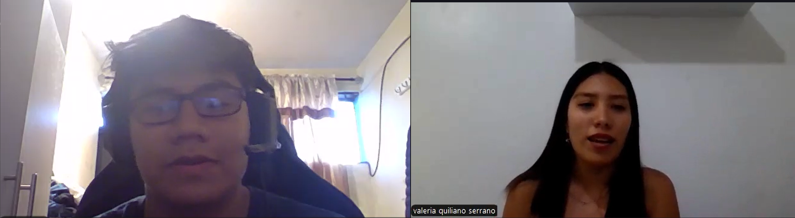

**Resumen:** Valeria, estudiante de Psicología de 21 años, ha realizado dos actividades de aventura destacadas: el Camino Inca en Cusco hasta Machu Picchu con un grupo de cinco amigos a través de una agencia, y sandboarding en Lunahuana con su familia. Debido a las obligaciones académicas y laborales de su entorno, estas actividades no son frecuentes. Durante el Camino Inca experimentó momentos de inseguridad por las rutas desconocidas y el soroche, que afectó a varios miembros del grupo, aunque el guía actuó con preparación y llevaba botiquín. Reconoce que la falta de señal en ciertos tramos le generó inquietud respecto a cómo pedir ayuda en caso de emergencia. Utiliza Google Maps como herramienta principal de orientación y un Apple Watch para monitorear su ritmo cardíaco, altitud y GPS. Durante el tour compartió su ubicación con su padre, aunque la señal intermitente interrumpía la conexión. Le hubiera gustado tener mayor precisión en los mapas, información histórica y cultural del recorrido, y la posibilidad de registrar su experiencia con fotos georreferenciadas. Estaría dispuesta a usar un wearable de monitoreo ofrecido por la agencia siempre que considere la empresa confiable. Sus dispositivos principales son iPhone y Apple Watch, y su canal digital de referencia es Instagram y TikTok.

---

### 2.2.3. Análisis de Entrevistas

##### Análisis del Segmento 2: Turistas de Aventura

A continuación se presenta el análisis de las entrevistas realizadas al segmento de turistas de aventura, identificando con sustento estadístico las características objetivas y subjetivas más representativas del segmento que servirán de base para la construcción del User Persona correspondiente.

---

**Características demográficas**

El rango de edad de los entrevistados oscila entre los 20 y 38 años, con una edad promedio de 23.8 años. El 80% de los entrevistados son del género femenino y el 20% del género masculino. El 80% son estudiantes universitarios en carreras no relacionadas al turismo (Psicología y Publicidad), mientras que el 20% restante cuenta con formación y ejercicio profesional en el área de emergencias médicas (paramédico).

---

**Frecuencia y tipo de actividades realizadas**

El 60% ha realizado rutas de trekking de varios días en zonas remotas del Perú, incluyendo el Camino Inca y rutas en Huaraz. El 60% ha practicado al menos un deporte extremo como parapente, sandboarding o esquí. El 20% ha realizado expediciones a nevados como el Rajuntay. El 100% realiza estas actividades de forma esporádica, condicionadas por disponibilidad de tiempo, amigos o familia. El 100% contrata agencias para actividades de mayor riesgo o duración, reconociendo que es necesario por razones de seguridad y organización.

---

**Herramientas y dispositivos utilizados**

El 100% utiliza Google Maps como herramienta principal de orientación durante sus actividades. El 40% utiliza dispositivos wearables como Apple Watch para monitorear ritmo cardíaco, altitud y GPS durante el recorrido. El 100% comparte su ubicación con un familiar durante el recorrido, aunque la señal intermitente interrumpe esta comunicación de forma frecuente. El 80% utiliza iPhone o Android como dispositivo principal. El 60% menciona Instagram como canal digital de referencia para descubrir actividades y agencias de aventura.

---

**Incidentes y situaciones de riesgo vividas**

El 60% experimentó síntomas de soroche o mal de altura durante rutas de altura. El 100% identificó la pérdida de señal celular como un momento de inseguridad, miedo o incertidumbre durante el recorrido. El 20% presenció emergencias médicas de otros turistas donde la respuesta de la agencia fue deficiente o tardía.

---

**Percepción sobre las agencias**

El 60% considera que las agencias con las que viajó contaban con preparación mínima aceptable, incluyendo botiquín y guía capacitado. El 40% percibió deficiencias en los mecanismos de seguridad de las agencias, incluyendo guías demasiado distanciados del grupo, ausencia de protocolos visibles y falta de personal con formación en emergencias. El 100% reconoce que la presencia de un guía preparado es indispensable para sentirse seguro durante el recorrido.

---

**Funcionalidades deseadas en una solución tecnológica**

El 100% considera prioritario tener acceso a monitoreo de signos vitales en tiempo real durante el recorrido. El 100% desearía contar con mapas precisos y navegación que funcionen sin señal celular. El 60% le gustaría acceder a información contextual del recorrido como datos históricos, culturales y puntos de interés. El 60% desearía que fotos, rutas y datos de salud se registren automáticamente sin necesidad de intervención manual. El 40% menciona explícitamente querer recibir alertas ante condiciones climáticas o de salud adversas durante el tour.

---

**Disposición a usar wearables de monitoreo**

El 100% estaría dispuesto a usar un wearable ofrecido por la agencia, siempre que la empresa sea percibida como confiable y transparente en el uso de los datos. El 40% expresa preocupaciones sobre privacidad, temiendo un uso invasivo o inadecuado de su información personal por parte de la agencia.

---

**Impacto en la decisión de contratar una agencia**

El 100% considera que contar con tecnología de monitoreo en tiempo real y protocolos de emergencia avanzados influiría significativamente en su decisión de contratar una agencia específica frente a otra que no cuente con estas características.

---

**Personalidad y habilidades blandas identificadas**

El 80% muestra un perfil aventurero con disposición a explorar entornos desafiantes, aunque con alta valoración de la seguridad como condición no negociable. El 60% presenta un perfil tecnológicamente activo, adoptando herramientas digitales de forma natural en su vida cotidiana. El 20% presenta un perfil analítico y crítico, con capacidad para evaluar protocolos de seguridad desde una perspectiva profesional.

---

*El análisis del Segmento 1 (Dueños o Responsables de Agencias de Turismo de Aventura) será incorporado una vez completado el registro de entrevistas de dicho segmento.*

## 2.3. Needfinding
 
En esta sección se presentan los artefactos resultantes del proceso de análisis de la información recolectada durante la fase de Needfinding. A partir de las entrevistas realizadas a los segmentos objetivo y del análisis competitivo desarrollado en el capítulo anterior, el equipo ha sintetizado los hallazgos en artefactos que permiten visualizar de forma estructurada las características, comportamientos, motivaciones y necesidades de los usuarios potenciales de VitalTrek. Estos artefactos servirán como base para la definición de requerimientos funcionales y de diseño de la solución, asegurando que cada decisión esté centrada en el usuario y respaldada por evidencia recolectada en campo.
 
### 2.3.1. User Personas
 
A continuación se presentan las fichas de User Persona elaboradas para cada uno de los dos segmentos objetivo de VitalTrek, identificados previamente en la sección de Segmentos Objetivo del capítulo anterior. La elaboración de estos arquetipos se sustenta en el análisis cualitativo de las entrevistas realizadas a representantes de cada segmento, así como en los hallazgos obtenidos del análisis competitivo, donde se evidenciaron brechas en la oferta actual de productos digitales para turismo de aventura en zonas de baja conectividad.
 
Las principales características consideradas para la construcción de los User Personas incluyen los datos demográficos, ocupación, comportamiento digital, motivaciones, frustraciones, objetivos personales y profesionales, así como el nivel de adopción tecnológica de cada segmento. Esta información fue contrastada con las debilidades detectadas en competidores como TrekkSoft, Wayward y AllTrails, especialmente en lo referente a la operatividad sin conectividad, la captura de signos vitales y la falta de personalización para el contexto peruano. De esta manera, los arquetipos no solo representan a los usuarios, sino que también encapsulan las oportunidades de diferenciación que VitalTrek puede capitalizar.
 
Se ha elaborado una ficha de User Persona por cada segmento objetivo, utilizando la herramienta UXPressia siguiendo las mejores prácticas de la industria. El primer User Persona, Ana Lucía Quispe, representa al segmento de agencias y operadores de turismo de aventura, mientras que el segundo, Marco Rodriguez, representa al segmento de turistas de aventura nacionales y extranjeros que contratan los servicios de estas agencias.
 
**User Persona 1: Ana Lucía Quispe - Segmento de Dueños o Responsables de Agencias de Turismo de Aventura**
 
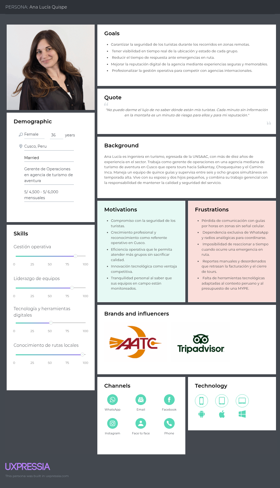

Representa al segmento de agencias y operadores de turismo de aventura. Este arquetipo encarna a la gerente de operaciones de una agencia mediana en Cusco, responsable de coordinar guías, supervisar tours simultáneos y garantizar la seguridad de los grupos en zonas remotas. Sus motivaciones giran en torno a la profesionalización operativa, la reducción del tiempo de respuesta ante emergencias y la diferenciación competitiva mediante el uso de tecnología. Sus principales frustraciones se relacionan con la pérdida de comunicación con los guías por horas, la dependencia de WhatsApp y radios analógicas, y la ausencia de herramientas digitales adaptadas al contexto y al presupuesto de una micro o pequeña empresa peruana.

**User Persona 2: Marco Rodriguez - Segmento de Turistas de Aventura**
 
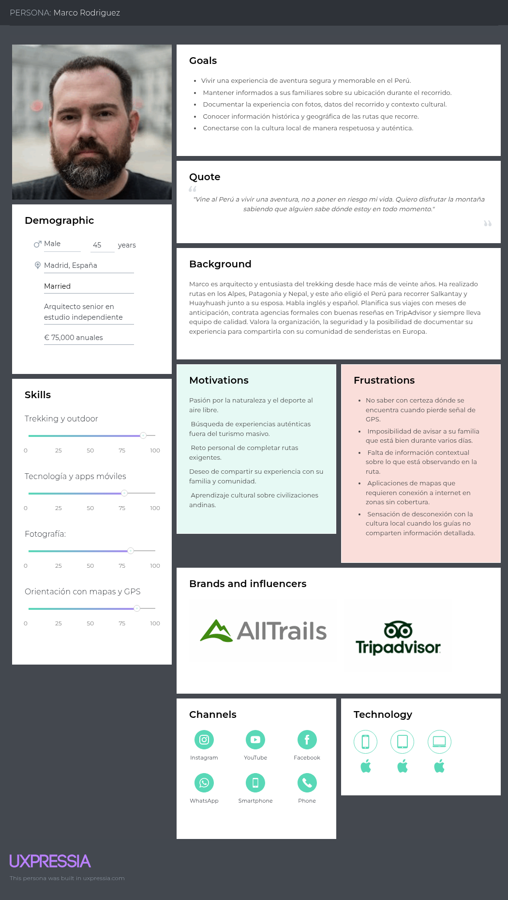

Representa al segmento de turistas de aventura nacionales y extranjeros. Este arquetipo encarna al viajero europeo experimentado, con alto poder adquisitivo, dominio tecnológico y pasión por las experiencias outdoor auténticas. Sus motivaciones se centran en vivir aventuras seguras y memorables, mantener informados a sus familiares durante el recorrido y enriquecer su experiencia con información cultural e histórica del entorno. Sus frustraciones más relevantes son la incertidumbre sobre su ubicación al perder señal GPS, la imposibilidad de avisar a su familia durante varios días, y la carencia de aplicaciones móviles que funcionen sin conectividad continua en zonas remotas del Perú.

### 2.3.2. User Task Matrix

A continuación se presenta el User Task Matrix, artefacto que concentra las principales tareas que los User Personas realizan para cumplir sus objetivos en el dominio del turismo de aventura. Es importante precisar que las tareas listadas corresponden a actividades que ambos segmentos llevan a cabo de manera independiente a la existencia de VitalTrek, ya que reflejan el comportamiento natural y las responsabilidades inherentes a cada rol dentro del ecosistema del turismo de aventura. Los segmentos considerados en esta matriz son las agencias y operadores de turismo de aventura, representados por Ana Lucía Quispe, y los turistas de aventura nacionales y extranjeros, representados por Marco Rodriguez.

Para cada User Persona se evalúan dos dimensiones por tarea. La frecuencia indica con qué regularidad realiza la tarea, expresada en una escala cualitativa de Muy Alta, Alta, Media, Baja o Muy Baja. La importancia indica el grado en que la tarea es crítica para el cumplimiento de los objetivos del User Persona, expresada en la misma escala. Cuando una tarea no aplica para un User Persona específico, se indica con la abreviatura N/A.

| Tarea | Ana Lucía Quispe (Agencia) - Frecuencia | Ana Lucía Quispe (Agencia) - Importancia | Marco Rodriguez (Turista) - Frecuencia | Marco Rodriguez (Turista) - Importancia |
|---|---|---|---|---|
| Planificar el itinerario y la logística del recorrido | Muy Alta | Muy Alta | Alta | Alta |
| Coordinar con guías y personal operativo en campo | Muy Alta | Muy Alta | N/A | N/A |
| Supervisar la ubicación y el estado de los grupos durante el tour | Muy Alta | Muy Alta | N/A | N/A |
| Comunicarse con familiares para informar el estado durante el viaje | Baja | Media | Muy Alta | Muy Alta |
| Reaccionar ante emergencias o anomalías en ruta | Media | Muy Alta | Baja | Muy Alta |
| Registrar la asistencia y datos personales de los turistas | Alta | Alta | Alta | Media |
| Investigar y comparar agencias o servicios turísticos | Media | Alta | Muy Alta | Muy Alta |
| Reservar y pagar los servicios de tours de aventura | Alta | Alta | Alta | Muy Alta |
| Orientarse y navegar durante el recorrido en zonas remotas | Media | Alta | Muy Alta | Muy Alta |
| Documentar la experiencia mediante fotografías y notas | Baja | Media | Muy Alta | Alta |
| Acceder a información cultural e histórica del recorrido | Baja | Media | Alta | Muy Alta |
| Monitorear los signos vitales y el estado físico durante la actividad | Baja | Alta | Alta | Alta |
| Generar reportes operativos y financieros del tour | Muy Alta | Muy Alta | N/A | N/A |
| Recopilar feedback y reseñas posteriores al servicio | Alta | Alta | Media | Media |
| Compartir la experiencia en redes sociales y comunidades de viajeros | Media | Media | Alta | Alta |
| Gestionar la facturación y los pagos a guías o proveedores | Muy Alta | Muy Alta | N/A | N/A |
| Capacitarse en protocolos de seguridad y rutas nuevas | Media | Alta | Baja | Media |

**Análisis de los resultados de la matriz**

A partir del análisis de la matriz se identifican patrones claros que evidencian las prioridades y comportamientos de cada User Persona, así como los puntos de convergencia y divergencia entre ambos segmentos:

En el caso de Ana Lucía Quispe, las tareas con mayor frecuencia e importancia se concentran en la dimensión operativa y de supervisión. La planificación del itinerario, la coordinación con guías, la supervisión de la ubicación y estado de los grupos, la generación de reportes operativos y la gestión de la facturación constituyen el núcleo de su actividad diaria. Estas tareas reflejan su rol como gerente de operaciones y subrayan la criticidad de contar con herramientas que faciliten la trazabilidad y la comunicación con los equipos en campo. Adicionalmente, la reacción ante emergencias, aunque presenta una frecuencia media, mantiene una importancia muy alta debido al impacto que tiene sobre la seguridad de los turistas y la reputación de la agencia.

En el caso de Marco Rodriguez, las tareas con mayor frecuencia e importancia se orientan hacia la dimensión experiencial y de seguridad personal. La investigación y comparación de agencias previa al viaje, la reserva y pago de servicios, la orientación y navegación en zonas remotas, la comunicación con familiares y el acceso a información cultural e histórica constituyen las actividades centrales de su comportamiento como turista de aventura. La documentación de la experiencia mediante fotografías y notas también ocupa un lugar relevante, lo que refleja el perfil del viajero contemporáneo que busca compartir y conservar memorias de sus aventuras.

Entre las principales coincidencias entre ambos User Personas destaca la relevancia que ambos otorgan a la planificación del itinerario y a la reserva de servicios, aunque desde perspectivas distintas. Mientras Ana Lucía planifica la logística operativa del lado de la oferta, Marco planifica su experiencia desde el lado de la demanda. Otra coincidencia importante es la criticidad de la reacción ante emergencias, que aunque ocurre con baja frecuencia, ambos consideran muy importante por sus implicancias en seguridad y bienestar. Finalmente, ambos User Personas comparten la necesidad de orientarse y navegar en zonas remotas, lo cual refuerza la importancia de contar con herramientas digitales que operen sin conectividad continua.

Entre las principales diferencias se observa que las tareas relacionadas con la supervisión de grupos, la generación de reportes operativos, la gestión de facturación y la coordinación con guías son exclusivas del User Persona de la agencia, mientras que las tareas vinculadas a la documentación de la experiencia, el acceso a información cultural y el compartir contenido en redes sociales son predominantes en el User Persona del turista. Esta diferenciación valida el enfoque dual de la propuesta de valor de VitalTrek, donde la plataforma debe atender tanto las necesidades operativas y de control de las agencias como las expectativas experienciales y de seguridad personal de los turistas.

#### 2.3.3. User Journey Mapping

El User Journey Mapping es una herramienta que permite visualizar de forma estructurada la experiencia del usuario a lo largo de su interacción con un producto o servicio. Realizamos los User Journey Maps en su versión As-Is para los tres segmentos objetivos.

<b>User Journey Map del 1er segmento objetivo – agencias y operadores de turismo</b>
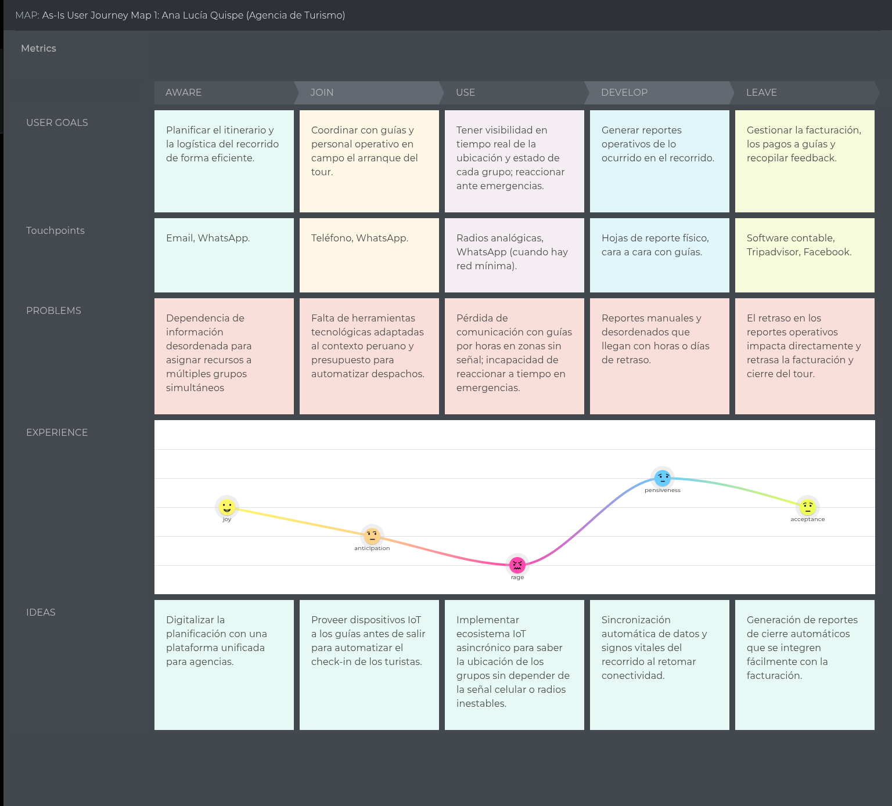

<b>User Journey Map del 2do segmento objetivo - turistas de aventura </b>


### 2.3.4. Empathy Mapping

El Empathy Mapping es una herramienta que nos permite profundizar en la experiencia emocional y cognitiva del usuario. A través de categorías como lo que el usuario piensa, siente, dice y hace, se busca comprender su contexto, así como sus principales miedos, frustraciones y motivaciones.

Para VitalTrek, elaborar un Empathy Mapping para cada segmento objetivo fue clave para entender no solo cómo las agencias planifican la logística y cómo los turistas viven la experiencia outdoor, sino también cómo enfrentan la incertidumbre de la desconexión en zonas remotas, los retos de seguridad y la respuesta ante posibles emergencias. Esta comprensión más empática nos permite diseñar un ecosistema tecnológico que responda a sus necesidades reales, brindando tranquilidad y reduciendo los puntos de dolor presentes en la gestión actual de las rutas de aventura.

<b>Empathy Mapping del 1er segmento objetivo – agencias y operadores de turismo</b>


<b>Empathy Mapping del 2do segmento objetivo – turistas de aventura </b>
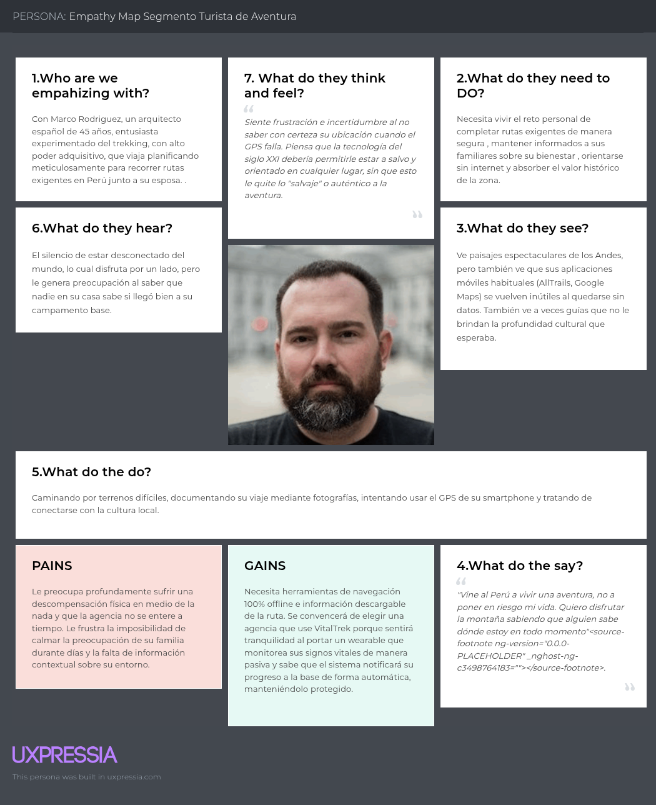

## 2.4. Big Picture Event Storming

En esta sección se presenta el Big Picture Event Storming del proyecto VitalTrek, elaborado como una visión general del dominio del turismo de aventura en zonas de baja conectividad. Mediante una sesión colaborativa, el equipo identificó y ordenó los eventos más importantes que ocurren durante un tour, desde la planificación hasta el cierre.


## 2.5 Ubiquitous Language

### Introducción

El siguiente glosario define los términos clave del dominio de turismo de aventura en zonas de baja conectividad. Su propósito es establecer un lenguaje común entre todos los stakeholders, evitando ambigüedades y facilitando la comunicación dentro del proyecto.

### Glosario

Adventure Tour (Tour de Aventura): Actividad organizada que involucra recorridos en entornos naturales, generalmente con cierto nivel de riesgo y condiciones variables.


Tour Operator (Operador de Turismo / Agencia): Entidad responsable de planificar, organizar y supervisar tours de aventura, asegurando la logística y seguridad del grupo.


Tour Guide (Guía de Turismo): Persona encargada de liderar al grupo durante el recorrido, brindando orientación, asistencia y apoyo en situaciones de riesgo.


Traveler (Turista / Viajero): Persona que participa en el tour de aventura y busca experiencias recreativas en entornos naturales.


Route (Ruta): Camino o trayecto definido que los participantes siguen durante el recorrido, el cual puede incluir distintos niveles de dificultad y riesgo.


Remote Area (Zona Remota): Entorno geográfico con acceso limitado a infraestructura, caracterizado por baja o nula conectividad y dificultad para recibir asistencia inmediata.


Low Connectivity (Baja Conectividad): Condición en la que la comunicación digital es limitada o inexistente, afectando la transmisión de información en tiempo real.


Checkpoint (Punto de Control): Ubicación dentro de la ruta donde se registra el paso de los participantes o se valida su progreso durante el recorrido.


Group Tracking (Seguimiento de Grupo): Proceso de supervisar la ubicación y el estado general de los participantes durante el desarrollo del tour.


Health Monitoring (Monitoreo de Salud): Seguimiento de las condiciones físicas del turista durante la actividad, especialmente en entornos exigentes como altura o esfuerzo físico prolongado.


Vital Signs (Signos Vitales): Indicadores básicos del estado de salud de una persona, como frecuencia cardíaca o nivel de oxígeno, relevantes en contextos de riesgo.


Incident (Incidente): Evento inesperado que afecta la seguridad o el bienestar de los participantes durante el recorrido.


Emergency Response (Respuesta a Emergencias): Acciones tomadas para atender un incidente, incluyendo comunicación, asistencia y evacuación si es necesario.


Situational Awareness (Conciencia Situacional): Capacidad de comprender lo que ocurre en el entorno del tour en un momento determinado, incluyendo ubicación, condiciones y riesgos.


Risk Level (Nivel de Riesgo): Grado de peligro asociado a una ruta o actividad, determinado por factores como terreno, clima y dificultad.


Safety Protocol (Protocolo de Seguridad): Conjunto de medidas y procedimientos establecidos para prevenir y responder a incidentes durante el recorrido.


Offline Navigation (Navegación sin Conexión): Capacidad de orientarse y seguir una ruta sin depender de conexión a internet.


Tour Completion (Finalización del Tour): Momento en el que el grupo completa la ruta y concluye la actividad planificada.


Post-Tour Evaluation (Evaluación Post-Tour): Proceso de revisión de la experiencia, incluyendo desempeño, incidentes y oportunidades de mejora.


Tour Experience (Experiencia del Tour): Percepción general del usuario respecto a la calidad, seguridad y disfrute del recorrido.

<div style="page-break-before: always;"></div>

---

# Capítulo III: Requirements Specification

## 3.1. User Stories

La presente sección consolida el conjunto completo de Epics, User Stories, 
Landing Page Stories y Technical Stories que definen los requerimientos 
funcionales del sistema VitalTrek. Los requerimientos han sido identificados 
a partir del análisis realizado en los capítulos previos, considerando los 
hallazgos del Needfinding, las características de los segmentos objetivo, el 
resultado del análisis competitivo y las brechas detectadas en las soluciones 
existentes del mercado.

Para garantizar la coherencia del lenguaje a lo largo del documento, se 
establecen dos términos clave del dominio. El término **tour** se refiere a 
la configuración comercial del recorrido tal como es ofrecido por la agencia, 
incluyendo su ruta, checkpoints, información asociada y participantes. El 
término **expedición** se refiere a la instancia activa de un tour, es decir, 
al recorrido en ejecución durante el cual se generan datos de ubicación, 
telemetría e incidentes. Esta distinción se mantiene de forma consistente en 
todas las historias de la presente sección.

El cuadro presentado a continuación incluye historias agrupadas en tres 
categorías. La primera corresponde a las User Stories de la aplicación web y 
móvil, organizadas en Epics funcionales que reflejan los cinco bounded 
contexts del sistema: **Identity & Access**, **Tour Management**, 
**Navigation & Exploration**, **Safety & Monitoring** y **Notification & 
Profile**. Estas historias están redactadas desde la perspectiva de los roles 
definidos en el dominio del problema: turista, administrador de agencia, guía 
de tour y usuario registrado. La segunda categoría corresponde a las Landing 
Page Stories, redactadas desde el rol visitante o subconjuntos por segmento 
objetivo, que recogen los requerimientos del sitio web estático orientado a 
comunicar la propuesta de valor de la plataforma. La tercera categoría 
corresponde a las Technical Stories, redactadas desde el rol developer, que 
documentan los requerimientos técnicos asociados a los endpoints del RESTful 
API que sustentan la operación del sistema.

Cada historia incluye su descripción en formato estándar y un conjunto de 
criterios de aceptación redactados siguiendo la estructura Gherkin 
(Given-When-Then). Los criterios de aceptación se han redactado en tiempo 
presente, tercera persona, sin referencia a detalles de interfaz de usuario, 
garantizando que sean comprobables mediante pruebas funcionales. Las únicas 
excepciones a esta estructura corresponden a reglas de negocio o restricciones 
que no dependen de condiciones específicas, las cuales se declaran de forma 
directa cuando aplican.

| Epic / Story ID | Título | Descripción | Criterios de Aceptación | Relacionado con (Epic ID) |
|---|---|---|---|---|
| **EP01** | **Identidad y Acceso** | Agrupa las funcionalidades relacionadas con el registro, autenticación, verificación, recuperación de credenciales, gestión de sesiones y ciclo de vida de la cuenta de los usuarios de la plataforma. | — | — |
| US01 | Registro de turista | Como turista, quiero registrarme en la plataforma para acceder a los tours y funcionalidades disponibles del sistema. | **Escenario 1: Registro exitoso**<br>Dado que el turista proporciona información válida y completa<br>Cuando envía la solicitud de registro<br>Entonces el sistema crea la cuenta correctamente y retorna confirmación de registro<br><br>**Escenario 2: Registro mediante autenticación externa**<br>Dado que el turista opta por registrarse mediante una cuenta de Google válida<br>Cuando autoriza el acceso a sus datos<br>Entonces el sistema crea la cuenta automáticamente con la información obtenida del proveedor externo y autentica al turista<br><br>**Escenario 3: Correo ya registrado**<br>Dado que el correo proporcionado ya existe en el sistema<br>Cuando el turista envía la solicitud de registro<br>Entonces el sistema retorna un error indicando que el correo ya se encuentra registrado | EP01 |
| US02 | Registro de administrador de agencia | Como administrador de agencia, quiero registrar mi agencia en la plataforma para gestionar tours y monitorear a los turistas asignados. | **Escenario 1: Registro exitoso**<br>Dado que el administrador de agencia proporciona información válida de la empresa<br>Cuando envía la solicitud de registro<br>Entonces el sistema crea la cuenta con el rol correspondiente y retorna confirmación<br><br>**Escenario 2: Correo duplicado**<br>Dado que el correo proporcionado ya está asociado a una cuenta existente<br>Cuando el administrador de agencia envía la solicitud de registro<br>Entonces el sistema retorna un error indicando que el correo ya está registrado<br><br>**Escenario 3: Datos inválidos**<br>Dado que el administrador de agencia ingresa datos con formato incorrecto<br>Cuando envía la solicitud de registro<br>Entonces el sistema retorna un error indicando los campos con formato inválido | EP01 |
| US03 | Inicio de sesión | Como usuario registrado, quiero iniciar sesión de forma segura para acceder a las funcionalidades de la plataforma según mi rol. | **Escenario 1: Credenciales válidas**<br>Dado que el usuario registrado proporciona credenciales correctas<br>Cuando envía la solicitud de autenticación<br>Entonces el sistema valida las credenciales y retorna un token de acceso con el rol asociado<br><br>**Escenario 2: Credenciales inválidas**<br>Dado que el usuario registrado proporciona credenciales incorrectas<br>Cuando envía la solicitud de autenticación<br>Entonces el sistema retorna un error sin revelar cuál de los campos es incorrecto<br><br>**Escenario 3: Cuenta inactiva**<br>Dado que la cuenta del usuario se encuentra deshabilitada<br>Cuando el usuario envía la solicitud de autenticación<br>Entonces el sistema retorna un error indicando que la cuenta no está activa | EP01 |
| US04 | Recuperación de contraseña | Como usuario registrado, quiero recuperar mi contraseña para no perder el acceso a mi cuenta en la plataforma. | **Escenario 1: Solicitud exitosa**<br>Dado que el usuario registrado proporciona un correo válido y registrado<br>Cuando envía la solicitud de recuperación<br>Entonces el sistema genera un enlace de recuperación con vigencia limitada y lo envía al correo indicado<br><br>**Escenario 2: Enlace expirado**<br>Dado que el enlace de recuperación ha superado su tiempo de validez<br>Cuando el usuario intenta utilizarlo<br>Entonces el sistema retorna un error indicando que el enlace ya no es válido<br><br>**Escenario 3: Correo no registrado**<br>Dado que el correo proporcionado no existe en el sistema<br>Cuando el usuario envía la solicitud de recuperación<br>Entonces el sistema retorna un error indicando que el correo no está registrado | EP01 |
| US05 | Verificación de correo electrónico | Como turista, quiero verificar mi correo electrónico tras el registro para confirmar la validez de mi cuenta. | **Escenario 1: Verificación exitosa**<br>Dado que el turista recibe el enlace de verificación tras el registro<br>Cuando confirma la verificación mediante el enlace<br>Entonces el sistema activa la cuenta del turista y retorna confirmación<br><br>**Escenario 2: Enlace expirado**<br>Dado que el enlace de verificación ha superado su tiempo de validez<br>Cuando el turista intenta utilizarlo<br>Entonces el sistema retorna un error e indica al turista que puede solicitar un nuevo enlace de verificación<br><br>**Escenario 3: Reenvío de correo de verificación**<br>Dado que el turista solicita el reenvío del correo de verificación<br>Cuando el sistema procesa la solicitud<br>Entonces el sistema genera un nuevo enlace de verificación y lo envía al correo registrado | EP01 |
| US06 | Cambio de contraseña | Como usuario registrado, quiero cambiar mi contraseña para mantener la seguridad de mi cuenta. | **Escenario 1: Cambio exitoso**<br>Dado que el usuario registrado proporciona la contraseña actual correcta y una nueva contraseña válida<br>Cuando envía la solicitud de cambio<br>Entonces el sistema actualiza la contraseña correctamente e invalida las sesiones activas distintas a la actual<br><br>**Escenario 2: Contraseña actual incorrecta**<br>Dado que el usuario registrado proporciona una contraseña actual incorrecta<br>Cuando envía la solicitud de cambio<br>Entonces el sistema retorna un error indicando que la contraseña actual es incorrecta<br><br>**Escenario 3: Nueva contraseña no cumple requisitos**<br>Dado que la nueva contraseña no cumple los requisitos de seguridad definidos<br>Cuando el usuario envía la solicitud de cambio<br>Entonces el sistema retorna un error indicando los requisitos no cumplidos | EP01 |
| US07 | Cierre de sesiones activas | Como usuario registrado, quiero cerrar todas mis sesiones activas en otros dispositivos para proteger mi cuenta. | **Escenario 1: Cierre exitoso**<br>Dado que el usuario registrado tiene sesiones activas en otros dispositivos<br>Cuando solicita el cierre de sesiones<br>Entonces el sistema invalida todos los tokens de sesión activos distintos al actual<br><br>**Escenario 2: Sin sesiones adicionales**<br>Dado que el usuario registrado no tiene otras sesiones activas<br>Cuando solicita el cierre de sesiones<br>Entonces el sistema retorna una respuesta indicando que no existen sesiones adicionales que cerrar<br><br>**Escenario 3: Desactivación de cuenta**<br>Dado que el usuario registrado confirma la desactivación de su cuenta<br>Cuando envía la solicitud de desactivación<br>Entonces el sistema marca la cuenta como inactiva, invalida todas las sesiones activas y retorna confirmación | EP01 |
| US08 | Vincular dispositivo wearable | Como turista, quiero vincular un dispositivo wearable a mi cuenta para que el sistema capture mis signos vitales durante la expedición. | **Escenario 1: Vinculación exitosa**<br>Dado que el turista dispone de un wearable compatible y proporciona el identificador del dispositivo<br>Cuando envía la solicitud de vinculación<br>Entonces el sistema asocia el dispositivo a la cuenta del turista y retorna confirmación<br><br>**Escenario 2: Dispositivo ya vinculado**<br>Dado que el identificador del dispositivo ya está asociado a otra cuenta<br>Cuando el turista envía la solicitud de vinculación<br>Entonces el sistema retorna un error indicando que el dispositivo ya está vinculado<br><br>**Escenario 3: Desvinculación durante expedición activa**<br>Dado que el dispositivo está transmitiendo datos durante una expedición activa<br>Cuando el turista envía la solicitud de desvinculación<br>Entonces el sistema retorna un error indicando que no es posible desvincular un dispositivo activo durante una expedición | EP01 |
| **EP02** | **Gestión de Tours** | Agrupa las funcionalidades de creación, edición, eliminación, duplicación, asignación y consulta de tours por parte del administrador de agencia, así como la búsqueda, filtrado y confirmación de asistencia por parte del turista. | — | — |
| US09 | Crear tour | Como administrador de agencia, quiero crear un tour para organizar rutas y ponerlas a disposición de los turistas. | **Escenario 1: Creación exitosa**<br>Dado que el administrador de agencia proporciona información válida y completa del tour<br>Cuando envía la solicitud de creación<br>Entonces el sistema registra el tour correctamente y retorna confirmación<br><br>**Escenario 2: Campos obligatorios incompletos**<br>Dado que el administrador de agencia omite campos obligatorios<br>Cuando envía la solicitud de creación<br>Entonces el sistema retorna un error indicando los campos requeridos faltantes<br><br>**Escenario 3: Datos con formato inválido**<br>Dado que el administrador de agencia ingresa datos con formato incorrecto<br>Cuando envía la solicitud de creación<br>Entonces el sistema retorna un error indicando los campos con formato inválido | EP02 |
| US10 | Editar tour | Como administrador de agencia, quiero editar la información de un tour para mantener actualizados los datos del recorrido. | **Escenario 1: Edición exitosa**<br>Dado que el administrador de agencia modifica información válida de un tour existente<br>Cuando envía la solicitud de actualización<br>Entonces el sistema aplica los cambios correctamente y retorna confirmación<br><br>**Escenario 2: Datos inválidos**<br>Dado que el administrador de agencia ingresa datos con formato incorrecto<br>Cuando envía la solicitud de actualización<br>Entonces el sistema retorna un error indicando los campos con formato inválido<br><br>**Escenario 3: Tour no encontrado**<br>Dado que el administrador de agencia intenta modificar un tour inexistente<br>Cuando envía la solicitud de actualización<br>Entonces el sistema retorna un error indicando que el recurso no existe | EP02 |
| US11 | Eliminar tour | Como administrador de agencia, quiero eliminar un tour para mantener actualizado el catálogo de la agencia. | **Escenario 1: Eliminación exitosa**<br>Dado que el administrador de agencia confirma la eliminación de un tour existente<br>Cuando envía la solicitud de eliminación<br>Entonces el sistema elimina el tour de forma permanente y retorna confirmación<br><br>**Escenario 2: Tour con expedición en curso**<br>Dado que el administrador de agencia intenta eliminar un tour cuya expedición se encuentra activa<br>Cuando envía la solicitud de eliminación<br>Entonces el sistema retorna un error indicando que no es posible eliminar un tour con expedición activa<br><br>**Escenario 3: Tour no encontrado**<br>Dado que el administrador de agencia intenta eliminar un tour inexistente<br>Cuando envía la solicitud de eliminación<br>Entonces el sistema retorna un error indicando que el recurso no existe | EP02 |
| US12 | Duplicar tour | Como administrador de agencia, quiero duplicar un tour existente para crear uno nuevo basado en una configuración previamente validada. | **Escenario 1: Duplicación exitosa**<br>Dado que el administrador de agencia selecciona un tour existente<br>Cuando envía la solicitud de duplicación<br>Entonces el sistema crea una copia del tour con estado borrador y retorna confirmación<br><br>**Escenario 2: Tour origen no disponible**<br>Dado que el administrador de agencia intenta duplicar un tour eliminado o inaccesible<br>Cuando envía la solicitud de duplicación<br>Entonces el sistema retorna un error indicando que el tour origen no existe<br><br>**Escenario 3: Error durante la duplicación**<br>Dado que ocurre un fallo interno al procesar la duplicación<br>Cuando el administrador de agencia envía la solicitud<br>Entonces el sistema retorna un error indicando que la operación no pudo completarse | EP02 |
| US13 | Asignar turistas a un tour | Como administrador de agencia, quiero asignar turistas a un tour para conformar el grupo de participantes del recorrido. | **Escenario 1: Asignación exitosa**<br>Dado que el administrador de agencia selecciona turistas registrados para un tour disponible<br>Cuando envía la solicitud de asignación<br>Entonces el sistema registra la asignación correctamente y retorna confirmación<br><br>**Escenario 2: Turista ya asignado**<br>Dado que el turista seleccionado ya pertenece al tour<br>Cuando el administrador de agencia envía la solicitud de asignación<br>Entonces el sistema retorna un error indicando que el turista ya está asignado<br><br>**Escenario 3: Tour cerrado o cancelado**<br>Dado que el tour se encuentra cerrado o cancelado<br>Cuando el administrador de agencia intenta asignar turistas<br>Entonces el sistema retorna un error indicando que el tour no acepta nuevas asignaciones | EP02 |
| US14 | Desasignar turista de un tour | Como administrador de agencia, quiero desasignar a un turista de un tour para actualizar la composición del grupo. | **Escenario 1: Desasignación exitosa**<br>Dado que el administrador de agencia selecciona un turista asignado a un tour<br>Cuando envía la solicitud de desasignación<br>Entonces el sistema retira al turista del tour y retorna confirmación<br><br>**Escenario 2: Expedición ya iniciada**<br>Dado que el administrador de agencia intenta desasignar a un turista de un tour cuya expedición se encuentra en curso<br>Cuando envía la solicitud de desasignación<br>Entonces el sistema requiere confirmación adicional antes de procesar la solicitud<br><br>**Escenario 3: Turista no asignado al tour**<br>Dado que el turista seleccionado no pertenece al tour indicado<br>Cuando el administrador de agencia envía la solicitud de desasignación<br>Entonces el sistema retorna un error indicando que el turista no está asignado a ese tour | EP02 |
| US15 | Confirmar asistencia | Como turista, quiero confirmar mi asistencia a un tour para asegurar mi participación en el recorrido. | **Escenario 1: Confirmación exitosa**<br>Dado que el turista está asignado a un tour disponible<br>Cuando envía la solicitud de confirmación de asistencia<br>Entonces el sistema actualiza el estado de participación correctamente<br><br>**Escenario 2: Cancelación de participación**<br>Dado que el turista ha confirmado previamente su asistencia<br>Cuando envía la solicitud de cancelación<br>Entonces el sistema actualiza el estado de participación y notifica al administrador de agencia<br><br>**Escenario 3: Expedición ya iniciada**<br>Dado que la expedición del tour al que pertenece el turista ya ha comenzado<br>Cuando el turista envía la solicitud de cancelación<br>Entonces el sistema retorna un error indicando que no es posible modificar la participación | EP02 |
| US16 | Buscar y filtrar tours | Como turista, quiero buscar y filtrar los tours disponibles para encontrar opciones acordes a mis intereses y preferencias. | **Escenario 1: Búsqueda con resultados**<br>Dado que el turista proporciona un término de búsqueda válido<br>Cuando el sistema procesa la consulta<br>Entonces el sistema retorna los tours cuya información coincide con el término ingresado<br><br>**Escenario 2: Filtro con resultados**<br>Dado que el turista aplica criterios de filtrado válidos<br>Cuando el sistema procesa la consulta<br>Entonces el sistema retorna los tours que cumplen los criterios indicados<br><br>**Escenario 3: Búsqueda sin coincidencias**<br>Dado que el término o criterios proporcionados no coinciden con ningún tour disponible<br>Cuando el sistema procesa la consulta<br>Entonces el sistema retorna una respuesta vacía indicando que no hay coincidencias | EP02 |
| US17 | Consultar detalle del tour | Como turista, quiero acceder a la información completa de un tour para tomar una decisión informada antes de participar. | **Escenario 1: Consulta exitosa**<br>Dado que el tour solicitado existe en el sistema<br>Cuando el turista solicita el detalle<br>Entonces el sistema retorna la información completa del recorrido incluyendo ruta, checkpoints y dificultad<br><br>**Escenario 2: Tour no encontrado**<br>Dado que el tour solicitado no existe en el sistema<br>Cuando el turista solicita el detalle<br>Entonces el sistema retorna un error indicando que el recurso no existe<br><br>**Escenario 3: Consulta de turistas asignados**<br>Dado que el administrador de agencia solicita la lista de turistas de un tour existente<br>Cuando el sistema procesa la solicitud<br>Entonces el sistema retorna los datos relevantes de cada turista asignado junto con su estado de confirmación | EP02 |
| US18 | Consultar tours de la agencia | Como administrador de agencia, quiero consultar todos los tours registrados por mi agencia para gestionarlos de forma centralizada. | **Escenario 1: Consulta con resultados**<br>Dado que la agencia tiene tours registrados en el sistema<br>Cuando el administrador de agencia solicita la consulta<br>Entonces el sistema retorna el listado completo de tours con su estado actual<br><br>**Escenario 2: Filtro por estado**<br>Dado que el administrador de agencia aplica un filtro por estado del tour<br>Cuando el sistema procesa la consulta<br>Entonces el sistema retorna únicamente los tours que coinciden con el estado indicado<br><br>**Escenario 3: Sin tours registrados**<br>Dado que la agencia no tiene tours registrados<br>Cuando el administrador de agencia solicita la consulta<br>Entonces el sistema retorna una respuesta vacía indicando la ausencia de tours | EP02 |
| **EP03** | **Navegación y Exploración** | Agrupa las funcionalidades relacionadas con la ejecución de expediciones, navegación de ruta, visualización de checkpoints, progreso del recorrido, registro de experiencias, consulta de clima y operación en campo por parte del guía de tour. | — | — |
| US19 | Iniciar expedición | Como guía de tour, quiero marcar el inicio de la expedición para activar el monitoreo y registro del recorrido. | **Escenario 1: Inicio exitoso**<br>Dado que el guía de tour está asignado a un tour pendiente de iniciar<br>Cuando envía la solicitud de inicio<br>Entonces el sistema activa la expedición y retorna confirmación<br><br>**Escenario 2: Expedición ya iniciada**<br>Dado que la expedición del tour seleccionado ya se encuentra activa<br>Cuando el guía de tour envía la solicitud de inicio<br>Entonces el sistema retorna un error indicando que la expedición ya se encuentra en curso<br><br>**Escenario 3: Guía no asignado al tour**<br>Dado que el guía de tour no está asignado al tour que intenta iniciar<br>Cuando envía la solicitud de inicio<br>Entonces el sistema retorna un error indicando que no tiene permisos para iniciar esa expedición | EP03 |
| US20 | Visualizar ruta del tour | Como turista, quiero acceder a la ruta del tour para orientarme durante el recorrido. | **Escenario 1: Acceso con conexión**<br>Dado que el turista tiene una expedición activa asignada y conexión disponible<br>Cuando solicita la información de la ruta<br>Entonces el sistema retorna los datos completos del recorrido<br><br>**Escenario 2: Acceso sin conexión**<br>Dado que el turista descargó previamente la ruta y no tiene conexión<br>Cuando solicita la información de la ruta<br>Entonces el sistema retorna los datos desde el almacenamiento local<br><br>**Escenario 3: Ruta no disponible**<br>Dado que el turista no tiene una expedición activa y no ha descargado ninguna ruta<br>Cuando solicita la información<br>Entonces el sistema retorna un error indicando que no hay rutas disponibles | EP03 |
| US21 | Descargar ruta offline | Como turista, quiero descargar la información de la ruta de un tour para utilizarla sin conexión durante el recorrido. | **Escenario 1: Descarga exitosa**<br>Dado que el turista solicita la descarga de una ruta disponible<br>Cuando el sistema procesa la solicitud<br>Entonces el sistema almacena la información localmente y retorna confirmación<br><br>**Escenario 2: Acceso posterior sin conexión**<br>Dado que el turista descargó previamente la información y no tiene conexión<br>Cuando solicita acceso a la ruta<br>Entonces el sistema retorna la información desde el almacenamiento local sin requerir conexión<br><br>**Escenario 3: Ruta no disponible para descarga**<br>Dado que el turista intenta descargar una ruta que no existe en el sistema<br>Cuando el sistema procesa la solicitud<br>Entonces el sistema retorna un error indicando que la ruta no está disponible | EP03 |
| US22 | Visualizar checkpoints del recorrido | Como turista, quiero conocer los checkpoints del tour para identificar mi progreso durante el recorrido. | **Escenario 1: Consulta de checkpoints**<br>Dado que el turista tiene una expedición activa<br>Cuando solicita la información de checkpoints<br>Entonces el sistema retorna los checkpoints diferenciando los completados de los pendientes<br><br>**Escenario 2: Checkpoint detectado automáticamente**<br>Dado que el turista se aproxima a un checkpoint registrado<br>Cuando el sistema procesa la proximidad<br>Entonces el sistema marca el checkpoint como completado y actualiza el progreso del turista<br><br>**Escenario 3: Sin expedición activa**<br>Dado que el turista no tiene una expedición activa<br>Cuando solicita la información de checkpoints<br>Entonces el sistema retorna un error indicando que no existe una expedición activa asociada | EP03 |
| US23 | Visualizar progreso del recorrido | Como turista, quiero consultar mi avance en el tour para conocer cuánto resta por completar. | **Escenario 1: Consulta de progreso**<br>Dado que el turista tiene una expedición activa<br>Cuando solicita la información de progreso<br>Entonces el sistema retorna el porcentaje completado y los checkpoints restantes<br><br>**Escenario 2: Actualización automática**<br>Dado que el turista completa un tramo o checkpoint del recorrido<br>Cuando el sistema procesa el evento<br>Entonces el sistema actualiza el porcentaje de avance del turista<br><br>**Escenario 3: Recorrido completado**<br>Dado que el turista ha completado todos los checkpoints de la expedición<br>Cuando el sistema procesa el último evento de progreso<br>Entonces el sistema retorna un porcentaje de avance del cien por ciento y notifica la finalización del recorrido | EP03 |
| US24 | Registrar checkpoint manual | Como guía de tour, quiero registrar manualmente el paso del grupo por un checkpoint para garantizar la trazabilidad cuando la detección automática no es posible. | **Escenario 1: Registro exitoso**<br>Dado que el guía de tour confirma el paso del grupo por un checkpoint válido<br>Cuando envía la solicitud de registro<br>Entonces el sistema marca el checkpoint como completado para el grupo y retorna confirmación<br><br>**Escenario 2: Checkpoint ya registrado**<br>Dado que el checkpoint seleccionado ya está marcado como completado<br>Cuando el guía de tour envía la solicitud de registro<br>Entonces el sistema retorna un error indicando que el checkpoint ya fue registrado<br><br>**Escenario 3: Checkpoint no pertenece a la expedición activa**<br>Dado que el checkpoint seleccionado no pertenece a la expedición que el guía tiene activa<br>Cuando envía la solicitud de registro<br>Entonces el sistema retorna un error indicando que el checkpoint no corresponde a la expedición en curso | EP03 |
| US25 | Registrar experiencia del recorrido | Como turista, quiero registrar notas durante el tour para documentar mi experiencia. | **Escenario 1: Registro exitoso**<br>Dado que el turista proporciona contenido válido durante una expedición activa<br>Cuando envía la solicitud de registro<br>Entonces el sistema almacena la información asociada al tour y al punto del recorrido<br><br>**Escenario 2: Consulta del historial**<br>Dado que el turista solicita el historial de experiencias registradas<br>Cuando el sistema procesa la solicitud<br>Entonces el sistema retorna las experiencias asociadas a los tours del turista<br><br>**Escenario 3: Sin expedición activa**<br>Dado que el turista intenta registrar una experiencia sin tener una expedición activa<br>Cuando envía la solicitud de registro<br>Entonces el sistema retorna un error indicando que no es posible registrar experiencias fuera de una expedición activa | EP03 |
| US26 | Consultar clima del recorrido | Como turista, quiero consultar la información climática del recorrido para prepararme con el equipamiento adecuado. | **Escenario 1: Consulta con conexión**<br>Dado que el turista solicita información climática con conexión activa<br>Cuando el sistema consulta el servicio externo de clima<br>Entonces el sistema retorna información actualizada para la zona del recorrido<br><br>**Escenario 2: Consulta sin conexión**<br>Dado que el turista solicita información climática sin conexión<br>Cuando el sistema procesa la solicitud<br>Entonces el sistema retorna la última información climática almacenada localmente<br><br>**Escenario 3: Servicio externo no disponible**<br>Dado que el servicio externo de clima no responde<br>Cuando el sistema intenta obtener la información<br>Entonces el sistema retorna un error indicando que el servicio no está disponible temporalmente | EP03 |
| US27 | Sincronización asincrónica de datos offline | Como turista, quiero que los datos capturados durante la expedición se sincronicen automáticamente al recuperar la conexión para no perder ningún registro generado. | **Escenario 1: Sincronización exitosa**<br>Dado que el dispositivo del turista tiene datos almacenados localmente y recupera la conexión<br>Cuando el sistema procesa la sincronización<br>Entonces el sistema transmite los datos al servidor y retorna confirmación<br><br>**Escenario 2: Datos duplicados**<br>Dado que algunos registros ya fueron sincronizados previamente<br>Cuando el sistema procesa la sincronización<br>Entonces el sistema descarta los duplicados y procesa únicamente los registros nuevos<br><br>**Escenario 3: Error durante la sincronización**<br>Dado que ocurre un fallo durante la transmisión de datos<br>Cuando el sistema procesa la sincronización<br>Entonces el sistema conserva los datos localmente y agenda un nuevo intento de transmisión | EP03 |
| US28 | Finalizar expedición | Como guía de tour, quiero marcar la finalización de la expedición para cerrar formalmente el monitoreo del recorrido. | **Escenario 1: Finalización exitosa**<br>Dado que el guía de tour está asignado a una expedición activa<br>Cuando envía la solicitud de finalización<br>Entonces el sistema cierra la expedición y retorna confirmación<br><br>**Escenario 2: Expedición ya finalizada**<br>Dado que la expedición seleccionada ya se encuentra cerrada<br>Cuando el guía de tour envía la solicitud de finalización<br>Entonces el sistema retorna un error indicando que la expedición ya fue finalizada<br><br>**Escenario 3: Finalización con progreso parcial**<br>Dado que el turista no completó todos los checkpoints de la expedición<br>Cuando el guía envía la solicitud de finalización<br>Entonces el sistema registra la expedición con el progreso alcanzado y la agrega al historial como completada parcialmente | EP03 |
| **EP04** | **Seguridad y Monitoreo** | Agrupa las funcionalidades de monitoreo de ubicación, estado de salud, telemetría IoT, detección de anomalías, gestión de alertas y reporte de incidentes durante las expediciones. | — | — |
| US29 | Monitorear ubicación de turistas | Como administrador de agencia, quiero consultar la ubicación de los turistas para supervisar su seguridad durante la expedición. | **Escenario 1: Ubicaciones disponibles**<br>Dado que existen registros de ubicación activos para los turistas de una expedición<br>Cuando el administrador de agencia solicita el estado de ubicación<br>Entonces el sistema retorna las coordenadas actuales de cada turista<br><br>**Escenario 2: Turista sin señal**<br>Dado que un turista ha dejado de transmitir datos de ubicación<br>Cuando el administrador de agencia solicita el estado<br>Entonces el sistema retorna la última ubicación registrada junto con la marca de tiempo<br><br>**Escenario 3: Expedición sin datos activos**<br>Dado que no existen registros de ubicación para la expedición consultada<br>Cuando el administrador de agencia solicita el estado<br>Entonces el sistema retorna una respuesta vacía indicando que no hay datos disponibles | EP04 |
| US30 | Consultar estado general del grupo | Como administrador de agencia, quiero consultar el estado general de los turistas para detectar situaciones de riesgo durante la expedición. | **Escenario 1: Estado consolidado disponible**<br>Dado que existen datos activos de los participantes de una expedición<br>Cuando el administrador de agencia solicita el estado general<br>Entonces el sistema retorna información consolidada del estado de cada participante<br><br>**Escenario 2: Anomalía detectada**<br>Dado que el sistema identifica una condición fuera del rango establecido<br>Cuando procesa los datos del grupo<br>Entonces el sistema genera una notificación de alerta al administrador de agencia responsable<br><br>**Escenario 3: Sin datos activos**<br>Dado que la expedición no tiene participantes con datos activos<br>Cuando el administrador de agencia solicita el estado general<br>Entonces el sistema retorna una respuesta indicando que no existen datos disponibles | EP04 |
| US31 | Recibir alertas por anomalías | Como administrador de agencia, quiero recibir alertas ante situaciones de riesgo para responder oportunamente durante las expediciones. | **Escenario 1: Desvío de ruta detectado**<br>Dado que un turista se encuentra fuera del área definida para el recorrido<br>Cuando el sistema procesa los datos de ubicación<br>Entonces el sistema genera una alerta y la notifica al administrador de agencia responsable<br><br>**Escenario 2: Pérdida de comunicación**<br>Dado que un turista deja de transmitir datos durante un periodo superior al umbral configurado<br>Cuando el sistema detecta la interrupción<br>Entonces el sistema genera una alerta de pérdida de conexión y la notifica al administrador de agencia<br><br>**Escenario 3: Signos vitales fuera de rango**<br>Dado que los datos biométricos de un turista superan los umbrales críticos configurados<br>Cuando el sistema procesa los datos<br>Entonces el sistema genera una alerta preventiva de salud y la notifica al administrador de agencia | EP04 |
| US32 | Consultar estado de salud básico | Como guía de tour, quiero consultar alertas básicas del estado de salud de los turistas para actuar oportunamente ante posibles emergencias. | **Escenario 1: Datos biométricos disponibles**<br>Dado que existen datos biométricos activos para los turistas de una expedición<br>Cuando el guía de tour solicita el estado de salud<br>Entonces el sistema retorna el estado de salud básico de cada turista<br><br>**Escenario 2: Valores críticos detectados**<br>Dado que el sistema identifica valores biométricos fuera del rango normal<br>Cuando procesa los datos del turista<br>Entonces el sistema genera una alerta preventiva y la notifica al guía de tour responsable<br><br>**Escenario 3: Sin datos biométricos disponibles**<br>Dado que el dispositivo del turista no transmite datos biométricos<br>Cuando el guía de tour solicita el estado de salud<br>Entonces el sistema retorna el último estado registrado junto con la marca de tiempo | EP04 |
| US33 | Reportar incidente | Como turista, quiero reportar incidentes para alertar oportunamente al personal responsable durante la expedición. | **Escenario 1: Reporte con conexión**<br>Dado que el turista genera un reporte con información válida y tiene conexión activa<br>Cuando envía el reporte<br>Entonces el sistema registra el incidente y notifica al administrador de agencia responsable<br><br>**Escenario 2: Reporte sin conexión**<br>Dado que el dispositivo del turista no tiene conexión a internet<br>Cuando el turista envía el reporte<br>Entonces el sistema almacena el incidente localmente y lo sincroniza cuando se recupera la conexión<br><br>**Escenario 3: Información incompleta**<br>Dado que el turista envía un reporte con campos obligatorios faltantes<br>Cuando el sistema procesa la solicitud<br>Entonces el sistema retorna un error indicando los campos requeridos | EP04 |
| US34 | Reportar incidente desde el rol guía | Como guía de tour, quiero reportar incidentes detectados en campo para informar oportunamente al administrador de agencia. | **Escenario 1: Reporte exitoso con conexión**<br>Dado que el guía de tour proporciona información válida del incidente y tiene conexión<br>Cuando envía el reporte<br>Entonces el sistema registra el incidente y notifica al administrador de agencia responsable<br><br>**Escenario 2: Reporte sin conexión**<br>Dado que el dispositivo del guía de tour no tiene conexión<br>Cuando envía el reporte<br>Entonces el sistema almacena el incidente localmente y lo sincroniza al recuperar la conexión<br><br>**Escenario 3: Resolución de incidente**<br>Dado que el administrador de agencia recibe un incidente reportado<br>Cuando registra la resolución con una nota válida<br>Entonces el sistema actualiza el estado del incidente a resuelto y retorna confirmación | EP04 |
| US35 | Recibir datos biométricos del wearable | Como turista, quiero que el sistema reciba los datos biométricos capturados por mi wearable para que sean utilizados en el monitoreo de mi salud durante la expedición. | **Escenario 1: Recepción exitosa**<br>Dado que el wearable transmite datos biométricos válidos durante una expedición activa<br>Cuando el sistema procesa la transmisión<br>Entonces el sistema registra los datos asociados al turista y a la expedición correspondiente<br><br>**Escenario 2: Datos con formato inválido**<br>Dado que el wearable transmite datos con formato incorrecto<br>Cuando el sistema procesa la transmisión<br>Entonces el sistema descarta los datos y registra un evento de error<br><br>**Escenario 3: Sin expedición activa**<br>Dado que el turista no tiene una expedición activa en el momento de la transmisión<br>Cuando el sistema recibe los datos<br>Entonces el sistema descarta los datos y registra un evento informativo indicando que no había una expedición activa | EP04 |
| US36 | Consultar estado del wearable | Como turista, quiero consultar el estado de mi wearable para verificar su nivel de batería y conectividad antes de iniciar el recorrido. | **Escenario 1: Estado disponible**<br>Dado que el wearable está vinculado y activo<br>Cuando el turista solicita el estado del dispositivo<br>Entonces el sistema retorna información sobre nivel de batería, conectividad y última sincronización<br><br>**Escenario 2: Dispositivo desconectado**<br>Dado que el wearable no está transmitiendo datos<br>Cuando el turista solicita el estado del dispositivo<br>Entonces el sistema retorna el último estado registrado junto con la marca de tiempo<br><br>**Escenario 3: Dispositivo no vinculado**<br>Dado que el turista no tiene ningún wearable vinculado a su cuenta<br>Cuando solicita el estado del dispositivo<br>Entonces el sistema retorna un error indicando que no existe un dispositivo asociado a la cuenta | EP04 |
| US37 | Exportar reportes de expedición | Como administrador de agencia, quiero exportar reportes de las expediciones para analizar la información operativa. | **Escenario 1: Exportación exitosa**<br>Dado que existen datos disponibles para la expedición solicitada<br>Cuando el administrador de agencia solicita la exportación<br>Entonces el sistema genera correctamente el archivo con la información de la expedición<br><br>**Escenario 2: Sin datos disponibles**<br>Dado que no existen datos registrados para la expedición solicitada<br>Cuando el administrador de agencia solicita la exportación<br>Entonces el sistema retorna un error indicando que no hay información disponible para exportar<br><br>**Escenario 3: Formato de exportación inválido**<br>Dado que el administrador de agencia solicita un formato de exportación no soportado<br>Cuando el sistema procesa la solicitud<br>Entonces el sistema retorna un error indicando los formatos disponibles | EP04 |
| **EP05** | **Notificaciones y Perfil** | Agrupa las funcionalidades relacionadas con la administración del perfil personal del usuario, la configuración de preferencias de notificaciones y la recepción de notificaciones relevantes sobre eventos del sistema. | — | — |
| US38 | Gestionar perfil personal | Como usuario registrado, quiero gestionar mi información personal para mantener actualizados los datos asociados a mi cuenta. | **Escenario 1: Actualización exitosa**<br>Dado que el usuario proporciona información válida<br>Cuando envía la solicitud de actualización<br>Entonces el sistema aplica los cambios correctamente y retorna confirmación<br><br>**Escenario 2: Datos inválidos**<br>Dado que el usuario ingresa información con formato incorrecto<br>Cuando envía la solicitud de actualización<br>Entonces el sistema retorna un error indicando los campos con formato inválido<br><br>**Escenario 3: Campos obligatorios vacíos**<br>Dado que el usuario omite campos obligatorios<br>Cuando envía la solicitud de actualización<br>Entonces el sistema retorna un error indicando los campos requeridos faltantes | EP05 |
| US39 | Actualizar foto de perfil | Como usuario registrado, quiero actualizar mi foto de perfil para personalizar mi cuenta en la plataforma. | **Escenario 1: Actualización exitosa**<br>Dado que el usuario proporciona un archivo de imagen con formato y tamaño válidos<br>Cuando envía la solicitud de actualización<br>Entonces el sistema almacena la imagen y la asocia al perfil del usuario<br><br>**Escenario 2: Formato de archivo inválido**<br>Dado que el usuario proporciona un archivo con extensión no soportada<br>Cuando envía la solicitud de actualización<br>Entonces el sistema retorna un error indicando los formatos de imagen aceptados<br><br>**Escenario 3: Tamaño de archivo excedido**<br>Dado que el archivo proporcionado supera el tamaño máximo permitido<br>Cuando el sistema procesa la solicitud<br>Entonces el sistema retorna un error indicando el límite de tamaño permitido | EP05 |
| US40 | Configurar preferencias de notificaciones | Como usuario registrado, quiero configurar las preferencias de notificaciones para recibir únicamente las que considero relevantes. | **Escenario 1: Configuración exitosa**<br>Dado que el usuario proporciona preferencias válidas<br>Cuando envía la solicitud de configuración<br>Entonces el sistema aplica las preferencias y retorna confirmación<br><br>**Escenario 2: Restaurar preferencias por defecto**<br>Dado que el usuario solicita restablecer las preferencias a los valores predeterminados<br>Cuando el sistema procesa la solicitud<br>Entonces el sistema aplica la configuración por defecto y retorna confirmación<br><br>**Escenario 3: Configuración inválida**<br>Dado que el usuario proporciona preferencias con formato incorrecto<br>Cuando envía la solicitud de configuración<br>Entonces el sistema retorna un error indicando los parámetros inválidos | EP05 |
| US41 | Recibir notificaciones de seguridad | Como usuario registrado, quiero recibir notificaciones de alerta de seguridad para mantenerme informado sobre eventos críticos relacionados con mi expedición. | **Escenario 1: Notificación generada por alerta**<br>Dado que el sistema detecta una condición crítica asociada a la expedición del usuario<br>Cuando procesa el evento de seguridad<br>Entonces el sistema genera y envía la notificación al usuario correspondiente a través del canal configurado<br><br>**Escenario 2: Notificaciones de seguridad deshabilitadas**<br>Dado que el usuario tiene deshabilitadas las notificaciones de alerta en su configuración<br>Cuando ocurre un evento de seguridad que generaría una notificación<br>Entonces el sistema no envía la notificación y registra el evento internamente<br><br>**Escenario 3: Canal de notificación no disponible**<br>Dado que el canal de notificación configurado no está disponible en el momento del evento<br>Cuando el sistema intenta enviar la notificación<br>Entonces el sistema reintenta el envío por un canal alternativo y registra el intento fallido | EP05 |
| US42 | Recibir notificaciones de tour | Como turista, quiero recibir notificaciones sobre actualizaciones de mi tour para mantenerme informado sobre cambios en mi participación. | **Escenario 1: Notificación de asignación**<br>Dado que el turista es asignado a un tour por el administrador de agencia<br>Cuando el sistema procesa la asignación<br>Entonces el sistema envía una notificación al turista informando sobre su nueva asignación<br><br>**Escenario 2: Notificación de inicio de expedición**<br>Dado que la expedición a la que pertenece el turista es iniciada por el guía<br>Cuando el sistema registra el inicio<br>Entonces el sistema envía una notificación al turista indicando que la expedición ha comenzado<br><br>**Escenario 3: Notificación de cancelación**<br>Dado que el tour al que pertenece el turista es cancelado por el administrador de agencia<br>Cuando el sistema registra la cancelación<br>Entonces el sistema envía una notificación al turista informando sobre la cancelación del tour | EP05 |
| US43 | Consultar historial de notificaciones | Como usuario registrado, quiero consultar el historial de notificaciones recibidas para revisar eventos pasados relacionados con mi cuenta. | **Escenario 1: Consulta con resultados**<br>Dado que el usuario tiene notificaciones registradas en el sistema<br>Cuando solicita el historial de notificaciones<br>Entonces el sistema retorna el listado de notificaciones ordenadas cronológicamente<br><br>**Escenario 2: Marcar notificación como leída**<br>Dado que el usuario selecciona una notificación no leída<br>Cuando envía la solicitud de marcado<br>Entonces el sistema actualiza el estado de la notificación a leída y retorna confirmación<br><br>**Escenario 3: Sin notificaciones registradas**<br>Dado que el usuario no tiene notificaciones en el sistema<br>Cuando solicita el historial<br>Entonces el sistema retorna una respuesta vacía indicando la ausencia de notificaciones | EP05 |
| **EP06** | **Landing Page** | Agrupa las funcionalidades del sitio web estático que comunica la propuesta de valor de VitalTrek a los visitantes de cada segmento objetivo, permitiendo conocer las funcionalidades, beneficios y acceder al registro de la plataforma. | — | — |
| US-LP01 | Conocer la propuesta de valor | Como visitante, quiero conocer la propuesta de valor de VitalTrek para evaluar si la plataforma se ajusta a mis necesidades. | **Escenario 1: Contenido principal disponible**<br>Dado que el visitante accede a la landing page<br>Cuando el sistema entrega el contenido principal<br>Entonces el sistema retorna la información que comunica el propósito y el beneficio central de la plataforma<br><br>**Escenario 2: Acceso desde dispositivo móvil**<br>Dado que el visitante accede a la landing page desde un dispositivo móvil<br>Cuando el sistema procesa la solicitud<br>Entonces el sistema entrega el contenido adaptado al tamaño del dispositivo<br><br>**Escenario 3: Contenido no disponible**<br>Dado que ocurre un fallo al entregar el contenido principal<br>Cuando el visitante accede a la landing page<br>Entonces el sistema retorna un mensaje indicando que el contenido no está disponible temporalmente | EP06 |
| US-LP02 | Navegar entre secciones | Como visitante, quiero acceder a las distintas secciones de la landing page para conocer las funcionalidades del sistema. | **Escenario 1: Navegación exitosa**<br>Dado que el visitante accede a la landing page<br>Cuando solicita acceder a una sección específica<br>Entonces el sistema redirige al contenido correspondiente a la sección seleccionada<br><br>**Escenario 2: Acceso desde dispositivo móvil**<br>Dado que el visitante accede desde un dispositivo móvil<br>Cuando solicita acceder a una sección<br>Entonces el sistema entrega el contenido adaptado al tamaño del dispositivo<br><br>**Escenario 3: Sección no disponible**<br>Dado que el visitante solicita una sección que no se encuentra disponible<br>Cuando el sistema procesa la solicitud<br>Entonces el sistema retorna un mensaje indicando que la sección no está disponible temporalmente | EP06 |
| US-LP03 | Conocer beneficios para turistas | Como visitante del segmento turista, quiero conocer los beneficios específicos de la plataforma para comprender cómo mejora mi experiencia durante las expediciones. | **Escenario 1: Acceso al contenido del segmento turista**<br>Dado que el visitante del segmento turista solicita el contenido dirigido a su segmento<br>Cuando el sistema procesa la solicitud<br>Entonces el sistema retorna información sobre las funcionalidades de seguridad y navegación offline orientadas al turista<br><br>**Escenario 2: Acceso al registro desde el segmento turista**<br>Dado que el visitante del segmento turista solicita iniciar el registro<br>Cuando el sistema procesa la solicitud<br>Entonces el sistema redirige al proceso de registro correspondiente al segmento turista<br><br>**Escenario 3: Contenido no disponible**<br>Dado que ocurre un fallo al entregar el contenido del segmento turista<br>Cuando el visitante solicita el contenido<br>Entonces el sistema retorna un mensaje indicando que el contenido no está disponible temporalmente | EP06 |
| US-LP04 | Conocer beneficios para agencias | Como visitante del segmento agencia, quiero conocer los beneficios específicos de la plataforma para comprender cómo mejora la gestión y monitoreo de expediciones. | **Escenario 1: Acceso al contenido del segmento agencia**<br>Dado que el visitante del segmento agencia solicita el contenido dirigido a su segmento<br>Cuando el sistema procesa la solicitud<br>Entonces el sistema retorna información sobre las funcionalidades de monitoreo, alertas y gestión de expediciones<br><br>**Escenario 2: Acceso al registro desde el segmento agencia**<br>Dado que el visitante del segmento agencia solicita iniciar el registro<br>Cuando el sistema procesa la solicitud<br>Entonces el sistema redirige al proceso de registro correspondiente al segmento agencia<br><br>**Escenario 3: Contenido no disponible**<br>Dado que ocurre un fallo al entregar el contenido del segmento agencia<br>Cuando el visitante solicita el contenido<br>Entonces el sistema retorna un mensaje indicando que el contenido no está disponible temporalmente | EP06 |
| US-LP05 | Conocer las funcionalidades principales | Como visitante, quiero conocer las funcionalidades principales de la plataforma para entender el funcionamiento general del sistema. | **Escenario 1: Acceso al contenido**<br>Dado que el visitante solicita el contenido de funcionalidades principales<br>Cuando el sistema procesa la solicitud<br>Entonces el sistema retorna información sobre las funcionalidades principales de VitalTrek<br><br>**Escenario 2: Acceso a funcionalidad offline**<br>Dado que el visitante solicita información sobre la compatibilidad offline de la plataforma<br>Cuando el sistema procesa la solicitud<br>Entonces el sistema retorna información sobre la operatividad sin conexión de forma clara<br><br>**Escenario 3: Contenido no disponible**<br>Dado que ocurre un fallo al entregar el contenido de funcionalidades<br>Cuando el visitante solicita la información<br>Entonces el sistema retorna un mensaje indicando que el contenido no está disponible temporalmente | EP06 |
| US-LP06 | Acceder al registro desde la landing | Como visitante, quiero acceder rápidamente al registro desde la landing page para comenzar a utilizar la plataforma. | **Escenario 1: Redirección al registro de turista**<br>Dado que el visitante del segmento turista solicita iniciar el registro<br>Cuando el sistema procesa la solicitud<br>Entonces el sistema redirige al proceso de registro del segmento turista<br><br>**Escenario 2: Redirección al registro de agencia**<br>Dado que el visitante del segmento agencia solicita iniciar el registro<br>Cuando el sistema procesa la solicitud<br>Entonces el sistema redirige al proceso de registro del segmento agencia<br><br>**Escenario 3: Servicio de registro no disponible**<br>Dado que el servicio de registro no se encuentra disponible<br>Cuando el visitante solicita iniciar el registro<br>Entonces el sistema retorna un mensaje indicando que el servicio no está disponible temporalmente | EP06 |
| US-LP07 | Conocer testimonios y casos de uso | Como visitante, quiero conocer testimonios y casos de uso reales para tomar una decisión informada sobre la plataforma. | **Escenario 1: Testimonios disponibles**<br>Dado que el visitante solicita el contenido de testimonios<br>Cuando el sistema procesa la solicitud<br>Entonces el sistema retorna los testimonios y casos de uso registrados<br><br>**Escenario 2: Sin testimonios disponibles**<br>Dado que no existen testimonios registrados<br>Cuando el visitante solicita el contenido<br>Entonces el sistema retorna un mensaje indicando que no hay testimonios disponibles por el momento<br><br>**Escenario 3: Contenido no disponible**<br>Dado que ocurre un fallo al entregar el contenido de testimonios<br>Cuando el visitante solicita la información<br>Entonces el sistema retorna un mensaje indicando que el contenido no está disponible temporalmente | EP06 |
| US-LP08 | Contactar al equipo de VitalTrek | Como visitante, quiero contactar al equipo de VitalTrek para resolver dudas relacionadas con la plataforma. | **Escenario 1: Mensaje enviado correctamente**<br>Dado que el visitante proporciona información válida en el formulario de contacto<br>Cuando envía la solicitud de contacto<br>Entonces el sistema registra el mensaje correctamente y retorna confirmación de recepción<br><br>**Escenario 2: Datos inválidos**<br>Dado que el visitante ingresa información con formato incorrecto<br>Cuando envía la solicitud de contacto<br>Entonces el sistema retorna un error indicando los campos con formato inválido<br><br>**Escenario 3: Servicio de contacto no disponible**<br>Dado que el servicio de contacto no se encuentra disponible<br>Cuando el visitante envía la solicitud<br>Entonces el sistema retorna un mensaje indicando que el servicio no está disponible temporalmente | EP06 |
| US-LP09 | Conocer al equipo de la startup | Como visitante, quiero conocer al equipo detrás de VitalTrek para construir confianza en la propuesta de valor. | **Escenario 1: Información del equipo disponible**<br>Dado que el visitante solicita el contenido del equipo<br>Cuando el sistema procesa la solicitud<br>Entonces el sistema retorna información sobre los miembros del equipo de NexumDevs<br><br>**Escenario 2: Acceso desde dispositivo móvil**<br>Dado que el visitante accede al contenido del equipo desde un dispositivo móvil<br>Cuando el sistema procesa la solicitud<br>Entonces el sistema retorna la información adaptada al tamaño del dispositivo<br><br>**Escenario 3: Contenido no disponible**<br>Dado que ocurre un fallo al entregar el contenido del equipo<br>Cuando el visitante solicita el contenido<br>Entonces el sistema retorna un mensaje indicando que el contenido no está disponible temporalmente | EP06 |
| US-LP10 | Acceder a una demostración del sistema | Como visitante, quiero acceder a una demostración del sistema para comprender el funcionamiento de la plataforma antes de registrarme. | **Escenario 1: Demostración disponible**<br>Dado que el visitante solicita la demostración del sistema<br>Cuando el sistema procesa la solicitud<br>Entonces el sistema provee acceso al recurso de demostración correctamente<br><br>**Escenario 2: Interacción con la demostración**<br>Dado que el visitante interactúa con la demostración<br>Cuando el sistema procesa cada interacción<br>Entonces el sistema responde correctamente a cada acción del visitante<br><br>**Escenario 3: Demostración no disponible**<br>Dado que el recurso de demostración no se encuentra disponible<br>Cuando el visitante solicita la demostración<br>Entonces el sistema retorna un mensaje indicando que el recurso no está disponible temporalmente | EP06 |
| **EP07** | **RESTful API** | Agrupa los endpoints RESTful que exponen las funcionalidades del sistema a los componentes del frontend y dispositivos IoT, siguiendo los estándares de diseño de API REST. | — | — |
| TS-IAM-01 | Endpoint de registro y autenticación | Como frontend developer, quiero registrar usuarios y validar credenciales mediante la API para poder crear cuentas y autenticarlas de forma segura en la plataforma. | **Escenario 1: Registro exitoso**<br>Dado que el request contiene un body con información válida y completa<br>Cuando el cliente consume el endpoint POST `/api/v1/users`<br>Entonces el sistema retorna una respuesta con código 201 y los datos del usuario creado<br><br>**Escenario 2: Autenticación exitosa**<br>Dado que el request contiene credenciales válidas y registradas<br>Cuando el cliente consume el endpoint POST `/api/v1/auth/login`<br>Entonces el sistema retorna una respuesta con código 200 y el token de acceso generado<br><br>**Escenario 3: Correo duplicado en registro**<br>Dado que el correo del request ya existe en el sistema<br>Cuando el cliente consume el endpoint POST `/api/v1/users`<br>Entonces el sistema retorna una respuesta con código 409 indicando que el recurso ya existe<br><br>**Escenario 4: Token expirado**<br>Dado que el token de acceso del cliente ha superado su tiempo de validez<br>Cuando el cliente consume un endpoint protegido<br>Entonces el sistema retorna una respuesta con código 401 indicando que el token no es válido | EP07 |
| TS-IAM-02 | Endpoint de vinculación de wearables | Como frontend developer, quiero vincular dispositivos wearable a las cuentas de los turistas mediante la API para que el sistema pueda mapear la telemetry entrante al usuario correcto. | **Escenario 1: Vinculación exitosa**<br>Dado que el request contiene el `DeviceId`<br>Cuando el cliente consume el endpoint POST `/api/v1/users/{userId}/wearables`<br>Entonces el sistema verifica la disponibilidad y retorna una respuesta con código 201<br><br>**Escenario 2: Dispositivo en uso**<br>Dado que el `DeviceId` ya está vinculado a otra cuenta<br>Cuando el cliente consume el endpoint<br>Entonces el sistema retorna una respuesta con código 409 indicando el conflicto | EP07 |
| TS-TM-03 | Endpoint de gestión de tours | Como frontend developer, quiero gestionar (crear, consultar, actualizar y eliminar) tours mediante la API para poder administrar el catálogo de la agencia en la interfaz. | **Escenario 1: Creación exitosa**<br>Dado que el request contiene información válida del tour y un token de acceso válido<br>Cuando el cliente consume el endpoint POST `/api/v1/tours`<br>Entonces el sistema retorna una respuesta con código 201 y los datos del tour creado<br><br>**Escenario 2: Consulta exitosa**<br>Dado que existen tours registrados y el token es válido<br>Cuando el cliente consume el endpoint GET `/api/v1/tours`<br>Entonces el sistema retorna una respuesta con código 200 y la lista de tours disponibles<br><br>**Escenario 3: Tour no encontrado**<br>Dado que el identificador del tour solicitado no existe<br>Cuando el cliente consume el endpoint GET `/api/v1/tours/{id}`<br>Entonces el sistema retorna una respuesta con código 404 indicando que el recurso no existe<br><br>**Escenario 4: Solicitud sin autorización**<br>Dado que el request no contiene un token de acceso válido<br>Cuando el cliente consume el endpoint<br>Entonces el sistema retorna una respuesta con código 401 indicando que se requiere autenticación | EP07 |
| TS-TM-04 | Endpoint de asignación de turistas | Como frontend developer, quiero asignar turistas a un tour específico mediante la API para que la agencia pueda gestionar los grupos de expedición desde la interfaz. | **Escenario 1: Asignación exitosa**<br>Dado que el request contiene un `TouristId` válido<br>Cuando el cliente consume el endpoint POST `/api/v1/tours/{tourId}/tourists`<br>Entonces el sistema retorna una respuesta con código 201 confirmando la asignación<br><br>**Escenario 2: Turista ya asignado**<br>Dado que el turista ya pertenece al tour<br>Cuando el cliente consume el endpoint<br>Entonces el sistema retorna una respuesta con código 409 indicando el conflicto | EP07 |
| TS-TO-05 | Endpoint de gestión de expediciones | Como frontend developer, quiero iniciar, consultar y finalizar expediciones mediante la API para gestionar el ciclo de vida de cada recorrido activo en la pantalla. | **Escenario 1: Inicio exitoso**<br>Dado que el request contiene un `TourId` válido y credenciales de guía<br>Cuando el cliente consume el endpoint POST `/api/v1/expeditions`<br>Entonces el sistema retorna una respuesta con código 201 y los datos de la expedición iniciada<br><br>**Escenario 2: Finalización exitosa**<br>Dado que la expedición se encuentra en estado activo<br>Cuando el cliente consume el endpoint PUT `/api/v1/expeditions/{id}/finish`<br>Entonces el sistema retorna una respuesta con código 200 confirmando el cierre | EP07 |
| TS-TO-06 | Endpoint de sincronización offline | Como frontend developer, quiero enviar datos almacenados localmente al recuperar conexión mediante la API para que no se pierdan registros generados durante la expedición offline. | **Escenario 1: Sincronización exitosa**<br>Dado que el request contiene un array de eventos offline válidos<br>Cuando el cliente consume el endpoint POST `/api/v1/expeditions/{id}/sync`<br>Entonces el sistema procesa los datos, aplica deduplicación y retorna código 200<br><br>**Escenario 2: Error de procesamiento**<br>Dado que ocurre un fallo interno al procesar el payload<br>Cuando el cliente consume el endpoint<br>Entonces el sistema retorna código 500 indicando fallo en la sincronización | EP07 |
| TS-MON-07 | Endpoint de ingesta de telemetry IoT | Como frontend developer, quiero enviar telemetría capturada por los dispositivos IoT mediante la API para habilitar el monitoreo biométrico y de ubicación en tiempo real en la interfaz. | **Escenario 1: Ingesta exitosa**<br>Dado que el request contiene telemetry válida proveniente de un dispositivo registrado<br>Cuando el cliente consume el endpoint POST `/api/v1/telemetry`<br>Entonces el sistema registra la data y retorna una respuesta con código 201<br><br>**Escenario 2: Dispositivo no autorizado**<br>Dado que el `DeviceId` del payload no está registrado<br>Cuando el cliente consume el endpoint<br>Entonces el sistema retorna código 403 Forbidden | EP07 |
| TS-MON-08 | Endpoint de gestión de incidentes | Como frontend developer, quiero registrar y consultar incidentes reportados en campo mediante la API para que el administrador de agencia pueda verlos y responder oportunamente. | **Escenario 1: Registro exitoso**<br>Dado que el request contiene información válida de un incidente (severidad, coordenadas)<br>Cuando el cliente consume el endpoint POST `/api/v1/incidents`<br>Entonces el sistema registra el incidente, dispara alertas y retorna código 201<br><br>**Escenario 2: Consulta de incidentes**<br>Dado que existen incidentes en la expedición<br>Cuando el cliente consume el endpoint GET `/api/v1/expeditions/{id}/incidents`<br>Entonces el sistema retorna código 200 y el listado de incidentes | EP07 |
| TS-MON-09 | Endpoint de alertas automáticas | Como frontend developer, quiero obtener alertas generadas ante anomalías detectadas en la telemetry mediante la API para mostrarlas en el panel de supervisión de la expedición. | **Escenario 1: Generación de alerta**<br>Dado que el sistema detecta valores biométricos o de ubicación fuera del umbral configurado<br>Cuando el servicio interno procesa la regla<br>Entonces el sistema registra la alerta y notifica vía WebSockets o Push<br><br>**Escenario 2: Consulta de alertas activas**<br>Dado que la expedición tiene alertas sin resolver<br>Cuando el cliente consume el endpoint GET `/api/v1/expeditions/{id}/alerts`<br>Entonces el sistema retorna código 200 y el listado de alertas | EP07 |
| TS-NOT-10 | Endpoint de perfil y notificaciones | Como frontend developer, quiero gestionar el perfil del usuario y sus preferencias de notificaciones mediante la API para mantener actualizada la información de contacto y emergencia. | **Escenario 1: Actualización exitosa**<br>Dado que el request contiene campos válidos como contactos de emergencia<br>Cuando el cliente consume el endpoint PUT `/api/v1/profiles/{id}`<br>Entonces el sistema actualiza el registro y retorna código 200 con el `ProfileResource` actualizado<br><br>**Escenario 2: Datos de perfil inválidos**<br>Dado que el request contiene formatos de email o teléfono inválidos<br>Cuando el cliente consume el endpoint<br>Entonces el sistema retorna código 400 indicando los campos con error<br><br>**Escenario 3: Perfil no encontrado**<br>Dado que se intenta actualizar un identificador de usuario que no existe<br>Cuando el cliente consume el endpoint<br>Entonces el sistema retorna código 404 | EP07 |
| TS-DASH-11 | Endpoint de métricas de agencia (Dashboard) | Como frontend developer, quiero obtener métricas operativas globales mediante la API para renderizar el panel principal de analíticas del administrador de agencia. | **Escenario 1: Fetch exitoso**<br>Dado que el request posee un token de administrador<br>Cuando el cliente consume el endpoint GET `/api/v1/analytics/agency-dashboard`<br>Entonces el sistema agrega los datos y retorna código 200 con totales de expediciones activas, incidentes y turistas<br><br>**Escenario 2: Sin datos operativos**<br>Dado que la agencia es nueva y no tiene expediciones registradas<br>Cuando el cliente consume el endpoint<br>Entonces el sistema retorna código 200 con todos los contadores en cero<br><br>**Escenario 3: Rol no autorizado**<br>Dado que el request posee un token de turista en lugar de administrador<br>Cuando el cliente consume el endpoint<br>Entonces el sistema retorna código 403 Forbidden | EP07 |
| TS-DASH-12 | Endpoint de exportación de reportes | Como frontend developer, quiero generar reportes exportables de las expediciones mediante la API para permitir la descarga de auditorías y análisis de rendimiento en la vista. | **Escenario 1: Exportación CSV exitosa**<br>Dado que el request solicita formato CSV de una expedición finalizada<br>Cuando el cliente consume el endpoint GET `/api/v1/analytics/expeditions/{id}/export?format=csv`<br>Entonces el sistema compila la data y retorna código 200 con un file stream `text/csv`<br><br>**Escenario 2: Expedición sin finalizar**<br>Dado que se solicita el reporte de una expedición que sigue activa<br>Cuando el cliente consume el endpoint<br>Entonces el sistema retorna código 400 indicando que solo se exportan expediciones finalizadas<br><br>**Escenario 3: Formato no soportado**<br>Dado que el request solicita un formato inválido en los query parameters<br>Cuando el cliente consume el endpoint<br>Entonces el sistema retorna código 400 indicando los formatos válidos disponibles | EP07 |
| TS-ENG-13 | Endpoint de perfil de Gamification | Como frontend developer, quiero consultar el progreso, puntos totales y badges desbloqueados de un turista mediante la API para renderizar su perfil de lealtad en pantalla. | **Escenario 1: Consulta exitosa**<br>Dado que el request consulta un identificador de perfil válido<br>Cuando el cliente consume el endpoint GET `/api/v1/loyalty/profiles/{id}`<br>Entonces el sistema retorna código 200 y un payload con el `GamificationResource` (puntos, rango y badges)<br><br>**Escenario 2: Perfil no inicializado**<br>Dado que el turista nunca ha participado en un tour<br>Cuando el cliente consume el endpoint<br>Entonces el sistema retorna código 200 con un `GamificationResource` en estado base<br><br>**Escenario 3: Acceso denegado**<br>Dado que el request no contiene un token de acceso válido<br>Cuando el cliente consume el endpoint<br>Entonces el sistema retorna código 401 Unauthorized | EP07 |
| TS-ENG-14 | Endpoint de otorgamiento de puntos | Como frontend developer, quiero enviar la confirmación de finalización de ruta mediante la API para que asigne puntos al historial del turista y actualizar dinámicamente su progreso de engagement. | **Escenario 1: Entrega de puntos exitosa**<br>Dado que el request contiene el id de la expedición y los puntos ganados<br>Cuando el cliente consume el endpoint POST `/api/v1/loyalty/profiles/{id}/award`<br>Entonces el sistema actualiza el balance, evalúa nuevos badges y retorna código 201<br><br>**Escenario 2: Expedición ya puntuada**<br>Dado que el request intenta otorgar puntos por una expedición previamente procesada<br>Cuando el cliente consume el endpoint<br>Entonces el sistema retorna código 409 Conflict indicando que los puntos ya fueron otorgados<br><br>**Escenario 3: Datos inválidos**<br>Dado que el payload contiene un valor de puntos menor a cero o formato incorrecto<br>Cuando el cliente consume el endpoint<br>Entonces el sistema retorna código 400 Bad Request por validación de datos | EP07 |

## 3.2. Impact Mapping

El Impact Mapping es una herramienta de planificación estrategica que nos permite conectar los objetivos de negocio de VitalTrek con los comportamientos de cada segmento objetivo.

### Impact Map - Segmento 1: Trekker

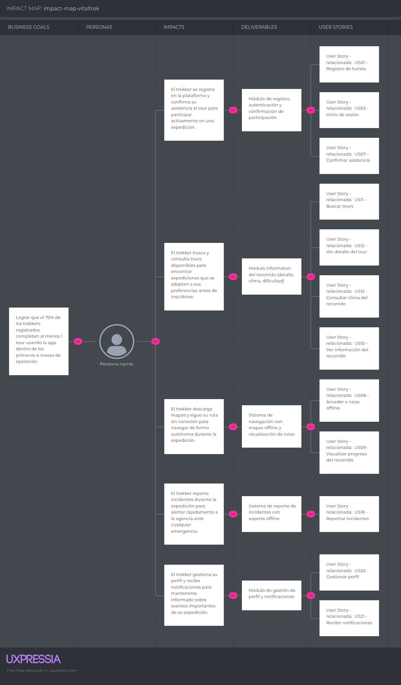

### Impact Map - Segmento 2: Agencia de turismo

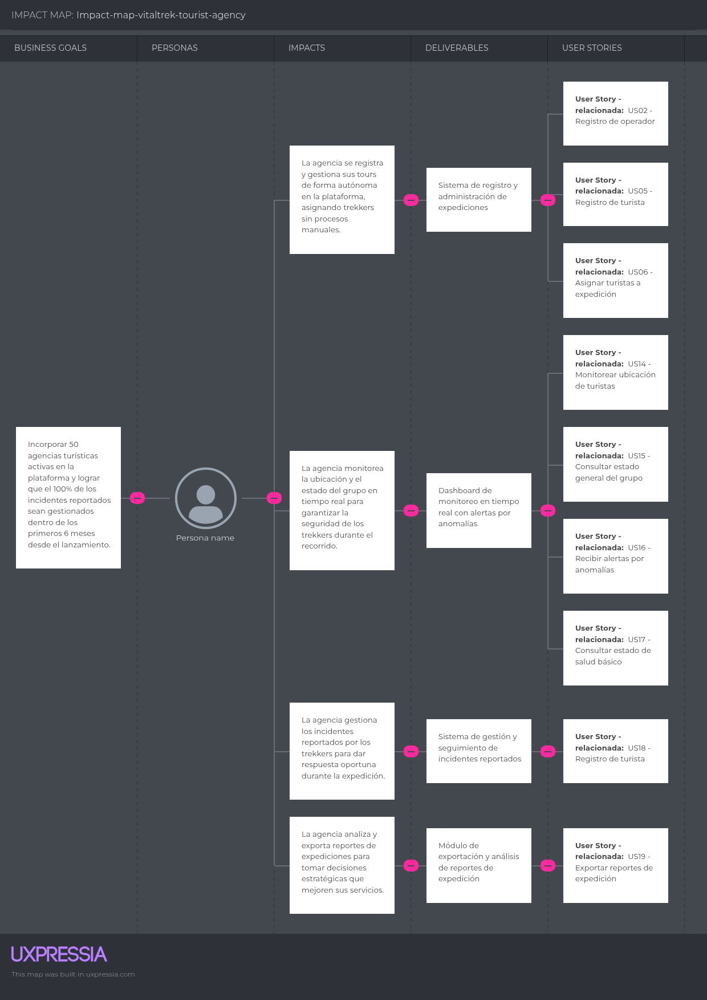


## 3.3. Product Backlog

A continuación se presenta el Product Backlog de VitalTrek con la priorización y estimación de todas las historias identificadas. El orden refleja el valor para el negocio, priorizando las funcionalidades del Landing Page y las capacidades core de monitoreo y seguridad en campo.

Para acceder al Product Backlog en la herramienta de gestión del equipo, visitar el siguiente enlace: [Product Backlog — VitalTrek](https://trello.com/invite/b/6a01549806a94e62dfa6d970/ATTIaa1f5e639f52cbe5545e00c59015b13b4225C42A/product-backlog)
https://trello.com/invite/b/6a01549806a94e62dfa6d970/ATTIaa1f5e639f52cbe5545e00c59015b13b4225C42A/product-backlog

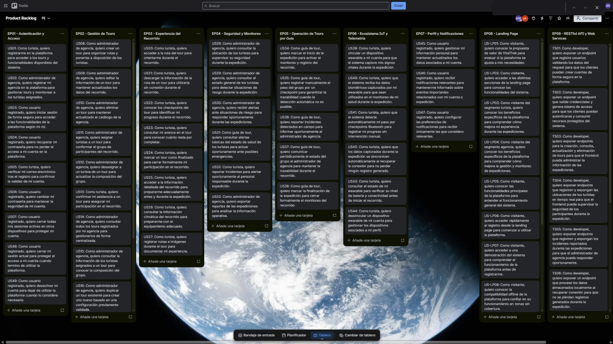

| #Orden | User Story ID | Título | Descripción | Story Points |
|:--------|:---------------|:--------|:-------------|:--------------|
| 1 | US-LP01 | Conocer la propuesta de valor | Como visitante, quiero conocer la propuesta de valor de VitalTrek para evaluar si la plataforma se ajusta a mis necesidades. | 3 |
| 2 | US-LP02 | Navegar entre secciones de la landing | Como visitante, quiero acceder a las distintas secciones de la landing page para conocer las funcionalidades del sistema. | 2 |
| 3 | US-LP03 | Conocer beneficios para turistas | Como visitante del segmento turista, quiero conocer los beneficios específicos de la plataforma para comprender cómo mejora mi experiencia durante las expediciones. | 2 |
| 4 | US-LP04 | Conocer beneficios para administradores de agencia | Como visitante del segmento agencia, quiero conocer los beneficios específicos de la plataforma para comprender cómo mejora la gestión y monitoreo de expediciones. | 2 |
| 5 | US-LP05 | Conocer las funcionalidades principales | Como visitante, quiero conocer las funcionalidades principales de la plataforma para entender el funcionamiento general del sistema. | 2 |
| 6 | US-LP06 | Acceder al registro desde la landing | Como visitante, quiero acceder rápidamente al registro desde la landing page para comenzar a utilizar la plataforma. | 1 |
| 7 | US-LP07 | Acceder a una demostración del sistema | Como visitante, quiero acceder a una demostración del sistema para comprender el funcionamiento de la plataforma antes de registrarme. | 3 |
| 8 | US-LP08 | Conocer la compatibilidad offline | Como visitante, quiero conocer la compatibilidad offline de la plataforma para confiar en su funcionamiento en zonas sin cobertura. | 1 |
| 9 | US-LP09 | Contactar al equipo de VitalTrek | Como visitante, quiero contactar al equipo de VitalTrek para resolver dudas relacionadas con la plataforma. | 3 |
| 10 | US-LP10 | Conocer las medidas de seguridad de datos | Como visitante, quiero conocer cómo la plataforma protege la información personal para confiar en el sistema. | 1 |
| 11 | US-LP11 | Conocer testimonios y casos de uso | Como visitante, quiero conocer testimonios y casos de uso reales para tomar una decisión informada sobre la plataforma. | 2 |
| 12 | US-LP12 | Conocer el equipo de la startup | Como visitante, quiero conocer al equipo detrás de VitalTrek para construir confianza en la propuesta de valor. | 2 |
| 13 | TS03 | Endpoint de gestión de tours | Como developer, quiero exponer endpoints para la creación, consulta, actualización y eliminación de tours para que el frontend pueda administrar la información de las expediciones. | 5 |
| 14 | US08 | Crear tour | Como administrador de agencia, quiero crear un tour para organizar rutas y ponerlas a disposición de los turistas. | 5 |
| 15 | US09 | Editar tour | Como administrador de agencia, quiero editar la información de un tour para mantener actualizados los datos del recorrido. | 3 |
| 16 | US10 | Eliminar tour | Como administrador de agencia, quiero eliminar un tour para mantener actualizado el catálogo de la agencia. | 2 |
| 17 | US16 | Duplicar tour | Como administrador de agencia, quiero duplicar un tour existente para crear uno nuevo basado en una configuración previamente validada. | 3 |
| 18 | US14 | Consultar tours de la agencia | Como administrador de agencia, quiero consultar todos los tours registrados por mi agencia para gestionarlos de forma centralizada. | 2 |
| 19 | US11 | Asignar turistas a un tour | Como administrador de agencia, quiero asignar turistas a un tour para conformar el grupo de participantes del recorrido. | 5 |
| 20 | US12 | Desasignar turista de un tour | Como administrador de agencia, quiero desasignar a un turista de un tour para actualizar la composición del grupo. | 3 |
| 21 | US15 | Consultar turistas asignados a un tour | Como administrador de agencia, quiero consultar la información de los turistas asignados a un tour para conocer la composición del grupo. | 2 |
| 22 | US17 | Buscar tours | Como turista, quiero buscar tours mediante términos para localizar opciones acordes a mis intereses. | 3 |
| 23 | US18 | Filtrar tours | Como turista, quiero filtrar los tours disponibles según criterios definidos para encontrar opciones ajustadas a mis preferencias. | 3 |
| 24 | US19 | Consultar detalle del tour | Como turista, quiero acceder a la información completa de un tour para tomar una decisión informada antes de participar. | 2 |
| 25 | US13 | Confirmar asistencia | Como turista, quiero confirmar mi asistencia a un tour para asegurar mi participación en el recorrido. | 2 |
| 26 | US45 | Gestionar perfil personal | Como usuario registrado, quiero gestionar mi información personal para mantener actualizados los datos asociados a mi cuenta. | 2 |
| 27 | US25 | Consultar información del recorrido | Como turista, quiero acceder a la información detallada del recorrido para prepararme adecuadamente antes y durante la expedición. | 2 |
| 28 | US26 | Consultar clima del recorrido | Como turista, quiero consultar la información climática del recorrido para prepararme con el equipamiento adecuado. | 3 |
| 29 | US20 | Visualizar ruta del tour | Como turista, quiero acceder a la ruta del tour para orientarme durante el recorrido. | 8 |
| 30 | US21 | Descargar ruta offline | Como turista, quiero descargar la información de la ruta de un tour para utilizarla sin conexión durante el recorrido. | 8 |
| 31 | US22 | Visualizar checkpoints del recorrido | Como turista, quiero conocer los checkpoints del tour para identificar mi progreso durante el recorrido. | 5 |
| 32 | US23 | Visualizar progreso del recorrido | Como turista, quiero consultar mi avance en el tour para conocer cuánto resta por completar. | 5 |
| 33 | US24 | Finalizar tour | Como turista, quiero marcar un tour como finalizado para cerrar formalmente mi participación en el recorrido. | 2 |
| 34 | US27 | Registrar experiencia del recorrido | Como turista, quiero registrar notas e imágenes durante el tour para documentar mi experiencia. | 3 |
| 35 | TS04 | Endpoint de monitoreo de ubicación | Como developer, quiero exponer endpoints que registren y expongan las ubicaciones de los turistas en tiempo real para que el frontend pueda supervisar la seguridad de los participantes durante la expedición. | 8 |
| 36 | TS05 | Endpoint de gestión de incidentes | Como developer, quiero exponer endpoints que registren y expongan los incidentes reportados durante las expediciones para que el administrador de agencia pueda responder oportunamente. | 5 |
| 37 | TS07 | Endpoint de gestión de alertas | Como developer, quiero exponer endpoints que generen y expongan alertas ante anomalías detectadas para que el administrador de agencia y el guía de tour puedan responder oportunamente. | 5 |
| 38 | US28 | Monitorear ubicación de turistas | Como administrador de agencia, quiero consultar la ubicación de los turistas para supervisar su seguridad durante la expedición. | 8 |
| 39 | US29 | Consultar estado general del grupo | Como administrador de agencia, quiero consultar el estado general de los turistas para detectar situaciones de riesgo durante la expedición. | 8 |
| 40 | US30 | Recibir alertas por anomalías | Como administrador de agencia, quiero recibir alertas ante situaciones de riesgo para responder oportunamente durante las expediciones. | 5 |
| 41 | US31 | Consultar estado de salud básico | Como guía de tour, quiero consultar alertas básicas del estado de salud de los turistas para actuar oportunamente ante posibles emergencias. | 5 |
| 42 | US32 | Reportar incidentes | Como turista, quiero reportar incidentes para alertar oportunamente al personal responsable durante la expedición. | 3 |
| 43 | US33 | Exportar reportes de expedición | Como administrador de agencia, quiero exportar reportes de las expediciones para analizar la información operativa. | 5 |
| 44 | TS08 | Endpoint de exportación de reportes | Como developer, quiero exponer un endpoint que genere reportes exportables de las expediciones para que el administrador de agencia pueda analizar la información operativa. | 5 |
| 45 | US34 | Iniciar expedición | Como guía de tour, quiero marcar el inicio de la expedición para activar el monitoreo y registro del recorrido. | 3 |
| 46 | US35 | Registrar paso por checkpoint manual | Como guía de tour, quiero registrar manualmente el paso del grupo por un checkpoint para garantizar la trazabilidad cuando la detección automática no es posible. | 3 |
| 47 | US36 | Reportar incidente desde el rol guía | Como guía de tour, quiero reportar incidentes detectados en campo para informar oportunamente al administrador de agencia. | 3 |
| 48 | US37 | Comunicar estado del grupo | Como guía de tour, quiero comunicar periódicamente el estado del grupo al administrador de agencia para mantener la trazabilidad durante el recorrido. | 3 |
| 49 | US38 | Finalizar expedición como guía | Como guía de tour, quiero marcar la finalización de la expedición para cerrar formalmente el monitoreo del recorrido. | 2 |
| 50 | TS09 | Endpoint de ingesta de telemetría IoT | Como developer, quiero exponer un endpoint que reciba y procese la telemetría enviada por los dispositivos wearables para que la información biométrica esté disponible para el monitoreo en tiempo real. | 8 |
| 51 | TS10 | Endpoint de gestión de dispositivos wearables | Como developer, quiero exponer endpoints para vincular, desvincular y consultar dispositivos wearables para que los turistas puedan administrar los dispositivos asociados a su cuenta. | 5 |
| 52 | TS06 | Endpoint de sincronización offline | Como developer, quiero exponer un endpoint que procese los datos almacenados localmente al recuperar conexión para que no se pierdan registros generados durante la expedición. | 8 |
| 53 | US39 | Vincular dispositivo wearable | Como turista, quiero vincular un dispositivo wearable a mi cuenta para que el sistema capture mis signos vitales durante la expedición. | 3 |
| 54 | US40 | Recibir datos biométricos del wearable | Como turista, quiero que el sistema reciba los datos biométricos capturados por mi wearable para que sean utilizados en el monitoreo de mi salud durante la expedición. | 5 |
| 55 | US41 | Detección automática por checkpoint Bluetooth | Como turista, quiero que el sistema detecte automáticamente mi paso por checkpoints Bluetooth para registrar mi progreso sin intervención manual. | 8 |
| 56 | US42 | Sincronización asincrónica de telemetría | Como turista, quiero que los datos capturados durante la expedición se sincronicen automáticamente al recuperar la conexión para no perder ningún registro generado. | 8 |
| 57 | US43 | Consultar estado del wearable | Como turista, quiero consultar el estado de mi wearable para verificar su nivel de batería y conectividad antes de iniciar el recorrido. | 2 |
| 58 | US44 | Desvincular dispositivo wearable | Como turista, quiero desvincular un dispositivo wearable de mi cuenta para gestionar los dispositivos asociados a mi perfil. | 2 |
| 59 | US46 | Recibir notificaciones | Como usuario registrado, quiero recibir notificaciones relevantes para mantenerme informado sobre eventos importantes relacionados con mi cuenta o expedición. | 5 |
| 60 | US47 | Configurar preferencias de notificaciones | Como usuario registrado, quiero configurar las preferencias de notificaciones para recibir únicamente las que considero relevantes. | 3 |
| 61 | TS01 | Endpoint de registro de usuarios | Como developer, quiero exponer un endpoint que registre usuarios validando los datos del request para que los clientes puedan crear cuentas de forma segura en la plataforma. | 5 |
| 62 | TS02 | Endpoint de autenticación | Como developer, quiero exponer un endpoint que valide credenciales y genere tokens de acceso para que los clientes puedan autenticarse y consumir recursos protegidos del sistema. | 5 |
| 63 | US01 | Registro de turista | Como turista, quiero registrarme en la plataforma para acceder a los tours y funcionalidades disponibles del sistema. | 5 |
| 64 | US02 | Registro de administrador de agencia | Como administrador de agencia, quiero registrar mi agencia en la plataforma para gestionar tours y monitorear a los turistas asignados. | 5 |
| 65 | US03 | Inicio de sesión | Como usuario registrado, quiero iniciar sesión de forma segura para acceder a las funcionalidades de la plataforma según mi rol. | 3 |
| 66 | US05 | Verificación de correo electrónico | Como turista, quiero verificar mi correo electrónico tras el registro para confirmar la validez de mi cuenta. | 2 |
| 67 | US04 | Recuperación de contraseña | Como usuario registrado, quiero recuperar mi contraseña para no perder el acceso a mi cuenta en la plataforma. | 3 |
| 68 | US06 | Cambio de contraseña | Como usuario registrado, quiero cambiar mi contraseña para mantener la seguridad de mi cuenta. | 2 |
| 69 | US48 | Cerrar sesión actual | Como usuario registrado, quiero cerrar mi sesión actual para proteger el acceso a mi cuenta cuando termino de utilizar la plataforma. | 1 |
| 70 | US07 | Cierre de sesiones activas | Como usuario registrado, quiero cerrar todas mis sesiones activas en otros dispositivos para proteger mi cuenta. | 2 |
| 71 | US49 | Desactivar cuenta personal | Como usuario registrado, quiero desactivar mi cuenta para dejar de utilizar la plataforma cuando lo considere necesario. | 2 |

<div style="page-break-before: always;"></div>

---

# Capítulo IV: Product Design

## 4.1. Style Guidelines

### 4.1.1. General Style Guidelines

**Branding**

VitalTrek es una plataforma IoT orientada al turismo de aventura extrema en Perú y América Latina. La identidad visual del producto refleja dos valores centrales que coexisten: **seguridad** y **aventura**. El sistema visual comunica confianza tecnológica a través de una paleta oscura y estructurada, mientras que el acento naranja aporta energía, dinamismo y llamada a la acción. El resultado es una marca que transmite seriedad operativa sin perder el espíritu explorador de su audiencia.

El logotipo se presenta siempre acompañado del nombre **VitalTrek** en peso bold, con un espaciado de tracking negativo (-0.3px) para mayor cohesión. El ícono nunca se usa de forma aislada en contextos de navegación. La proporción mínima del logo es 32px de alto para garantizar legibilidad en pantallas pequeñas.

---

**Tone of Communication**

El tono de VitalTrek se posiciona en los siguientes ejes:

| Eje | Posición |
|---|---|
| Divertido / Serio | **Serio con energía** — el producto gestiona situaciones de riesgo real, por lo que el tono es directo y profesional, pero no frío. |
| Formal / Casual | **Semi-casual** — se tutea al usuario, se usan frases cortas y activas. Se evita el lenguaje técnico innecesario. |
| Respetuoso / Irreverente | **Respetuoso** — la seguridad del turista es el eje central; el tono nunca minimiza riesgos ni usa humor inapropiado. |
| Entusiasta / Sereno | **Entusiasta** — los CTAs y encabezados usan lenguaje de acción ("Explore more", "Worry less", "Manage all your tours"). |

El idioma por defecto de la interfaz es **inglés (en_US)**. Se soporta **español latinoamericano (es_419)** como idioma alternativo mediante el sistema i18n implementado en el producto.

---

**Colors**

La paleta de colores de VitalTrek está organizada en cuatro categorías funcionales: superficies, accentos, texto y bordes. Todos los valores están definidos como CSS Custom Properties en el archivo `style.css` del producto, garantizando consistencia y mantenibilidad.

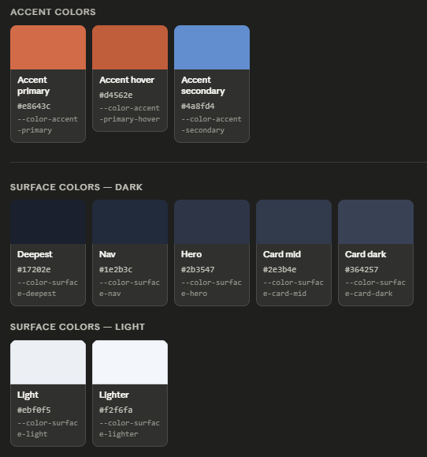

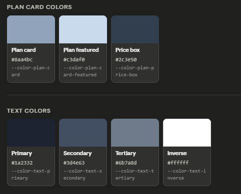

---

**Typography**

VitalTrek usa un sistema tipográfico de dos familias con roles claramente diferenciados.

**Fuentes**

| Familia | Peso(s) | Rol |
|---|---|---|
| **Playfair Display** | 700, 800 (regular e italic) | Headings principales (h1, h2, h3), precios |
| **DM Sans** | 300, 400, 500, 600 | Cuerpo de texto, labels, botones, navegación |


**Escala tipográfica**

| Elemento | Familia | Tamaño | Peso | Uso |
|---|---|---|---|---|
| H1 Hero | Playfair Display | `clamp(40px, 5vw, 66px)` | 700 | Titular principal de la landing |
| H2 Secciones | Playfair Display | `clamp(26px, 3vw, 48px)` | 700 | Encabezados de cada sección |
| H3 Cards | DM Sans | `15–24px` | 600–700 | Títulos de plan cards y about cards |
| H4 Features | DM Sans | `14px` | 600 | Títulos de feature cards |
| Body | DM Sans | `15–16px` | 400 | Descripciones de sección |
| Body small | DM Sans | `13–14px` | 400 | Texto de cards y listas |
| Label | DM Sans | `11–12px` | 700 | Section tags, plan tiers |
| Button | DM Sans | `14px` | 600 | Todos los botones |
| Caption | DM Sans | `12px` | 400 | Footer, notas de precio |

**Principios tipográficos**

- **Jerarquía serif/sans**: los headings en Playfair Display establecen un contraste editorial con el cuerpo en DM Sans, creando ritmo visual en cada sección.
- **Line height**: `1.6` para cuerpo de texto, `1.10–1.20` para headings, `1.75` para párrafos descriptivos.
- **Letter spacing**: `0.14em` en section tags (uppercase), `-0.3px` en el nombre del logo.
- **Responsive type**: los headings principales usan `clamp()` para escalar fluidamente entre breakpoints sin media queries adicionales.

---

**Spacing**

El sistema de espaciado de VitalTrek sigue una escala consistente basada en múltiplos de 4px. Los valores más usados son:

| Valor | Uso principal |
|---|---|
| `4px` | Gap entre elementos inline (lang toggle, nav actions) |
| `7–10px` | Gap interno en listas de features |
| `14px` | Gap entre cards en grids |
| `16px` | Padding de elementos compactos (section tags, badges) |
| `22–24px` | Padding interno de cards |
| `28–36px` | Padding de cards grandes (plan cards, eco cards) |
| `48px` | Padding horizontal de secciones en desktop |
| `64–80px` | Padding vertical inferior de secciones |
| `96px` | Padding vertical estándar de secciones en desktop |

**Border Radius**

| Token | Valor | Uso |
|---|---|---|
| `--radius-button` | `8px` | Botones (btn-primary, btn-join, btn-plan) |
| `--radius-card` | `14px` | Feature cards, stat cards, about cards |
| `--radius-section` | `20px` | Eco cards, plan cards, testi cards, modal |
| `--radius-hero` | `28px` | Hero image wrap |

**Shadows**

| Token | Valor | Uso |
|---|---|---|
| `--shadow-elevation-high` | `0 12px 40px rgba(0,0,0,0.28)` | Hero image, modal |
| `--shadow-card` | `0 4px 20px rgba(0,0,0,0.12)` | Feature cards en sección Tourists |
| `--shadow-elevation-low` | `0 2px 10px rgba(0,0,0,0.08)` | Testimonial cards |

---

### 4.1.2. Web Style Guidelines

**Layout y Grid System**

VitalTrek usa CSS Grid como sistema de layout principal. Cada sección de la landing page sigue un grid de dos columnas en desktop que colapsa a una columna en mobile.

| Sección | Grid desktop | Grid mobile |
|---|---|---|
| Hero | `1fr 1fr` | `1fr` |
| Problem | `1fr 1fr` | `1fr` |
| Tourists | `1fr 1fr` | `1fr` |
| Agencies | `1fr 1fr` | `1fr` |
| Ecosystem | `repeat(4, 1fr)` | `1fr` |
| Plans | `repeat(3, 1fr)` | `1fr` |
| Testimonials | `repeat(3, 1fr)` | `1fr` |
| About cards | `repeat(3, 1fr)` | `1fr 1fr` |
| Team | `repeat(5, 1fr)` | `repeat(2, 1fr)` |
| Footer | `1.6fr 1fr 1fr 1fr` | `1fr` |

El ancho máximo de contenido se limita a `1060–1100px` en las secciones con `max-width` explícito (Ecosystem, Plans, Testimonials, Team).

---

**Navbar**

La barra de navegación es **fixed** en la parte superior, con altura fija de `var(--height-navbar) = 66px` y `z-index: 1000`. Estructura:

- **Izquierda**: logo + nombre de marca.
- **Centro**: links de navegación con hover state (background sutil + color blanco).
- **Derecha**: language toggle pill, hamburger (mobile), botón Join (CTA).

En mobile (≤ 900px), los links colapsan a un dropdown vertical que se activa con el hamburger, el cual anima a una X al abrirse. El estado del menú se gestiona con `aria-expanded` para accesibilidad.

---

**Buttons**

VitalTrek define cuatro variantes de botón con usos específicos:

| Clase | Apariencia | Uso |
|---|---|---|
| `.btn-primary` | Fondo naranja, texto blanco | CTA principal en Hero |
| `.btn-outline` | Borde blanco translúcido, texto blanco | CTA secundario en Hero |
| `.btn-join` | Fondo naranja, texto blanco, compacto | CTA en navbar |
| `.btn-plan` | Fondo translúcido blanco o naranja | CTA en plan cards |

Todos los botones tienen `transition` de `0.15–0.2s` en hover, con `transform: translateY(-1px)` o `(-2px)` para dar feedback táctil visual. El radio de borde es siempre `var(--radius-button) = 8px`.

El estado `:focus-visible` expone un outline naranja de `2px` con `outline-offset: 3px` en todos los elementos interactivos para accesibilidad de teclado.

---

**Cards**

Las cards siguen tres arquetipos visuales según el contexto de uso:

***Cards sobre fondo claro (Feature cards, Testimonial cards)***
- Fondo blanco `#fff`.
- Borde `1px solid var(--color-border-default)`.
- `box-shadow: var(--shadow-card)`.
- `border-radius: var(--radius-card)` (14px).
- Hover: `transform: translateY(-3px)` + sombra elevada.

***Cards sobre fondo oscuro (About cards, Team cards, Stat cards)***
- Fondo `var(--color-surface-card-dark)` (`#364257`).
- Borde `1px solid var(--color-border-inverse)`.
- Sin sombra.
- Hover: `transform: translateY(-3px)` o `(-4px)`.

***Cards de agencia (Agency feature cards)***
- Fondo `rgba(255,255,255,0.10)` con `backdrop-filter: blur(8px)`.
- Borde `1px solid rgba(255,255,255,0.15)`.
- Hover: aumenta opacidad del fondo a `0.16`.

---

**Section Tags**

Los labels de sección (`<span class="section-tag">`) usan:
- Color `var(--color-accent-primary)` — naranja.
- `font-size: 11px`, `font-weight: 700`, `letter-spacing: 0.14em`.
- `text-transform: uppercase`.
- Se colocan siempre encima del `<h2>` correspondiente con `margin-bottom: 16px`.

---

**Modal — Join Dialog**

El modal de acceso sigue el patrón **dialog accesible** con `role="dialog"`, `aria-modal="true"`, `aria-labelledby` y `aria-describedby`. Se activa desde el botón Join en la navbar.

- Overlay: `background: rgba(0,0,0,0.55)`, `z-index: 2000`.
- Card: fondo `var(--color-surface-lighter)`, `border-radius: var(--radius-section)` (20px), `max-width: 520px`.
- Botón primario: `var(--color-accent-primary)` naranja relleno.
- Botón secundario: `var(--color-surface-nav)` navy outlined.
- Cierre: botón X en esquina superior derecha, click en overlay, tecla `Escape`.
- Focus management: al abrir, el foco se mueve al botón de cierre; al cerrar, regresa al botón Join.
- i18n: todos los textos del modal responden al toggle de idioma EN/ES.

---

**Responsive Breakpoints**

VitalTrek define tres breakpoints en el CSS:

| Breakpoint | Valor | Descripción |
|---|---|---|
| Tablet | `max-width: 1024px` | Reduce grids de 4 columnas a 2, ajusta footer |
| Mobile | `max-width: 900px` | Navbar colapsa, secciones de 2 columnas a 1 |
| Mobile small | `max-width: 600px` | Reducción agresiva de padding, grids de 1 columna |

En mobile (≤ 900px):
- El padding horizontal de secciones pasa de `48px` a `24px`.
- El padding vertical de secciones pasa de `96px` a `80px`.
- Los botones Hero ocupan el 100% del ancho (`width: 100%`).
- El plans toggle ocupa el 100% del ancho.

En mobile small (≤ 600px):
- El padding horizontal se reduce a `18px`.
- El padding vertical a `64px`.
- Stats grid, features grid, agency grid y eco grid colapsan a `1fr`.
- El footer grid colapsa a `1fr` en columna única.

---

**Accessibility (a11y)**

VitalTrek implementa los siguientes estándares de accesibilidad en la web:

- **ARIA landmarks**: `role="navigation"` en navbar, `role="contentinfo"` en footer, `role="dialog"` en modal, `role="tablist"` y `role="tabpanel"` en el toggle de planes.
- **aria-labelledby**: cada `<section>` referencia su `<h2>` correspondiente por ID.
- **aria-live**: región `role="status"` anuncia cambios de idioma a screen readers.
- **aria-selected**: los botones de tab de planes actualizan `aria-selected="true/false"` dinámicamente.
- **aria-expanded**: el botón hamburger reporta el estado del menú mobile.
- **aria-hidden**: todos los SVGs decorativos están marcados como `aria-hidden="true"`.
- **focus-visible**: outline naranja de 2px en todos los elementos interactivos para navegación por teclado.
- **Semántica HTML**: se usan `<nav>`, `<section>`, `<footer>`, `<address>`, `<figure>`, `<blockquote>`, `<figcaption>` según su propósito semántico.
- **Textos alternativos**: todas las imágenes tienen `alt` descriptivo; las decorativas tienen `alt=""`.

---

**Internationalization (i18n)**

La interfaz web soporta dos locales:

| Locale | Código | Idioma por defecto |
|---|---|---|
| English | `en-US` | Sí |
| Latin American Spanish | `es-419` | No |

El sistema i18n se implementa mediante atributos `data-i18n` en el HTML y un objeto `translations` en `main.js`. La función `toggleLanguage()` actualiza `document.documentElement.lang`, todos los elementos `[data-i18n]`, el pill del botón de idioma y anuncia el cambio mediante `aria-live`. El modal de Join también responde al toggle de idioma. El idioma predeterminado al cargar la página es inglés, conforme al statement del proyecto.

## 4.2. Information Architecture

La arquitectura de información de VitalTrek está diseñada para servir a tres perfiles de usuario con necesidades distintas: el **turista aventurero**, el **administrador de agencia** y el **guía de tour**. Las decisiones de organización, etiquetado, navegación y búsqueda se orientan a reducir la carga cognitiva en contextos de uso exigentes — en campo, sin señal, bajo presión — garantizando que cada usuario encuentre lo que necesita sin esfuerzo y en el menor número de pasos posible.

---

### 4.2.1. Organization Systems

**Organización visual del contenido**

***Jerarquía visual (Visual Hierarchy)***

Se aplica jerarquía visual en todas las secciones de la landing page y en las vistas principales de la aplicación web. El sistema tipográfico de dos familias (Playfair Display para headings, DM Sans para cuerpo) establece niveles de importancia claros: el título de sección comunica el tema central, el subtítulo contextualiza, y el cuerpo detalla. Los elementos de mayor jerarquía visual reciben mayor tamaño tipográfico, mayor contraste cromático y mayor espaciado superior. Este sistema se aplica consistentemente en Hero, Problem, Tourists, Agencies, Ecosystem y Plans.

En la aplicación web, la jerarquía visual se expresa mediante el tamaño y posición de los componentes: el estado activo de una expedición se muestra en la parte superior de la vista con métricas clave (progreso, alertas activas), mientras que el detalle histórico queda en un nivel inferior de la pantalla.

***Organización secuencial (Step-by-step)***

Se aplica organización secuencial en los siguientes contextos:

- **Landing page**: las secciones siguen una progresión narrativa — problema → solución por segmento → tecnología → planes → confianza — que guía al visitante desde la identificación del dolor hasta la conversión.
- **Flujo de registro**: el proceso de creación de cuenta sigue pasos ordenados (datos personales → verificación de correo → configuración de perfil) que el usuario debe completar en secuencia.
- **Creación de tour**: el formulario de creación de tour sigue una secuencia lógica (información general → checkpoints → asignación de turistas → publicación).
- **Inicio de expedición**: el guía sigue un flujo secuencial (verificar grupo → iniciar expedición → registrar checkpoints → finalizar) que refleja el proceso operativo real del recorrido.

***Organización matricial***

Se aplica organización matricial en las vistas de listado y comparación donde el usuario necesita evaluar múltiples elementos con los mismos atributos en paralelo:

- **Sección Plans de la landing page**: los tres planes de cada segmento se presentan en una grilla de tres columnas donde cada fila representa una categoría de features, permitiendo la comparación horizontal entre planes.
- **Dashboard de monitoreo**: el estado de cada turista se presenta en una cuadrícula donde las columnas representan métricas (ubicación, signos vitales, último checkpoint) y las filas representan participantes.
- **Lista de tours de la agencia**: los tours se muestran en formato de tabla o tarjeta donde cada elemento expone los mismos atributos (título, estado, fecha, capacidad) para facilitar la comparación.

**Esquemas de categorización del contenido**

***Por audiencia (grupos de usuarios)***

Es el esquema principal de VitalTrek. Tanto en la landing page como en la aplicación web, el contenido se segmenta según el rol del usuario:

- En la landing page, las secciones "For Adventurous Tourists" y "For the Tours Agencies" presentan beneficios diferenciados para cada segmento. El toggle de planes (Tourists / Agencies) es el ejemplo más explícito de esta categorización.
- En la aplicación web, el menú de navegación y las vistas disponibles varían según el rol autenticado: el administrador de agencia accede a Tour Management y Safety & Monitoring; el turista accede a Navigation & Exploration; el guía tiene acceso operativo a la expedición en curso.

***Por tópicos***

Se aplica dentro de cada módulo de la aplicación web para agrupar funcionalidades relacionadas:

- **Tour Management**: agrupa todo lo relacionado con el ciclo de vida del tour (crear, editar, duplicar, asignar, publicar).
- **Safety & Monitoring**: agrupa ubicaciones, signos vitales, alertas e incidentes bajo el tópico de seguridad operativa.
- **Notification & Profile**: agrupa las preferencias del usuario y el historial de comunicaciones.

***Cronológico***

Se aplica en vistas donde el tiempo es el criterio de relevancia más importante:

- **Historial de expediciones**: ordenado de más reciente a más antiguo.
- **Historial de notificaciones**: ordenado cronológicamente inverso, con las no leídas destacadas al inicio.
- **Registros de ubicación y telemetría**: los datos biométricos y de localización se presentan en orden cronológico para permitir la identificación de patrones a lo largo del recorrido.
- **Incidentes reportados**: ordenados por fecha de reporte, con posibilidad de reordenar por severidad.

---

### 4.2.2. Labeling Systems

Las etiquetas de VitalTrek siguen el principio de mínimo número de palabras sin sacrificar claridad. Se prioriza el uso de términos del dominio de la aventura y el turismo para que los usuarios reconozcan las funciones sin necesidad de aprendizaje adicional.

**Etiquetas de navegación principal**

| Etiqueta EN | Etiqueta ES | Destino |
|---|---|---|
| Tourists | Turistas | Sección beneficios turistas |
| Agencies | Agencias | Sección beneficios agencias |
| Ecosystem | Ecosistema | Sección IoT |
| Plans | Planes | Sección precios |
| About us | Nosotros | Sección equipo |
| Join | Únete | Modal de acceso |

**Etiquetas de módulos de la aplicación**

| Etiqueta EN | Etiqueta ES | Módulo |
|---|---|---|
| My Tours | Mis Tours | Lista de tours del turista |
| Tour Catalog | Catálogo | Lista de tours de la agencia |
| Active Expedition | Expedición activa | Vista de expedición en curso |
| Live Monitoring | Monitoreo en vivo | Dashboard de seguridad |
| Alerts | Alertas | Lista de alertas activas |
| Incidents | Incidentes | Registro de incidentes |
| Profile | Perfil | Datos personales |
| Notifications | Notificaciones | Historial de notificaciones |

**Etiquetas de acciones principales**

| Etiqueta | Contexto |
|---|---|
| Create tour | Nuevo tour |
| Edit | Modificar tour existente |
| Duplicate | Copiar configuración de tour |
| Assign tourist | Agregar participante |
| Start expedition | Iniciar recorrido |
| Register checkpoint | Paso manual por checkpoint |
| Report incident | Nuevo incidente |
| Acknowledge | Confirmar recepción de alerta |
| Export report | Descargar reporte |
| Download route | Guardar ruta offline |
| Sign in | Acceso con cuenta existente |
| Create account | Registro nuevo usuario |

**Etiquetas de estados de entidades**

| Entidad | Estados |
|---|---|
| Tour | Draft · Available · Closed · Cancelled |
| Expedition | Scheduled · Active · Finished · Partially completed |
| Assignment | Pending · Confirmed · Cancelled |
| Alert | Active · Acknowledged · Dismissed |
| Incident | Reported · Acknowledged · Resolved |
| Account | Pending verification · Active · Inactive |

---

### 4.2.3. SEO Tags and Meta Tags

**Landing Page (index.html)**

```html
<title>VitalTrek — Explore more. Worry less.</title>

<meta name="description"
  content="VitalTrek is an IoT platform for extreme adventure tourism in Peru.
  Monitor location, vital signs, and route progress in real time,
  even without a signal.">

<meta name="keywords"
  content="VitalTrek, adventure tourism Peru, IoT trekking, wearable monitoring,
  tour agency platform, GPS tracking trekking, smartwatch hiking,
  turismo aventura Peru, plataforma agencias tours, NexumDevs">

<meta name="author" content="NexumDevs — UPC 2026">

<meta property="og:title"        content="VitalTrek — Explore more. Worry less.">
<meta property="og:description"  content="IoT platform for extreme adventure tourism in Peru.
  Real-time monitoring of location, vital signs and route progress.">
<meta property="og:type"         content="website">
<meta property="og:locale"       content="en_US">
<meta property="og:locale:alternate" content="es_419">
```

**Web Application — Login / Register**

```html
<title>Sign in — VitalTrek</title>

<meta name="description"
  content="Sign in to your VitalTrek account to manage tours,
  monitor expeditions and access your adventure history.">

<meta name="keywords"
  content="VitalTrek login, VitalTrek sign in, adventure tour management,
  IoT expedition platform">

<meta name="author"  content="NexumDevs — UPC 2026">
<meta name="robots" content="noindex, nofollow">
```

**Web Application — Tour Catalog (Agency)**

```html
<title>Tour Catalog — VitalTrek</title>

<meta name="description"
  content="Manage your agency's tour catalog. Create, edit, publish and assign
  tourists to each tour from the VitalTrek dashboard.">

<meta name="keywords"
  content="tour management, agency dashboard, tour catalog, assign tourists,
  VitalTrek agency, adventure tours Peru">

<meta name="author"  content="NexumDevs — UPC 2026">
<meta name="robots" content="noindex, nofollow">
```

**Web Application — Live Monitoring**

```html
<title>Live Monitoring — VitalTrek</title>

<meta name="description"
  content="Real-time monitoring dashboard. Track tourist locations,
  vital signs and receive automatic alerts during active expeditions.">

<meta name="keywords"
  content="live monitoring, IoT expedition tracking, tourist safety,
  vital signs dashboard, VitalTrek monitoring">

<meta name="author"  content="NexumDevs — UPC 2026">
<meta name="robots" content="noindex, nofollow">
```

**Web Application — Active Expedition (Tourist)**

```html
<title>Active Expedition — VitalTrek</title>

<meta name="description"
  content="Navigate your current expedition with offline maps, checkpoint tracking
  and real-time health monitoring provided by VitalTrek.">

<meta name="keywords"
  content="offline navigation, expedition tracking, checkpoint progress,
  trekking app, VitalTrek tourist">

<meta name="author"  content="NexumDevs — UPC 2026">
<meta name="robots" content="noindex, nofollow">
```

---

### 4.2.4. Searching Systems

**Landing Page**

La landing page no implementa búsqueda textual dado que su contenido es estático y está estructurado en secciones claramente diferenciadas. La navegación por anclas cumple la función de localización de contenido de forma más eficiente que una búsqueda para este tipo de producto.

**Web Application**

***Búsqueda de tours***

- **Dónde**: módulo Tour Management, vista de catálogo de la agencia y vista de exploración del turista.
- **Tipo**: búsqueda textual por término libre sobre título y descripción del tour.
- **Filtros disponibles**: dificultad (Easy / Moderate / Hard / Expert), estado (Available / Draft / Closed), duración estimada (rango en horas).
- **Resultado**: lista filtrada de tour cards con título, dificultad, estado y duración. Se actualiza en tiempo real conforme el usuario escribe. Cada card es clickeable para acceder al detalle.
- **Estado vacío**: mensaje "No tours match your search. Try adjusting the filters." con botón "Clear filters" para restablecer la vista completa.

***Búsqueda de turistas asignados***

- **Dónde**: módulo Tour Management, vista de detalle de tour.
- **Tipo**: búsqueda textual por nombre completo o correo electrónico.
- **Filtros disponibles**: estado de asignación (Pending / Confirmed / Cancelled).
- **Resultado**: lista filtrada de turistas con nombre, correo y estado de confirmación. Cada fila expone acciones directas (Unassign).
- **Estado vacío**: mensaje "No tourists found." diferenciando si no hay turistas asignados o si no coinciden con el criterio de búsqueda.

***Búsqueda de incidentes***

- **Dónde**: módulo Safety & Monitoring, vista de incidentes de la expedición.
- **Tipo**: filtrado por categorías predefinidas, sin búsqueda textual libre.
- **Filtros disponibles**: estado (Reported / Acknowledged / Resolved), severidad (Minor / Moderate / Major / Emergency), reportado por (Tourist / Tour Guide).
- **Resultado**: lista filtrada de tarjetas de incidente con descripción, severidad, estado, reportador y timestamp. Los incidentes de mayor severidad se muestran con un indicador de color (rojo para Emergency, naranja para Major).
- **Estado vacío**: mensaje "No incidents recorded for this expedition."

***Búsqueda de notificaciones***

- **Dónde**: módulo Notification & Profile, vista de historial de notificaciones.
- **Tipo**: filtrado por categorías.
- **Filtros disponibles**: tipo (Safety alert / Tour assignment / Expedition update / System), estado (Unread / Read).
- **Resultado**: lista filtrada de notificaciones ordenadas cronológicamente con título, cuerpo, tipo y timestamp. Las no leídas se muestran con un indicador visual (fondo destacado o punto de color).
- **Estado vacío**: mensaje "No notifications yet." para historial vacío, o "No notifications match the selected filters." cuando los filtros no retornan resultados.

***Principios del sistema de búsqueda***

- **No destructiva**: los filtros aplicados no modifican los datos; siempre se puede regresar a la vista completa mediante "Clear filters".
- **Feedback explícito**: el sistema distingue entre "no hay datos registrados" y "no hay coincidencias con los filtros actuales" para evitar que el usuario crea que el sistema tiene un error.
- **Persistencia de filtros**: los filtros activos se mantienen mientras el usuario permanece en la vista; se reinician al salir del módulo.
- **Sin búsqueda global**: no se implementa búsqueda transversal entre módulos. Cada módulo tiene su propio contexto de búsqueda para evitar resultados ambiguos entre entidades de dominios distintos (un "tour" y una "expedition" son entidades diferentes aunque relacionadas).

---

### 4.2.5. Navigation Systems

**Landing Page**

La landing page implementa un sistema de navegación **global fija** mediante una barra superior que permanece visible durante todo el desplazamiento. Los links funcionan como anclas de sección con scroll suave, permitiendo al visitante orientarse y moverse entre secciones sin perder el contexto de la página.

El botón **Join** actúa como CTA de conversión principal y está diferenciado visualmente del resto de links (botón naranja relleno vs. links de texto). Al presionarlo, abre un modal con dos acciones primarias (Sign in / Create account) y una opción terciaria (Continue as guest), estructurando el flujo de entrada en tres niveles de compromiso.

En mobile (≤ 900px), la navegación colapsa a un menú hamburger que despliega los links verticalmente. El estado abierto/cerrado se comunica visualmente con la animación hamburger → X y mediante el atributo `aria-expanded` para screen readers. Al hacer clic en cualquier link del menú, este se cierra automáticamente y el scroll lleva al usuario a la sección destino.

El recorrido esperado del visitante sigue la progresión natural de la página: Hero → Problem → Tourists o Agencies → Ecosystem → Plans → Testimonials → About → footer con acceso a Terms y Privacy Policy.

**Web Application**

La aplicación web usa un sistema de navegación **lateral persistente** en desktop con acceso directo a los módulos principales desde cualquier pantalla. El módulo activo se resalta visualmente para orientar al usuario sobre su posición dentro de la aplicación.

Se aplica el patrón **hub and spoke**: cada módulo es un hub desde el que se accede a las vistas de detalle. La navegación hacia el detalle siempre expone un mecanismo de retorno (botón "Back" o breadcrumb) para que el usuario pueda regresar al hub sin usar el botón de retroceso del navegador.

La aplicación implementa **navegación contextual** en vistas operativas: cuando hay una expedición activa, el sistema expone acciones relevantes para ese contexto (registrar checkpoint, reportar incidente, ver progreso del grupo) sin necesidad de navegar entre módulos.

El flujo de navegación por rol es el siguiente:

**Administrador de agencia**: Dashboard → Tour Catalog → Tour Detail → Assign Tourists → Live Monitoring → Alerts → Incidents → Export Report.

**Guía de tour**: Active Expedition → Checkpoint List → Register Checkpoint → Report Incident → Group Status → Finish Expedition.

**Turista**: My Tours → Tour Detail → Download Route → Active Expedition → Route Map → Checkpoint Progress → Record Experience → Health Status.

**Mobile Application**

La aplicación móvil usa una **barra de navegación inferior** con cuatro destinos organizados por frecuencia de uso durante la expedición:

| Posición | Destino | Uso |
|---|---|---|
| 1 | Route Map | Principal durante el recorrido |
| 2 | Checkpoints | Frecuente durante el avance |
| 3 | Health | Consulta periódica |
| 4 | Profile | Uso ocasional |

El estado de conectividad (online / offline) se comunica mediante un indicador persistente en la interfaz. Las rutas descargadas previamente son accesibles sin conexión, y el sistema sincroniza automáticamente los datos generados offline cuando se recupera la señal.

---

## 4.3 Landing Page UI Design

###  4.3.1 Landing Page Wireframe

Para la landing page se realizaron low-fi Wireframes de cada una de las pantallas del sitio:

Pantalla 1:

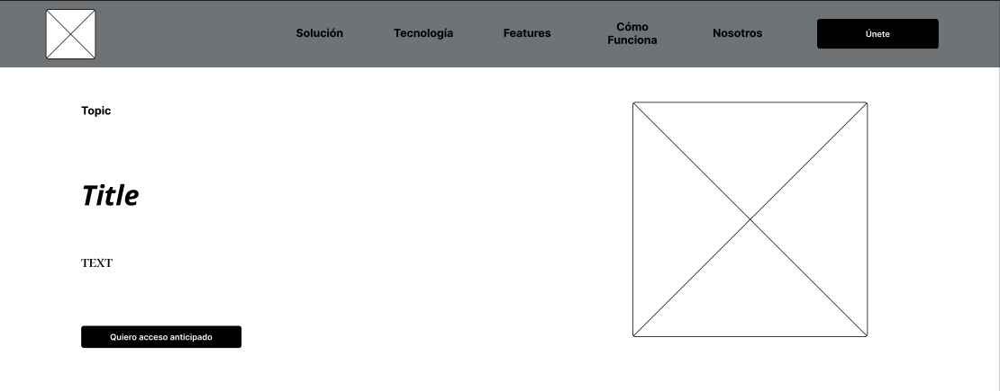

Pantalla 2:


Pantalla 3:

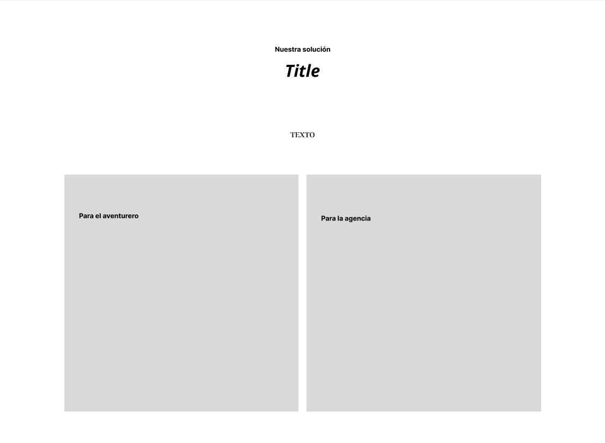

Pantalla 4:


Pantalla 5:

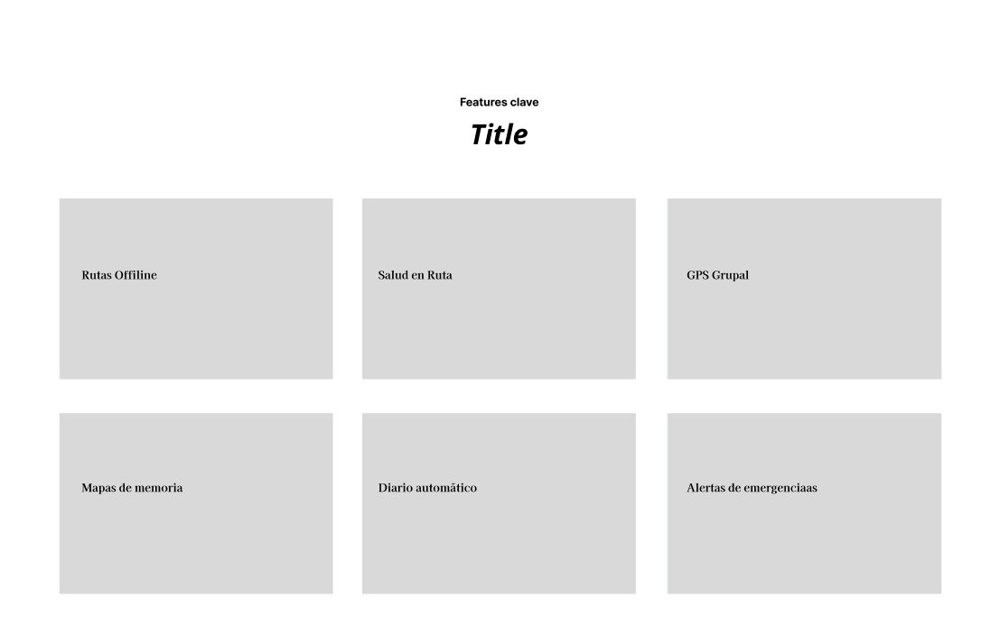

Pantalla 6:

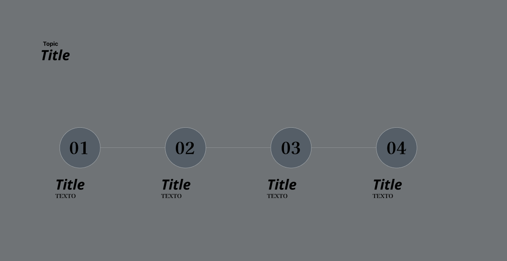

Pantalla 7:

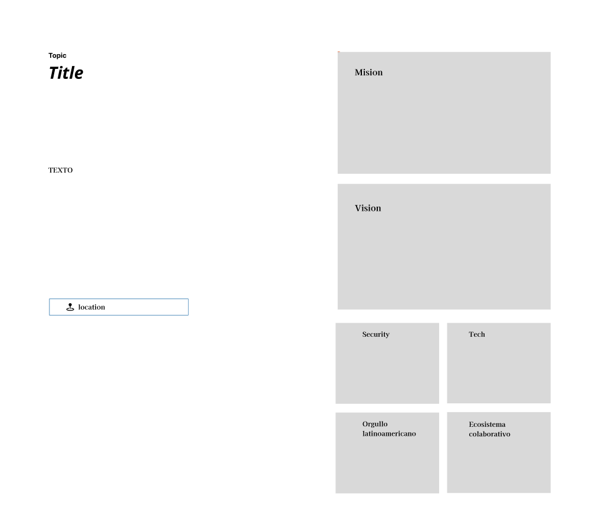

Pantalla 8:


Pantalla 9:

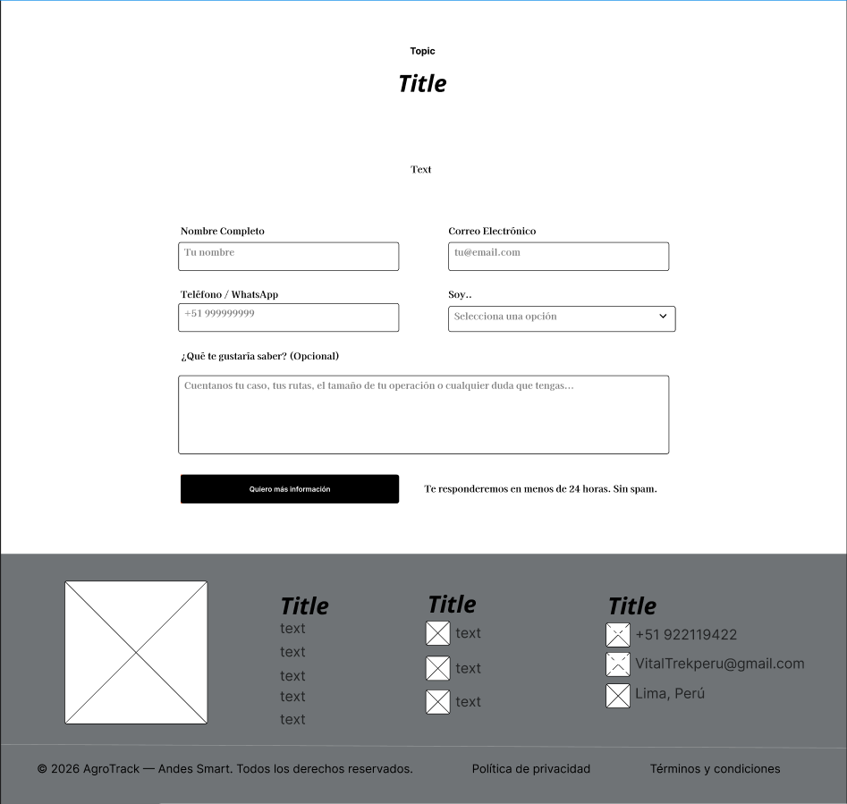

### 4.3.2 Landing Page Mock-up

**Estructura general y lineamientos visuales**

El Mock-Up de la landing page de VitalTrek se desarrolla con un nivel de fidelidad alta, empleando contenido real, imágenes representativas y componentes visuales funcionales, siguiendo una línea gráfica moderna orientada al turismo de aventura y la seguridad tecnológica.

**Aplicación del Branding**

Se incorporan los elementos de identidad visual de VitalTrek, como el logotipo, la paleta cromática institucional y el mensaje principal enfocado en aventura segura. El logotipo se ubica en la parte superior izquierda dentro de la barra de navegación, fortaleciendo el reconocimiento de marca.

La propuesta visual transmite confianza, innovación y conexión con la naturaleza mediante el uso de colores oscuros combinados con tonos azules y acentos naranjas, asociados con tecnología, seguridad y energía.

**Estructura visual:**

- **Zona superior:** barra de navegación con enlaces principales (Solución, Tecnología, Features, Cómo funciona, Nosotros) y botón de llamada a la acción “Únete”.

- **Sección principal** (Hero): mensaje central de alto impacto: “La montaña no espera. Pero tú siempre sabrás dónde está tu grupo.”, acompañado por imagen de excursionistas en montaña, reforzando la propuesta de valor.

- **Sección problema:** presentación del contexto actual del turismo de aventura en Perú, mostrando estadísticas relevantes y resaltando el vacío tecnológico existente en el sector.

- **Sección solución:** explicación de la plataforma para agencias y viajeros, mediante bloques comparativos que detallan beneficios para cada tipo de usuario.

- **Sección tecnología IoT:** presentación del smartwatch inteligente como dispositivo principal de monitoreo, mostrando funciones como alertas, checkpoints, signos vitales y emergencias.

- **Sección funcionalidades:** tarjetas informativas que resumen herramientas clave del ecosistema VitalTrek (rutas offline, salud en ruta, GPS grupal, alertas, diario automático, mapas con memoria, etc.).

- **Sección proceso:** explicación del funcionamiento del servicio en cuatro pasos simples, facilitando la comprensión del usuario.

- **Sección nosotros:** presentación de la visión, misión y valores corporativos, destacando el origen del proyecto y su propósito social.

- **Testimonios:** opiniones de agencias y aventureros que validan la utilidad de la solución.

- **Zona de contacto:** formulario de interés para potenciales clientes o aliados estratégicos.

- **Zona inferior** (Footer): redes sociales, datos de contacto, navegación rápida y enlaces legales.

**Aplicación de guía de estilos:**

- **Tipografía:** combinación de serif elegante para títulos y sans-serif moderna para textos secundarios, generando contraste visual y profesionalismo.


- **Jerarquía tipográfica:**

  - Títulos principales: 38–48 px
  - Subtítulos: 26–32 px
  - Texto base: 16–18 px


- Paleta cromática:
  - Azul oscuro (#24384C) como color principal institucional.
  - Azul claro (#AFC6D9) para fondos suaves.
  - Naranja (#F26A21) como color de acento y llamados a la acción.
  - Blanco y gris claro para equilibrio visual.


- Layout: estructura modular basada en grillas de 2 y 3 columnas en versión desktop, con espaciado amplio y buena respiración visual.

**Principios de diseño y arquitectura de la información:**

El contenido se distribuye jerárquicamente para conducir al usuario desde el problema hasta la solución ofrecida. La navegación superior permite acceso rápido a secciones clave. Se prioriza la claridad del mensaje, el uso estratégico del contraste y una lectura escaneable mediante bloques cortos y secciones diferenciadas.

Los botones de acción destacan por color, ubicación y tamaño, incentivando conversiones como registro o solicitud de información.

**Diseño inclusivo:**

El Mock-Up considera principios de accesibilidad mediante contrastes adecuados, textos legibles, botones visibles y estructura adaptable a distintos dispositivos. Asimismo, se emplean etiquetas claras en formularios e íconos reconocibles para mejorar la experiencia de todo tipo de usuarios.

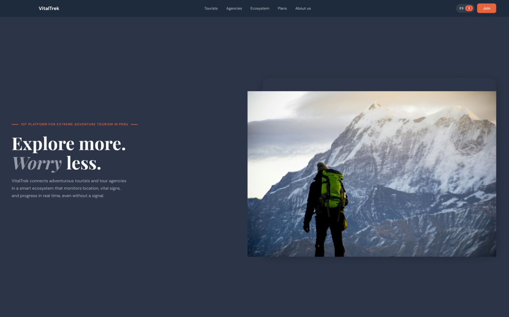
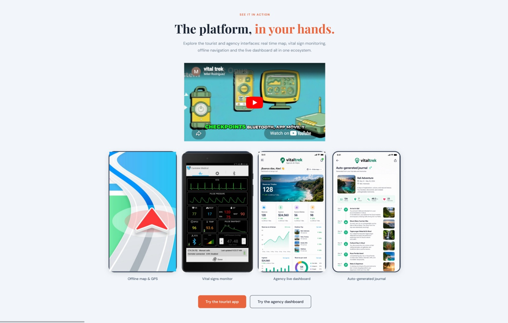
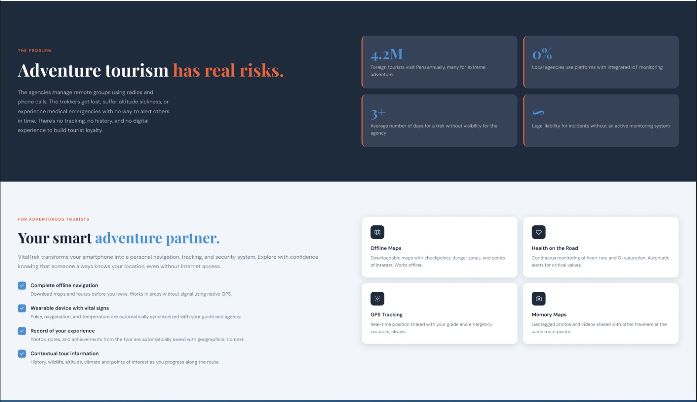
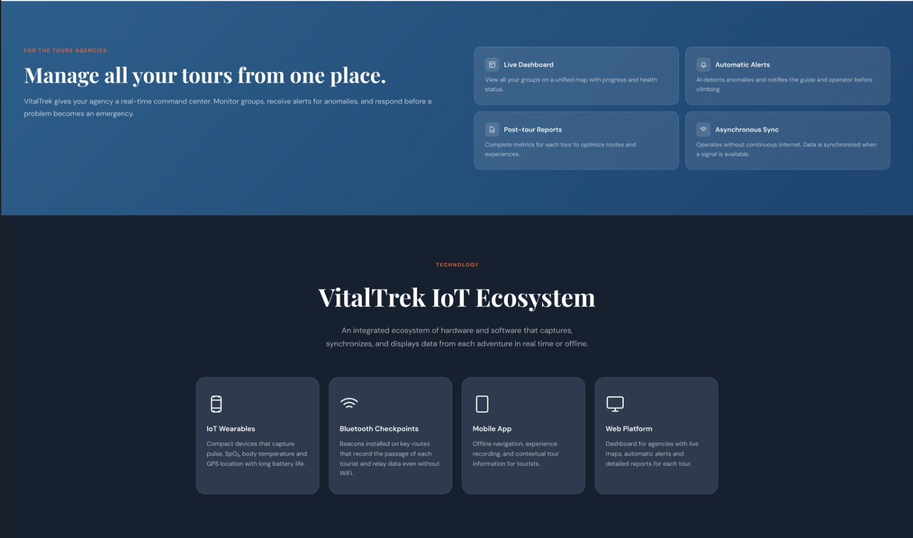
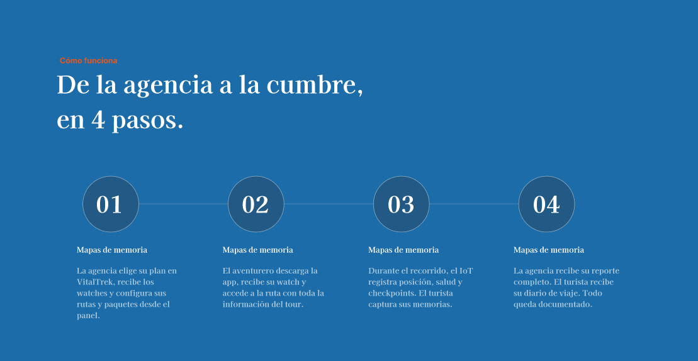
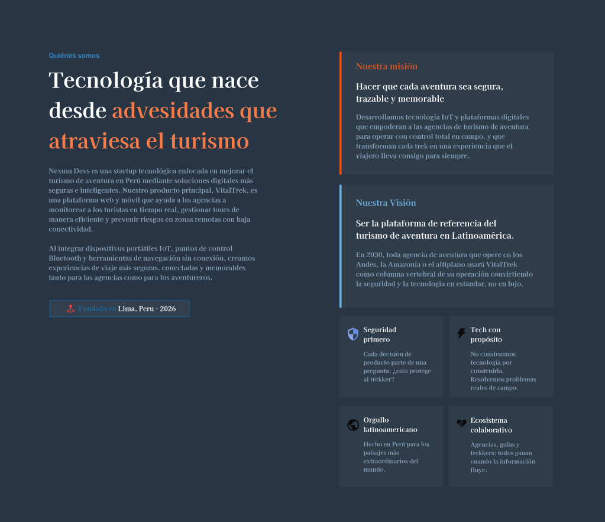
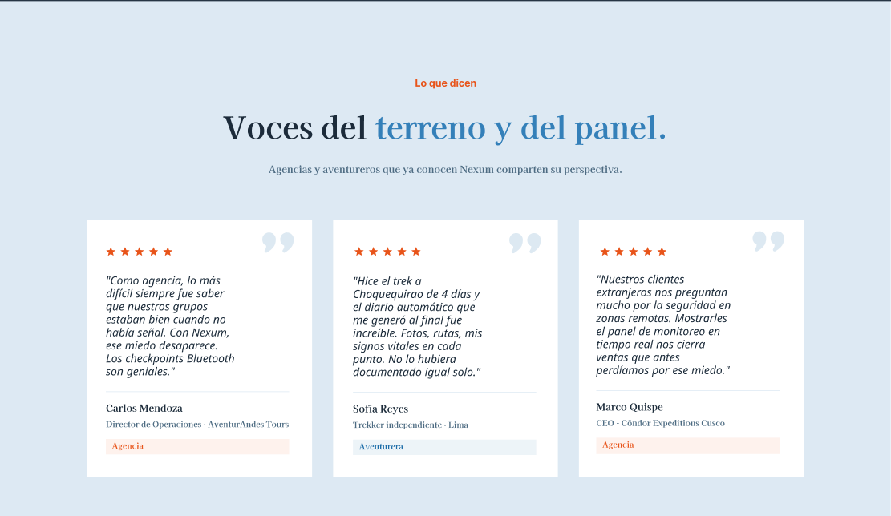
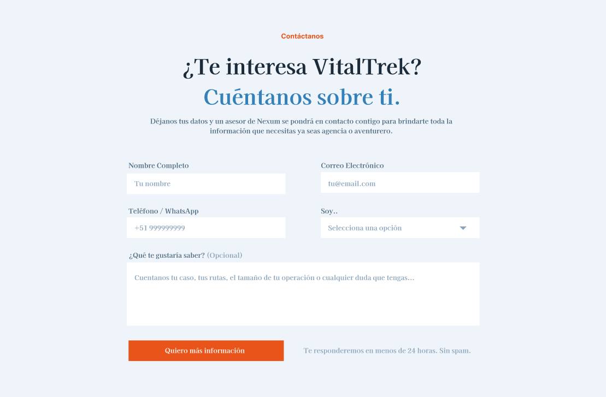
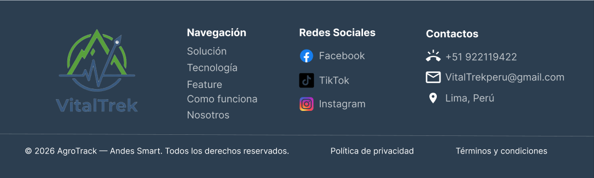

## 4.4. Web Applications UX/UI Design

La presente sección documenta la propuesta visual y de interacción correspondiente a la aplicación web de VitalTrek, plataforma orientada al turismo de aventura asistido por dispositivos IoT en zonas de baja conectividad. La propuesta integra los principios de diseño centrado en el usuario, los lineamientos de diseño inclusivo y la arquitectura de información definida en sprints anteriores, garantizando coherencia con el Design System establecido para los productos digitales del proyecto.

El contenido se organiza en cuatro subsecciones complementarias: los **Wireframes**, que constituyen la base estructural y de jerarquía visual de cada pantalla; los **Wireflow Diagrams**, que documentan las transiciones entre wireframes según los User goals de cada User Persona; los **Mock-ups**, que materializan la propuesta visual final aplicando el Design System; y los **User Flow Diagrams**, que integran los mock-ups con los caminos esperados (happy path) y los caminos alternativos (unhappy paths) que el usuario puede recorrer en el sistema.

Los dos User Personas considerados son: **Ana Lucía Quispe**, gerente de operaciones de una agencia mediana de turismo de aventura en Cusco, representante del segmento de agencias y operadores; y **Marco Rodriguez**, viajero europeo experimentado con alto dominio tecnológico, representante del segmento de turistas de aventura nacionales y extranjeros. Cada User goal documentado a continuación responde directamente a las motivaciones y frustraciones identificadas en sus respectivas fichas.

---

### 4.4.1. Web Applications Wireframes

Los Wireframes presentados a continuación constituyen la propuesta estructural de baja fidelidad de la aplicación web de VitalTrek. Cada wireframe fue diseñado aplicando los principios de jerarquía visual, consistencia y proximidad, junto con los criterios de diseño inclusivo (áreas de toque amplias, contraste adecuado en estado de borrador, etiquetas explícitas en elementos interactivos) y la arquitectura de información validada en etapas previas. La herramienta utilizada para su elaboración fue **Figma**, considerando un viewport base de 1920w para la versión light.

Se identifican trece wireframes principales que cubren las funcionalidades clave del sistema, agrupados según los módulos a los que pertenecen:

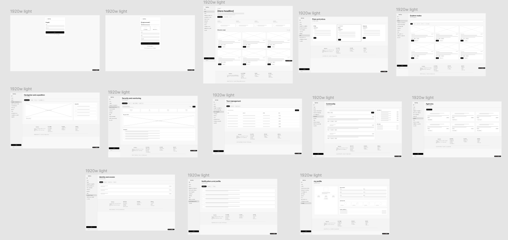

**Explicación de la propuesta:** Los wireframes se diseñaron bajo un enfoque modular y consistente, manteniendo en todas las pantallas una estructura de tres zonas funcionales: un menú de navegación lateral izquierdo persistente que actúa como anclaje de la arquitectura de información, un área principal de contenido que se reorganiza según el módulo activo, y un footer informativo con datos institucionales. Esta consistencia estructural reduce la carga cognitiva del usuario al moverse entre secciones y refuerza el principio de uniformidad visual.

La jerarquía visual se establece mediante el uso de tipografía escalonada (título principal, subtítulo de sección, etiquetas de campo y texto de cuerpo), espacios en blanco generosos y bloques de contenido claramente delimitados. En las pantallas operativas dirigidas a Ana Lucía (Tour management, Security and monitoring, Agencies, Identity and access), se aplica un patrón de tabla con filtros superiores y acción primaria destacada para soportar las tareas administrativas de alta frecuencia. En las pantallas dirigidas a Marco (Explore routes, Plans and prices), se utilizan grids de tarjetas que facilitan la comparación visual entre opciones, mientras que la pantalla Navigation está optimizada para uso en campo con prominencia del mapa y datos esenciales en panel lateral.

En cuanto a diseño inclusivo, los wireframes contemplan áreas táctiles amplias para botones y elementos clickeables (considerando que Marco puede operar el sistema en condiciones outdoor con guantes o en movimiento), etiquetas textuales explícitas que acompañan a los iconos, soporte para internacionalización (relevante para el perfil europeo de Marco), y un orden de lectura natural que respeta la jerarquía F-pattern característica de las interfaces web occidentales.

---

### 4.4.2. Web Applications Wireflow Diagrams

La presente sección documenta los **Wireflows** diseñados para el sistema VitalTrek, los cuales representan la integración entre los wireframes propuestos y los flujos de interacción que cada User Persona sigue para alcanzar sus respectivos User goals. A diferencia de un Task Flow tradicional, el Wireflow permite visualizar simultáneamente la estructura visual de cada pantalla y la secuencia de transiciones que ocurren como respuesta a las acciones del usuario, evidenciando los cambios de estado mediante la incorporación de un nuevo wireframe por cada paso relevante del flujo.

Para la elaboración de estos diagramas, el equipo trabajó previamente los Task Flows correspondientes a cada User goal, estableciendo consenso sobre las rutas típicas de interacción. Los Wireflows fueron desarrollados considerando los dos User Personas definidos: Ana Lucía Quispe (agencia/operador) y Marco Rodriguez (turista de aventura), redactando los User goals desde la perspectiva de sus motivaciones específicas.

A continuación se presentan los seis Wireflows correspondientes a los User goals más representativos del sistema, tres por cada User Persona.

#### 4.4.2.1. Wireflow 01 — Marco registra su cuenta en VitalTrek

**User Persona:** Marco Rodriguez (turista de aventura)

**User goal:** *Como viajero europeo planificando una expedición en Perú, deseo crear una cuenta en VitalTrek desde mi país de origen para preparar mi viaje con anticipación y tener acceso a una plataforma confiable que opere en zonas remotas.*

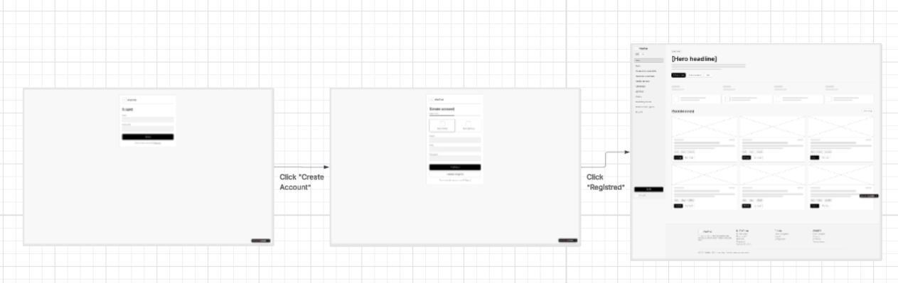

**Explicación del flujo:** El flujo se inicia en la pantalla de Login, donde Marco, como nuevo usuario, selecciona la opción "Crear cuenta", lo que dispara una transición hacia el wireframe del formulario de registro en su estado inicial (campos vacíos). Marco procede a diligenciar la información solicitada (nombre, correo, contraseña y confirmación), generando un nuevo estado del wireframe en el que se visualizan los datos ingresados. Al presionar el botón "Registrar", el sistema valida la información y conduce a Marco al wireframe del Hero/landing en su versión autenticada, donde tiene acceso completo a las funcionalidades del rol turista. Este flujo responde a la motivación de Marco de planificar con anticipación una experiencia outdoor auténtica y atiende su frustración por la falta de aplicaciones confiables para el contexto peruano.

#### 4.4.2.2. Wireflow 02 — Marco se inscribe en una ruta de aventura

**User Persona:** Marco Rodriguez (turista de aventura)

**User goal:** *Como viajero experimentado con alto poder adquisitivo, deseo explorar el catálogo de rutas y seleccionar aquella que ofrezca una experiencia auténtica acorde a mi nivel técnico, con la confianza de que podré comunicarme con mi familia durante el recorrido.*

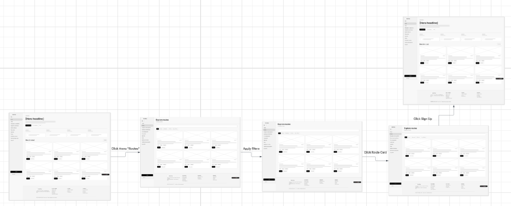

**Explicación del flujo:** El flujo parte del wireframe Hero/landing, desde donde Marco accede al módulo de rutas mediante el menú lateral. Al ingresar, visualiza el wireframe Explore routes con el catálogo completo de rutas disponibles presentadas en formato de tarjetas. Marco aplica filtros de búsqueda (dificultad técnica, duración, ubicación geográfica), generando un nuevo estado del wireframe que refleja únicamente los resultados que cumplen sus criterios. Al hacer clic sobre una tarjeta específica, el flujo transiciona a un nuevo estado del wireframe con el detalle completo de la ruta (descripción cultural e histórica, mapa de la ruta, equipamiento requerido, características de conectividad). Al confirmar la inscripción con el botón "Inscribirme", el flujo retorna al Hero/landing en un estado actualizado. Este Wireflow capitaliza dos motivaciones clave de Marco: enriquecer su experiencia con información cultural del entorno y tener la seguridad de un sistema diseñado para zonas remotas del Perú.

#### 4.4.2.3. Wireflow 03 — Marco sigue su expedición en tiempo real

**User Persona:** Marco Rodriguez (turista de aventura)

**User goal:** *Como turista durante una expedición activa en zona remota, deseo seguir mi recorrido en tiempo real y mantener informados a mis familiares sobre mi ubicación, incluso cuando pierdo señal GPS o conectividad continua durante varios días.*

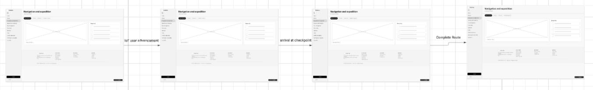

**Explicación del flujo:** Este Wireflow representa el caso de uso más diferenciador de VitalTrek y responde directamente a las dos frustraciones principales de Marco: la incertidumbre por pérdida de señal GPS y la imposibilidad de avisar a su familia. El flujo es predominantemente reactivo: los cambios de estado se disparan por eventos del dispositivo IoT, no por interacciones explícitas del usuario. El flujo inicia con el wireframe Navigation en su estado de "expedición iniciada", mostrando el mapa de la ruta y el punto de partida. A medida que el dispositivo IoT reporta nueva información de ubicación a través de la red de baja conectividad del sistema, el wireframe transiciona hacia un nuevo estado donde el mapa se actualiza y el panel lateral refleja los datos del trayecto, incluyendo el estado de comunicación con familiares. Al alcanzar un punto de control predefinido, el wireframe presenta un estado de notificación que confirma el envío automático de actualización familiar. Finalmente, al completar la ruta, el flujo conduce a un estado final con el resumen de la expedición. Este Wireflow encarna el diferencial tecnológico IoT que distingue a VitalTrek de competidores como AllTrails o Wayward.

#### 4.4.2.4. Wireflow 04 — Ana Lucía monitorea a sus turistas durante un tour

**User Persona:** Ana Lucía Quispe (agencia/operador)

**User goal:** *Como gerente de operaciones de una agencia mediana en Cusco, deseo supervisar en tiempo real las variables vitales y la ubicación de los turistas de cada tour activo para reducir el tiempo de respuesta ante emergencias y profesionalizar la operación de mi agencia.*

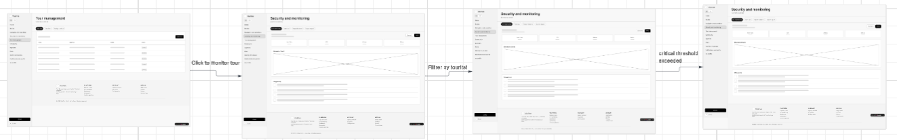

**Explicación del flujo:** El flujo se origina en el wireframe Tour management, donde Ana Lucía visualiza la lista de tours activos coordinados por su agencia. Al seleccionar un tour específico mediante la acción "Monitorear tour", el flujo transiciona al wireframe Security and monitoring en su estado de dashboard general, presentando las visualizaciones gráficas de los datos recibidos desde los dispositivos IoT de los turistas. Ana Lucía puede aplicar filtros por turista, por guía responsable o por tipo de variable vital, generando un nuevo estado del wireframe con la información segmentada. Si una variable supera un umbral crítico predefinido, el sistema transiciona automáticamente a un nuevo estado del wireframe donde se destaca visualmente la alerta correspondiente, indicando la naturaleza del evento y las acciones recomendadas según el protocolo de la agencia. Este Wireflow atiende directamente la frustración de Ana Lucía por la pérdida de comunicación con los guías por horas y la dependencia de WhatsApp y radios analógicas, posicionando a VitalTrek como herramienta de diferenciación competitiva para su agencia.

#### 4.4.2.5. Wireflow 05 — Ana Lucía crea un nuevo tour

**User Persona:** Ana Lucía Quispe (agencia/operador)

**User goal:** *Como responsable de coordinar la operación turística de mi agencia, deseo crear y publicar un nuevo tour dentro del catálogo para gestionar de manera profesional la oferta de servicios y mantener actualizada la información disponible a los turistas.*

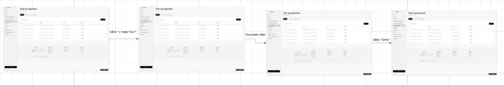

**Explicación del flujo:** El flujo inicia en el wireframe Tour management con la tabla de tours existentes visible. Al presionar el botón "+ Nuevo tour", el wireframe transiciona a un nuevo estado donde se presenta el formulario de creación con todos los campos vacíos (nombre del tour, fechas, capacidad máxima, ruta asociada, guías asignados, precio, descripción). Ana Lucía procede a completar la información requerida, generando un nuevo estado del wireframe con los datos diligenciados. Al confirmar mediante el botón "Guardar", el sistema valida la información y conduce al wireframe final con la tabla de tours actualizada, donde se evidencia el nuevo registro creado al inicio de la lista. Este Wireflow responde a la motivación de Ana Lucía de profesionalizar la operación de su agencia mediante herramientas digitales adaptadas al contexto y presupuesto de una micro o pequeña empresa peruana, contrastando con la oferta limitada y costosa de competidores como TrekkSoft.

#### 4.4.2.6. Wireflow 06 — Ana Lucía gestiona los permisos de su equipo de guías

**User Persona:** Ana Lucía Quispe (agencia/operador)

**User goal:** *Como gerente de operaciones, deseo gestionar los roles y permisos de los guías y personal de mi agencia para garantizar un control adecuado sobre quién accede a la información de cada tour, fortaleciendo la profesionalización operativa.*

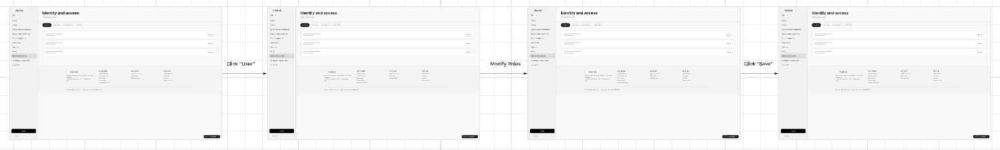

**Explicación del flujo:** El flujo parte del wireframe Identity and access en su estado inicial, presentando la lista completa de usuarios vinculados a la agencia de Ana Lucía (guías, asistentes, personal administrativo) con sus roles actuales. Ana Lucía localiza al usuario objetivo mediante los filtros disponibles y hace clic sobre su registro, lo que dispara una transición al wireframe en un nuevo estado con el detalle del usuario seleccionado, mostrando los roles asignados y permisos asociados. Ana Lucía procede a modificar los roles mediante los selectores disponibles, generando un nuevo estado del wireframe que refleja los cambios pendientes de aplicación. Al confirmar mediante el botón "Guardar", el sistema persiste las modificaciones y conduce al wireframe final con la lista de usuarios actualizada. Este Wireflow refuerza la dimensión de profesionalización operativa que es central en la motivación de Ana Lucía, ofreciéndole control granular sobre su equipo en contraste con la informalidad de las comunicaciones vía WhatsApp.

---

### 4.4.3. Web Applications Mock-ups

Los Mock-ups documentados en esta sección constituyen la materialización visual de alta fidelidad de los wireframes presentados previamente. Su elaboración aplica de manera integral el Design System definido para los productos digitales de VitalTrek, incluyendo la paleta cromática institucional, la familia tipográfica seleccionada, el sistema de espaciados, los componentes UI estandarizados y los lineamientos de iconografía. La herramienta utilizada para su construcción fue **Figma**, manteniendo coherencia visual con los wireframes y permitiendo trazabilidad directa entre ambos niveles de fidelidad.

A continuación se presentan los mock-ups correspondientes a las pantallas principales del sistema, agrupados según los módulos definidos en la sección de wireframes:

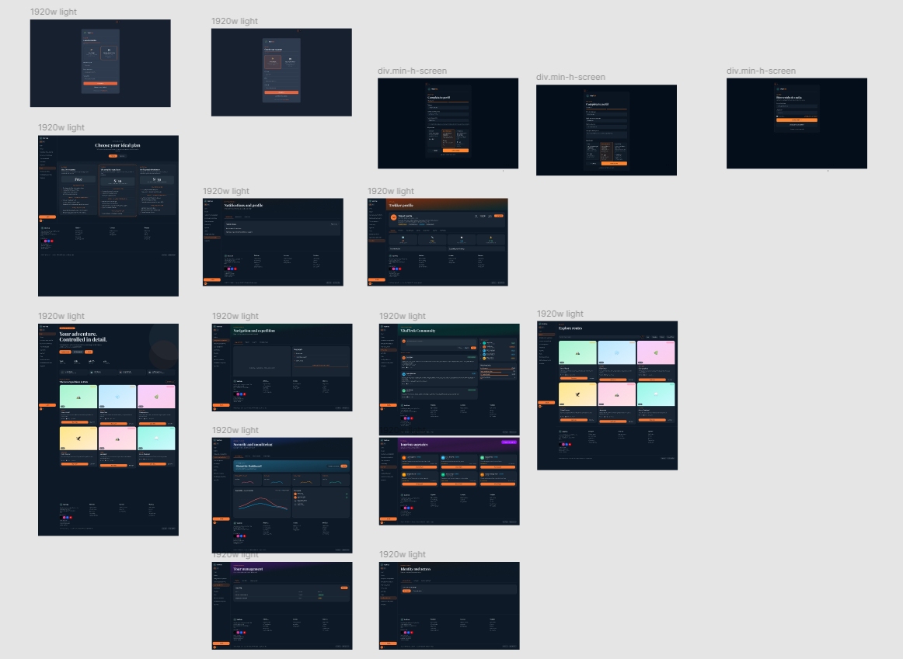

**Explicación de la propuesta:** Los mock-ups aplican consistentemente el Design System establecido, evidenciado en el uso de la paleta cromática principal (con tonos predominantemente naturales asociados al turismo de aventura andino), la tipografía corporativa con escalas tipográficas claras para títulos, subtítulos y cuerpo, y el sistema de espaciado modular que garantiza ritmo visual entre los elementos. Los componentes UI (botones primarios, secundarios y terciarios, campos de formulario, tarjetas, tablas y modales) siguen el catálogo definido en la librería del Design System, lo que asegura consistencia visual y permite escalabilidad en futuras iteraciones.

En relación con los principios de diseño aplicados, se evidencia el uso de jerarquía visual a través de contraste cromático y peso tipográfico, el principio de proximidad mediante la agrupación de elementos relacionados, y el principio de retroalimentación con estados visuales claros (hover, active, disabled, error) en los elementos interactivos. La iconografía utilizada complementa las etiquetas textuales sin sustituirlas, reforzando la comprensión sin generar ambigüedad — un aspecto particularmente relevante para Marco, quien podría utilizar la aplicación en idioma distinto a su lengua materna.

El diseño inclusivo se materializa mediante el uso de contrastes que cumplen los lineamientos WCAG 2.1 en su nivel AA, áreas táctiles mínimas de 44x44 píxeles para elementos interactivos, etiquetas explícitas en todos los campos de formulario, mensajes de error con descripción clara del problema y sugerencia de corrección, y un orden lógico de tabulación para usuarios que navegan con teclado. Adicionalmente, las pantallas dirigidas a Ana Lucía priorizan la densidad informativa controlada (apropiada para perfiles operativos que gestionan múltiples tours simultáneamente), mientras que las pantallas dirigidas a Marco enfatizan la legibilidad en condiciones outdoor y la prominencia visual de la información crítica de seguridad.

---

### 4.4.4. Web Applications User Flow Diagrams

Los User Flow Diagrams documentados en esta sección representan la evolución de alta fidelidad de los Wireflows presentados previamente. Mientras los Wireflows trabajan con representaciones esquemáticas en baja fidelidad, los User Flows integran los Mock-ups finales junto con el detalle completo de los caminos que un usuario puede recorrer en el sistema: tanto la ruta esperada (**happy path**) como las rutas alternativas (**unhappy paths**) que se presentan cuando ocurren errores, validaciones fallidas o decisiones del usuario que se desvían del flujo principal.

Estos User Flows mantienen consistencia directa con los Wireflows definidos en la sección 4.4.2, garantizando trazabilidad de extremo a extremo en el proceso de diseño. Cada diagrama incluye los puntos de decisión, las condiciones de validación y las transiciones entre pantallas, complementados con anotaciones que documentan el comportamiento del sistema en cada bifurcación. Las rutas alternativas fueron diseñadas considerando los escenarios reales identificados durante las entrevistas con representantes de los segmentos objetivo.

#### 4.4.4.1. User Flow 01 — Marco registra su cuenta en VitalTrek

**User Persona:** Marco Rodriguez (turista de aventura)

**User goal:** *Como viajero europeo planificando una expedición en Perú, deseo crear una cuenta en VitalTrek desde mi país de origen para preparar mi viaje con anticipación y tener acceso a una plataforma confiable que opere en zonas remotas.*

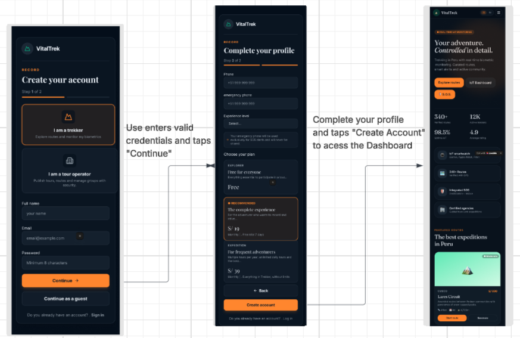

**Explicación del flujo:** El happy path inicia en la pantalla de Login y conduce a Marco al formulario de creación de cuenta, donde completa sus datos personales (nombre, correo, contraseña, país de origen). Al enviar el formulario con información válida, el sistema crea la cuenta y redirige al Hero/landing como turista autenticado, con contenido localizado según su país. Los unhappy paths contemplados son: (a) correo ya registrado, donde el sistema retorna al formulario mostrando un mensaje de error y sugiriendo iniciar sesión o recuperar contraseña; (b) contraseña que no cumple los requisitos mínimos de seguridad, generando un mensaje inline bajo el campo afectado con los criterios pendientes; (c) campos obligatorios vacíos, donde el sistema impide el envío y resalta los campos pendientes; (d) términos y condiciones no aceptados, bloqueando el botón de envío hasta que el checkbox sea marcado; (e) error de conexión durante el registro, mostrando un mensaje de reintento sin perder los datos diligenciados.

#### 4.4.4.2. User Flow 02 — Marco se inscribe en una ruta de aventura

**User Persona:** Marco Rodriguez (turista de aventura)

**User goal:** *Como viajero experimentado con alto poder adquisitivo, deseo explorar el catálogo de rutas y seleccionar aquella que ofrezca una experiencia auténtica acorde a mi nivel técnico, con la confianza de que podré comunicarme con mi familia durante el recorrido.*

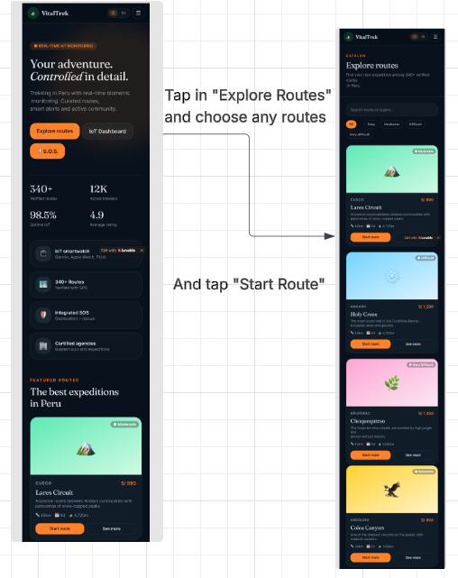

**Explicación del flujo:** El happy path conduce a Marco desde el Hero/landing hasta la pantalla Explore routes, donde aplica filtros, selecciona una ruta y confirma su inscripción, retornando con una notificación de éxito y los detalles del tour en su perfil. Los unhappy paths considerados son: (a) ningún resultado coincide con los filtros aplicados, mostrando un estado vacío con sugerencia de ajustar criterios o ver rutas similares; (b) ruta sin cupos disponibles, donde el botón de inscripción se deshabilita y se ofrece la opción de unirse a una lista de espera o ver fechas alternativas; (c) usuario sin plan activo intentando inscribirse en una ruta premium, lo que dispara una redirección sugerida hacia la pantalla Plans and prices; (d) nivel de dificultad técnica de la ruta superior al perfil declarado por Marco, generando una advertencia que requiere confirmación explícita antes de continuar; (e) error de conexión durante la confirmación, mostrando un mensaje de reintento sin perder los datos seleccionados.

#### 4.4.4.3. User Flow 03 — Marco sigue su expedición en tiempo real

**User Persona:** Marco Rodriguez (turista de aventura)

**User goal:** *Como turista durante una expedición activa en zona remota, deseo seguir mi recorrido en tiempo real y mantener informados a mis familiares sobre mi ubicación, incluso cuando pierdo señal GPS o conectividad continua durante varios días.*

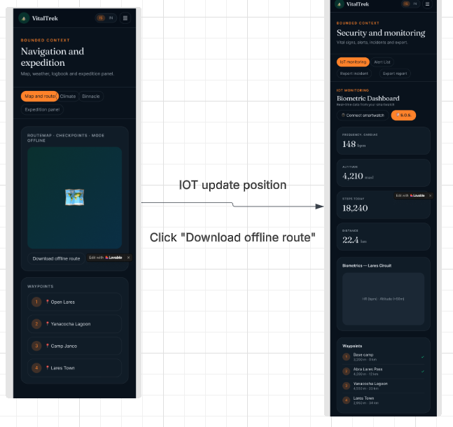

**Explicación del flujo:** El happy path corresponde a una expedición que avanza normalmente: el dispositivo IoT reporta posición continua a través de la red de baja conectividad, el mapa se actualiza, los familiares de Marco reciben notificaciones automáticas en cada checkpoint, y se completa la ruta con resumen final. Los unhappy paths cubiertos — que constituyen el diferencial central de VitalTrek frente a competidores — son: (a) pérdida temporal de señal GPS, donde el sistema muestra la última posición conocida con marca temporal y activa la búsqueda automática mediante el dispositivo IoT, manteniendo a Marco informado del estado de comunicación; (b) desvío del turista respecto a la ruta planificada, lo que dispara una alerta visual con instrucciones de retorno y notifica simultáneamente al guía responsable; (c) detección de valores anómalos en variables vitales (frecuencia cardiaca elevada, temperatura corporal alterada), generando una notificación a Marco y al equipo de la agencia; (d) imposibilidad temporal de enviar actualización familiar, donde el sistema encola el mensaje y lo despacha automáticamente al recuperar conectividad, mostrando claramente el estado de la comunicación a Marco; (e) cancelación voluntaria de la expedición, que conduce a una pantalla de confirmación y registra el evento para la agencia.

#### 4.4.4.4. User Flow 04 — Ana Lucía monitorea a sus turistas durante un tour

**User Persona:** Ana Lucía Quispe (agencia/operador)

**User goal:** *Como gerente de operaciones de una agencia mediana en Cusco, deseo supervisar en tiempo real las variables vitales y la ubicación de los turistas de cada tour activo para reducir el tiempo de respuesta ante emergencias y profesionalizar la operación de mi agencia.*

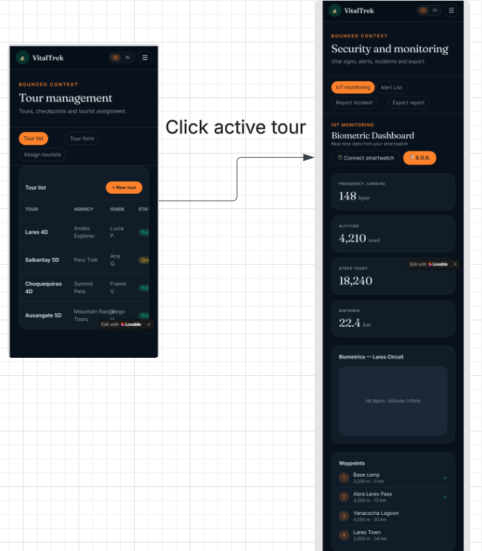

**Explicación del flujo:** El happy path conduce a Ana Lucía desde Tour management hasta el dashboard de Security and monitoring, donde supervisa las variables sin incidentes durante toda la expedición y revisa el reporte de cierre al finalizar. Los unhappy paths definidos — que responden a los escenarios reales que actualmente Ana Lucía gestiona vía WhatsApp y radios analógicas — son: (a) alerta crítica por variable vital fuera de umbral, que activa una notificación destacada con protocolo de respuesta sugerido y permite contacto inmediato con el guía en campo; (b) pérdida de comunicación con un dispositivo IoT específico, que marca al turista afectado en estado "sin conexión" con tiempo transcurrido y dispara el protocolo de búsqueda; (c) múltiples alertas simultáneas en tours diferentes, donde el sistema prioriza por nivel de criticidad y guía a Ana Lucía en el orden de atención; (d) guía responsable no disponible para responder a una alerta, donde el sistema escala automáticamente a un guía de respaldo o a la propia Ana Lucía; (e) error en la carga del dashboard, mostrando un fallback con los últimos datos cacheados y un botón de reintento manual, garantizando continuidad operativa.

#### 4.4.4.5. User Flow 05 — Ana Lucía crea un nuevo tour

**User Persona:** Ana Lucía Quispe (agencia/operador)

**User goal:** *Como responsable de coordinar la operación turística de mi agencia, deseo crear y publicar un nuevo tour dentro del catálogo para gestionar de manera profesional la oferta de servicios y mantener actualizada la información disponible a los turistas.*

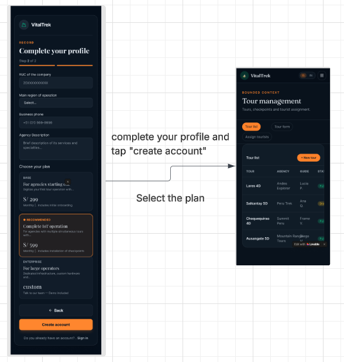

**Explicación del flujo:** El happy path conduce a Ana Lucía desde la tabla de tours hasta el formulario de creación, completando todos los campos requeridos (nombre, fechas, ruta, capacidad, guías asignados, precio) y guardando exitosamente el nuevo registro, que queda disponible inmediatamente en el catálogo. Los unhappy paths considerados son: (a) campos obligatorios incompletos al intentar guardar, donde el sistema resalta los pendientes con mensajes inline específicos; (b) fechas inconsistentes (fecha de inicio posterior a la de fin, o fechas en el pasado), mostrando un mensaje de validación contextual en los campos afectados; (c) capacidad máxima fuera del rango permitido por la política de la agencia, bloqueando el envío hasta corrección; (d) conflicto con otro tour ya programado en las mismas fechas con los mismos guías asignados, donde el sistema detecta la sobreposición y sugiere fechas o guías alternativos; (e) guía asignado sin las certificaciones requeridas para la dificultad técnica de la ruta, lo que dispara una validación que impide guardar hasta que se asigne un guía calificado; (f) error al guardar por pérdida de conexión, manteniendo los datos del formulario para reintento sin pérdida de información.

#### 4.4.4.6. User Flow 06 — Ana Lucía gestiona los permisos de su equipo de guías

**User Persona:** Ana Lucía Quispe (agencia/operador)

**User goal:** *Como gerente de operaciones, deseo gestionar los roles y permisos de los guías y personal de mi agencia para garantizar un control adecuado sobre quién accede a la información de cada tour, fortaleciendo la profesionalización operativa.*

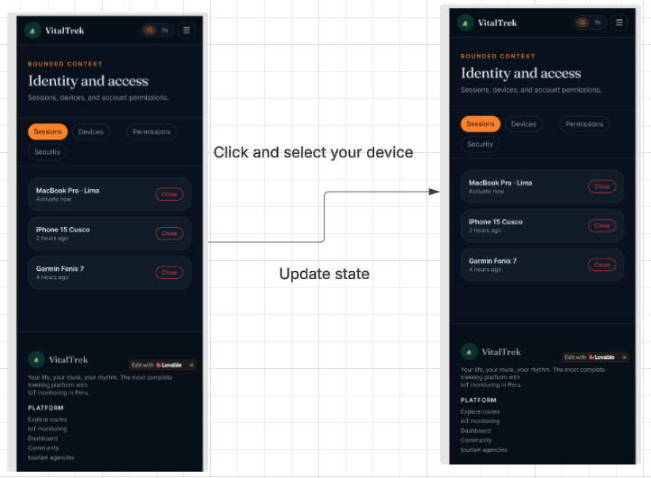

**Explicación del flujo:** El happy path conduce a Ana Lucía desde la lista de usuarios de su agencia hasta el detalle del miembro del equipo seleccionado, donde modifica sus roles y guarda los cambios con éxito, viendo reflejado el cambio inmediatamente en la tabla. Los unhappy paths definidos son: (a) intento de remover el rol de Ana Lucía como única gerente con permisos completos, donde el sistema bloquea la acción y solicita asignar previamente otro responsable; (b) asignación de roles incompatibles entre sí (por ejemplo, guía de campo simultáneamente como administrador de identidad), generando una validación que impide guardar hasta resolver el conflicto; (c) usuario actualmente activo en una sesión con los roles previos, donde el sistema advierte que los cambios surtirán efecto al siguiente inicio de sesión y ofrece notificar al usuario afectado; (d) intento de asignar un permiso de monitoreo IoT a un usuario sin entrenamiento certificado en uso del sistema, donde el sistema sugiere agendar capacitación previa; (e) error de persistencia al guardar, mostrando un mensaje de reintento sin perder las modificaciones realizadas en pantalla.
## 4.5. Web Applications Prototyping

Prototipo de la aplicación web VitalTrek en Figma:
[Prototipo-VitalTrek](https://www.figma.com/design/ggY7QkJXCBcy7VXaPptREz/Figma-basics?node-id=1825-73&t=QlXWry40dvBZPTwC-0)

## 4.6. Domain-Driven Software Architecture

### 4.6.1. Design-Level EventStorming


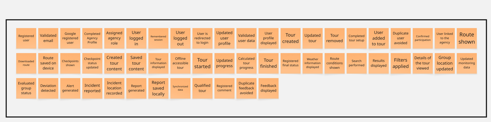
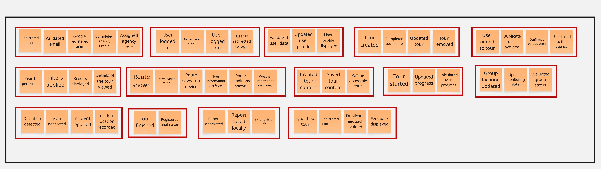
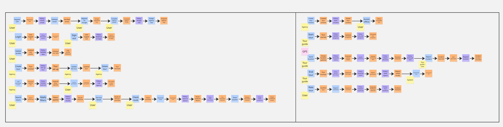
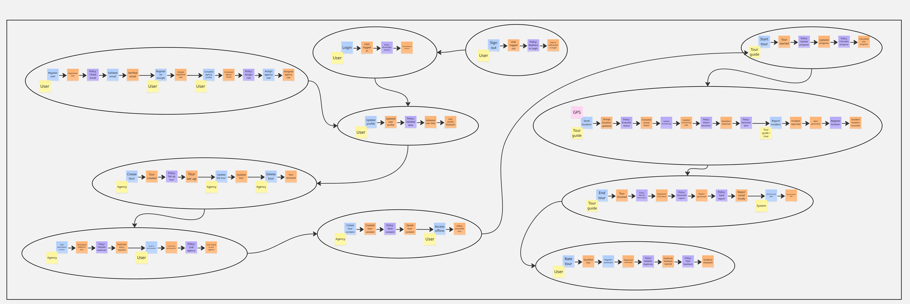

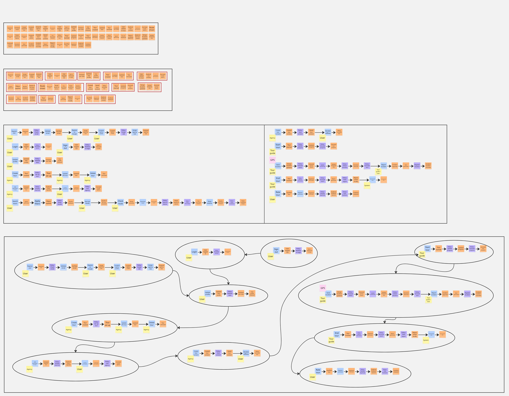

### 4.6.2. Software Architecture Context Diagram


### 4.6.3. Software Architecture Container Diagrams


### 4.6.4. Software Architecture Components Diagrams


## 4.7. Software Object-Oriented Design

### 4.7.1. Class Diagrams

**Bounded Context: Shared**
Agrupa los componentes y servicios transversales reutilizados por toda 
la aplicación. Incluye `Layout`, `LanguageSwitcher` y `FooterContent` 
como componentes de presentación comunes, junto con `BaseApi` y 
`BaseEndpoint` como infraestructura base que extienden las APIs 
específicas de cada bounded context
.


**Bounded Context: Safety & Monitoring**
Supervisa la seguridad de los turistas durante la expedición mediante 
monitoreo en tiempo real. Administra `Location`, `VitalSignReading`, 
`Alert` e `Incident` a través de `SafetyStore`, permitiendo detectar 
anomalías y exportar reportes operativos.


**Bounded Context: Navigation & Exploration**
Gestiona la ejecución de expediciones en campo y la experiencia del 
turista durante el recorrido. Incluye `Expedition` como entidad central, 
junto con `Progress`, `TouristExperience` y `Weather`, coordinados por 
`NavigationStore` para navegación offline y registro multimedia.


**Bounded Context: Identity & Access**
Gestiona el registro, autenticación y ciclo de vida de las cuentas de 
usuario. Se centra en `User` y `Session`, administradas mediante 
`IdentityStore` para operaciones de login, registro, recuperación de 
contraseña y gestión de sesiones activas.


**Bounded Context: Tour Management**
Controla la creación y administración del catálogo de tours por parte 
de las agencias. La entidad principal es `Tour`, que se compone de 
`Checkpoint` y se asocia con `Tourist` mediante asignaciones, todo 
gestionado a través de `TourManagementStore`.


**Bounded Context: Notification & Profile**
Administra los datos personales del usuario y la entrega de 
notificaciones del sistema. Se basa en `Profile`, `NotificationPreferences` 
y `Notification`, gestionados por `ProfileStore` para personalización 
de la cuenta y configuración de canales de comunicación.


**Bounded Context: IoT**
Permite la integración de dispositivos inteligentes y sensores durante las expediciones. Administra `IoTDevice` y `SensorReading` a través de `IoTStore`, habilitando el registro de datos en tiempo real y el envío de comandos a los dispositivos conectados. Se relaciona con el contexto de Safety & Monitoring para proveer lecturas de signos vitales y ubicación.


**Bounded Context: Subscriptions & Payment**  
Gestiona los planes de suscripción y el procesamiento de pagos de los usuarios. Incluye `SubscriptionPlan`, `Subscription e Invoice`, administrados mediante `SubscriptionStore` para operaciones de contratación, cancelación y facturación. Se vincula con el contexto de Identity & Access para asociar las suscripciones a cada usuario registrado.


## 4.8. Database Design
### 4.8.1. Database Diagrams

El diseño de base de datos de VitalTrek está estructurado en 5 bounded
contexts con 15 tablas, siguiendo los principios de Domain-Driven Design
para garantizar modularidad, escalabilidad y mantenibilidad. Cada contexto
—Identity & Access, Tour Management, Navigation & Exploration, Safety &
Monitoring y Notification & Profile— gestiona de forma autónoma una parte
específica del sistema, pero todos están integrados mediante claves foráneas
UUID que reflejan el flujo operativo del negocio: desde el registro del
usuario y la configuración del tour, hasta la ejecución de la expedición,
el monitoreo de seguridad en tiempo real y la entrega de notificaciones.
Esta arquitectura desacoplada pero conectada garantiza trazabilidad completa
del recorrido, monitoreo biométrico continuo, sincronización offline y una
gestión eficiente de toda la operación de turismo de aventura.


<div style="page-break-before: always;"></div>

---
# Capítulo V: Product Implementation, Validation & Deployment

## 5.1. Software Configuration Management

### 5.1.1. Software Development Environment Configuration

Con el objetivo de garantizar un desarrollo fluido, estandarizado y consistente entre todos los miembros del equipo Nexum Devs, se ha definido el siguiente entorno de desarrollo para el ecosistema VitalTrek:

| Actividad                           | Producto           | Propósito / Uso                                                                                                                         | Ruta de referencia / descarga                                                                                                                                              |
|:------------------------------------|:-------------------|:----------------------------------------------------------------------------------------------------------------------------------------|:---------------------------------------------------------------------------------------------------------------------------------------------------------------------------|
| Project Management                  | Trello             | Organización del Product Backlog, planificación de Sprints y monitoreo del avance de tareas del equipo.                                 | https://trello.com/invite/b/6a01549806a94e62dfa6d970/ATTIaa1f5e639f52cbe5545e00c59015b13b4225C42A/product-backlog <br>                                                     |
| Requirements Management             | UXPressia          | Elaboración de artefactos de descubrimiento (User Personas, Empathy Maps, Journey Maps e Impact Maps) para la definición de requisitos. | https://uxpressia.com/w/zOJAx                                                                                                                                              |
| UX/UI Design                        | Figma              | Diseño de la guía de estilo, prototipos de baja fidelidad (wireframes) y alta fidelidad (mockups).                                      | https://www.figma.com/design/ggY7QkJXCBcy7VXaPptREz/Figma-basics?node-id=0-286&p=f&t=A39veEYR7UykQwPG-0                                                                    |
| Big Picture Event Storming          | Miro               | Modelado y representación colaborativa de procesos mediante Event Storming.                                                             | https://miro.com/app/board/uXjVHcmAuSg=/?share_link_id=67734123477                                                                                                         |
| User Flows & Wireflows              | LucidChart         | Elaboración de Wireflows y User Flows.                                                                                                  | https://lucid.app/lucidchart/43bc9b20-18a3-4d2c-b9a6-85ed008620de/edit?viewport_loc=-2040%2C2618%2C4437%2C2445%2C0_0&invitationId=inv_49759446-823e-49d5-b1b4-d320a18165d8 |
| C4 Diagrams                         | Structurizr        | Elaboración de diagramas C4.                                                                                                            | https://structurizr.com/share/109663/51271721-b088-4007-addf-b09ca1ad0c3f                                                                                                  |
| Class Diagrams & Database Design    | PlantUML           | Elaboración de diagramas UML y modelado estructural de la base de datos.                                                                | https://plantuml.com/es/class-diagram                                                                                                                                      |
| Software Development (Backend)      | JetBrains Rider    | Entorno de desarrollo para la implementación de servicios web RESTful con ASP.NET Core y C#.                                            |                                                                                                                                                                            |
| Software Development (Frontend)     | JetBrains WebStorm | Desarrollo de la aplicación web utilizando Vue Framework y tecnologías frontend como HTML5, CSS3 y JavaScript.                          |                                                                                                                                                                            |
| Software Development (Landing Page) | Visual Studio Code | Desarrollo y edición de la Landing Page utilizando tecnologías web estándar.                                                            |                                                                                                                                                                            |
| Version Control                     | GitHub             | Administración de repositorios y control de versiones mediante GitFlow y Conventional Commits.                                          |                                                                                                                                                                            |
| Software Deployment                 | GitHub Pages       | Despliegue y publicación de la Landing Page en un entorno accesible para usuarios.                                                      | https://vitaltrek-project.github.io/landing-page/                                                                                                                          |
| Software Deployment Web-Application | CloudFare          | Despliegue y publicación de la Web Application en un entorno accesible para usuarios.                                                   | 
| Documentation                       | Markdown           | Redacción y mantenimiento de la documentación técnica y del reporte del proyecto.                                                       |                                                                                                                                                                            |


### 5.1.2. Source Code Management

El proyecto utilizará Git como sistema de control de versiones distribuido y GitHub como plataforma de alojamiento de repositorios. Con el propósito de garantizar la trazabilidad, consistencia y control de cambios durante el ciclo de vida del producto digital, se adoptará una estrategia de trabajo basada en GitFlow, permitiendo organizar el desarrollo colaborativo, la integración continua y el mantenimiento de versiones estables del sistema.

Asimismo, cada componente del ecosistema VitalTrek contará con un repositorio independiente, facilitando la modularidad, el control de versiones y la administración de los distintos productos de software desarrollados por el equipo. En el caso de Web Services, el repositorio incluirá tanto el proyecto principal como los archivos correspondientes a pruebas unitarias y pruebas de integración/aceptación.

| Producto                 | Repositorio            | URL                                                      |
|:-------------------------|:-----------------------|:---------------------------------------------------------|
| Landing Page             | vitaltrek-landing-page | https://github.com/VitalTrek-Project/landing-page.git    |
| Frontend Web Application | vitaltrek-frontend     | https://github.com/VitalTrek-Project/web-application.git |
| Web Services             | vitaltrek-backend      |                                                          |
| Documentation            | NexumDevs              | https://github.com/VitalTrek-Project/report.git          |

---

#### Estrategia de Ramas (GitFlow)

El flujo de trabajo del proyecto seguirá el modelo GitFlow propuesto por Vincent Driessen, estableciendo ramas específicas para desarrollo, integración, liberación y mantenimiento correctivo.

Las ramas definidas para el proyecto son las siguientes:

- **main**: contiene únicamente versiones estables, aprobadas y listas para producción. Cada liberación será etiquetada utilizando Semantic Versioning.
- **develop**: rama principal de integración continua donde se consolidan las funcionalidades desarrolladas antes de su liberación.
- **feature/***: ramas temporales creadas a partir de `develop` para el desarrollo de nuevas funcionalidades o User Stories.
- **release/***: ramas utilizadas para la preparación, validación y estabilización de nuevas versiones antes de ser desplegadas en producción.

Las funcionalidades serán desarrolladas en ramas `feature/*` y posteriormente integradas a `develop` mediante Pull Requests (PR). Una vez completada la validación de funcionalidades, se preparará una rama `release/*` para estabilizar la versión antes de su integración en `main`. En caso de detectarse errores críticos en producción, se utilizarán ramas `hotfix/*` creadas a partir de `main`.

---

#### Convención para el Nombre de Ramas

Con el objetivo de mantener consistencia y facilitar la identificación de cambios dentro del repositorio, se definieron las siguientes convenciones para el nombramiento de ramas:

| Tipo de rama | Convención | Ejemplo |
|:--|:--|:--|
| Feature Branch | `feature/<nombre-funcionalidad>` | `feature/user-authentication` |
| Release Branch | `release/v<major>.<minor>.<patch>` | `release/v1.0.0` |

---

#### Semantic Versioning

El versionado de liberaciones seguirá el estándar Semantic Versioning 2.0.0 bajo el siguiente formato:

```text
vMAJOR.MINOR.PATCH
```

Donde:

- **MAJOR**: cambios incompatibles o modificaciones significativas.
- **MINOR**: incorporación de nuevas funcionalidades compatibles.
- **PATCH**: corrección de errores o ajustes menores.

Ejemplo de versión:

```text
v1.0.0
```

---

#### Convención de Commits (Conventional Commits)

Todos los mensajes de commit seguirán el estándar Conventional Commits con el objetivo de mantener un historial de cambios claro, consistente y fácilmente rastreable.

La estructura definida para los mensajes de commit es la siguiente:

```text
<tipo>(componente): descripción corta en minúsculas y en infinitivo
```

---

#### Tipos de Commits Permitidos

| Tipo | Uso recomendado | Ejemplo |
|:--|:--|:--|
| **feat** | Incorporación de nuevas funcionalidades | `feat(auth): agregar autenticación mediante JWT` |
| **fix** | Corrección de errores o fallos del sistema | `fix(api): corregir validación de valores nulos` |
| **docs** | Actualizaciones o modificaciones de documentación | `docs(readme): actualizar instrucciones de instalación` |
| **style** | Cambios de formato que no afectan la lógica del código | `style(navbar): ajustar espaciado entre componentes` |
| **refactor** | Reestructuración interna del código sin modificar su comportamiento | `refactor(recipe): simplificar lógica de filtrado` |
| **test** | Creación o modificación de pruebas unitarias o de integración | `test(user): agregar pruebas unitarias de registro` |
| **chore** | Tareas de mantenimiento o configuración del proyecto | `chore(deps): actualizar dependencias npm` |
| **build** | Cambios relacionados con compilación, CI/CD o despliegue | `build(deploy): configurar pipeline de despliegue` |
| **perf** | Mejoras orientadas al rendimiento del sistema | `perf(search): optimizar tiempo de respuesta del filtrado` |

### 5.1.3. Source Code Style Guide & Conventions

#### Organización del Código

El proyecto seguirá una arquitectura basada en Domain-Driven Design (DDD) y organización modular por funcionalidades (Feature-Based Structure), permitiendo mantener un código desacoplado, reutilizable, escalable y fácil de mantener tanto en frontend como en backend.

Cada funcionalidad del sistema se organiza como un módulo independiente que contiene sus propias capas de responsabilidad, evitando dependencias innecesarias entre contextos del sistema.

Las capas utilizadas en cada módulo son las siguientes:

- `application`: contiene la lógica de aplicación, manejo de estado y coordinación de casos de uso.
- `domain`: contiene entidades, modelos y reglas de negocio del dominio.
- `infrastructure`: contiene acceso a APIs, ensambladores, persistencia y servicios externos.
- `presentation`: contiene componentes visuales e interacción con el usuario.

Asimismo, el sistema incorpora un módulo `shared` destinado a funcionalidades y componentes reutilizables entre diferentes módulos de la aplicación.

La estructura general adoptada en el proyecto es la siguiente:

```text
/src
├── assets/
│
├── locales/
│   ├── en.json
│   └── es.json
│
├── monitoring/
│   ├── application/
│   │   └── monitoring.store.js
│   │
│   ├── domain/
│   │   └── model/
│   │       ├── alert.entity.js
│   │       ├── incident.entity.js
│   │       ├── location.entity.js
│   │       ├── sign.entity.js
│   │       └── tourist.entity.js
│   │
│   ├── infrastructure/
│   │   ├── alert.assembler.js
│   │   ├── incident.assembler.js
│   │   ├── location.assembler.js
│   │   ├── monitoring-api.js
│   │   ├── sign.assembler.js
│   │   └── tourist.assembler.js
│   │
│   └── presentation/
│       ├── components/
│       │   ├── alert-item.vue
│       │   ├── alert-list.vue
│       │   ├── incident-item.vue
│       │   ├── incident-list.vue
│       │   ├── location-item.vue
│       │   ├── location-list.vue
│       │   ├── sign-item.vue
│       │   ├── sign-list.vue
│       │   ├── tourist-item.vue
│       │   └── tourist-list.vue
│       │
│       └── views/
│           └── monitoring-view.vue
│
├── tour-management/
│   ├── application/
│   │   └── tour-management.store.js
│   │
│   ├── domain/
│   │   └── model/
│   │       ├── checkpoint.entity.js
│   │       ├── tour.entity.js
│   │       └── tourist.entity.js
│   │
│   ├── infrastructure/
│   │   ├── checkpoint.assembler.js
│   │   ├── tour.assembler.js
│   │   └── tour-management-api.js
│   │
│   └── presentation/
│       ├── components/
│       │   ├── checkpoint-item.vue
│       │   ├── checkpoint-list.vue
│       │   ├── tour-item.vue
│       │   ├── tour-list.vue
│       │   └── tourist-item.vue
│       │
│       └── views/
│           └── tour-management-view.vue
│
├── shared/
│   ├── infrastructure/
│   │   ├── base-api.js
│   │   └── base-endpoint.js
│   │
│   └── presentation/
│       └── components/
│           ├── footer-content.vue
│           ├── language-switcher.vue
│           └── layout.vue
│
├── navigation/
│   └── index.js
│
├── app.vue
├── i18n.js
├── main.js
└── style.css
```

Esta estructura arquitectónica será utilizada de manera consistente tanto para aplicaciones frontend como para servicios backend desarrollados por el equipo, garantizando uniformidad en la organización del código, separación clara de responsabilidades y facilidad de escalabilidad del sistema.

### 5.1.4. Software Deployment Configuration


Esta sección describe la configuración de despliegue adoptada para los productos digitales del ecosistema VitalTrek, especificando el proceso necesario para publicar correctamente cada solución a partir de sus respectivos repositorios de código fuente.

Durante este primer sprint, el único producto desplegado corresponde a la Landing Page del proyecto. Debido a su naturaleza estática, el despliegue se realiza utilizando GitHub Pages como plataforma de publicación continua integrada con GitHub.

---

#### Landing Page Deployment

La Landing Page fue desarrollada utilizando HTML5, CSS3 y JavaScript, sin requerir herramientas de compilación, gestores de paquetes ni procesos de build adicionales. El despliegue se realiza directamente desde el repositorio remoto alojado en GitHub.

| Configuración            | Valor                                             |
|:-------------------------|:--------------------------------------------------|
| Producto                 | Landing Page                                      |
| Plataforma de despliegue | GitHub Pages                                      |
| Repositorio fuente       | `vitaltrek-landing-page`                          |
| Rama de despliegue       | `main`                                            |
| Directorio publicado     | `/root`                                           |
| Tipo de despliegue       | Automático                                        |
| URL pública              | https://vitaltrek-project.github.io/landing-page/ |

---

#### Procedimiento de Despliegue

El proceso de despliegue configurado para la Landing Page sigue los siguientes pasos:

1. Crear el repositorio remoto en GitHub bajo la organización del equipo.
2. Subir el código fuente de la Landing Page mediante commits y push hacia la rama `main`.
3. Acceder a la sección **Settings > Pages** dentro del repositorio.
4. Configurar GitHub Pages seleccionando:
    - Source: `Deploy from a branch`
    - Branch: `main`
    - Folder: `/root`
5. Guardar la configuración de publicación.
6. Esperar la generación automática del sitio público por parte de GitHub Pages.
7. Verificar el correcto despliegue accediendo a la URL pública generada.

---

#### Automatización del Despliegue

El despliegue está configurado bajo un esquema de publicación automática. Cada actualización enviada mediante `git push` hacia la rama `main` genera automáticamente una nueva versión desplegada de la Landing Page.

Este enfoque permite mantener sincronizada la versión publicada con el estado actual del repositorio fuente, facilitando la integración continua y la entrega rápida de cambios.

---

#### Consideraciones Técnicas

- El despliegue está orientado exclusivamente a contenido estático.
- No se requiere infraestructura de servidores dedicada.
- No se utilizan contenedores ni pipelines CI/CD personalizados durante este sprint.
- El entorno de publicación es completamente administrado por GitHub Pages.
- La solución desplegada es accesible públicamente mediante una URL permanente.

---

## 5.2. Landing Page, Services & Applications Implementation

### 5.2.1. Sprint 1

En esta sección se registra y explica el avance en términos de producto y trabajo colaborativo correspondiente al Sprint 1 del proyecto VitalTrek. Durante este sprint, el equipo concentró sus esfuerzos en la implementación de la Landing Page estática de la plataforma, que constituye el primer punto de contacto con los segmentos objetivo: turistas aventureros y administradores de agencias de tours de aventura.

#### 5.2.1.1. Sprint Planning 1

A continuación se presenta el resumen de la reunión de Sprint Planning correspondiente al Sprint 1, llevada a cabo de forma virtual mediante Discord. En esta reunión el equipo definió el Sprint Goal, acordó la velocidad del sprint y seleccionó las User Stories que serían abordadas durante la iteración.

El Sprint Goal fue formulado considerando el enfoque de negocio y la perspectiva de los visitantes del sitio, siguiendo el template recomendado por Scrum.org:

> **"Our focus is on** publishing a fully functional and bilingual Landing Page for VitalTrek. **We believe it delivers** a clear understanding of the platform's value proposition — including its features, offline capabilities, and security measures — to prospective tourists and tour agency administrators visiting the site. **This will be confirmed when** visitors can navigate all sections of the landing page, consult benefits tailored to each user segment, access a system demonstration, and submit a contact message — all available in both English and Spanish."

| Campo | Detalle |
|:------|:--------|
| **Sprint #** | Sprint 1 |
| **Date** | 2026-05-9 |
| **Time** | 10:00 PM |
| **Location** | Discord  |
| **Prepared By** | Quispe Perez, Edu |
| **Attendees (to planning meeting)** | Rodriguez, Miler / Verastigue, Giancarlo / Vilchez, Gabriel / Alfaro, Joaquin / Quispe Perez, Edu |
| **Sprint n – 1 Review Summary** | Al tratarse del primer sprint del proyecto, no existe sprint previo que revisar. El equipo inició la iteración con el Product Backlog definido y los artefactos de Requirements Engineering completados. |
| **Sprint n – 1 Retrospective Summary** | Al tratarse del primer sprint del proyecto, no aplica retrospectiva anterior. El equipo acordó establecer canales de comunicación en Discord, distribuir responsabilidades por sección de la landing page y mantener una convención de commits descriptiva desde el inicio del desarrollo. |
| **Sprint 1 Goal** | Our focus is on publishing a fully functional and bilingual Landing Page for VitalTrek. We believe it delivers a clear understanding of the platform's value proposition including its features, offline capabilities, and security measures to prospective tourists and tour agency administrators visiting the site. This will be confirmed when visitors can navigate all sections of the landing page, consult benefits tailored to each user segment, access a system demonstration, and submit a contact message all available in both English and Spanish. |
| **Sprint 1 Velocity** | 24 Story Points |
| **Sum of Story Points** | 24 Story Points |

---

#### 5.2.1.2. Aspect Leaders and Collaborators

Durante el Sprint 1, el equipo identificó seis aspectos principales correspondientes al alcance funcional de la Landing Page de VitalTrek. Cada aspecto agrupa un conjunto de User Stories relacionadas y representa una unidad de trabajo coherente dentro de la iteración. La distribución de líderes y colaboradores se estableció en función de las fortalezas de cada integrante y tiene correspondencia directa con la selección de tasks en el Sprint Backlog.

Los aspectos considerados para este sprint son: Hero & Navigation, Benefits & Features Section, Demo & Offline Info Section, Contact & Security Section, Testimonials & Team Section, e i18n & Deployment.

| Team Member (Last Name, First Name) | GitHub Username | Hero & Navigation Leader (L) / Collaborator (C) | Benefits & Features Section Leader (L) / Collaborator (C) | Demo & Offline Info Section Leader (L) / Collaborator (C) | Contact & Security Section Leader (L) / Collaborator (C) | Testimonials & Team Section Leader (L) / Collaborator (C) | i18n & Deployment Leader (L) / Collaborator (C) |
|:-------------------------------------|:----------------|:--------------------------------------------------|:-----------------------------------------------------------|:-----------------------------------------------------------|:----------------------------------------------------------|:----------------------------------------------------------|:------------------------------------------------|
| Quispe Perez, Edu | Eder_09 | C | C | C | C | C | L |
| Rodriguez, Miler | Miler2003 | L | C | C | C | C | C |
| Verastigue, Giancarlo | CaLoVM | C | L | C | C | C | C |
| Alfaro, Joaquin | elprrr | C | C | L | C | C | C |
| Vilchez, Gabriel | GZ-99 | C | C | C | L | L | C |

---

#### 5.2.1.3. Sprint Backlog 1

El objetivo principal del Sprint 1 fue implementar la Landing Page completa y bilingüe de VitalTrek, cubriendo todas las secciones informativas dirigidas a los segmentos de turistas aventureros y administradores de agencias de tours. Al cierre del sprint, todas las User Stories comprometidas fueron completadas satisfactoriamente.

A continuación se presenta el screenshot del board de control utilizado durante el sprint, junto con el URL público.

**Board:** https://trello.com/invite/b/6a0567247c8e53cf8fc17be3/ATTI7e5cdb3f9c2996b8b79b09dace8562264A21CD8D/vitaltrek-sprint-1(#)


---

| Sprint # | Sprint 1 |
|:---------|:---------|

| User Story | | Work-Item / Task | | | | |
|:-----------|:-|:-----------------|:-|:-|:-|:-|
| **Id** | **Title** | **Id** | **Title** | **Description** | **Estimation (Hours)** | **Assigned To** | **Status** |

| Id | Title | Id | Title | Description | Estimation (Hours) | Assigned To | Status |
|:---|:------|:---|:------|:------------|:-------------------|:------------|:-------|
| US-LP01 | Conocer la propuesta de valor | T01 | Diseñar sección Hero | Implementar la sección hero con headline, descripción de la propuesta de valor y CTA principal. | 3 | Rodriguez, Miler | Done |
| | | T02 | Redactar copy de propuesta de valor (EN/ES) | Redactar el contenido textual de la propuesta de valor en inglés y español. | 1 | Alfaro, Joaquin | Done |
| US-LP02 | Navegar entre secciones de la landing | T03 | Implementar Navbar responsive | Desarrollar la barra de navegación con enlaces a todas las secciones y comportamiento responsive. | 3 | Rodriguez, Miler | Done |
| | | T04 | Implementar menú hamburguesa móvil | Implementar el menú colapsable para dispositivos móviles mediante JavaScript. | 2 | Rodriguez, Miler | Done |
| US-LP03 | Conocer beneficios para turistas | T05 | Diseñar sección de beneficios para turistas | Implementar la sección con los beneficios específicos dirigidos al segmento turista, con íconos y descripciones. | 2 | Verastigue, Giancarlo | Done |
| | | T06 | Redactar contenido de beneficios para turistas (EN/ES) | Redactar los textos descriptivos de cada beneficio para el segmento turista en inglés y español. | 1 | Alfaro, Joaquin | Done |
| US-LP04 | Conocer beneficios para administradores de agencia | T07 | Diseñar sección de beneficios para agencias | Implementar la sección con los beneficios específicos dirigidos al segmento agencia, con íconos y descripciones. | 2 | Verastigue, Giancarlo | Done |
| | | T08 | Redactar contenido de beneficios para agencias (EN/ES) | Redactar los textos descriptivos de cada beneficio para el segmento agencia en inglés y español. | 1 | Alfaro, Joaquin | Done |
| US-LP05 | Conocer las funcionalidades principales | T09 | Diseñar sección de funcionalidades | Implementar la sección que presenta las funcionalidades principales del sistema con íconos y descripciones breves. | 2 | Verastigue, Giancarlo | Done |
| | | T10 | Redactar contenido de funcionalidades (EN/ES) | Redactar los textos de cada funcionalidad principal en inglés y español. | 1 | Alfaro, Joaquin | Done |
| US-LP06 | Acceder al registro desde la landing | T11 | Implementar CTA de registro | Añadir botón de acceso rápido al registro en la sección hero y en la navbar. | 1 | Rodriguez, Miler | Done |
| US-LP07 | Acceder a una demostración del sistema | T12 | Diseñar sección de demostración | Implementar la sección que presenta capturas o mockups del sistema con descripción del flujo de uso. | 3 | Alfaro, Joaquin | Done |
| | | T13 | Redactar contenido de demostración (EN/ES) | Redactar los textos descriptivos del flujo de demostración en inglés y español. | 1 | Alfaro, Joaquin | Done |
| US-LP08 | Conocer la compatibilidad offline | T14 | Diseñar sección de compatibilidad offline | Implementar la sección que comunica las capacidades offline de la plataforma. | 1 | Alfaro, Joaquin | Done |
| | | T15 | Redactar contenido offline (EN/ES) | Redactar los textos sobre compatibilidad offline en inglés y español. | 1 | Alfaro, Joaquin | Done |
| US-LP09 | Contactar al equipo de VitalTrek | T16 | Diseñar sección de contacto | Implementar la sección de contacto con formulario de nombre, correo y mensaje. | 2 | Vilchez, Gabriel | Done |
| | | T17 | Implementar validación del formulario de contacto | Añadir validación de campos requeridos y formato de correo electrónico mediante JavaScript. | 2 | Vilchez, Gabriel | Done |
| | | T18 | Redactar contenido de contacto (EN/ES) | Redactar los textos de la sección de contacto en inglés y español. | 1 | Alfaro, Joaquin | Done |
| US-LP10 | Conocer las medidas de seguridad de datos | T19 | Diseñar sección de seguridad de datos | Implementar la sección que comunica las medidas de protección de información personal de los usuarios. | 1 | Vilchez, Gabriel | Done |
| | | T20 | Redactar contenido de seguridad (EN/ES) | Redactar los textos sobre medidas de seguridad de datos en inglés y español. | 1 | Alfaro, Joaquin | Done |
| US-LP11 | Conocer testimonios y casos de uso | T21 | Diseñar sección de testimonios | Implementar la sección de testimonios con tarjetas de casos de uso reales o representativos. | 2 | Vilchez, Gabriel | Done |
| | | T22 | Redactar contenido de testimonios (EN/ES) | Redactar los testimonios y casos de uso en inglés y español. | 1 | Alfaro, Joaquin | Done |
| US-LP12 | Conocer el equipo de la startup | T23 | Diseñar sección del equipo | Implementar la sección con las tarjetas de presentación de los integrantes del equipo VitalTrek. | 2 | Vilchez, Gabriel | Done |
| | | T24 | Redactar contenido del equipo (EN/ES) | Redactar las descripciones de cada integrante del equipo en inglés y español. | 1 | Alfaro, Joaquin | Done |
| | | T25 | Implementar toggle de idioma EN/ES | Desarrollar la funcionalidad de cambio de idioma mediante JavaScript con atributos data-i18n. | 3 | Quispe Perez, Edu | Done |
| | | T26 | Implementar archivo de traducciones | Crear y estructurar el objeto de traducciones en JavaScript para todos los textos de la landing page. | 2 | Quispe Perez, Edu | Done |
| | | T27 | Despliegue en GitHub Pages | Configurar y publicar la landing page en GitHub Pages bajo el repositorio de NexumDevs. | 1 | Quispe Perez, Edu | Done |
| | | T28 | Diseñar Footer | Implementar el footer con links de navegación, redes sociales e información de contacto. | 1 | Quispe Perez, Edu | Done |

#### 5.2.1.4. Development Evidence for Sprint Review

Durante el Sprint 1, el equipo implementó la Landing Page estática y bilingüe de VitalTrek utilizando HTML, CSS y JavaScript vanilla. Los avances cubrieron la estructura semántica completa del sitio, los estilos visuales con variables CSS, la funcionalidad de cambio de idioma EN/ES mediante atributos `data-i18n`, el menú responsive para dispositivos móviles y el despliegue en GitHub Pages. A continuación se presenta la tabla de commits relacionados con la implementación durante este sprint.

| Repository | Branch | Commit Id | Commit Message | Commit Message Body | Committed on (Date) |
|:-----------|:-------|:----------|:---------------|:--------------------|:--------------------|
| VitalTrek-Project/landing-page | feature/hero-navbar | a3f2c1e | feat(landing): add hero section with main CTA | Implements hero section with headline, subtitle and call-to-action button linking to registration. | 2026-04-15 |
| VitalTrek-Project/landing-page | feature/hero-navbar | b7d4e2a | feat(landing): add responsive navbar with mobile menu | Implements navigation bar with links to all sections and hamburger menu for mobile devices using toggleMobileMenu(). | 2026-04-15 |
| VitalTrek-Project/landing-page | feature/hero-navbar | c1a9f3d | style(landing): add CSS custom properties and base styles | Defines CSS variables for color palette (--navy-hero, --orange, --plan-card-bg) and global typography styles. | 2026-04-16 |
| VitalTrek-Project/landing-page | feature/benefits | d5e8b2f | feat(landing): add benefits section for tourists segment | Implements benefits cards section targeted at the tourist user segment with icons and descriptions. | 2026-04-17 |
| VitalTrek-Project/landing-page | feature/benefits | e2c7a4b | feat(landing): add benefits section for agency segment | Implements benefits cards section targeted at the agency administrator segment with icons and descriptions. | 2026-04-17 |
| VitalTrek-Project/landing-page | feature/benefits | f4d1c9e | feat(landing): add features section | Implements main platform features section with icon cards and brief descriptions of core functionalities. | 2026-04-18 |
| VitalTrek-Project/landing-page | feature/demo-offline | g8b3f2a | feat(landing): add demo and offline compatibility sections | Implements system demonstration section with mockup screenshots and offline compatibility info section. | 2026-04-19 |
| VitalTrek-Project/landing-page | feature/contact-security | h2e5d7c | feat(landing): add contact form with validation | Implements contact form with name, email and message fields and JavaScript validation for required fields and email format. | 2026-04-20 |
| VitalTrek-Project/landing-page | feature/contact-security | i9f4a1b | feat(landing): add data security section | Implements section communicating personal data protection measures to platform visitors. | 2026-04-20 |
| VitalTrek-Project/landing-page | feature/testimonials-team | j3c8e6d | feat(landing): add testimonials and team sections | Implements testimonials cards section with use cases and team presentation cards for all VitalTrek members. | 2026-04-21 |
| VitalTrek-Project/landing-page | feature/i18n | k7a2b5f | feat(landing): implement EN/ES language toggle | Implements bilingual support using data-i18n attributes and toggleLanguage() function with translations object for all text content. | 2026-04-22 |
| VitalTrek-Project/landing-page | feature/i18n | l1d9c3e | feat(landing): add translations object for all sections | Defines complete EN/ES translations object in JavaScript covering all text content across hero, benefits, features, demo, contact, testimonials and team sections. | 2026-04-22 |
| VitalTrek-Project/landing-page | feature/footer | m5f7b4a | feat(landing): add footer with navigation links and social media | Implements footer with navigation links, social media icons and contact information. | 2026-04-23 |
| VitalTrek-Project/landing-page | develop | n8e1d2c | style(landing): responsive adjustments for mobile and tablet | Applies media queries for breakpoints at 768px and 480px ensuring correct layout on mobile and tablet devices. | 2026-04-24 |
| VitalTrek-Project/landing-page | develop | o4b6f9a | fix(landing): fix mobile menu close behavior on link click | Fixes mobile menu not closing when a navigation link is clicked on small screens. | 2026-04-25 |
| VitalTrek-Project/landing-page | develop | p2c3e7d | fix(landing): fix language toggle not updating CTA buttons | Fixes toggleLanguage() not updating text content of CTA buttons in hero and navbar sections. | 2026-04-25 |
| VitalTrek-Project/landing-page | main | q6a8b1f | chore(deploy): configure GitHub Pages deployment | Configures GitHub Pages deployment from main branch and verifies correct rendering of all sections. | 2026-04-26 |
| VitalTrek-Project/landing-page | main | r3d5c4e | docs(landing): add README with project description and deploy URL | Adds README.md with project description, tech stack, local setup instructions and GitHub Pages URL. | 2026-04-26 |

---

#### 5.2.1.5. Execution Evidence for Sprint Review

Durante el Sprint 1, el equipo completó la implementación de la Landing Page estática y bilingüe de VitalTrek. Se implementaron todas las secciones comprometidas en el Sprint Backlog: Hero con propuesta de valor y CTA, navegación responsive con toggle de idioma EN/ES, beneficios diferenciados por segmento (turistas y agencias), funcionalidades principales de la plataforma, demostración del sistema, compatibilidad offline, formulario de contacto con validación, medidas de seguridad de datos, testimonios y casos de uso, y sección del equipo. La landing page fue desplegada en GitHub Pages al cierre del sprint.

A continuación se presentan capturas de las principales vistas implementadas:


---

#### 5.2.1.6. Services Documentation Evidence for Sprint Review

Durante el Sprint 1, el alcance del equipo se limitó exclusivamente a la implementación de la Landing Page estática de VitalTrek, desarrollada con HTML, CSS y JavaScript vanilla. En esta iteración no se implementaron Web Services ni endpoints de API REST, por lo que no aplica documentación de servicios con OpenAPI para este sprint.

La implementación de endpoints y su documentación corresponderá a sprints posteriores, una vez que el equipo avance hacia el desarrollo de la Web Application y el Web Service de la plataforma.

### 5.2.2. Sprint 2

En esta sección se registra y explica el avance en términos de producto y trabajo colaborativo correspondiente al Sprint 2 del proyecto VitalTrek. Durante este sprint, el equipo concentró sus esfuerzos en la implementación inicial de la **Web Application**, que constituye el núcleo funcional de la plataforma y habilita la interacción directa de los usuarios con los servicios de expediciones, monitoreo y gestión de tours.

---

### 5.2.1.7. Software Deployment Evidence for Sprint Review

Durante el Sprint 1, el equipo desplegó la Landing Page de VitalTrek utilizando **GitHub Pages** como plataforma de publicación, siguiendo la configuración descrita en la sección 5.1.4. El proceso se ejecutó directamente desde el repositorio `vitaltrek-landing-page`, sin requerir procesos de build ni infraestructura adicional, dado que el sitio fue desarrollado con HTML5, CSS3 y JavaScript puro.

El despliegue se configuró desde la sección **Settings > Pages** del repositorio, seleccionando la rama `main` como fuente de publicación y el directorio raíz (`/root`) como contenido servido. Una vez guardada la configuración, GitHub Pages generó automáticamente la URL pública del sitio, verificándose el correcto renderizado de todas las secciones implementadas durante el sprint (Hero, Beneficios por segmento, Funcionalidades, Demo, Compatibilidad offline, Contacto, Seguridad de datos, Testimonios, Equipo y Footer), incluyendo el correcto funcionamiento del toggle de idioma EN/ES.

**Repositorio fuente:** https://github.com/VitalTrek-Project/landing-page

**URL pública desplegada:** https://vitaltrek-project.github.io/landing-page/

**Figura**
*Evidencia de deployment 1 — Configuración de GitHub Pages*

*Nota.* Elaboración propia.

**Figura**
*Evidencia de deployment 2 — Repositorio y commit de despliegue*

*Nota.* Elaboración propia.

**Figura**
*Evidencia de deployment 3 — Sitio publicado y accesible públicamente*

*Nota.* Elaboración propia.

Esta automatización garantiza que cada `push` a la rama `main` actualice automáticamente la versión publicada, cumpliendo con el criterio de aceptación del Sprint Goal referido a la disponibilidad pública y bilingüe del sitio.

---

#### 5.2.1.8. Team Collaboration Insights during Sprint

Durante el **Sprint 1**, el equipo trabajó de manera colaborativa para desarrollar la **primera versión funcional de la Landing Page de VitalTrek**, aplicando una estrategia de trabajo basada en **GitFlow** y utilizando **GitHub** como plataforma para el control de versiones y la integración del código fuente.

Al inicio del Sprint, las tareas fueron planificadas y distribuidas entre los cinco integrantes del equipo, asignando a cada uno la responsabilidad del desarrollo de una sección específica de la Landing Page. Esta distribución permitió que las actividades se desarrollaran de forma paralela, optimizando el tiempo de implementación y facilitando la integración progresiva de los cambios en la rama **develop**.

Durante todo el Sprint, la comunicación entre los integrantes fue constante mediante reuniones de coordinación y seguimiento, donde se revisó el avance de las tareas, se resolvieron dudas técnicas y se verificó que todas las secciones implementadas mantuvieran una estructura visual consistente con la identidad del producto.

#### Distribución de responsabilidades

Durante el Sprint 1, el equipo distribuyó el desarrollo de la primera versión funcional de la Landing Page entre los cinco integrantes, asignando a cada uno una sección específica de la interfaz. En esta primera iteración se priorizó la implementación de la estructura principal del sitio web, dejando para los siguientes Sprints la incorporación de nuevas funcionalidades, mejoras visuales y elementos multimedia.

| Integrante | Sección desarrollada | Responsabilidades |
|------------|----------------------|-------------------|
| **Alberto Joaquin Alfaro Mallma** | Navbar | Implementó la barra de navegación principal de la Landing Page, incorporando la estructura de navegación y los enlaces necesarios para acceder a las secciones disponibles durante el Sprint 1. |
| **Eder Edu Quispe Perez** | Plans | Desarrolló la sección de planes, presentando la información inicial de los servicios ofrecidos por la plataforma mediante una estructura organizada y responsive. |
| **Gabriel Alejandro Vilchez Vite** | Benefits | Implementó la sección de beneficios, describiendo las ventajas que la plataforma ofrece tanto para los turistas como para los trabajadores de agencias de viaje. |
| **Miler Alexander Rodriguez Rojas** | About Us y Footer | Desarrolló las secciones **About Us** y **Footer**, incorporando la información institucional del proyecto, enlaces de navegación y datos de contacto básicos. |
| **Giancarlo Jose Verastigue Martinez** | Integración y soporte de desarrollo | Colaboró en la integración de las diferentes secciones implementadas durante el Sprint, apoyando en la corrección de detalles de la interfaz y en la consolidación de la primera versión funcional de la Landing Page. |

##### Flujo de colaboración

Durante el Sprint se siguió un flujo de trabajo colaborativo que permitió mantener organizado el desarrollo del proyecto:

- Planificación de las actividades durante el Sprint Planning.
- Desarrollo individual de las secciones asignadas a cada integrante.
- Implementación de funcionalidades mediante ramas de trabajo.
- Registro continuo del avance mediante commits en GitHub.
- Integración progresiva de los cambios en la rama `develop`.
- Revisión conjunta de la Landing Page antes de finalizar el Sprint para validar su funcionamiento y consistencia visual.

##### Evidencias de colaboración

Las siguientes figuras muestran las evidencias del trabajo colaborativo realizado durante el Sprint 1.

##### Contributors


Como se aprecia en la figura anterior, todos los integrantes realizaron contribuciones al repositorio durante el Sprint, evidenciando una participación activa en el desarrollo de la primera versión de la Landing Page.

##### Historial de commmits de la lading page v1.0.0


El historial de commits evidencia el desarrollo progresivo del proyecto y la participación continua de los integrantes mediante la incorporación de nuevas funcionalidades y mejoras en las diferentes secciones de la Landing Page.

##### Conclusiones del Sprint

El trabajo colaborativo desarrollado durante el Sprint 1 permitió completar satisfactoriamente la primera versión funcional de la Landing Page de **VitalTrek**. La adecuada distribución de responsabilidades, el uso de GitHub como herramienta de control de versiones y la comunicación permanente entre los integrantes facilitaron la integración del trabajo realizado por cada miembro del equipo. Asimismo, la planificación de las actividades y el seguimiento continuo del progreso permitieron cumplir los objetivos establecidos para el Sprint y sentar una base sólida para las siguientes iteraciones del proyecto.

#### 5.2.2.1. Sprint Planning 2

La reunión de Sprint Planning se realizó de forma virtual mediante Discord. En esta reunión el equipo definió el Sprint Goal, acordó la velocidad del sprint y seleccionó las User Stories que serían abordadas durante la iteración.

El Sprint Goal fue formulado considerando el enfoque de negocio y la perspectiva de los usuarios finales:

> **"Our focus is on** delivering the first functional version of the VitalTrek Web Application. **We believe it delivers** core capabilities such as user registration/login, tour catalog browsing, and initial monitoring features. **This will be confirmed when** users can create accounts, authenticate sessions, explore available tours, and visualize monitoring dashboards within the application."

| Campo | Detalle |
|:------|:--------|
| **Sprint #** | Sprint 2 |
| **Date** | 2026-05-16 |
| **Time** | 9:00 PM |
| **Location** | Discord |
| **Prepared By** | Rodriguez Rojas, Miler |
| **Attendees (to planning meeting)** | Alfaro, Joaquin / Quispe, Edu / Rodriguez, Miler / Verastigue, Giancarlo / Vilchez, Gabriel |
| **Sprint n – 1 Review Summary** | El equipo completó la Landing Page bilingüe y estática, cumpliendo con todos los objetivos del Sprint 1. |
| **Sprint n – 1 Retrospective Summary** | Se acordó mejorar la organización de commits, reforzar la documentación técnica y establecer un flujo de integración continua para la Web Application. |
| **Sprint 2 Goal** | Our focus is on delivering the first functional version of the VitalTrek Web Application. We believe it delivers core capabilities such as user registration/login, tour catalog browsing, and initial monitoring features. This will be confirmed when users can create accounts, authenticate sessions, explore available tours, and visualize monitoring dashboards within the application. |
| **Sprint 2 Velocity** | 30 Story Points |
| **Sum of Story Points** | 30 Story Points |

---

#### 5.2.2.2. Aspect Leaders and Collaborators

Durante el Sprint 2, el equipo identificó seis aspectos principales correspondientes al alcance funcional de la Web Application de VitalTrek.

| Team Member (Last Name, First Name) | GitHub Username | Identity & Access (Login/Register) | Tour Management (Catalog) | Safety & Monitoring (Dashboard) | Notification & Profile | IoT Integration | Deployment & CI/CD |
|:-------------------------------------|:----------------|:----------------------------------|:--------------------------|:-------------------------------|:----------------------|:---------------|:------------------|
| Quispe Perez, Edu | Eder_09 | L | C | C | C | C | C |
| Rodriguez, Miler | Miler2003 | C | L | C | C | C | C |
| Verastigue, Giancarlo | CaLoVM | C | C | L | C | C | C |
| Alfaro, Joaquin | elprrr | C | C | C | L | C | C |
| Vilchez, Gabriel | GZ-99 | C | C | C | C | L | L |

---

#### 5.2.2.3. Sprint Backlog 2

El objetivo principal del Sprint 2 fue implementar la primera versión funcional de la Web Application, habilitando sección IOT, la exploración del catálogo de tours y el monitoreo inicial.
A continuación, se presenta el tablero correspondiente al Sprint 2 junto con su enlace:

https://trello.com/b/QKMh317p/vitaltrek-sprint2


| Sprint # | Sprint 2 | | | | | | |
| :--- | :--- | :--- | :--- | :--- | :--- | :--- | :--- |
| **User Story** | | **Work-Item / Task** | | | | | |
| **Id** | **Title** | **Id** | **Title** | **Description** | **Estimation (Hours)** | **Assigned To** | **Status** |
| US09 | Crear tour | T01 | Diseñar UI de formulario | Implementar la vista web para configurar rutas y puntos de control. | 4 | Quispe, Edu | Done |
| | | T02 | Simular creación (Fake API) | Conectar el frontend con endpoints simulados para el registro local sin backend real. | 3 | Vilchez, Gabriel | Done |
| US18 | Consultar tours de la agencia | T03 | Implementar catálogo de tours | Desarrollar la vista principal de la web application para listar y filtrar los recorridos. | 5 | Rodriguez, Miler | Done |
| | | T04 | Integrar Fake API de listado | Consumir datos estáticos (mock) para poblar las tablas del catálogo de agencia. | 2 | Alfaro, Joaquin | Done |
| US19 | Iniciar expedición | T05 | Desarrollar vista de expedición | Crear el panel interactivo en la web para que el guía gestione el inicio del recorrido. | 4 | Verastigue, Giancarlo | In-Process |
| | | T06 | Simular estado de expedición | Configurar Fake API para simular el cambio de estado de tour a expedición activa. | 3 | Quispe, Edu | In-Process |
| US29 | Monitorear ubicación de turistas | T07 | Integrar mapa web | Incorporar un componente de mapa en el dashboard para mostrar coordenadas en la aplicación web. | 6 | Alfaro, Joaquin | To-Do |
| | | T08 | Simular recepción de telemetría | Inyectar coordenadas simuladas vía Fake API para probar el rastreo en el mapa. | 4 | Vilchez, Gabriel | To-Do |
| US32 | Consultar estado de salud básico | T09 | Construir dashboard IoT | Diseñar y programar los indicadores visuales (ritmo cardíaco, etc.) para el monitoreo de salud. | 5 | Rodriguez, Miler | To-Do |
| | | T10 | Mockear datos biométricos | Crear servicios en frontend que consuman respuestas estáticas simulando un wearable IoT. | 3 | Verastigue, Giancarlo | To-Do |


---

#### 5.2.2.4. Development Evidence for Sprint Review

Durante el Sprint 2, el equipo implementó la base de la Web Application utilizando **Vue.js** junto con la biblioteca de componentes **PrimeVue** para la interfaz. Se configuró  la vista de catálogo de tours y un dashboard básico de monitoreo. El diseño visual siguió las guías de **Material Design** para asegurar consistencia y usabilidad.


| Repository | Branch | Commit Id | Commit Message | Committed on (Date) |
| :--- | :--- | :--- | :--- | :--- |
| VitalTrek/web-application | develop | bac506c | Initial commit | 12/05/2026 |
| VitalTrek/web-application | develop | 0a17524 | chore: initial setup | 12/05/2026 |
| VitalTrek/web-application | feature/monitoring | 2dc2aef | feature: add sign entity | 13/05/2026 |
| VitalTrek/web-application | feature/monitoring | d3d54f8 | feature: update sign-list | 13/05/2026 |
| VitalTrek/web-application | feature/navigation | ae2cc09 | feat: add Tour entity class | 13/05/2026 |
| VitalTrek/web-application | feature/monitoring | 18aa286 | feat: add Tourist entity class | 13/05/2026 |
| VitalTrek/web-application | feature/navigation | a27e74c | feat: add Checkpoint entity class | 13/05/2026 |
| VitalTrek/web-application | feature/iot | 9b3f35e | feat: add Checkpoint and Tour assembler classes | 13/05/2026 |
| VitalTrek/web-application | feature/iot | 7f25948 | feat: add TourManagementApi for managing tours | 13/05/2026 |
| VitalTrek/web-application | feature/iot | 2b31298 | feat: add TourManagement store for managing tour state and actions | 13/05/2026 |
| VitalTrek/web-application | feature/navigation | 249e6f7 | feat: add TourForm component for creating and editing tours | 13/05/2026 |
| VitalTrek/web-application | feature/iot | 101c63e | feat: add TourList component for displaying and managing tours | 13/05/2026 |
| VitalTrek/web-application | feature/iot | bad0214 | feat: add TouristsAssignment component for assigning and unassigning tourists to tours | 13/05/2026 |
| VitalTrek/web-application | feature/tour-management | f14cb3f | feature: add alert, incident, location and tourist entities | 13/05/2026 |
| VitalTrek/web-application | feature/tour-management | 9020fd2 | feature: CRUD sing entity | 13/05/2026 |
| VitalTrek/web-application | feature/tour-management | 9bed2f7 | feature: update file locales | 13/05/2026 |
| VitalTrek/web-application | feature/tour-management | 9da5dbb | feat: add tourists management with fetching, assigning, and unassigning functionality | 14/05/2026 |
| VitalTrek/web-application | feature/tour-management | 70b4348 | chore: initial commit. | 14/05/2026 |
| VitalTrek/web-application | feature/tour-management | fa77486 | feat(store): Update navigation store. | 14/05/2026 |
| VitalTrek/web-application | develop | 4d0de11 | feat(api): Update navigation api and store. | 14/05/2026 |
| VitalTrek/web-application | develop | d95199f | feat(env): Update environment. | 14/05/2026 |
| VitalTrek/web-application | develop | 579db68 | feat(presentation): Add expedition-dashboard.vue, experience-log.vue, route-map.vue and weather-widget.vue. | 14/05/2026 |
| VitalTrek/web-application | develop | bdb3204 | feat(experience): Rename experience.assembler.js. | 14/05/2026 |
| VitalTrek/web-application | develop | 2557952 | feat(env): Add VITE_VITALTREK_PLATFORM_API_URL to development environment | 14/05/2026 |
| VitalTrek/web-application | develop | c154d5a | feat(about): Update about.vue. | 14/05/2026 |
| VitalTrek/web-application | develop | 59cd339 | feat(api): Update base-api.js. | 14/05/2026 |
| VitalTrek/web-application | develop | dc9c78d | feat(expedition): Update expedition-dashboard.vue. | 14/05/2026 |
| VitalTrek/web-application | develop | 67d37e0 | feat(layout): Update layout.vue. | 14/05/2026 |
| VitalTrek/web-application | develop | 00ea74a | feat(store): Update navigation store. | 14/05/2026 |
| VitalTrek/web-application | develop | e9c97b1 | feat(route): Update route-map.vue. | 14/05/2026 |
| VitalTrek/web-application | develop | 092755f | feat(router): Update router.js. | 14/05/2026 |
| VitalTrek/web-application | develop | 9c57f11 | feat(weather): Update weather-widget.vue. | 14/05/2026 |
| VitalTrek/web-application | develop | 26a182e | fix: fix layout | 14/05/2026 |
| VitalTrek/web-application | develop | b7da88e | feature : merge monitoring bounded context to develop branch | 14/05/2026 |
| VitalTrek/web-application | develop | 381bc0f | feat: enhance monitoring features with new alert management, improved navigation, and updated UI components | 15/05/2026 |
| VitalTrek/web-application | develop | 1675266 | merge: feature/navigation into develop | 15/05/2026 |
| VitalTrek/web-application | develop | a59057a | feat(tour-management): add search and stats to tour panel | 15/05/2026 |
| VitalTrek/web-application | develop | 2b8c173 | fix : update comments and documentation for clarity and consistency across IoT and monitoring modules | 15/05/2026 |

---

#### 5.2.2.5. Execution Evidence for Sprint Review

El equipo completó la primera versión funcional de la Web Application. Los usuarios pueden registrarse, iniciar sesión, explorar el catálogo de tours y visualizar un dashboard inicial de monitoreo. Se configuró despliegue en **CloudFlare** y pipeline de integración continua en **GitHub Actions**, aplicando **GitFlow Workflow**, **Conventional Commits** y **Semantic Versioning** para el control de versiones.

**Video demostración**
[https://goo.su/QZUI1L](https://upcedupe-my.sharepoint.com/:v:/g/personal/u202416903_upc_edu_pe/IQD0xfEcQf5CRoJSFOJoNaR4AY9W9ZAsIunBWrLP7TKZfNU?nav=eyJyZWZlcnJhbEluZm8iOnsicmVmZXJyYWxBcHAiOiJTdHJlYW1XZWJBcHAiLCJyZWZlcnJhbFZpZXciOiJTaGFyZURpYWxvZy1MaW5rIiwicmVmZXJyYWxBcHBQbGF0Zm9ybSI6IldlYiIsInJlZmVycmFsTW9kZSI6InZpZXcifX0%3D&e=bAuF0G)

**Screenshots de la Web Application**

- Home


- Dashboard IOT


- Dashboard Monitoring


- Dashboard Navigation and Expedition


- Dashboard Routes


- Dashboard Tour Management

---

#### 5.2.2.6. Services Documentation Evidence for Sprint Review

En esta sección se presenta la documentación de los principales Web Services implementados durante el Sprint 2 para la Web Application de VitakTrek. Los servicios fueron diseñados bajo el estilo arquitectónico RESTful y documentados utilizando el estándar OpenAPI, permitiendo definir de manera clara las operaciones disponibles, parámetros, estructuras de request y responses esperados.

Los servicios fueron integrados utilizando APIs simuladas mediante MockAPI, facilitando las pruebas funcionales de la aplicación frontend.

A continuación, se presenta la relación de endpoints implementados y documentados para este Sprint. 

| Contexto / Módulo | Endpoint Base | Acciones Implementadas |
|---|---|---|
| Tourist | `https://6a02d7d90d92f63dd25442e3.mockapi.io/api/v1/tourist` | GET, POST, PUT, DELETE |
| Checkpoints | `https://6a02d7d90d92f63dd25442e3.mockapi.io/api/v1/checkpoints` | GET |
| Tours | `https://6a02d7d90d92f63dd25442e3.mockapi.io/api/v1/tours` | GET, POST, PUT, DELETE |
| Weather | `https://6a02d7d90d92f63dd25442e3.mockapi.io/api/v1/weather` | GET |
| Expeditions | `https://6a02d7d90d92f63dd25442e3.mockapi.io/api/v1/expeditions` | GET, POST |
| Experiences | `https://6a02d7d90d92f63dd25442e3.mockapi.io/api/v1/experiences` | GET, POST |
| Progress | `https://6a02d7d90d92f63dd25442e3.mockapi.io/api/v1/progress` | GET |
| Alerts | `https://6a02d7d90d92f63dd25442e3.mockapi.io/api/v1/alerts` | GET |
| Incidents | `https://6a02d7d90d92f63dd25442e3.mockapi.io/api/v1/incidents` | GET, POST, PUT |
| Locations | `https://6a02d7d90d92f63dd25442e3.mockapi.io/api/v1/locations` | GET, POST |
| Signs | `https://6a02d7d90d92f63dd25442e3.mockapi.io/api/v1/vital-sing-reading` | GET |
| Sensors | `https://6a02d7d90d92f63dd25442e3.mockapi.io/api/v1/sensors-readings` | GET, PUT |

---

Ejemplo de documentación de Endpoint

Tourist Endpoint

Base URL: https://6a02d7d90d92f63dd25442e3.mockapi.io/api/v1/tourist

http (get, post, put, delete, patch)


**Evidencias Visuales de interacción**

Durante este Sprint, se ha logrado la definición y despliegue de los servicios web iniciales para la plataforma VitalTrek utilizando la plataforma MockAPI. Esta fase garantiza que el equipo de Front-end cuente con interfaces de datos consistentes antes de la migración definitiva a Spring Boot con OpenAPI.


**Repositorio de Web Services

Repositorio: https://github.com/VitalTrek-Project/web-application

#### 5.2.2.7. Software Deployment Evidence for Sprint Review

Durante el Sprint 2 se realizaron las actividades relacionadas con el despliegue de la Web Application y configuración de servicios utilizados por ViltaTrek. Para ello, se utilizaron plataformas cloud y herramientas de integración que permitieron publicar la aplicación y conectar los servicios REST utilizados durante el desarrollo.

En este Sprint se trabajó principalmente en la configuración del proyecto frontend, despliegue de la aplicación web y consumo de APIs simuladas mediante MockAPI para pruebas funcionales.

#### Infraestructura Utilizada

- GitHub como repositorio principal del proyecto.
- GitHub Pages para el despliegue del frontend.
- MockAPI para simulación de endpoints REST.
- Vue.js + Vite para la construcción de la Web Application.

#### Proceso de Deployment

##### 1. Configuración del repositorio

Se creó y configuró el repositorio principal de la Web Application en GitHub, organizando la estructura del proyecto y ramas de desarrollo.

##### 2. Configuración de variables de entorno

Se configuraron las variables de entorno necesarias para conectar la aplicación con los servicios REST simulados mediante MockAPI.


##### 3. Build de producción

Se generó la versión de producción de la aplicación utilizando Vite.


##### 4. Configuración de Firebase

Se usó Firebase para alojar la aplicación web, configurando el hosting y conectando el repositorio de GitHub para despliegues automáticos.


##### 5. Publicación de la aplicación

La aplicación fue desplegada correctamente y quedó accesible mediante una URL pública


##### Resultado

La Web Application de VitalTrek fue desplegada exitosamente, permitiendo acceder a los módulos implementados durante el Sprint 2, incluyendo gestión de tours, turists, monitoreo logístico e infraestructura IoT.

URL de despliegue: https://vitaltrek.vitaltrek.workers.dev/home

### 5.2.2.8. Team Collaboration Insights during Sprint

Durante el **Sprint 2**, el equipo continuó trabajando de manera colaborativa en la evolución del producto, enfocándose en dos objetivos principales: mejorar la experiencia de usuario de la **Landing Page** e iniciar el desarrollo de la **versión v1.0.0 de la Web Application de VitalTrek**.

En la Landing Page se realizaron mejoras sobre la versión desarrollada durante el Sprint 1, refinando la identidad visual mediante la actualización de la paleta de colores y optimizando la redacción de los contenidos para comunicar con mayor claridad la propuesta de valor de la plataforma. Estas mejoras estuvieron orientadas a que los usuarios comprendieran con mayor facilidad el propósito de VitalTrek y se sintieran motivados a explorar la aplicación.

Paralelamente, el equipo inició el desarrollo de la **Web Application v1.0.0**, organizando la implementación mediante **Bounded Contexts** definidos siguiendo los principios de **Domain-Driven Design (DDD)**. Esta distribución permitió que cada integrante trabajara de forma independiente sobre un dominio específico del sistema, facilitando posteriormente la integración de los distintos módulos en una única aplicación.

La comunicación entre los integrantes se mantuvo de forma constante mediante reuniones de seguimiento, donde se revisó el progreso de las actividades, se resolvieron dificultades técnicas y se coordinó la integración de los avances desarrollados tanto en la Landing Page como en la Web Application.

#### Distribución de responsabilidades

Durante este Sprint, las actividades fueron distribuidas entre los integrantes del equipo de la siguiente manera:

| Integrante | Responsabilidad | Actividades realizadas |
|------------|-----------------|------------------------|
| **Alberto Joaquin Alfaro Mallma** | Dashboard | Implementó el Bounded Context **Dashboard**, desarrollando la primera versión de los componentes principales asociados a la visualización de información para los usuarios. |
| **Eder Edu Quispe Perez** | Landing Page | Mejoró la Landing Page desarrollada durante el Sprint anterior, actualizando la paleta de colores e incorporando una redacción más clara y persuasiva para comunicar la propuesta de valor de VitalTrek. |
| **Miler Alexander Rodriguez Rojas** | Tour Management | Implementó el Bounded Context **Tour Management**, desarrollando las funcionalidades iniciales relacionadas con la administración de recorridos turísticos. |
| **Giancarlo Jose Verastigue Martinez** | Monitoring | Desarrolló el Bounded Context **Monitoring**, implementando la primera versión de los componentes asociados al monitoreo de información dentro de la plataforma. |
| **Gabriel Alejandro Vilchez Vite** | Navigation and Expedition | Implementó el Bounded Context **Navigation and Expedition**, desarrollando las funcionalidades iniciales relacionadas con la navegación y la gestión de expediciones. |

#### Flujo de colaboración

Durante el Sprint 2, el equipo siguió un flujo de trabajo colaborativo basado en GitFlow para garantizar una integración organizada del desarrollo realizado por cada integrante.

Las principales actividades colaborativas fueron las siguientes:

- Revisión y mejora de la versión inicial de la Landing Page.
- Actualización de la identidad visual mediante una nueva paleta de colores.
- Optimización del contenido textual para mejorar la comprensión del producto.
- Desarrollo paralelo de los Bounded Contexts de la Web Application.
- Registro continuo del progreso mediante commits en GitHub.
- Integración progresiva de los cambios en la rama `develop`.
- Revisión conjunta de las funcionalidades implementadas antes del cierre del Sprint.

#### Evidencias de colaboración

Las siguientes figuras presentan las evidencias del trabajo colaborativo realizado durante el Sprint 2.

#### Contributors de la landing page


#### Contributors de la web application


La figura evidencia la participación activa de todos los integrantes mediante contribuciones distribuidas en el repositorio durante el desarrollo del Sprint.

#### Historial de commits del Sprint 2.

#### Historial de commmits de la landing page v2.0.0


#### Historial de commmits de la web application v1.0.0


El historial de commits refleja el desarrollo continuo tanto de la Landing Page como de la primera versión de la Web Application, evidenciando la implementación paralela de los diferentes Bounded Contexts y la integración progresiva de las funcionalidades desarrolladas por cada integrante.

#### Conclusiones del Sprint

El Sprint 2 representó un avance importante en la evolución del proyecto, ya que permitió mejorar significativamente la presentación de la Landing Page mediante una identidad visual más consistente y contenidos mejor estructurados para comunicar la propuesta de valor de VitalTrek. Asimismo, se inició el desarrollo de la **Web Application v1.0.0**, distribuyendo la implementación en diferentes Bounded Contexts de acuerdo con los principios de **Domain-Driven Design**, lo que favoreció el trabajo paralelo, la organización del desarrollo y la integración eficiente de los componentes implementados por cada integrante del equipo.

### 5.2.3. Sprint 3

En esta sección se registra y explica el avance en términos de producto y trabajo colaborativo correspondiente al Sprint 3 del proyecto VitalTrek. Durante este sprint, el equipo concentró sus esfuerzos en la implementación del backend RESTful API, abordando los bounded contexts de Tour Management, Navigation & Exploration, Safety & Monitoring y Engagement, los cuales constituyen el núcleo funcional del servidor y habilitan la comunicación entre la web application y los servicios de la plataforma.


#### 5.2.3.1. Sprint Planning 3

La reunión de Sprint Planning se realizó de forma virtual mediante Discord. En esta reunión el equipo definió el Sprint Goal, acordó la velocidad del sprint y seleccionó las Technical Stories que serían abordadas durante la iteración.

El Sprint Goal fue formulado considerando el enfoque de negocio y la perspectiva de los usuarios finales:

**Nuestro enfoque se centra en** implementar los *endpoints* fundamentales de la API RESTful para Tour Management, Navigation & Exploration, Safety & Monitoring and Engagement bounded contexts; proporcionando así a los administradores de agencias, guías turísticos y turistas las capacidades de *backend* necesarias para gestionar tours, realizar expediciones, monitorear la seguridad en tiempo real y seguir el progreso de fidelización a través de la plataforma. **Consideramos que esto aporta** un control centralizado de tours y expediciones para administradores y guías, un monitoreo continuo de datos biométricos y ubicación con alertas automatizadas de anomalías para garantizar la seguridad de los turistas durante los recorridos activos, y un conjunto completo de *endpoints* fiables para que los desarrolladores de *frontend* implementen todas las funcionalidades relacionadas con expediciones, monitoreo y gamificación en el ecosistema VitalTrek sin necesidad de intervención del equipo de *backend*. **Esto se confirmará cuando** los administradores de agencias puedan crear y gestionar tours y asignar turistas mediante los *endpoints* implementados; los guías puedan iniciar y finalizar expediciones con soporte de sincronización *offline*; el sistema ingiera automáticamente telemetría IoT y genere alertas en tiempo real ante desviaciones de ruta, pérdida de comunicación y signos vitales críticos; los administradores puedan acceder al panel operativo y exportar informes de expediciones finalizadas en formato CSV; los turistas reciban puntos e insignias al completar la expedición, con protección contra duplicidad de recompensas; y los desarrolladores de *frontend* puedan consumir todos los *endpoints* implementados, obteniendo los códigos de estado y las representaciones de recursos correctos sin requerir soporte adicional del *backend*.


| Campo | Detalle |
|:------|:--------|
| **Sprint #** | Sprint 3 |
| **Date** | 2026-06-07 |
| **Time** | 10:00 PM |
| **Location** | Discord |
| **Prepared By** | Quispe Perez, Eder Edu |
| **Attendees (to planning meeting)** | Alfaro, Joaquin / Quispe, Eder Edu / Rodriguez, Miler / Verastigue, Giancarlo / Vilchez, Gabriel |
| **Sprint n – 1 Review Summary** | El equipo completó la implementación de la Web Application con las vistas principales de los bounded contexts, incluyendo exploración de tours, seguimiento de expediciones y el dashboard del turista. Los flujos de usuario fueron validados por el product owner, quien expresó conformidad con la experiencia de navegación y señaló como prioridad contar con el backend real para la siguiente iteración. |
| **Sprint n – 1 Retrospective Summary** | Se identificó que la distribución de tareas fue desbalanceada durante los últimos días del sprint, generando presión en la integración final. Para el Sprint 3 se acordó definir los contratos de endpoints desde el inicio, asignar tareas de forma individual al comienzo de cada semana y realizar check-ins diarios en Discord para visibilizar bloqueos a tiempo. |
| **Sprint 3 Goal** | Our focus is on implementing the core RESTful API endpoints for the Tour Management, Navigation & Exploration, Safety & Monitoring and Engagement bounded contexts, providing agency administrators, tour guides and tourists the backend capabilities needed to manage tours, run expeditions, monitor safety in real time and track loyalty progress through the platform. We believe it delivers centralized tour and expedition control to agency administrators and tour guides, continuous biometric and location monitoring with automated anomaly alerts to keep tourists safe during active recorridos, and a complete set of reliable endpoints to frontend developers for implementing all expedition-related, monitoring and gamification features in the VitalTrek ecosystem without backend team intervention. This will be confirmed when agency administrators can create and manage tours and assign tourists through the implemented endpoints, tour guides can start and finish expeditions with offline sync support, the system automatically ingests IoT telemetry and generates real-time alerts for route deviation, communication loss and critical vital signs, agency administrators can access the operational dashboard and export finished expedition reports in CSV format, tourists receive points and badges upon expedition completion with duplicate award protection, and frontend developers can consume all implemented endpoints returning the correct status codes and resource representations without additional backend support. |
| **Sprint 3 Velocity** | 50 Story Points |
| **Sum of Story Points** | 50 Story Points |

---

#### 5.2.3.2. Aspect Leaders and Collaborators

Durante el Sprint 3, el equipo identificó cinco aspectos principales correspondientes al alcance funcional del backend RESTful API de VitalTrek.

| Team Member (Last Name, First Name) | GitHub Username | Tour Management | Navigation & Exploration | Safety & Monitoring | Loyalty & Engagement | Deployment & CI/CD |
|:-------------------------------------|:----------------|:----------------|:------------------------|:--------------------|:---------------------|:------------------|
| Quispe Perez, Eder Edu | DuDu-tech | C | C | C | L | C |
| Rodriguez, Miler | Miler2003 | L | C | C | C | C |
| Verastigue, Giancarlo | CaLoVM | C | C | L | C | C |
| Alfaro, Joaquin | elprrr | C | C | C | C | L |
| Vilchez, Gabriel | GZ-99 | C | L | C | C | C |

---

#### 5.2.3.3. Sprint Backlog 3

El objetivo principal del Sprint 3 fue implementar el backend RESTful API de VitalTrek, cubriendo los bounded contexts de Tour Management, Navigation & Exploration, Safety & Monitoring y Engagement bajo arquitectura DDD en ASP.NET Core.

A continuación se presenta el tablero correspondiente al Sprint 3 junto con su enlace:

**link trello :** https://trello.com/b/pImIQqdi/vitaltrek-sprint-3

| Sprint # | Sprint 3 | | | | | | |
| :--- | :--- | :--- | :--- | :--- | :--- | :--- | :--- |
| **User Story** | | **Work-Item / Task** | | | | | |
| **Id** | **Title** | **Id** | **Title** | **Description** | **Estimation (Hours)** | **Assigned To** | **Status** |
| TS-TM-03 | Endpoint de gestión de tours | T01 | Implementar Tour Aggregate y Repository | Crear el agregado Tour con sus value objects, definir ITourRepository e implementar TourRepository con EF Core. | 4 | Rodriguez, Miler | Done |
| | | T02 | Implementar TourCommandService y TourQueryService | Desarrollar los servicios de aplicación para creación, actualización y eliminación de tours con validaciones de dominio. | 4 | Rodriguez, Miler | Done |
| | | T03 | Implementar ToursController | Exponer los endpoints POST, GET, PUT y DELETE en /api/v1/tours con autorización por token y mapeo a TourResource. | 3 | Rodriguez, Miler | Done |
| TS-TM-04 | Endpoint de asignación de turistas | T04 | Implementar TourParticipant Entity y Repository | Crear la entidad TourParticipant, definir ITourParticipantRepository e implementar con EF Core incluyendo reglas de conflicto. | 3 | Rodriguez, Miler | Done |
| | | T05 | Implementar TourParticipantCommandService | Desarrollar los métodos AssignTouristAsync y RemoveTouristAsync con validaciones de duplicado y estado del tour. | 3 | Rodriguez, Miler | Done |
| | | T06 | Implementar TourParticipantsController | Exponer los endpoints POST, DELETE y GET en /api/v1/tours/{tourId}/tourists con mapeo a TouristAssignmentResource. | 2 | Rodriguez, Miler | Done |
| TS-TO-05 | Endpoint de gestión de expediciones | T07 | Implementar Expedition Aggregate y Repository | Crear el agregado Expedition con ExpeditionStatus, definir IExpeditionRepository e implementar con EF Core. | 4 | Vilchez, Gabriel | Done |
| | | T08 | Implementar ExpeditionCommandService y QueryService | Desarrollar los métodos StartExpeditionAsync y FinishExpeditionAsync con manejo de progreso parcial y validación de rol guía. | 5 | Vilchez, Gabriel | Done |
| | | T09 | Implementar ExpeditionsController | Exponer los endpoints POST, GET y PUT /finish en /api/v1/expeditions con autorización y mapeo a ExpeditionResource. | 3 | Vilchez, Gabriel | Done |
| TS-TO-06 | Endpoint de sincronización offline | T10 | Implementar OfflineEvent Entity y lógica de deduplicación | Crear la entidad OfflineEvent con el método IsDuplicate y definir IOfflineSyncRepository con soporte de inserción por lotes. | 3 | Vilchez, Gabriel | Done |
| | | T11 | Implementar OfflineSyncCommandService | Desarrollar el método SyncEventsAsync con deduplicación contra registros existentes y retorno de resumen de sincronización. | 3 | Vilchez, Gabriel | Done |
| | | T12 | Implementar ExpeditionSyncController | Exponer el endpoint POST /api/v1/expeditions/{id}/sync con manejo de error 500 y retorno de resumen de sincronización. | 2 | Vilchez, Gabriel | Done |
| TS-MON-07 | Endpoint de ingesta de telemetría IoT | T13 | Implementar TelemetryRecord Entity y Repository | Crear la entidad TelemetryRecord con sus value objects, definir ITelemetryRepository e implementar con EF Core. | 3 | Verastigue, Giancarlo | Done |
| | | T14 | Implementar TelemetryCommandService | Desarrollar el método IngestTelemetryAsync con validación de DeviceId autorizado y descarte controlado sin expedición activa. | 3 | Verastigue, Giancarlo | Done |
| | | T15 | Implementar TelemetryController | Exponer el endpoint POST /api/v1/telemetry con retorno 201, 403 y 400 según el resultado de la validación. | 2 | Verastigue, Giancarlo | Done |
| TS-MON-08 | Endpoint de gestión de incidentes | T16 | Implementar Incident Aggregate y Repository | Crear el agregado Incident con IncidentSeverity e IncidentStatus, definir IIncidentRepository e implementar con EF Core. | 4 | Verastigue, Giancarlo | Done |
| | | T17 | Implementar IncidentCommandService y QueryService | Desarrollar los métodos ReportIncidentAsync y ResolveIncidentAsync con disparo de alerta y actualización de estado. | 4 | Verastigue, Giancarlo | Done |
| | | T18 | Implementar IncidentsController | Exponer los endpoints POST, GET y PUT /resolve en /api/v1/incidents con mapeo a IncidentResource. | 3 | Verastigue, Giancarlo | Done |
| TS-MON-09 | Endpoint de alertas automáticas | T19 | Implementar Alert Entity y AnomalyRuleEngine | Crear la entidad Alert con AlertType, implementar AnomalyRuleEngine con reglas para desvío de ruta, pérdida de comunicación y signos vitales críticos. | 5 | Verastigue, Giancarlo | Done |
| | | T20 | Implementar AlertCommandService y QueryService | Desarrollar EvaluateAndGenerateAlertsAsync integrando el motor de reglas y la notificación en tiempo real vía WebSocket o Push. | 5 | Verastigue, Giancarlo | Done |
| | | T21 | Implementar AlertsController | Exponer el endpoint GET /api/v1/expeditions/{id}/alerts con retorno de array de AlertResource y autorización por token. | 2 | Verastigue, Giancarlo | Done |
| TS-DASH-11 | Endpoint de métricas de agencia | T22 | Implementar AgencyDashboardQueryService | Desarrollar el método GetDashboardMetricsAsync agregando contadores de expediciones activas, incidentes y turistas participantes. | 3 | Verastigue, Giancarlo | Done |
| | | T23 | Implementar AnalyticsController (dashboard) | Exponer el endpoint GET /api/v1/analytics/agency-dashboard con restricción de rol administrador y retorno de AgencyDashboardResource. | 2 | Verastigue, Giancarlo | Done |
| TS-DASH-12 | Endpoint de exportación de reportes | T24 | Implementar ExpeditionReportExporter | Desarrollar el exportador CSV que compila participantes, checkpoints, incidentes y resumen de telemetría en un MemoryStream text/csv. | 4 | Verastigue, Giancarlo | Done |
| | | T25 | Implementar AnalyticsController (export) | Exponer el endpoint GET /api/v1/analytics/expeditions/{id}/export con validación de estado finalizado, formato soportado y retorno FileStreamResult. | 3 | Verastigue, Giancarlo | Done |
| TS-ENG-13 | Endpoint de perfil de Gamification | T26 | Implementar LoyaltyProfile Aggregate y Repository | Crear el agregado LoyaltyProfile con Badge como value object y LoyaltyRank enum, definir ILoyaltyProfileRepository e implementar con EF Core. | 4 | Quispe, Eder Edu | Done |
| | | T27 | Implementar LoyaltyProfileQueryService | Desarrollar el método GetProfileByTouristIdAsync retornando perfil existente o GamificationResource base para turistas sin historial. | 3 | Quispe, Eder Edu | Done |
| | | T28 | Implementar LoyaltyProfilesController (consulta) | Exponer el endpoint GET /api/v1/loyalty/profiles/{id} con autorización por token y retorno de GamificationResource. | 2 | Quispe, Eder Edu | Done |
| TS-ENG-14 | Endpoint de otorgamiento de puntos | T29 | Implementar BadgeEvaluationService | Desarrollar el servicio de dominio con reglas de desbloqueo de badges basadas en puntos acumulados y expediciones completadas. | 3 | Quispe, Eder Edu | Done |
| | | T30 | Implementar AwardCommandService | Desarrollar el método AwardPointsAsync con control de idempotencia por expedición, actualización de balance y evaluación de badges. | 4 | Quispe, Eder Edu | Done |
| | | T31 | Implementar LoyaltyProfilesController (award) | Exponer el endpoint POST /api/v1/loyalty/profiles/{id}/award con retorno 201, 409 y 400 según resultado de validación. | 2 | Quispe, Eder Edu | Done |
| TS-DEP-01 | Deployment & CI/CD | T32 | Configurar pipeline de integración continua | Configurar el workflow de GitHub Actions para build, test y validación automática del backend en cada push a la rama principal. | 4 | Alfaro, Joaquin | Done |
| | | T33 | Configurar despliegue en entorno de producción | Preparar la configuración de despliegue del backend en el entorno cloud con variables de entorno y cadena de conexión a base de datos. | 4 | Alfaro, Joaquin | Done |

---

#### 5.2.3.4. Development Evidence for Sprint Review

Durante el desarrollo del presente Sprint se realizaron avances relacionados con la implementación de los productos principales de la solución **VitalTrek**, abarcando la **Landing Page**, la **Web Application** y los **Web Services**.

Los principales avances estuvieron enfocados en la construcción de la interfaz web, la integración de funcionalidades orientadas al usuario y la implementación de servicios necesarios para soportar las operaciones principales de la plataforma.

Asimismo, se realizaron mejoras en la estructura del proyecto, corrección de errores, optimización de componentes y actualización de funcionalidades según el alcance definido para este Sprint.

A continuación, se presentan los commits relacionados con la implementación realizados en cada repositorio:

| Repository                             | Branch                  | Commit Id | Commit Message                                         | Commit Message Body                                                                                        | Commited on (Date) |
|----------------------------------------|-------------------------|-----------|--------------------------------------------------------|------------------------------------------------------------------------------------------------------------|--------------------|
| VitalTrek-Project/web-application      |                         |           |                                                        |                                                                                                            | 20/06/2026         |
| VitalTrek-Project/web-application      |                         |           |                                                        |                                                                                                            | 20/06/2026         |
| VitalTrek-Project/vital-trek-platform  | feature/tour-management | 5914f2b   | feat: add tourrepository for managing tour data access | Se agregó el TourRepository para gestionar el acceso y manejo de datos de los tours.                       | 10/06/2026         |
| VitalTrek-Project/vital-trek-platform | feature/engagement | 0228bac | feat(engagement): implement GET profile endpoint with base state handling | Se implementó el endpoint GET /api/v1/loyalty/profiles/{id} con manejo de perfil base para turistas sin historial de tours. | 16/06/2026 |
| VitalTrek-Project/vital-trek-platform | feature/engagement | 456316d1 | feat(engagement): implement POST award endpoint with duplicate and validation checks | Se implementó el endpoint POST /api/v1/loyalty/profiles/{id}/award con validaciones de duplicado y datos incorrectos. | 16/06/2026 |
| VitalTrek-Project/vital-trek-platform | feature/iot | c096f41 | feat(iot): add IoT REST controllers and DI registrations | Se agregaron los controladores REST del bounded context IoT (IoTDevicesController, SensorReadingsController) junto con sus resources y assemblers, además del registro de inyección de dependencias correspondiente. | 20/06/2026 |
| VitalTrek-Project/vital-trek-platform | feature/iot | f3a3e50 | chore(db): add EF migration for IoT bounded context | Se generó la migración de Entity Framework Core correspondiente al bounded context IoT, incluyendo el archivo Designer.cs y la actualización del Model Snapshot. | 20/06/2026 |
| VitalTrek-Project/landing-page         | feature/call-to-action  | 44d19c3   | feat: add call-to-action in landing page               | Se agregó un llamado a la acción en la landing page para mejorar la interacción y navegación del usuario.  | 18/06/2026         |

#### 5.2.3.5. Execution Evidence for Sprint Review

Durante este Sprint se logró avanzar en la implementación de las funcionalidades principales de **VitalTrek**, enfocándose en mejorar la experiencia del usuario y consolidar la solución propuesta.

Entre los principales resultados obtenidos se encuentran:

- Implementación y mejora de la **Landing Page**, mostrando información relevante sobre la plataforma y su propuesta de valor.
- Desarrollo de nuevas funcionalidades dentro de la **Web Application**, permitiendo una navegación más fluida y una mejor interacción con los usuarios.
- Implementación y actualización de **Web Services**, permitiendo la comunicación entre los diferentes componentes de la solución.
- Integración progresiva de las funcionalidades relacionadas con turismo, ubicación y gestión de información dentro de la plataforma.

Como evidencia del trabajo realizado durante el Sprint se presentan capturas de pantalla de las funcionalidades implementadas y mejoras realizadas en la solución.

##### Evidencias de Implementación

###### Landing Page

> Captura de la Landing Page actualizada.


---

##### Web Application

> Captura de la plataforma web mostrando las funcionalidades desarrolladas.

- Home


- Dashboard IOT


- Dashboard Monitoring


- Dashboard Navigation and Expedition


- Dashboard Routes


- Dashboard Tour Management


###### Web Services

> Evidencia de la implementación y funcionamiento de los servicios.


###### Video de demostración

Se adjunta un video donde se muestra la navegación y funcionamiento de las funcionalidades implementadas durante este Sprint:

[https://goo.su/zKxBL](https://upcedupe-my.sharepoint.com/:v:/g/personal/u202324623_upc_edu_pe/IQB_RXGV--VQSLSPl1xwcGVeAcFsIlJbw8uShFUMwrIu-hk?e=cGXghl&nav=eyJyZWZlcnJhbEluZm8iOnsicmVmZXJyYWxBcHAiOiJTdHJlYW1XZWJBcHAiLCJyZWZlcnJhbFZpZXciOiJTaGFyZURpYWxvZy1MaW5rIiwicmVmZXJyYWxBcHBQbGF0Zm9ybSI6IldlYiIsInJlZmVycmFsTW9kZSI6InZpZXcifX0%3D)


#### 5.2.3.6. Services Documentation Evidence for Sprint Review

Durante el Sprint 3, el equipo desplegó la primera versión funcional del RESTful API propio de VitalTrek, dejando atrás el uso de servidores provisionales. La API fue implementada en ASP.NET Core (.NET 10) bajo una arquitectura de monolito modular basada en Domain-Driven Design, organizada en los bounded contexts de Monitoring, Engagement, TourManagement, Navigation e IoT. A continuación se documentan todos los endpoints disponibles en la API que el frontend puede consumir a partir de este sprint.

**Figura**


*Panel de Swagger con los endpoints configurados para VitalTrek*

URL base: `https://backend-vitaltrek-production.up.railway.app/api/v1`

---

**Alerts**

| Endpoint | Verbo HTTP | Sintaxis de llamada | Parámetros | Descripción | Ejemplo de Response |
|---|---|---|---|---|---|
| `/alerts` | POST | `POST /alerts` | Body JSON con los datos de la alerta | Genera (levanta) una nueva alerta | `{ "id": 1, "touristId": 42, "type": "HealthAlert", "severity": "High", "status": "Active", "message": "Tourist heart rate above safe threshold", "raisedAt": "2026-06-20T14:35:00+00:00" }` |
| `/alerts/expedition/{expeditionId}` | GET | `GET /alerts/expedition/{expeditionId}` | `expeditionId` (path, requerido) | Retorna las alertas activas de una expedición | `[{ "id": 1, "touristId": 42, "type": "HealthAlert", "severity": "High", "status": "Active", ... }]` |
| `/alerts/{alertId}/acknowledge` | PUT | `PUT /alerts/{alertId}/acknowledge` | `alertId` (path, requerido) | Reconoce (marca como vista) una alerta | `{ "id": 1, "status": "Acknowledged", "touristId": 42, "type": "HealthAlert", ... }` |
| `/alerts/{alertId}/dismiss` | PUT | `PUT /alerts/{alertId}/dismiss` | `alertId` (path, requerido) | Descarta una alerta | `{ "id": 1, "status": "Dismissed", "touristId": 42, "type": "HealthAlert", ... }` |

**BinnacleReadings**

| Endpoint | Verbo HTTP | Sintaxis de llamada | Parámetros | Descripción | Ejemplo de Response |
|---|---|---|---|---|---|
| `/binnacle-readings` | POST | `POST /binnacle-readings` | Body JSON con los datos de la lectura | Registra una lectura de bitácora | `{ "expeditionId": 3, "touristId": 42, "note": "Reached the Sun Gate after 4 hours of hiking", "mediaUrl": "https://storage.vitaltrek.com/media/exp3/tourist42/sungate.jpg", "createdAt": "2026-06-20T12:30:00" }` |
| `/binnacle-readings/expedition/{expeditionId}` | GET | `GET /binnacle-readings/expedition/{expeditionId}` | `expeditionId` (path, requerido) | Retorna las lecturas de bitácora de una expedición | `[{ "expeditionId": 3, "touristId": 42, "note": "Reached the Sun Gate after 4 hours of hiking", ... }]` |

**Expeditions**

| Endpoint | Verbo HTTP | Sintaxis de llamada | Parámetros | Descripción | Ejemplo de Response |
|---|---|---|---|---|---|
| `/expeditions` | GET | `GET /expeditions` | Sin parámetros | Retorna todas las expediciones registradas | `[{ "id": 3, "tourID": 12, "guideID": 7, "expeditionName": "Inca Trail Expedition - Group A", "status": "Active" }]` |
| `/expeditions/{expeditionId}` | GET | `GET /expeditions/{expeditionId}` | `expeditionId` (path, requerido) | Retorna el detalle de una expedición específica | `{ "id": 3, "tourID": 12, "guideID": 7, "expeditionName": "Inca Trail Expedition - Group A", "status": "Active" }` |
| `/expeditions` | POST | `POST /expeditions` | Body JSON con los datos de la expedición | Crea una nueva expedición | `{ "id": 3, "tourID": 12, "guideID": 7, "expeditionName": "Inca Trail Expedition - Group A", "status": "Active" }` |

**Experiences**

| Endpoint | Verbo HTTP | Sintaxis de llamada | Parámetros | Descripción | Ejemplo de Response |
|---|---|---|---|---|---|
| `/experiences` | GET | `GET /experiences` | Sin parámetros | Retorna todas las experiencias registradas | `[{ "id": 15, "expeditionID": 3, "touristID": 42, "note": "Stunning view from Wiñay Wayna — unforgettable moment", "mediaUrl": "https://storage.vitaltrek.com/media/exp3/tourist42/winaywayna.jpg" }]` |
| `/experiences/{experienceId}` | GET | `GET /experiences/{experienceId}` | `experienceId` (path, requerido) | Retorna el detalle de una experiencia específica | `{ "id": 15, "expeditionID": 3, "touristID": 42, "note": "Stunning view from Wiñay Wayna — unforgettable moment", "mediaUrl": "https://storage.vitaltrek.com/media/exp3/tourist42/winaywayna.jpg" }` |
| `/experiences` | POST | `POST /experiences` | Body JSON con los datos de la experiencia | Crea una nueva experiencia | `{ "id": 15, "expeditionID": 3, "touristID": 42, "note": "Stunning view from Wiñay Wayna — unforgettable moment", "mediaUrl": "https://storage.vitaltrek.com/media/exp3/tourist42/winaywayna.jpg" }` |

**Incidents**

| Endpoint | Verbo HTTP | Sintaxis de llamada | Parámetros | Descripción | Ejemplo de Response |
|---|---|---|---|---|---|
| `/incidents` | GET | `GET /incidents` | Sin parámetros | Retorna todos los incidentes registrados | `[{ "id": 5, "expeditionId": 3, "reportedBy": 101, "description": "Tourist suffered minor ankle sprain near checkpoint 2", "severity": "Low", "status": "Open", "reportedAt": "2026-06-20T11:20:00" }]` |
| `/incidents/{incidentId}` | GET | `GET /incidents/{incidentId}` | `incidentId` (path, requerido) | Retorna el detalle de un incidente específico | `{ "id": 5, "expeditionId": 3, "reportedBy": 101, "description": "Tourist suffered minor ankle sprain near checkpoint 2", "severity": "Low", "status": "Open", "reportedAt": "2026-06-20T11:20:00" }` |
| `/incidents` | POST | `POST /incidents` | Body JSON con los datos del incidente | Crea un nuevo incidente | `{ "id": 5, "expeditionId": 3, "reportedBy": 101, "description": "Tourist suffered minor ankle sprain near checkpoint 2", "severity": "Low", "status": "Open", "reportedAt": "2026-06-20T11:20:00" }` |

**IoTDevices**

| Endpoint | Verbo HTTP | Sintaxis de llamada | Parámetros | Descripción | Ejemplo de Response |
|---|---|---|---|---|---|
| `/devices` | GET | `GET /devices` | Sin parámetros | Retorna todos los dispositivos IoT registrados | `[{ "id": 7, "name": "SmartBand-A42", "type": "Wearable", "status": "Active", "lastSeen": "2026-06-20T10:00:00", "lastCommand": null, "expeditionId": 3, "touristId": 42 }]` |
| `/devices/{deviceId}` | GET | `GET /devices/{deviceId}` | `deviceId` (path, requerido) | Retorna el detalle de un dispositivo específico | `{ "id": 7, "name": "SmartBand-A42", "type": "Wearable", "status": "Active", "lastSeen": "2026-06-20T10:00:00", "lastCommand": null, "expeditionId": 3, "touristId": 42 }` |
| `/devices` | POST | `POST /devices` | Body JSON con los datos del dispositivo | Registra un nuevo dispositivo IoT | `{ "id": 7, "name": "SmartBand-A42", "type": "Wearable", "status": "Active", "lastSeen": "2026-06-20T10:00:00", "lastCommand": null, "expeditionId": 3, "touristId": 42 }` |
| `/devices/{deviceId}` | PUT | `PUT /devices/{deviceId}` | `deviceId` (path, requerido). Body JSON con el comando | Despacha un comando a un dispositivo | `{ "id": 7, "name": "SmartBand-A42", "status": "Active", "lastSeen": "2026-06-20T10:15:00", "lastCommand": "SYNC", "expeditionId": 3, "touristId": 42 }` |
| `/devices/{deviceId}` | DELETE | `DELETE /devices/{deviceId}` | `deviceId` (path, requerido) | Elimina un dispositivo registrado | `204 No Content` |

**LocationReadings**

| Endpoint | Verbo HTTP | Sintaxis de llamada | Parámetros | Descripción | Ejemplo de Response |
|---|---|---|---|---|---|
| `/location-readings` | POST | `POST /location-readings` | Body JSON con los datos de ubicación | Registra una lectura de ubicación | `{ "id": 88, "expeditionId": 3, "touristId": 42, "latitude": -13.163141, "longitude": -72.545128, "accuracyMeters": 4.5, "recordedAt": "2026-06-20T10:00:00" }` |
| `/location-readings/expedition/{expeditionId}` | GET | `GET /location-readings/expedition/{expeditionId}` | `expeditionId` (path, requerido) | Retorna las lecturas de ubicación de una expedición | `[{ "id": 88, "expeditionId": 3, "touristId": 42, "latitude": -13.163141, "longitude": -72.545128, "accuracyMeters": 4.5, "recordedAt": "2026-06-20T10:00:00" }]` |

**Loyalty**

| Endpoint | Verbo HTTP | Sintaxis de llamada | Parámetros | Descripción | Ejemplo de Response |
|---|---|---|---|---|---|
| `/loyalty/profiles/{id}` | GET | `GET /loyalty/profiles/{id}` | `id` (path, requerido) | Retorna el perfil de gamificación/lealtad de un usuario | `{ "profileId": "e5f6a7b8-9c0d-1e2f-3a4b-5c6d7e8f9a0b", "totalPoints": 340, "rank": "Explorer", "unlockedBadges": ["FirstSummit", "IronLegs", "EarlyBird"] }` |
| `/loyalty/profiles/{id}/award` | POST | `POST /loyalty/profiles/{id}/award` | `id` (path, requerido). Body JSON con los puntos/recompensa | Otorga una recompensa al perfil de lealtad | `{ "profileId": "e5f6a7b8-9c0d-1e2f-3a4b-5c6d7e8f9a0b", "totalPoints": 440, "rank": "Explorer", "unlockedBadges": ["FirstSummit", "IronLegs", "EarlyBird", "CenturyClub"] }` |

**Progress**

| Endpoint | Verbo HTTP | Sintaxis de llamada | Parámetros | Descripción | Ejemplo de Response |
|---|---|---|---|---|---|
| `/progress/{progressId}` | GET | `GET /progress/{progressId}` | `progressId` (path, requerido) | Retorna el detalle de un progreso específico | `{ "id": 9, "expeditionId": 3, "completedCheckpoints": 4, "totalCheckpoints": 7, "percentage": 57.14 }` |
| `/progress` | POST | `POST /progress` | Body JSON con los datos del progreso | Crea un nuevo registro de progreso | `{ "id": 9, "expeditionId": 3, "completedCheckpoints": 4, "totalCheckpoints": 7, "percentage": 57.14 }` |

**SensorReadings**

| Endpoint | Verbo HTTP | Sintaxis de llamada | Parámetros | Descripción | Ejemplo de Response |
|---|---|---|---|---|---|
| `/sensor-readings` | GET | `GET /sensor-readings` | Sin parámetros | Retorna todas las lecturas de sensores | `[{ "id": 512, "deviceId": 7, "type": "HeartRate", "value": 98.0, "unit": "bpm", "recordedAt": "2026-06-20T10:02:00" }]` |
| `/sensor-readings/device/{deviceId}` | GET | `GET /sensor-readings/device/{deviceId}` | `deviceId` (path, requerido) | Retorna las lecturas de un sensor específico | `[{ "id": 512, "deviceId": 7, "type": "HeartRate", "value": 98.0, "unit": "bpm", "recordedAt": "2026-06-20T10:02:00" }]` |
| `/sensor-readings` | POST | `POST /sensor-readings` | Body JSON con los datos de la lectura | Registra una nueva lectura de sensor | `{ "id": 512, "deviceId": 7, "type": "HeartRate", "value": 98.0, "unit": "bpm", "recordedAt": "2026-06-20T10:02:00" }` |

**TourAssignments**

| Endpoint | Verbo HTTP | Sintaxis de llamada | Parámetros | Descripción | Ejemplo de Response |
|---|---|---|---|---|---|
| `/tours/{tourId}/assignments` | GET | `GET /tours/{tourId}/assignments` | `tourId` (path, requerido) | Retorna las asignaciones de un tour | `[{ "id": "d1e2f3a4-5b6c-7d8e-9f0a-1b2c3d4e5f6a", "tourId": "a3f2c1d4-8b7e-4f6a-9c3d-2e1f0a5b4c7d", "touristId": "e5f6a7b8-9c0d-1e2f-3a4b-5c6d7e8f9a0b", "status": "Assigned", "assignedAt": "2026-06-20T09:00:00+00:00" }]` |
| `/tours/{tourId}/assignments` | POST | `POST /tours/{tourId}/assignments` | `tourId` (path, requerido). Body JSON con datos del turista | Asigna un turista a un tour | `{ "id": "d1e2f3a4-5b6c-7d8e-9f0a-1b2c3d4e5f6a", "tourId": "a3f2c1d4-8b7e-4f6a-9c3d-2e1f0a5b4c7d", "touristId": "e5f6a7b8-9c0d-1e2f-3a4b-5c6d7e8f9a0b", "status": "Assigned", "assignedAt": "2026-06-20T09:00:00+00:00" }` |
| `/tours/{tourId}/assignments/{touristId}` | DELETE | `DELETE /tours/{tourId}/assignments/{touristId}` | `tourId`, `touristId` (path, requeridos) | Elimina la asignación de un turista a un tour | `204 No Content` |

**Tours**

| Endpoint | Verbo HTTP | Sintaxis de llamada | Parámetros | Descripción | Ejemplo de Response |
|---|---|---|---|---|---|
| `/tours` | POST | `POST /tours` | Body JSON con los datos del tour | Crea un nuevo tour | `{ "id": "a3f2c1d4-8b7e-4f6a-9c3d-2e1f0a5b4c7d", "title": "Classic Inca Trail 4 Days", "description": "Trek through the legendary Inca Trail passing Wiñay Wayna and arriving at the Sun Gate", "difficulty": "Moderate", "status": "Active", "capacity": 16 }` |
| `/tours/{tourId}` | GET | `GET /tours/{tourId}` | `tourId` (path, requerido) | Retorna el detalle de un tour específico | `{ "id": "a3f2c1d4-8b7e-4f6a-9c3d-2e1f0a5b4c7d", "title": "Classic Inca Trail 4 Days", "difficulty": "Moderate", "status": "Active", "capacity": 16 }` |
| `/tours/{tourId}` | PUT | `PUT /tours/{tourId}` | `tourId` (path, requerido). Body JSON con campos a actualizar | Actualiza los datos de un tour | `{ "id": "a3f2c1d4-8b7e-4f6a-9c3d-2e1f0a5b4c7d", "title": "Classic Inca Trail 4 Days — Premium", "status": "Active", "capacity": 12 }` |
| `/tours/{tourId}` | DELETE | `DELETE /tours/{tourId}` | `tourId` (path, requerido) | Elimina un tour registrado | `204 No Content` |
| `/tours/agency/{agencyId}` | GET | `GET /tours/agency/{agencyId}` | `agencyId` (path, requerido) | Retorna los tours de una agencia específica | `[{ "id": "a3f2c1d4-8b7e-4f6a-9c3d-2e1f0a5b4c7d", "title": "Classic Inca Trail 4 Days", "status": "Active", "capacity": 16 }]` |
| `/tours/search` | GET | `GET /tours/search?term=inca` | Query params de búsqueda | Busca tours según criterios de filtrado | `[{ "id": "a3f2c1d4-8b7e-4f6a-9c3d-2e1f0a5b4c7d", "title": "Classic Inca Trail 4 Days", "status": "Active", "capacity": 16 }]` |
| `/tours/{tourId}/duplicate` | POST | `POST /tours/{tourId}/duplicate` | `tourId` (path, requerido) | Duplica un tour existente | `{ "id": "c9d3e4f5-6a7b-4c8d-9e1f-0a2b3c4d5e6f", "title": "Classic Inca Trail 4 Days", "status": "Draft", "capacity": 16 }` |

**VitalSignReadings**

| Endpoint | Verbo HTTP | Sintaxis de llamada | Parámetros | Descripción | Ejemplo de Response |
|---|---|---|---|---|---|
| `/vital-sign-readings` | POST | `POST /vital-sign-readings` | Body JSON con los datos de signos vitales | Registra una lectura de signos vitales | `{ "id": 210, "expeditionId": 3, "touristId": 42, "heartRate": 98, "bloodOxygen": 95.4, "bodyTemperature": 36.8, "recordedAt": "2026-06-20T10:02:00" }` |
| `/vital-sign-readings/expedition/{expeditionId}` | GET | `GET /vital-sign-readings/expedition/{expeditionId}` | `expeditionId` (path, requerido) | Retorna las lecturas de signos vitales de una expedición | `[{ "id": 210, "expeditionId": 3, "touristId": 42, "heartRate": 98, "bloodOxygen": 95.4, "bodyTemperature": 36.8, "recordedAt": "2026-06-20T10:02:00" }]` |

**Weather**

| Endpoint | Verbo HTTP | Sintaxis de llamada | Parámetros | Descripción | Ejemplo de Response |
|---|---|---|---|---|---|
| `/weather/{weatherId}` | GET | `GET /weather/{weatherId}` | `weatherId` (path, requerido) | Retorna el detalle de un registro climático específico | `{ "id": 21, "expeditionId": 3, "temperatureCelsius": 14.5, "condition": "PartlyCloudy", "humidity": 68.3, "windSpeedKmh": 12.0 }` |
| `/weather` | POST | `POST /weather` | Body JSON con los datos climáticos | Crea un nuevo registro climático | `{ "id": 21, "expeditionId": 3, "temperatureCelsius": 14.5, "condition": "PartlyCloudy", "humidity": 68.3, "windSpeedKmh": 12.0 }` |

---

URL del repositorio Backend: [VitalTrek-Project/vital-trek-platform](https://github.com/VitalTrek-Project/vital-trek-platform)

URL de documentación interactiva (Swagger): [https://backend-vitaltrek-production.up.railway.app/swagger](https://backend-vitaltrek-production.up.railway.app/swagger)

Commits relacionados con la implementación de estos endpoints en este Sprint: `c096f41`, `1bb7ef2`, `f3a3e50`, `653414b`, `20e928b`

#### 5.2.3.7. Software Deployment Evidence for Sprint Review

Durante el Sprint 3 se realizaron las actividades necesarias para desplegar la primera versión funcional del Backend API de VitalTrek. A continuación se describe el proceso ejecutado y se presenta la evidencia correspondiente.

Como primer paso, se consolidó el código de la solución ASP.NET Core (.NET 10) en el repositorio del backend, incorporando un Dockerfile multi-stage para garantizar un proceso de build reproducible. Una vez estabilizado el código, se configuró el entorno de despliegue en Railway, provisionando una instancia de base de datos MySQL administrada y configurando las variables de entorno necesarias para la conexión a la base de datos y el entorno de ejecución de la aplicación. Se habilitó el dominio público y se publicó la API de forma accesible desde internet.

Se verificó el correcto funcionamiento de la API exponiendo la documentación interactiva (Swagger), comprobando que los endpoints de los módulos de Monitoring, Engagement, TourManagement, Navigation e IoT respondieran correctamente en producción, así como la correcta aplicación automática de las migraciones de base de datos al iniciar el servicio.

**Repositorio Backend:**
[https://github.com/VitalTrek-Project/vital-trek-platform](https://github.com/VitalTrek-Project/vital-trek-platform)

**URL de la API desplegada:**
[https://backend-vitaltrek-production.up.railway.app](https://backend-vitaltrek-production.up.railway.app)

**URL de documentación (Swagger):**
[https://backend-vitaltrek-production.up.railway.app/swagger](https://backend-vitaltrek-production.up.railway.app/swagger)

---

**Figura**
*Evidencia de deployment 1*

*Nota.* Elaboración propia.

**Figura**
*Evidencia de deployment 2*

*Nota.* Elaboración propia.

**Figura**
*Evidencia de deployment 3*

*Nota.* Elaboración propia.

**Figura**
*Evidencia de deployment 4*

*Nota.* Elaboración propia.

**Figura**
*Evidencia de deployment 5*

*Nota.* Elaboración propia.

### 5.2.3.8. Team Collaboration Insights during Sprint

Durante el **Sprint 3**, el equipo consolidó el desarrollo del proyecto mediante la evolución de los productos implementados en los Sprints anteriores. Las actividades se enfocaron en tres objetivos principales: completar la **tercera versión de la Landing Page**, continuar con la evolución de la **Web Application hacia la versión v2.0.0** e iniciar el desarrollo de la **versión v1.0.0 del Backend de VitalTrek Platform**.

Como parte de la evolución de la Landing Page, se incorporaron nuevas funcionalidades que fortalecieron la interacción con los usuarios. Entre las principales mejoras se implementó la sección **Call to Action (CTA)**, diseñada para incentivar a los visitantes a conocer y utilizar la plataforma, así como la incorporación del **video de About Us**, permitiendo presentar de manera más dinámica la misión del proyecto y la propuesta de valor de VitalTrek. Estas mejoras complementaron la identidad visual definida en el Sprint anterior, ofreciendo una experiencia más atractiva y completa para el usuario.

Paralelamente, el equipo continuó el desarrollo de la **Web Application**, alcanzando la **versión v2.0.0** mediante la ampliación y mejora de las funcionalidades implementadas previamente. Asimismo, se inició el desarrollo de la **versión v1.0.0 del Backend**, implementando la arquitectura basada en **Bounded Contexts** siguiendo los principios de **Domain-Driven Design (DDD)**.

A diferencia del Sprint anterior, donde cada integrante desarrolló un único Bounded Context de manera independiente, durante este Sprint se adoptó una estrategia de **colaboración cruzada**, en la que todos los integrantes participaron activamente en el desarrollo de cada uno de los Bounded Contexts del Backend. Esta forma de trabajo permitió compartir conocimientos, resolver problemas técnicos de manera conjunta y acelerar el desarrollo de la solución, manteniendo una arquitectura consistente entre el Frontend y el Backend.

La comunicación permanente mediante reuniones de seguimiento, revisiones de código y la integración continua en GitHub permitió coordinar eficientemente las tareas desarrolladas por cada integrante, garantizando la correcta integración de todos los componentes implementados durante el Sprint.

#### Distribución de responsabilidades

Durante el Sprint 3, las responsabilidades se organizaron de la siguiente manera:

| Integrante | Responsabilidad principal | Actividades realizadas |
|------------|---------------------------|------------------------|
| **Alberto Joaquin Alfaro Mallma** | Dashboard, Deployment y Backend | Continuó la evolución del Bounded Context **Dashboard** en el Frontend, lideró el **despliegue (deployment)** de la Landing Page, la Web Application y el Backend en los servicios de alojamiento definidos por el equipo, además de participar activamente en el desarrollo colaborativo de los diferentes Bounded Contexts del Backend. |
| **Eder Edu Quispe Perez** | Loyalty & Engagement Backend | Implementó el Bounded Context **Loyalty & Engagement** en la plataforma Backend de VitalTrek y colaboró con el equipo en el desarrollo e integración de los diferentes Bounded Contexts para garantizar el correcto funcionamiento de la arquitectura de la aplicación. |
| **Miler Alexander Rodriguez Rojas** | Tour Management, Backend y Landing Page | Continuó la evolución del Bounded Context **Tour Management** en el Frontend, colaboró en la implementación de los diferentes Bounded Contexts del Backend y desarrolló la sección **Call to Action (CTA)** de la tercera versión de la Landing Page para fortalecer la interacción de los usuarios con la plataforma. |
| **Giancarlo Jose Verastigue Martinez** | Monitoring, Backend y Landing Page | Mejoró el Bounded Context **Monitoring** en la Web Application, participó en el desarrollo colaborativo de la arquitectura Backend e incorporó el **video de About Us** en la Landing Page, enriqueciendo la presentación de la startup y su propuesta de valor. |
| **Gabriel Alejandro Vilchez Vite** | Navigation and Expedition y Backend | Evolucionó el Bounded Context **Navigation and Expedition** en el Frontend y colaboró en la implementación conjunta de los diferentes Bounded Contexts del Backend, apoyando en la integración de las funcionalidades desarrolladas por el equipo. |
#### Flujo de colaboración

Durante el Sprint 3, el equipo fortaleció su dinámica de trabajo colaborativo mediante una estrategia de integración continua y desarrollo paralelo entre el Frontend y el Backend.

Las principales actividades colaborativas desarrolladas fueron:

- Implementación de la tercera versión de la Landing Page.
- Incorporación de la sección **Call to Action (CTA)**.
- Integración del video institucional en la sección **About Us**.
- Evolución de la **Web Application** hacia la versión **v2.0.0**.
- Inicio del desarrollo de la **versión v1.0.0 del Backend**.
- Implementación colaborativa de los diferentes **Bounded Contexts** del Backend.
- Revisión conjunta del código desarrollado por cada integrante.
- Resolución colaborativa de incidencias técnicas durante la integración.
- Registro continuo del avance mediante commits en GitHub.
- Integración progresiva de las funcionalidades en la rama `develop`.

#### Evidencias de colaboración

Las siguientes figuras presentan las evidencias del trabajo colaborativo desarrollado durante el Sprint 3.

#### Contribution Insights Landing Page v3.0.0


#### Contribution Insights Web Application v2.0.0


#### Contribution Insights Vitaltrek Platform v1.0.0


Los analíticos muestran la participación activa de todos los integrantes durante el Sprint, evidenciando un incremento en las contribuciones como resultado del desarrollo simultáneo de la Landing Page, la Web Application y el Backend.

#### Historial de commits del Sprint 3.

##### Historial de commmits de la landing page v2.0.0


##### Historial de commmits de la web application v1.0.0


##### Historial de commmits de VitalTrek Platform v1.0.0


El historial de commits refleja el trabajo continuo realizado por el equipo durante la evolución de la Web Application y la implementación del Backend, evidenciando la integración progresiva de nuevas funcionalidades y la colaboración constante entre los integrantes.

#### Conclusiones del Sprint

El Sprint 3 representó una etapa de consolidación para el proyecto, permitiendo completar la tercera versión de la Landing Page mediante la incorporación de nuevas funcionalidades orientadas a mejorar la experiencia del usuario. Asimismo, la evolución de la **Web Application** hacia la versión **v2.0.0** y el inicio del desarrollo del **Backend v1.0.0** marcaron un avance significativo hacia una arquitectura distribuida basada en **Domain-Driven Design**. La estrategia de colaboración cruzada adoptada por el equipo permitió que todos los integrantes participaran activamente en el desarrollo de los diferentes Bounded Contexts del Backend, fortaleciendo el trabajo en equipo, la transferencia de conocimientos y el cumplimiento de los objetivos establecidos para el Sprint.

### 5.2.4. Sprint 4 
En esta sección se registra y explica el avance en términos de producto y trabajo colaborativo correspondiente al Sprint 4 del proyecto VitalTrek. Durante este sprint, el equipo concentró sus esfuerzos en icluir los bounded contexts de IAM, Subscriptions, Loyalty and Engagement, en la Web Aplication y Web Services. Ademas corregir algunos errores del sprint 3.
#### 5.2.4.1. Sprint Planning 4

La reunión de Sprint Planning se realizó de forma virtual mediante Discord. En esta reunión el equipo definió el Sprint Goal, acordó la velocidad del sprint y seleccionó los *User Stories* correspondientes a los módulos finales, así como las tareas de refactorización necesarias para estabilizar la plataforma.

El Sprint Goal fue formulado considerando el enfoque de negocio y la perspectiva de los usuarios finales:

**Nuestro enfoque se centra en** la implementación *frontend* y *backend* de los *bounded contexts* de IAM, Subscriptions, Loyalty and Engagement, así como en la liberación de nuevas versiones de la *Landing Page*, *Web Services* y *Web Application* que resuelvan la *technical debt* acumulada en los sprints anteriores. **Consideramos que esto aporta** un ecosistema completamente seguro, listo para la monetización y atractivo para la retención de usuarios, al mismo tiempo que garantiza una plataforma robusta, libre de errores y altamente mantenible. **Esto se confirmará cuando** los usuarios puedan registrarse, autenticarse de forma segura, gestionar sus suscripciones y visualizar su progreso de gamificación; las nuevas versiones de los componentes web y servicios operen correctamente en sus respectivos entornos; y todos los *bugs* críticos y la deuda técnica identificada previamente hayan sido corregidos y verificados.

| Campo | Detalle |
|:------|:--------|
| **Sprint #** | Sprint 4 |
| **Date** | 2026-07-04 |
| **Time** | 05:30 PM |
| **Location** | Discord |
| **Prepared By** | Verastigue Martinez, Giancarlo Jose |
| **Attendees (to planning meeting)** | Alfaro, Joaquin / Quispe, Eder Edu / Rodriguez, Miler / Verastigue, Giancarlo / Vilchez, Gabriel |
| **Sprint 4 Review Summary** | El equipo completó la implementación de los *bounded contexts* de Tour Management y Safety & Monitoring. Durante la revisión, el *Product Owner* validó los flujos principales, pero señaló la presencia de algunos *bugs* de integración y acumulación de *technical debt*. Se estableció como prioridad para esta iteración el desarrollo de los módulos de identidad, suscripciones y fidelidad, a la par de la estabilización del código base existente. |
| **Sprint 4 Retrospective Summary** | El equipo identificó que el desarrollo acelerado del sprint anterior generó *technical debt* que podría afectar la escalabilidad. Para el Sprint 4 se acordó destinar un porcentaje específico del *capacity* exclusivamente a la refactorización y corrección de errores, además de mejorar la sincronización diaria entre los desarrolladores de *frontend* y *backend* para la integración de los nuevos módulos. |
| **Sprint 4 Goal** | Nuestro enfoque se centra en implementar los *bounded contexts* de IAM, Subscriptions, Loyalty and Engagement tanto en *frontend* como en *backend*, además de entregar nuevas versiones de la *Landing Page*, *Web Services* y *Web Application* para solucionar la *technical debt* previa. Consideramos que esto aporta una plataforma segura, monetizable y orientada a la fidelización del usuario, respaldada por un sistema estable, pulido y libre de errores. Esto se confirmará cuando los usuarios puedan completar exitosamente los flujos de registro, inicio de sesión, suscripción y gamificación; los nuevos despliegues funcionen correctamente sin regresiones; y la deuda técnica priorizada haya sido resuelta y validada por el equipo de QA. |
| **Sprint 4 Velocity** | 45 Story Points |
| **Sum of Story Points** | 45 Story Points |

#### 5.2.4.2. Aspect Leaders and Collaborators
En esta sección se presenta el artefacto *Leadership-and-Collaboration Matrix* (LACX) correspondiente al Sprint 4. El propósito de esta matriz es brindar mayor claridad, responsabilidad compartida y efectividad en la comunicación al interior del equipo, asegurando que la selección posterior de tareas (tasks) esté alineada con estas responsabilidades.

Para este Sprint 4, los aspectos principales toman en cuenta la culminación de la arquitectura del sistema y la corrección de errores. Se han definido los siguientes aspectos enfocados en la implementación *frontend* y *backend* de los últimos módulos, así como la actualización de componentes para mitigar la deuda técnica:
1. **IAM Bounded Context** (Registro, autenticación y seguridad).
2. **Subscriptions Bounded Context** (Gestión de planes y pagos).
3. **Loyalty and Engagement Bounded Context** (Gamificación, puntos e insignias).
4. **Landing Page** (Nueva versión con optimizaciones y correcciones).
5. **Web Services & Web Application** (Refactorización, mitigación de *technical debt* y nuevas versiones).

A continuación se presenta la matriz de líderes y colaboradores:

| Team Member (Last Name, First Name) | GitHub Username | IAM Bounded Context | Subscriptions Bounded Context | Loyalty & Engagement Bounded Context | Landing Page (New Version) | Web Services & Web App (Refactoring) |
| :--- | :--- | :---: | :---: | :---: | :---: | :---: |
| Alfaro, Joaquin | elprrr | C | - | - | L | C |
| Quispe Perez, Eder Edu | Eder_09 | C | L | C | - | - |
| Rodriguez, Miler | Miler2003 | - | C | L | C | - |
| Verastigue Martinez, Giancarlo Jose | CaLoVM | L | - | C | - | C |
| Vilchez, Gabriel | GZ-99 | - | C | - | C | L |


#### 5.2.4.3. Sprint Backlog 4 

#### 5.2.4.4. Development Evidence for Sprint Review

#### 5.2.4.5. Execution Evidence for Sprint Review

#### 5.2.4.6. Services Documentation Evidence for Sprint Review

#### 5.2.4.7. Software Deployment Evidence for Sprint Review

#### 5.2.4.8. Team Collaboration Insights during Sprint

## 5.3. Validation Interviews.

### 5.3.1. Diseño de Entrevistas.


Para asegurar una evaluación estructurada, se han definido los elementos a presentar y los flujos de usuario (User Flows) que cada segmento objetivo debe completar durante la sesión.

#### Segmento 1: Administradores de Agencia de Turismo
*   **Elementos a incluir:** Landing Page (Sección agencias) y Web Application (Vista Administrador).
*   **User Flows a validar:**
    1.  **Comprensión de Valor:** Leer el Landing Page e identificar la solución principal.
    2.  **Gestión de Catálogo:** Navegar por el sistema y registrar un nuevo tour con sus respectivos checkpoints.
    3.  **Monitoreo de Expedición:** Acceder al dashboard de una expedición simulada en curso, identificar el estado de un grupo y localizar una alerta de incidente.

#### Segmento 2: Turistas / Trekkers
*   **Elementos a incluir:** Landing Page (Sección turistas) y Mobile/Web App (Vista Turista).
*   **User Flows a validar:**
    1.  **Comprensión de Valor:** Leer el Landing Page e identificar los beneficios de seguridad y uso offline.
    2.  **Inscripción en Ruta:** El turista explora el catálogo de la plataforma y completa el flujo donde *se inscribe en una ruta de aventura*.
    3.  **Preparación para el Tour:** Buscar la ruta elegida y utilizar el botón para "Descargar ruta" para uso sin conexión.
    4.  **Seguimiento en Ruta:** El usuario simula estar en acción y *sigue su expedición en tiempo real* mediante la vista de mapa, revisando su progreso y ubicación.
    5.  **Acción de Emergencia:** Desde la vista de mapa del tour, ubicar y accionar el botón de "Reportar Incidente".

---

#### Guía de Preguntas para las Entrevistas

Durante las sesiones de validación, el moderador utilizará las siguientes preguntas estructuradas en tres fases: contexto previo, ejecución de tareas y apreciación final.

#### Preguntas para el Segmento 1 (Agencias de Turismo)

**Fase 1: Preguntas de Contexto (Antes de mostrar la plataforma)**
*   Actualmente, ¿cómo monitoreas la ubicación y el estado de tus grupos cuando están en una expedición?
*   ¿Cuál es el mayor problema o riesgo que enfrentas cuando un grupo pierde la señal o cobertura en una ruta?

**Fase 2: Ejecución de Tareas (Mostrando el Landing Page y la App Web)**
*   *(Mostrando el Landing Page)* Basado en lo que ves en esta pantalla, ¿qué entiendes que hace VitalTrek por tu agencia?
*   *(Tarea: Crear un Tour)* Por favor, intenta crear un nuevo tour en la plataforma. ¿Qué te pareció el proceso? ¿Sentiste que faltaba algún campo de información que sueles utilizar en tu día a día?
*   *(Tarea: Monitoreo en Dashboard)* Imagina que tienes un grupo activo ahora mismo. Mirando este panel, ¿te queda claro cuál es el estado de los turistas? 
*   ¿Qué acción tomarías al ver esta alerta roja (incidente/anomalía) en la pantalla?

**Fase 3: Apreciación Final**
*   Del 1 al 10, ¿qué tan útil consideras esta plataforma para resolver tus problemas de gestión y seguridad? ¿Por qué?
*   ¿Estarías dispuesto a implementar un sistema como VitalTrek en tu agencia? ¿Qué te detendría de hacerlo?
*   ¿Hay alguna funcionalidad adicional que consideres indispensable para tu operación diaria?

#### Preguntas para el Segmento 2 (Turistas / Trekkers)

**Fase 1: Preguntas de Contexto (Antes de mostrar la plataforma)**
*   Cuando vas de trekking o realizas un tour en zonas de naturaleza, ¿cuál es tu mayor preocupación respecto a tu seguridad o ubicación?
*   ¿Sueles utilizar alguna aplicación en tu celular para guiarte durante estos recorridos? ¿Cuál y qué te gusta de ella?

**Fase 2: Ejecución de Tareas (Mostrando el Landing Page y la App Web)**
*   *(Mostrando el Landing Page)* Al revisar esta página, ¿qué beneficio principal te ofrece VitalTrek como turista? ¿Te genera confianza?
*   *(Tarea: Inscribirse en una ruta)* Por favor, explora las opciones y completa el proceso para inscribirte en una ruta de aventura. ¿Te pareció intuitivo el proceso? ¿La información mostrada antes de confirmar es suficiente para ti?
*   *(Tarea: Descargar Ruta)* Imagina que mañana sales al tour en el que te inscribiste y sabes que no habrá señal. ¿Cómo harías para guardar la ruta en tu teléfono? ¿Te pareció fácil encontrar la opción?
*   *(Tarea: Seguimiento en tiempo real)* Ahora imagina que ya estás realizando el recorrido y miras tu pantalla para seguir tu expedición en tiempo real. ¿Puedes identificar claramente dónde te encuentras, cuál es tu próximo checkpoint y tu porcentaje de avance?
*   *(Tarea: Reportar Incidente)* Supongamos que estás a mitad de la ruta, te has separado del grupo y necesitas ayuda. Sin dudarlo mucho, ¿dónde harías clic en esta pantalla para alertar al guía o a la agencia?

**Fase 3: Apreciación Final**
*   ¿Sientes que el uso de esta aplicación, junto con un dispositivo wearable (reloj inteligente), te daría más tranquilidad durante un recorrido?
*   ¿Qué te pareció la apariencia general y la facilidad de uso de la aplicación?
*   ¿Cambiarías, agregarías o quitarías algo para que la aplicación sea perfecta para tus viajes?

### 5.3.2. Registro de Entrevistas.

**Entrevista N° 1**

| **Nombres y apellidos** | **Edad** | **Distrito** |
|---|---|---|
| Valeri Rojas | 25 años | Cusco |

| **Segmento** | **URL** | **Inicio** | **Duración** |
|---|---|---|---|
| Agencia de turismo de aventura | [https://surl.li/dzpeqt](https://upcedupe-my.sharepoint.com/:v:/g/personal/u202324623_upc_edu_pe/IQBYw8DLtMrmRJOENG7mRxkcAeHRhd7EZT2GydyERlkPBS4?e=FFndIG&nav=eyJyZWZlcnJhbEluZm8iOnsicmVmZXJyYWxBcHAiOiJTdHJlYW1XZWJBcHAiLCJyZWZlcnJhbFZpZXciOiJTaGFyZURpYWxvZy1MaW5rIiwicmVmZXJyYWxBcHBQbGF0Zm9ybSI6IldlYiIsInJlZmVycmFsTW9kZSI6InZpZXcifX0%3D) | 00:00 | 8:51 min |


**Resumen:** Valeri Rojas es Jefa de Operaciones y Seguridad Turística de la agencia Inca Explorers, con sede en Cusco y ocho años de experiencia en trekkings, rutas de montaña y expediciones al Camino Inca y Machu Picchu. Actualmente, el monitoreo de grupos en ruta depende de llamadas telefónicas cuando hay cobertura, lo que genera retrasos e incertidumbre ante la pérdida de señal, ya que no es posible distinguir si se trata de una zona sin cobertura o de una emergencia real. Al explorar la plataforma VitalTrek, Valeri destacó que la propuesta centraliza información que normalmente está dispersa entre llamadas, mensajes y reportes, facilitando el control de grupos y la reacción ante incidentes. El proceso de creación de tours le pareció sencillo e intuitivo, aunque sugirió añadir un campo de contactos de emergencia. Respecto al módulo de monitoreo de estado, valoró la organización visual de la información y la rapidez con que puede interpretar el estado de los turistas. Ante una alerta, su protocolo sería revisar los detalles, contactar al guía responsable y activar el protocolo de emergencia de ser necesario. Le otorgó un 9 de 10 a la plataforma, señalando que las principales barreras para su adopción serían el costo de implementación y la capacitación del equipo. Como funcionalidad adicional, solicitó un sistema de mensajería integrado entre la agencia, los guías y los turistas durante el tour.

**Entrevista N° 2**

| **Nombres y apellidos** | **Edad** | **Distrito** |
|-------------------------|----------|--------------|
| Miguel Angel Morales    | 39 años  | Lima         |

| **Segmento**         | **URL**                                                                                                                                                                                                                                                                                                                                    | **Inicio** | **Duración** |
|----------------------|--------------------------------------------------------------------------------------------------------------------------------------------------------------------------------------------------------------------------------------------------------------------------------------------------------------------------------------------|------------|--------------|
| Turistas / Trekkers  | [https://surl.li/fuxtlu](https://upcedupe-my.sharepoint.com/:v:/g/personal/u202416903_upc_edu_pe/IQCBBCyU5RX7Tp_-SKCmKpLaATHf8YjEABhv9EEgrqmz8mk?e=s4NB67&nav=eyJyZWZlcnJhbEluZm8iOnsicmVmZXJyYWxBcHAiOiJTdHJlYW1XZWJBcHAiLCJyZWZlcnJhbFZpZXciOiJTaGFyZURpYWxvZy1MaW5rIiwicmVmZXJyYWxBcHBQbGF0Zm9ybSI6IldlYiIsInJlZmVycmFsTW9kZSI6InZpZXcifX0%3D)  | 00:00      | 11:45 min    |


**Resumen:** Miguel Ángel Morales es un aficionado al trekking y a las actividades de aventura en entornos naturales. Durante la entrevista comentó que sus principales preocupaciones al realizar recorridos en zonas remotas son conocer con precisión la ubicación de destino, la seguridad de la zona y contar con los recursos necesarios para completar la actividad. Actualmente utiliza Google Maps como herramienta de apoyo, aunque reconoce que su cobertura y fiabilidad disminuyen considerablemente en áreas rurales, por lo que suele depender de mapas tradicionales o de la experiencia de otros integrantes del grupo. Al conocer la propuesta de VitalTrek, destacó como aspecto más atractivo la capacidad de ofrecer información en zonas donde herramientas convencionales como Google Maps no resultan efectivas. Asimismo, mostró interés por las funcionalidades relacionadas con el monitoreo de signos vitales y el seguimiento de la ubicación durante los recorridos, considerándolas características valiosas para mejorar la seguridad de los excursionistas. Durante la prueba de la plataforma completó satisfactoriamente tareas como la inscripción a una ruta, la descarga de recorridos, el seguimiento de una expedición en tiempo real y el reporte de incidentes. En todos los casos señaló que la navegación era intuitiva y que la información presentada era clara y fácil de comprender. También indicó que pudo identificar sin dificultad su ubicación, el avance de la ruta y los mecanismos disponibles para solicitar ayuda en caso de emergencia. Respecto a la experiencia general, manifestó que el uso conjunto de la aplicación y un dispositivo wearable le proporcionaría una mayor sensación de seguridad y tranquilidad durante los recorridos. Además, valoró positivamente el diseño de la plataforma, describiéndolo como minimalista, sencillo y adecuado para usuarios que realizan actividades de trekking, ya que evita elementos visuales innecesarios y prioriza la información relevante. Como sugerencia de mejora, propuso optimizar la navegación de la interfaz incorporando accesos directos que desplacen automáticamente al usuario hacia las secciones correspondientes al seleccionar las opciones del menú. Consideró que esta mejora facilitaría la exploración de la plataforma y haría más intuitiva la experiencia de uso para nuevos usuarios.


**Entrevista N° 3**

| **Nombres y apellidos** | **Edad** | **Distrito** |
|-------------------------|----------|--------------|
| Anamile Atalaya   | 20 años  | Callao         |

| **Segmento**         | **URL**                                                                                                                                                                                                                                                                                                                                    | **Inicio** | **Duración** |
|----------------------|--------------------------------------------------------------------------------------------------------------------------------------------------------------------------------------------------------------------------------------------------------------------------------------------------------------------------------------------|------------|--------------|
| Turistas / Trekkers  | [https://surl.li/aayhte](https://upcedupe-my.sharepoint.com/:v:/g/personal/u202419483_upc_edu_pe/IQDurnfvZXIQTZhYNRDHjUlRAfZmSQa_rcEk9L3b6ETY018?nav=eyJyZWZlcnJhbEluZm8iOnsicmVmZXJyYWxBcHAiOiJPbmVEcml2ZUZvckJ1c2luZXNzIiwicmVmZXJyYWxBcHBQbGF0Zm9ybSI6IldlYiIsInJlZmVycmFsTW9kZSI6InZpZXciLCJyZWZlcnJhbFZpZXciOiJNeUZpbGVzTGlua0NvcHkifX0&e=PCBRWO)  | 00:00      | 10:12 min    |


**Resumen:** Durante la fase de preguntas iniciales, el entrevistador indaga sobre los hábitos de la usuaria, quien menciona que suele utilizar Google Maps para guiarse y que su mayor preocupación al perder la señal en una expedición es no saber su ubicación exacta. Posteriormente, al revisar la página de inicio, Anamile destaca que la plataforma parece muy útil para mantener la conexión mediante Bluetooth y mapas, resaltando positivamente la función de monitoreo de salud, como la medición del ritmo cardíaco, lo cual le genera confianza y una muy buena proyección visual. En la etapa de pruebas de usabilidad, la usuaria interactúa con el panel web para completar tres tareas específicas. Primero, navega por el catálogo y se inscribe en la ruta "Historic Lima City Tour", un proceso que le resulta fácil tras cambiar el idioma a español. Luego, ante un escenario sin conexión, localiza rápidamente la opción para descargar la ruta offline. Finalmente, en un caso simulado de emergencia, identifica sin problemas el botón para reportar incidentes en el mapa. Como apreciaciones finales, Anamile confirma que el uso de la aplicación en conjunto con dispositivos IoT como smartwatches le daría mucha tranquilidad y seguridad durante un recorrido. Considera que la apariencia general y la facilidad de uso están muy bien logradas, y concluye que no realizaría ningún cambio ni agregaría funciones adicionales, ya que la plataforma le parece completa tal como está.

**Entrevista N° 4**

| **Nombres y apellidos**                         | **Edad**                                                                                                                                                                                                                                                                                                                               | **Distrito**   |
|-------------------------------------------------|----------------------------------------------------------------------------------------------------------------------------------------------------------------------------------------------------------------------------------------------------------------------------------------------------------------------------------------|----------------|
| Maria Fernanda Ttito                            | 18 años                                                                                                                                                                                                                                                                                                                                | Lima           |

| **Segmento** | **URL**                                                                                                                                                                                                                                                                                                                                    | **Inicio** | **Duración** |
|--------------|--------------------------------------------------------------------------------------------------------------------------------------------------------------------------------------------------------------------------------------------------------------------------------------------------------------------------------------------|------------|--------------|
| Trekkers     | [https://surl.li/vpvmiq](https://upcedupe-my.sharepoint.com/:v:/g/personal/u20241a827_upc_edu_pe/IQCEkDYr6rMhTpmwXJGnUesHAefk8bDpdLb-04qhnGCEvOE?e=fXC63b&nav=eyJyZWZlcnJhbEluZm8iOnsicmVmZXJyYWxBcHAiOiJTdHJlYW1XZWJBcHAiLCJyZWZlcnJhbFZpZXciOiJTaGFyZURpYWxvZy1MaW5rIiwicmVmZXJyYWxBcHBQbGF0Zm9ybSI6IldlYiIsInJlZmVycmFsTW9kZSI6InZpZXcifX0%3D)  | 00:00      | 06:39 min    |


**Resumen:** Durante la entrevista de validación, María Fernanda expresó que una de sus principales preocupaciones al realizar actividades de trekking es perderse o no poder solicitar ayuda en caso de emergencia. Tras interactuar con la landing page y la aplicación web de VitalTrek, destacó que la solución transmite seguridad y confianza gracias a sus funciones de orientación, navegación y reporte de incidentes. Además, consideró que la aplicación es intuitiva, fácil de usar y adecuada para cualquier tipo de usuario. También señaló que la integración con dispositivos wearables podría brindarle mayor tranquilidad durante sus recorridos. Finalmente, sugirió incorporar más información sobre puntos de emergencia, opciones de comunicación con familiares y la posibilidad de utilizar un tema claro dentro de la aplicación.

### 5.3.3. Evaluaciones según heurísticas.

**CARRERA** : Ingeniería de Software
**CURSO** : Aplicaciones Web
**SECCIÓN** : 2610
**PROFESORES** : Todos
**AUDITOR** : NexumDevs
**CLIENTE(S)** :
- Valeri Rojas - Jefa de Operaciones y Seguridad Turística, Inco Explorers
- Miguel Ángel Morales - Aficionado al trekking y actividades de aventura
- Anami Atalaya - aficionada al trekking

#### UX Heuristics & Principles Evaluation
#### Usability - Inclusive Design - Information Architecture

**SITE APP A EVALUAR:**
VitalTrek

**TAREAS A EVALUAR:**
El alcance de esta evaluación incluye la revisión de la usabilidad de las siguientes tareas:

1. Crear un nuevo tour desde el módulo de Gestión de Tours.
2. Publicar un tour creado en estado borrador.
3. Monitorear el estado de un grupo activo desde el panel de Monitoreo de Estado.
4. Revisar y gestionar alertas rojas y amarillas generadas durante una expedición.

---

**ESCALA DE SEVERIDAD:**
Los errores serán puntuados tomando en cuenta la siguiente escala de severidad

| Nivel | Descripción |
| :---: | :--- |
| **1** | Problema superficial: puede ser fácilmente superado por el usuario o ocurre con muy poca frecuencia. No necesita ser arreglado a no ser que exista disponibilidad de tiempo. |
| **2** | Problema menor: puede ocurrir un poco más frecuentemente o es un poco más difícil de superar para el usuario. Se le debería asignar una prioridad baja resolverlo de cara al siguiente release. |
| **3** | Problema mayor: ocurre frecuentemente o los usuarios no son capaces de resolverlos. Es importante que sean corregidos y se les debe asignar una prioridad alta. |
| **4** | Problema muy grave: un error de gran impacto que impide al usuario continuar con el uso de la herramienta. Es imperativo que sea corregido antes del lanzamiento. |

---

**TABLA RESUMEN:**

| # | Problema | Escala de severidad | Heurística/Principio violada(o) |
| :---: | :--- | :---: | :--- |
| **1** | El formulario de creación de tours no incluye un campo para registrar contactos de emergencia. | 3 | Usability: Correspondencia entre el sistema y el mundo real |
| **2** | No existe un sistema de mensajería integrado entre la agencia, los guías y los turistas dentro de la plataforma. | 3 | Usability: Libertad y control del usuario |
| **3** | Dificultad para ubicar la opción de "Crear Tour" | 3 | Usability - Reconocimiento en lugar de recuerdo |
| **4** | Acceso confuso al panel de monitoreo de tours. | 3 | Flexibilidad y eficiencia de uso. |
| **5** | Barrera idiomática inicial sin detección automática. | 2 | Usability - Relación entre el sistema y el mundo real. |
| **6** | Falta de indicadores persistentes sobre las rutas descargadas (Modo Offline) | 2 | Usability - Visibilidad del estado del sistema / Prevención de errores. |
---

**DESCRIPCIÓN DE PROBLEMAS:**

---

**PROBLEMA #1:** El formulario de creación de tours no incluye un campo para registrar contactos de emergencia.

- **Severidad:** 3
- **Heurística violada:** Usabilidad - Correspondencia entre el sistema y el mundo real
- **Problema:**
  Durante la sesión de evaluación, Valeri Rojas identificó que al completar el formulario de creación de un nuevo tour, no existe un campo destinado a los contactos de emergencia. En su operación diaria, este dato es uno de los primeros que revisa antes de cada salida. La ausencia de este campo obliga a la coordinadora a gestionar esa información por fuera de la plataforma (mensajes, llamadas o documentos externos), fragmentando el flujo de trabajo y aumentando el riesgo operativo.
  

- **Recomendación:**
  Añadir en el formulario de creación de tours una sección de "Contactos de emergencia" que permita registrar al menos nombre, teléfono y rol (familiar, médico, guía líder). Este campo debería ser obligatorio antes de publicar el tour.

---

**PROBLEMA #2:** No existe un sistema de mensajería integrado entre la agencia, los guías y los turistas dentro de la plataforma.

- **Severidad:** 3
- **Heurística violada:** Usabilidad - Libertad y control del usuario
- **Problema:**
  Valeri señaló como funcionalidad indispensable un canal de comunicación directo dentro de VitalTrek que conecte a la agencia, los guías y los turistas durante el transcurso del tour. Actualmente, toda la coordinación se realiza mediante llamadas y mensajes externos, lo que fragmenta la información y dificulta el seguimiento centralizado. La falta de esta funcionalidad obliga a los coordinadores a salir de la plataforma para gestionar comunicaciones críticas.
  
- **Recomendación:**
  Desarrollar un módulo de mensajería in-app con canales diferenciados por tour activo, que permita comunicación en tiempo real entre la agencia, el guía responsable y los turistas del grupo.

---

**PROBLEMA #3:** Dificultad para ubicar la opción de "Crear Tour".

- **Severidad:** 3
- **Heurística violada:** Usability - Reconocimiento en lugar de recuerdo / Information Architecture: Is it findable?
- **Problema:**
  A la usuaria entrevistada no le resultó intuitivo ni fácil encontrar la sección o el botón exacto para iniciar el proceso de creación de un nuevo tour dentro de la plataforma. La opción parece estar oculta bajo categorías poco descriptivas o no tiene la jerarquía visual adecuada en el menú de navegación principal.
  
- **Recomendación:**
 Reestructurar el menú principal para incluir un botón de "Crear Tour" o "Nuevo Tour" de manera destacada y accesible permanentemente desde el dashboard de la agencia, utilizando un botón de llamado a la acción (CTA) claro y con un color contrastante.

 ---

 **PROBLEMA #4:** Acceso confuso al panel de monitoreo de tours.

- **Severidad:** 3
- **Heurística violada:** Usability - Visibilidad del estado del sistema / Flexibilidad y eficiencia de uso.
- **Problema:**
  La entrevistada presentó dificultades para acceder rápidamente al área donde se hace el monitoreo de los signos vitales y la ubicación en tiempo real. La ruta de navegación para llegar a este panel crítico requiere de múltiples clics innecesarios o la nomenclatura del menú no deja claro que allí se encuentra el monitoreo en vivo.
  
- **Recomendación:**
 Implementar un acceso directo etiquetado como "Monitoreo en Vivo" o "Tours Activos" directamente en la pantalla de inicio. Adicionalmente, se podría mostrar un widget de resumen en el dashboard principal que enlace directamente al panel detallado de los grupos que están actualmente en ruta.

 ---

  **PROBLEMA #5:** Barrera idiomática inicial sin detección automática.

- **Severidad:** 2
- **Heurística violada:** Usability - Relación entre el sistema y el mundo real.
- **Problema:**
  Durante la prueba, se evidenció que la usuaria pudo completar las tareas (como la inscripción a la ruta) con mucha mayor facilidad solo después de localizar y utilizar la opción de cambiar el idioma de inglés a español. La plataforma carga en un idioma por defecto sin considerar el contexto del usuario, creando una fricción inicial.

  
- **Recomendación:**
Implementar la detección automática del idioma basada en la configuración del navegador del usuario o su geolocalización. El botón para cambiar de idioma debe mantenerse en un lugar visible (como la cabecera superior), pero el sistema debería intentar mostrar la interfaz en el idioma nativo del usuario desde el primer momento.

---

  **PROBLEMA #6:** Falta de indicadores persistentes sobre las rutas descargadas (Modo Offline)

- **Severidad:** 2
- **Heurística violada:** Usability - Visibilidad del estado del sistema / Prevención de errores.
- **Problema:**
 Aunque existe la opción de "Descargar ruta offline" (lo cual es vital dado que la pérdida de señal es una preocupación principal), una vez descargada, el sistema no muestra un indicador claro, global y persistente que le confirme al turista qué mapas están listos para usarse sin conexión. El usuario tendría que entrar a los detalles de cada ruta para verificar si la descarga se completó.

  
- **Recomendación:**
Añadir un ícono visual claro (por ejemplo, una nube con un check verde) junto a las rutas en el catálogo general para aquellas que ya están descargadas. Además, se recomienda crear una pestaña de "Mis rutas offline" para que el usuario pueda corroborar rápidamente su disponibilidad antes de iniciar la expedición.

**PROBLEMA #7:** Falta de confirmación detallada después de reportar una incidencia

* **Severidad:** 3
* **Heurística violada:** Visibilidad del estado del sistema.
* **Problema:**
  Al reportar una incidencia mediante el botón **"Report Incident"**, el sistema únicamente muestra una notificación temporal indicando que la agencia ha sido notificada. Sin embargo, una vez que la alerta desaparece, el usuario no cuenta con información persistente sobre el estado de su reporte, como la hora de envío, el nivel de prioridad asignado o si la agencia ya está atendiendo el incidente.
Esto puede generar incertidumbre en situaciones de emergencia, ya que el usuario no tiene evidencia clara de que su solicitud continúa siendo procesada ni conoce el progreso de la atención.


* **Recomendación:**
  Implementar un panel permanente de seguimiento de incidencias donde el usuario pueda visualizar el estado actual de su reporte. Se recomienda mostrar información como la fecha y hora del reporte, ubicación enviada, nivel de prioridad, tiempo estimado de respuesta y actualizaciones en tiempo real por parte de la agencia. Además, utilizar indicadores visuales de progreso para comunicar claramente el avance de la atención de la incidencia.


## 5.4 Video About The Product

La presente sección tiene como propósito introducir y detallar el contenido del Video About-the-Product de VitalTrek. Este recurso audiovisual ha sido desarrollado como una herramienta de comunicación estratégica orientada a dos audiencias clave.

Por un lado, está diseñado para los visitantes de la Landing Page, brindándoles una visión clara, visual y dinámica sobre el modelo de negocio y las características principales que diferencian a nuestro ecosistema de software. Por otro lado, sirve como una guía introductoria para los futuros usuarios de las aplicaciones, ilustrando de manera práctica cómo interactuar con el sistema y ejecutar las tareas fundamentales relacionadas con los procesos operativos que la solución busca optimizar en el contexto del turismo de aventura.

| **URL** | **Inicio** | **Duración** |
|--------------------------------------------------------------------------------------------------------------------------------------------------------------------------------------------------------------------------------------------------------------------------------------------------------------------------------------------|------------|--------------|
| [https://surl.li/taewvi](https://upcedupe-my.sharepoint.com/:v:/g/personal/u20241a827_upc_edu_pe/IQBOUEmx4QguTatiDnDvw4p8AQoTjXObk6ZgmO9VHKbWS7Q?e=KrDdRT&nav=eyJyZWZlcnJhbEluZm8iOnsicmVmZXJyYWxBcHAiOiJTdHJlYW1XZWJBcHAiLCJyZWZlcnJhbFZpZXciOiJTaGFyZURpYWxvZy1MaW5rIiwicmVmZXJyYWxBcHBQbGF0Zm9ybSI6IldlYiIsInJlZmVycmFsTW9kZSI6InZpZXcifX0%3D)  | 00:00      | 00:57 min    |


# Conclusiones y Recomendaciones

## Conclusiones
Viabilidad de la Arquitectura Offline-First: El desarrollo de VitalTrek demuestra la factibilidad de resolver la "ceguera operativa" en el turismo de aventura peruano mediante un ecosistema IoT asincrónico. La sincronización basada en ráfagas de datos a través de checkpoints Bluetooth se confirma como una alternativa técnica y financieramente viable frente a las costosas soluciones 100% satelitales en zonas de baja o nula conectividad.

Diseño Centrado en el Usuario y el Dominio: La aplicación rigurosa de metodologías de descubrimiento (Lean UX, Empathy Mapping) y modelado (Event Storming, Domain-Driven Design) permitió estructurar un software que atiende con precisión las necesidades reales de dos segmentos distintos: el control operativo para las agencias (B2B) y la experiencia segura e interactiva para los turistas (B2C).

Escalabilidad Tecnológica: La estructuración del sistema mediante Bounded Contexts e interfaces basadas en APIs RESTful garantiza que VitalTrek sea una plataforma altamente desacoplada y escalable, preparada para asimilar un mayor volumen de usuarios y nuevos dispositivos wearables en el futuro sin comprometer el rendimiento general.

Cumplimiento del Outcome 5 de ABET: La adopción de prácticas ágiles de desarrollo (Scrum) y herramientas de gestión de configuración de software (GitFlow, Conventional Commits en GitHub) fomentó un entorno de trabajo organizado, inclusivo y colaborativo. Esto permitió al equipo Nexum Devs distribuir el liderazgo efectivamente, cumplir con los objetivos de cada Sprint y garantizar la trazabilidad completa del ciclo de vida del producto.

## Recomendaciones
Validación en Entornos Reales: Se recomienda realizar pruebas de campo piloto (Beta Testing) en rutas de alta exigencia geográfica y climática (como la cordillera en Áncash o el Camino Inca en Cusco) para medir empíricamente la tolerancia a fallos del hardware IoT y la latencia real en la sincronización de los checkpoints.

Evolución hacia Tecnologías Satelitales: A mediano plazo, se sugiere investigar la integración de tecnologías emergentes de conectividad (como Starlink Direct to Cell) dentro de la capa de infraestructura del sistema. Esto permitiría complementar la propuesta de sincronización asincrónica con envíos de alertas SOS satelitales sin necesidad de rediseñar la arquitectura modular de la plataforma.

Estrategia de Adopción Digital: Dado el bajo nivel de digitalización identificado en el segmento de las micro y pequeñas agencias turísticas, se recomienda implementar un plan de onboarding simplificado y capacitaciones continuas que reduzcan la curva de aprendizaje del personal administrativo y los guías en campo.

Expansión de la Gamificación: Para fortalecer la adopción por parte del turista (B2C), se sugiere profundizar en el módulo de Loyalty (Gamification), incluyendo recompensas, insignias y métricas sociales que incentiven al usuario a seguir contratando agencias afiliadas a la red de VitalTrek.

## Video About-The-Team
En esta sección, el equipo presenta el Video About-the-Team, un recurso audiovisual diseñado para dar a conocer a los miembros fundadores de la startup Nexum Devs. El video tiene como propósito generar confianza técnica y comercial al mostrar los rostros y perfiles profesionales detrás del desarrollo de VitalTrek. Durante el material, cada integrante expone su rol específico dentro del ciclo de desarrollo, la forma en que se estructuró el trabajo colaborativo y la visión compartida que impulsó al equipo a crear una solución tecnológica innovadora para salvaguardar la vida de los turistas en el ecosistema de aventura peruano.

| **URL** | **Inicio** | **Duración** |
|--------------------------------------------------------------------------------------------------------------------------------------------------------------------------------------------------------------------------------------------------------------------------------------------------------------------------------------------|------------|--------------|
| [https://goo.su/OBdc9y](https://upcedupe-my.sharepoint.com/:v:/g/personal/u202419483_upc_edu_pe/IQBkvoy60zGpSpi-_v3eNykOAUvjFFoOe5ZILRBPDf_MiqM?nav=eyJyZWZlcnJhbEluZm8iOnsicmVmZXJyYWxBcHAiOiJPbmVEcml2ZUZvckJ1c2luZXNzIiwicmVmZXJyYWxBcHBQbGF0Zm9ybSI6IldlYiIsInJlZmVycmFsTW9kZSI6InZpZXciLCJyZWZlcnJhbFZpZXciOiJNeUZpbGVzTGlua0NvcHkifX0&e=YHZNBQ)  | 00:00      | 13:30 min    |


# Bibliografía
- Ali, A., & Frew, A. J. (2014). ICT and sustainable tourism development: An innovative perspective. Journal of Hospitality and Tourism Technology, 5(1), 2–16. [https://doi.org/10.1108/JHTT-12-2012-0034](https://doi.org/10.1108/JHTT-12-2012-0034)
- Adeyinka-Ojo, S., & Abdullah, S. K. (2019). Disruptive technologies and the future of rural tourism. En J. Pesonen & J. Neidhardt (Eds.), Information and Communication Technologies in Tourism 2019 (pp. 311-323). Springer. [https://doi.org/10.1007/978-3-030-05940-8_24](https://doi.org/10.1007/978-3-030-05940-8_24)
- Gretzel, U., Sigala, M., Xiang, Z., & Koo, C. (2015). Smart tourism: Foundations and developments. Electronic Markets, 25(3), 179-188. [https://doi.org/10.1007/s12525-015-0197-8](https://doi.org/10.1007/s12525-015-0197-8)
- Buhalis, D. (2020). Technology in tourism-from information communication technologies to eTourism and smart tourism towards ambient intelligence tourism: A perspective. Tourism Management, 80, 104124. [https://doi.org/10.1016/j.tourman.2020.104124](https://doi.org/10.1016/j.tourman.2020.104124)
- Brown, S. (2020). *The C4 model for visualising software architecture*. C4Model.com. Recuperado de [https://c4model.com](https://c4model.com)
- Driessen, V. (2010). *A successful Git branching model*. Nvie. Recuperado de [https://nvie.com/posts/a-successful-git-branching-model](https://nvie.com/posts/a-successful-git-branching-model)
- Evans, E. (2003). *Domain-Driven Design: Tackling Complexity in the Heart of Software*. Addison-Wesley Professional. Recuperado de [https://www.domainlanguage.com/ddd](https://www.domainlanguage.com/ddd)
- Newman, S. (2021). *Building Microservices: Designing Fine-Grained Systems* (2nd ed.). O'Reilly Media. Recuperado de [https://samnewman.io/books/building_microservices_2nd_edition](https://samnewman.io/books/building_microservices_2nd_edition)
- Walls, C. (2022). *Spring in Action* (6th ed.). Manning Publications. Recuperado de [https://www.manning.com/books/spring-in-action-sixth-edition](https://www.manning.com/books/spring-in-action-sixth-edition)
# Anexos

## Anexo A. Videos de exposiciones

- Exposición AV1: 
- Exposición TB1: 
- Exposición AV2: 
- Exposición TB2:

<div style="page-break-before: always;"></div>

## Anexo B. Videos de entrevistas

- Entrevista 1 -
-
-
- 

## Anexo C. Videos de entrevistas de validación

- Entrevista 1 - 
## Anexo D. Materiales de ideación y diseño

- Lean UX Canvas del proyecto :
- Big Picture EventStorming y Design-Level EventStorming: 

- Wireframe de la landing page: 
- Mock-up de la landing page: 
- Wireframes de la aplicación web: 
- Wireflows de la aplicación web: 
- Mock-ups de la aplicación web: 
- Prototipo de la aplicación web: 
- Diagrama de clases del sistema: 

## Anexo E. Repositorios y despliegues

- Repositorio del informe del proyecto: 
- Repositorio de la landing page: 
- Repositorio del frontend web: 
- Repositorio del backend web: 
- Repositorio de datos de prueba: 
- Despliegue de la landing page: 
- Despliegue del frontend web: 
- Despliegue del backend web: 
- API mock del frontend: 
- Tablero del Sprint Backlog 1: 
- Tablero del Sprint Backlog 2: 
- Tablero del Sprint Backlog 3: 

## Anexo F. Herramientas utilizadas

- Trello, para gestión del backlog y tareas del proyecto: https://trello.com
- Gherkin, para criterios de aceptación en formato Given-When-Then: https://cucumber.io/docs/gherkin/
- Miro, para dinámicas de EventStorming: https://miro.com/
- Figma, para wireframes, mock-ups y prototipos: https://www.figma.com
- Canva, para recursos visuales del producto: https://www.canva.com
- UXPressia, para User Personas y Customer Journey Maps: https://uxpressia.com
- Lucidchart, para diagramas del sistema: https://www.lucidchart.com/ / https://lucidchart.com
- GitHub, para control de versiones y colaboración: https://github.com
- Visual Studio Code, para edición de código y archivos Markdown: https://code.visualstudio.com/
- WebStorm, para desarrollo del frontend: https://www.jetbrains.com/webstorm/
- Rider, para desarrollo del backend ASP.NET Core: https://www.jetbrains.com/rider/
- GitHub Pages, para despliegue de la landing page y frontend web: https://pages.github.com
- Render, para despliegue del backend web: https://render.com/
- My JSON Server, para datos de prueba: https://my-json-server.typicode.com/
- Structurizr, para diagramas C4: https://structurizr.com
- Vertabelo, para diagramas de base de datos: https://vertabelo.com

## Anexo G. Referencias bibliográficas con enlace

- Guía para ejecutar Big Picture Event Storming: https://bit.ly/bpes-guide
- Guía práctica de EventStorming remoto: https://ddd-practitioners.com/2023/03/20/remote-eventstorming-workshop/
- Material sobre historias de usuario: https://www.scrummanager.com/files/scrum_manager_historias_usuario.pdf
- Libro de ingeniería de software usado como referencia: https://www.javier8a.com/itc/bd1/ld-Ingenieria.de.software.enfoque.practico.7ed.Pressman.PDF

## Anexo H. Videos de cierre

- Video About The Team: 
- Video About The Product: 