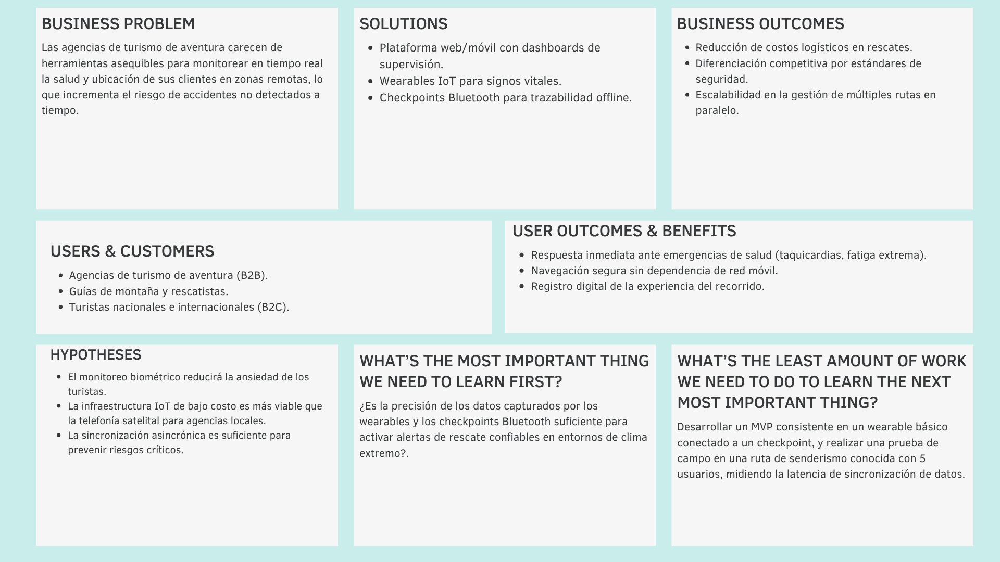

# Universidad Peruana de Ciencias Aplicadas

**Facultad de Ingeniería**

**Ingeniería de Software**

**Ciclo:** 5

**Aplicaciones Web - 1ASI0730**

**NRC:** 12206

**Profesor:** Velásquez Nuñez, Angel Augusto

**"Informe de Trabajo Final"**

**Startup:** Nexum Devs

**Producto:** VitalTrek

**Integrantes:**

- Alfaro Mallma, Alberto Joaquin - U20241A267
- Quispe Perez, Eder Edu - U202324623
- Rodriguez Rojas, Miler Alexander - U20241A827
- Verastigue Martinez, Giancarlo Jose - U202419483
- Vilchez Vite, Gabriel Alejandro - U202416903

**Abril 2026-10**

---

# Registro de Versiones del Informe

| Versión | Fecha | Autor | Descripción de modificación |
|---------|-------|-------|-----------------------------|
| AV1 | 26/04/2026 |   Alfaro Mallma, Alberto Joaquin     Vilchez Vite, Gabriel Alejandro     Quispe Perez, Eder Edu     Rodriguez Rojas, Miler Alexander     Verastigue Martinez, Giancarlo Jose   | Para esta primera entrega, elaboramos los cinco capítulos iniciales del informe y desarrollamos la versión inicial del landing page de VitalTrek.

---

# Project Report Collaboration Insights

Enlace del repositorio: https://github.com/DuDu-tech/NexumDevs.git

| Integrante | Tareas Designadas |
|------------|-------------------|
| Alberto Joaquin Alfaro Mallma | Capítulo I (2.1. Competidores, 2.1.1. Análisis competitivo, 2.1.2. Estrategias y tácticas frente a competidores, 2.2. Entrevistas, 2.2.1. Diseño de entrevistas), Capítulo II () |
| Vilchez Vite, Gabriel Alejandro | Capítulo I (2.3.3. User Journey Mapping, 2.3.4. Empathy Mapping, 2.4. Big Picture EventStorming, 2.5. Ubiquitous Language), Capítulo II () |
| Eder Edu Quispe Perez | Capítulo I (2.2.3. Análisis de entrevistas, 2.3. Needfinding, 2.3.1. User Personas, 2.3.2. User Task Matrix), Capítulo II () |
| Miler Alexander Rodriguez Rojas | Capítulo I (1.1. Startup Profile, 1.1.1. Descripción de la Startup, 1.1.2. Perfiles de integrantes del equipo, 1.2. Solution Profile, 1.2.1 Antecedentes y problemática), Capítulo II () |
| Giancarlo Verastigue Martinez| Capítulo I (1.2.2 Lean UX Process, 1.2.2.1. Lean UX Problem Statements, 1.2.2.2. Lean UX Assumptions, 1.2.2.3. Lean UX Hypothesis Statements, 1.2.2.4. Lean UX Canvas, 1.3. Segmentos objetivo.), Capítulo II () |

---

# Student Outcome

El curso contribuye al cumplimiento del Student Outcome ABET - EAC - Student Outcome 5, cuyo criterio es la capacidad de comunicarse efectivamente con un rango de audiencias. En el siguiente cuadro se describe las acciones realizadas y enunciados de conclusiones por parte del grupo, que permiten sustentar el haber alcanzado el logro del ABET - EAC - Student Outcome 5.

| Criterio específico | Acciones realizadas | Conclusiones |
|---------------------|---------------------|--------------|
| Comunica oralmente con efectividad a diferentes rangos de audiencia. |  **Alfaro Mallma, Alberto Joaquin**   **AV1:**    **Vilchez Vite, Gabriel Alejandro**   **AV1**:     **Quispe Perez, Eder Edu**   **AV1:**    **Rodriguez Rojas, Miler Alexander** **AV1:**    **Verastigue Martinez, Giancarlo Jose**  **AV1:**   | |
| Comunica por escrito con efectividad a diferentes rangos de audiencia. |  **Alfaro Mallma, Alberto Joaquin**   **AV1:**    **Vilchez Vite, Gabriel Alejandro**   **AV1**:     **Quispe Perez, Eder Edu**   **AV1:**    **Rodriguez Rojas, Miler Alexander** **AV1:**    **Verastigue Martinez, Giancarlo Jose**  **AV1:**   | |  

---

# Capítulo I: Introducción

## 1.1. Startup Profile

### 1.1.1. Descripción de la Startup

Nexum Devs es una startup tecnológica enfocada en el desarrollo de soluciones para el turismo de aventura en el Perú, orientada a mejorar la seguridad, trazabilidad y gestión operativa en entornos de baja conectividad. Surge para cubrir la falta de sistemas que permitan el monitoreo en tiempo real de turistas en zonas remotas.

Su producto principal, VitalTrek, es una plataforma web y móvil que centraliza la gestión de tours, permitiendo a las agencias supervisar la ubicación, estado y progreso de sus grupos mediante dashboards y alertas ante anomalías. A su vez, los turistas acceden a herramientas de navegación offline, registro de su experiencia y visualización de información contextual del recorrido.

A nivel técnico, VitalTrek integra un ecosistema IoT con dispositivos wearables y checkpoints Bluetooth que capturan datos de geolocalización y signos vitales. Estos se sincronizan de forma asincrónica, asegurando operatividad incluso sin conexión continua, lo que permite un sistema escalable, resiliente y orientado a la prevención de riesgos.

### 1.1.2 Perfiles de integrantes del equipo 

|||
|------|-------------|
|  | **Nombres y apellidos:** Alfaro Mallma, Alberto Joaquin    **Código:** U20241A267    **Descripción de carrera:** La ingeniería de software es una carrera enfocada en el diseño, desarrollo, prueba y mantenimiento de programas y aplicaciones informáticas. Los ingenieros de software aplican principios de ingeniería y métodos sistemáticos para crear soluciones de software eficientes, fiables y escalables que satisfacen las necesidades de usuarios y organizaciones.   **Principales conocimientos técnicos y habilidades:** Creatividad, trabajo en equipo, responsabilidad y conocimientos básicos en frameworks JavaScript, HTML, CSS, Angular 7 y Node.js |
|   |  **Quispe Perez, Eder Edu**   Código de Estudiante: U202324623  Me llamo Eder Edu Quispe Pérez, soy estudiante de Ingeniería de Software en la Universidad Peruana de Ciencias Aplicadas (UPC), manejo lenguajes como Python y C++, y en mi tiempo libre me gusta ver películas y series  |
|   |   **Rodriguez Rojas, Miler Alexander**   Código de Estudiante: U20241A827  Soy estudiante de Ingeniería de Software de quinto ciclo, con 22 años, enfocado en el desarrollo de soluciones tecnológicas eficientes. Me considero una persona con liderazgo, capaz de trabajar en equipo y adaptarme rápidamente a distintos entornos y necesidades del proyecto. Cuento con conocimientos en lenguajes y herramientas como SQL Server, C++, HTML, CSS y Python, los cuales aplico en el desarrollo de proyectos académicos y personales. En mis tiempos libres disfruto jugar fútbol, escuchar música, programar y ver películas, actividades que complementan mi creatividad y disciplina.|
|   | **Vilchez Vite, Gabriel Alejandro**   Código de Estudiante: U202416903    Mi nombre es Gabriel Alejandro Vilchez Vite, mi código es U202416903, actualmente estudio la carrera de ingeniería de software y estoy en mi 5to ciclo. Me considero una persona que no deja todos sus trabajos pendientes a última hora y que siempre trata de terminar todos sus trabajos a tiempo. Actualmente tengo conocimientos en matemáticas y en algunos lenguajes de programación como C++ y Matlab. Actualmente estoy estudiando Java.
|  | **Verastigue Martinez, Giancarlo Jose**   Código de Estudiante: U202419483   Mi nombre es Giancarlo Jose Verastigue Martinez, estudiante de Ingeniería de Software. Soy una persona responsable y enfocada en sus proyectos y metas, a nivel académico cuento con conocimientos en programación en el lenguaje de C++, con experiencia trabajando en equipo y bajo presión. Considero que soy organizado y detallista en mis proyectos. La experiencia laboral y la universidad me han hecho desarrollar habilidades para afrontar problemas o dificultades de manera exitosa, habilidades que aportaré a este grupo de trabajo y de esta manera sacar adelante nuestro proyecto.  |
---

## 1.2 Solution Profile

### 1.2.1. Antecedentes y problemática

Para estructurar el análisis del problema central que dio origen a AgroTrack, se utiliza el framework **5W2H**, que permite identificar con claridad el contexto, los actores involucrados y la naturaleza del problema.

---

**What (¿Qué ocurre?)**

En el Perú, las actividades de turismo de aventura como trekking, montañismo o expediciones en zonas remotas se realizan, en muchos casos, sin sistemas adecuados de monitoreo en tiempo real. Las agencias de turismo suelen depender de comunicación limitada, reportes manuales o el seguimiento básico por parte de guías, lo que dificulta tener visibilidad constante sobre la ubicación y el estado de los turistas.

Esto genera una brecha crítica en términos de seguridad. Ante situaciones como extravíos, accidentes, problemas de salud o cambios climáticos inesperados, la reacción suele ser tardía debido a la falta de información inmediata. Los turistas, por su parte, no cuentan con herramientas que les permitan conocer su estado físico o registrar su recorrido de manera estructurada, lo que limita tanto su seguridad como su experiencia.

---

**Why (¿Por qué sucede?)**

El problema responde a varias causas estructurales. En primer lugar, las soluciones tecnológicas existentes orientadas al monitoreo en campo suelen ser costosas, complejas o diseñadas para contextos distintos, como operaciones militares, rescate profesional o deportes de alto rendimiento en países desarrollados.

En segundo lugar, muchas zonas donde se realizan actividades de aventura en el Perú presentan conectividad limitada o inexistente, lo que dificulta la implementación de sistemas tradicionales basados en internet constante.

Además, existe una brecha tecnológica en las agencias de turismo de aventura, especialmente en las pequeñas y medianas, que no cuentan con herramientas digitales integradas para gestionar sus operaciones ni con soluciones IoT adaptadas a su realidad. A esto se suma que, hasta ahora, no existe una solución accesible que combine monitoreo de ubicación, salud y experiencia del usuario en una sola plataforma.

---

**Who (¿A quiénes afecta?)**

El problema impacta principalmente a dos perfiles:

- **Turistas de aventura**, tanto nacionales como extranjeros, que participan en actividades en zonas de difícil acceso. Estos usuarios enfrentan riesgos asociados a la falta de monitoreo constante, como desorientación, problemas de salud no detectados a tiempo o dificultades para pedir ayuda en emergencias.

- **Dueños de agencias de turismo**, especialmente aquellas que operan en entornos remotos. Estas organizaciones enfrentan desafíos para garantizar la seguridad de sus clientes, lo que no solo implica un riesgo humano, sino también reputacional y legal en caso de incidentes.

Ambos perfiles comparten una necesidad común: contar con información en tiempo real que permita prevenir riesgos y mejorar la toma de decisiones durante el desarrollo del tour.

---

**Where (¿Dónde ocurre?)**

La problemática se presenta principalmente en las zonas de turismo de aventura del Perú, como la sierra y áreas naturales alejadas: rutas de trekking en los Andes, selva alta y circuitos de montaña. Son entornos caracterizados por geografía compleja, condiciones climáticas variables y limitada cobertura de red, lo que incrementa el nivel de riesgo y dificulta la supervisión constante.

---

**When (¿Cuándo se hace más evidente?)**

El problema se vuelve más crítico durante el desarrollo del tour, especialmente en momentos donde pueden ocurrir incidentes: cuando los grupos se separan, cuando un turista presenta síntomas de fatiga o mal de altura, durante cambios bruscos de clima o en tramos de alta dificultad.

También se evidencia en situaciones de emergencia, donde la falta de información en tiempo real retrasa la capacidad de respuesta de la agencia, aumentando el impacto del incidente.

---

**How (¿Cómo se manifiesta el impacto?)**

Las consecuencias son visibles en tres dimensiones principales:

- **Seguridad**: la falta de monitoreo continuo incrementa el riesgo de accidentes graves, extravíos o atención tardía ante emergencias médicas.
- **Operativa**: las agencias no cuentan con herramientas centralizadas para gestionar múltiples grupos en campo, lo que reduce su capacidad de control y eficiencia.
- **Experiencia del usuario**: los turistas no tienen acceso a información relevante sobre su recorrido ni a herramientas que les permitan registrar y enriquecer su experiencia de forma integrada.

---

**How much (¿Cuál es la magnitud del problema?)**

El turismo es uno de los sectores clave en el Perú, y el turismo de aventura ha crecido significativamente en los últimos años, atrayendo tanto a viajeros nacionales como internacionales. Sin embargo, este crecimiento no ha ido acompañado de una adopción tecnológica equivalente en términos de seguridad y monitoreo.

La ausencia de soluciones integradas y accesibles para el control en tiempo real de turistas en zonas remotas representa una brecha importante en el sector. Esta situación no solo expone a los usuarios a riesgos innecesarios, sino que también limita la capacidad de las agencias para escalar sus operaciones de manera segura y competitiva.

# 1.2.2. Lean UX Process

### 1.2.2.1. Lean UX Problem Statements

Nuestra plataforma, VitalTrek, se sitúa en el dominio de la gestión de seguridad y logística para el turismo de aventura. Está dirigida a agencias de viajes y turistas que realizan rutas en zonas de baja conectividad.

Hemos identificado que el principal problema es la falta de visibilidad en tiempo real sobre la ubicación y el estado de salud de los grupos en ruta, debido a la dependencia de comunicaciones por radio inconstantes y la falta de señal celular. Aunque existen dispositivos GPS satelitales, sus altos costos y la falta de integración con datos biométricos limitan una respuesta preventiva ante emergencias.

¿Cómo podemos mejorar la capacidad de respuesta y supervisión en rutas de aventura, logrando que las agencias actúen de manera preventiva y los turistas se sientan seguros incluso sin conexión?.

**Domain** 
VitalTrek opera en la intersección de la gestión logística turística, la seguridad preventiva y la telemetría IoT. El entorno de acción se ubica en el turismo de aventura y expediciones al aire libre, específicamente en geografías caracterizadas por la ausencia o intermitencia de infraestructura de telecomunicaciones tradicionales (zonas "oscuras" de red celular).

**Customer Segments** 
El modelo de servicio atiende a dos actores fundamentales en el ecosistema turístico:
* **Segmento B2B (Operativo):** Agencias de turismo de aventura, operadores logísticos, directores de ruta y guías de montaña.
* **Segmento B2C (Usuario Final):** Turistas, senderistas y exploradores (nacionales e internacionales) que contratan estos servicios y transitan por las rutas.

**Pain Points** 
* **Para las Agencias:** La supervisión actual depende de reportes manuales o radiocomunicaciones inestables, generando una "ceguera operativa". Desconocen la ubicación exacta y el estado fisiológico de sus clientes en tiempo real. Esta falta de datos críticos provoca tiempos de reacción lentos ante emergencias médicas o extravíos, elevando drásticamente los costos de rescate y exponiendo a la empresa a riesgos legales y reputacionales.
* **Para los Turistas:** La desconexión total genera ansiedad e inseguridad. Además, la incapacidad de acceder a mapas interactivos o información del entorno sin conexión a internet disminuye la autonomía y empobrece la experiencia general del recorrido.

**The Gap** 
Existe una clara desconexión entre la necesidad de seguridad continua y las herramientas disponibles. Las soluciones satelitales actuales son financieramente prohibitivas para equipar a cada turista de forma individual en operaciones a gran escala. Por otro lado, las aplicaciones móviles estándar quedan completamente inoperativas al perder la señal celular. Actualmente, falta un sistema híbrido y asequible que logre integrar el monitoreo biométrico y la geolocalización de forma autónoma, sin depender de redes 4G/5G en tiempo real.

**Vision / Strategy** 
Nuestra visión es establecer a VitalTrek como el estándar tecnológico definitivo para la gestión de riesgo en el turismo de aventura. La estrategia se basa en desplegar una arquitectura de hardware y software resiliente: un ecosistema IoT asincrónico. Mediante el uso de wearables de bajo costo y checkpoints Bluetooth estratégicamente ubicados, capturaremos signos vitales y datos de ubicación que se sincronizarán en ráfagas. Esto permitirá transformar la gestión de las agencias de un modelo puramente reactivo a uno predictivo mediante dashboards centralizados y alertas automatizadas, mientras se dota al turista de herramientas robustas de navegación offline.

**Initial Segment** 
El despliegue inicial apuntará a agencias de turismo de aventura de tamaño mediano a grande que operan rutas de trekking de alta exigencia (como circuitos de alta montaña o selva densa). Estas agencias manejan volúmenes considerables de turistas, enfrentan los mayores riesgos operativos por la nula conectividad de sus zonas de trabajo y tienen una urgencia inmediata por elevar sus certificaciones y estándares internacionales de seguridad.

### 1.2.2.2. Lean UX Assumptions

**Assumptions Worksheet**

#### Supuestos del Negocio – VitalTrek

**Creo que mis clientes tienen la necesidad de:**
Mantener una supervisión constante sobre la ubicación y el estado de salud de los grupos de turistas en zonas remotas, reduciendo la incertidumbre y los tiempos de respuesta ante emergencias, sin depender de redes de telecomunicaciones tradicionales.

**Estas necesidades pueden resolverse con:**
VitalTrek, una plataforma web y móvil integrada con un ecosistema IoT (wearables y checkpoints Bluetooth) que captura y sincroniza de forma asincrónica datos biométricos y de geolocalización, dotando a las agencias de dashboards de control y a los turistas de herramientas de navegación offline.

**Mis clientes iniciales son (o serán):**
* **Segmento B2B:** Agencias de turismo de aventura, operadores logísticos y guías de alta montaña que gestionan rutas en zonas de baja o nula conectividad (como rutas andinas o expediciones en selva).
* **Segmento B2C (Usuarios finales):** Turistas y senderistas que buscan experiencias al aire libre seguras y desean registrar su progreso.

**El principal valor que un cliente quiere obtener de mi servicio es:**
Seguridad preventiva y visibilidad operativa en tiempo real (o cuasi-real) de toda la expedición, logrando autonomía total frente a la falta de cobertura celular.

**También pueden obtener estos beneficios adicionales:**
* Para las agencias: Reducción drástica de costos logísticos en misiones de búsqueda y rescate, y mejora en las certificaciones de seguridad internacionales.
* Para los turistas: Acceso a mapas interactivos offline, información contextual del recorrido y un registro digital de su experiencia.

**Adquiriré la mayoría de mis clientes a través de:**
* Venta directa B2B a agencias de turismo de aventura consolidadas.
* Alianzas estratégicas con asociaciones de guías de montaña, federaciones de andinismo y entidades gubernamentales de turismo.
* Presencia en ferias internacionales y nacionales de tecnología y turismo de aventura.

**Ganaré dinero mediante:**
Un modelo híbrido (Hardware-as-a-Service / SaaS):
* Venta o alquiler de la infraestructura física (wearables y nodos/checkpoints Bluetooth).
* Suscripción mensual/anual B2B por el uso de la plataforma web, almacenamiento en la nube, analítica de datos y gestión de alertas.

**Mi principal competencia en el mercado será:**
Sistemas de comunicación por radio (VHF/UHF), dispositivos de mensajería satelital (ej. Garmin inReach), y la gestión logística puramente manual/analógica.

**Superaremos a la competencia debido a:**
Nuestro enfoque escalable y preventivo. A diferencia de los dispositivos satelitales que son costosos por usuario y no miden la salud, VitalTrek permite monitorear de forma automática a decenas de turistas simultáneamente, detectando anomalías fisiológicas antes de que se conviertan en emergencias críticas, a una fracción del costo.

**El mayor riesgo de mi producto es:**
Que la latencia en la sincronización asincrónica (el tiempo entre checkpoints) sea demasiado alta para ser útil en una emergencia médica aguda, o que el hardware sufra averías en condiciones climáticas extremas.

**Lo resolveremos mediante:**
Un diseño de arquitectura de red optimizado para priorizar la transmisión de alertas críticas en ráfagas cortas de datos, y certificaciones de resistencia industrial (IP68) para todo el hardware IoT.

**Otras suposiciones que, si se demuestran falsas, harán que nuestro negocio fracase:**
* Que las agencias de turismo estén dispuestas a invertir en infraestructura tecnológica preventiva.
* Que los turistas acepten utilizar dispositivos wearables de la agencia durante su recorrido sin percibirlo como una invasión a su privacidad.

---

#### Supuestos del Cliente – VitalTrek

**¿Quién es el cliente?**
* **El Operador (B2B):** Directores de agencias de turismo y guías líderes que necesitan herramientas logísticas para garantizar el retorno seguro de sus grupos.
* **El Turista (B2C):** Personas apasionadas por el trekking y la aventura que valoran la seguridad pero exigen herramientas digitales modernas para enriquecer su viaje.

**¿Dónde encaja nuestro producto en su vida?**
En la fase de ejecución operativa del turismo. Para el guía y la agencia, es su centro de comando diario durante las expediciones. Para el turista, es su "guardián silencioso" y su brújula digital mientras camina por la ruta.

**¿Qué problemas soluciona nuestro producto?**
* La "ceguera operativa" de las agencias al no saber dónde están exactamente sus grupos.
* La incapacidad de detectar a tiempo un problema de salud (hipotermia, mal de altura, taquicardia) antes de que el turista colapse.
* La desorientación del turista por la inutilidad de las apps tradicionales al perder señal.

**¿Cuándo y cómo se utiliza nuestro producto?**
* **Uso en campo (Continuo):** Los turistas llevan el wearable que recopila datos automáticamente y consultan la app móvil para navegación offline.
* **Uso en base (Monitoreo):** El personal de la agencia visualiza el dashboard web desde su oficina, recibiendo actualizaciones asincrónicas conforme los grupos pasan por los checkpoints.

**¿Qué características son importantes?**
* Robustez y tolerancia a fallos de red (Offline-first).
* Alertas automatizadas y configurables según rangos de signos vitales normales/anormales.
* Sincronización Bluetooth de baja energía (BLE) transparente y sin fricción para el usuario.
* Mapas topográficos descargables y optimizados para dispositivos móviles.

**¿Cómo debe verse y comportarse nuestro producto?**
Debe tener un diseño minimalista, profesional y altamente funcional. Las interfaces deben priorizar la claridad de los datos, utilizando esquemas de alto contraste (para facilitar la lectura en exteriores bajo la luz del sol), evitando elementos visuales superfluos para centrarse exclusivamente en la tecnología, las métricas de salud y la cartografía.

### 1.2.2.3. Lean UX Hypothesis Statements

**Hipótesis 1: Monitoreo Biométrico Preventivo (Seguridad)**
* **Creemos que** equipar a los turistas con wearables IoT que monitorean sus signos vitales en tiempo real permitirá a los guías anticiparse a problemas de salud severos (como el mal de altura o agotamiento extremo) antes de que se conviertan en emergencias críticas.
* **Sabremos que esto es cierto cuando** los reportes operativos de las agencias muestren una reducción del 40% en evacuaciones médicas de emergencia durante los primeros seis meses de uso en campo.

**Hipótesis 2: Sincronización Asincrónica mediante BLE (Viabilidad Técnica)**
* **Creemos que** implementar checkpoints Bluetooth (BLE) estratégicos a lo largo de la ruta para sincronizar datos asincrónicamente garantizará la trazabilidad logística en zonas sin cobertura celular, sin necesidad de costosos equipos satelitales.
* **Sabremos que esto es cierto cuando** los dashboards de la agencia registren exitosamente el paso del 95% de los turistas por los puntos de control con una pérdida de paquetes de datos inferior al 5%.

**Hipótesis 3: Navegación Offline y Autonomía (Experiencia del Turista)**
* **Creemos que** proveer a los turistas con una aplicación móvil que contenga mapas topográficos interactivos e información contextual disponible 100% offline reducirá su ansiedad ante la desconexión y mejorará su percepción de seguridad.
* **Sabremos que esto es cierto cuando** las encuestas de satisfacción post-tour indiquen que al menos el 85% de los usuarios califiquen su sensación de seguridad como "Alta" o "Muy Alta" durante los tramos de cero conectividad.

**Hipótesis 4: Dashboards Centralizados y Alertas (Eficiencia Operativa B2B)**
* **Creemos que** centralizar la información de múltiples grupos simultáneos en un único dashboard web con alertas automatizadas por anomalías reducirá drásticamente la carga cognitiva de los operadores de la agencia.
* **Sabremos que esto es cierto cuando** el tiempo promedio de respuesta de la agencia ante una alerta temprana (desde que se detecta la anomalía hasta que se notifica al guía en campo) se reduzca a menos de 5 minutos.

**Hipótesis 5: Registro Digital de la Experiencia (Retención y Marketing)**
* **Creemos que** generar un resumen digital interactivo al finalizar el recorrido (que incluya la ruta trazada, hitos alcanzados y métricas físicas) incentivará a los turistas a compartir su logro, generando marketing orgánico para la agencia.
* **Sabremos que esto es cierto cuando** observemos que el 30% de los turistas que finalizan un tour compartan su "VitalTrek Summary" en redes sociales etiquetando a la agencia operadora en los primeros 30 días posteriores al lanzamiento.

**Hipótesis 6: Adopción del Modelo Híbrido SaaS/HaaS (Modelo de Negocio)**
* **Creemos que** ofrecer la infraestructura (wearables y checkpoints) bajo un modelo de alquiler o comodato, combinado con una suscripción de software (SaaS) escalable según el volumen de turistas, derribará la barrera de entrada económica para las agencias medianas.
* **Sabremos que esto es cierto cuando** logremos una tasa de conversión del 25% de agencias que pasan de la fase de "Piloto Gratuito" a "Suscripción Anual Pagada" dentro de un periodo de 3 meses.

### 1.2.2.4 Lean Ux Canvas

### 1.3. Segmentos objetivo

#### **1. Turistas de Aventura (Segmento B2C)**

Este segmento agrupa a los usuarios finales de la plataforma, quienes transitan por las rutas y portan los dispositivos IoT de VitalTrek.

* **Edad y Generación:** A nivel global, la mayoría de los turistas de aventura se concentra entre los 29 y 60 años, abarcando fuertemente a los Millennials y la Generación X. Específicamente en destinos de Sudamérica, existe una alta participación de viajeros en los rangos de 41 a 50 años y de 51 a 60 años.
* **Composición del viaje:** Si bien a nivel global un tercio de estos turistas prefiere viajar en pareja, el turismo de aventura también atrae a un grupo importante de viajeros solteros, cuya proporción (44%) es mayor a la del vacacionista promedio.
* **Comportamiento digital:** Muestran una alta dependencia tecnológica para la planificación; el 92% de estos turistas adquiere al menos un servicio por internet. Esto sustenta su predisposición a interactuar con aplicaciones móviles de navegación como la de VitalTrek.
* **Valor económico y estadía:** Representan un segmento altamente rentable. Permanecen en promedio 13 noches en el destino (tres noches más que el turista convencional) y realizan un gasto promedio de $1813 USD por viaje. 
* **Motivaciones principales:** Sus viajes están impulsados por la necesidad de autorrealización, la disminución del estrés y la búsqueda de interacciones auténticas con la naturaleza. Demandan experiencias que los saquen de su zona de confort, pero que garanticen protocolos de seguridad.

#### **2. Agencias de Turismo de Aventura (Segmento B2B)**

Este segmento representa a los clientes directos de VitalTrek, quienes adquieren la infraestructura y el software para gestionar a sus grupos.

* **Valor y crecimiento del mercado:** El turismo de aventura se ha consolidado como una fuerza disruptiva; en Latinoamérica, este mercado alcanzó una valoración estimada de 39,000 millones de dólares en gasto anual para el año 2026. A nivel mundial, se proyecta que el mercado de turismo de aventura supere los 1.9 billones de dólares para el año 2034.
* **Evolución del modelo operativo:** Las agencias se están alejando aceleradamente del modelo de turismo de masas tradicional, apostando por proyectos de inversión directa en modelos de hospitalidad más localizados, responsables y enfocados en el entorno.
* **Oferta de mercado:** La creación y venta de paquetes de viaje representa aproximadamente el 25% de los ingresos totales de las agencias de viaje, y un 18% de ellas ya se especializan en ofrecer paquetes temáticos seleccionados, como bienestar o aventura.
* **Adquisición de clientes y necesidad de confianza:** Aunque el turista es muy digital en su fase de investigación, el 64% de los que organizan su viaje a través de una agencia prefieren cerrar la compra de manera presencial. Esto indica que las agencias necesitan transmitir una confianza absoluta en sus estándares de seguridad operativa para asegurar la conversión, haciendo que plataformas preventivas como VitalTrek sean un diferencial de ventas crítico.
