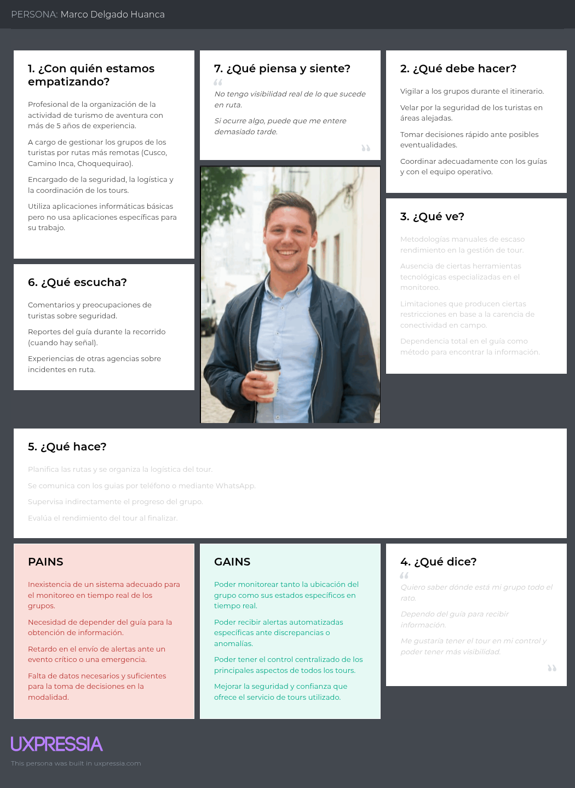
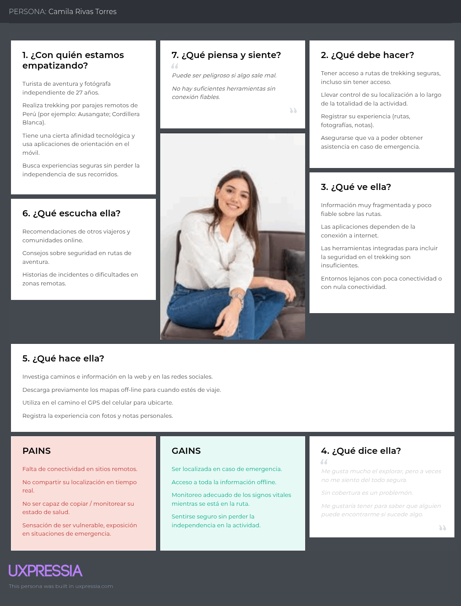

### 2.3. Needfinding
 
En esta sección se presentan los artefactos resultantes del proceso de análisis de la información recolectada durante la fase de Needfinding. A partir de las entrevistas realizadas a los segmentos objetivo y del análisis competitivo desarrollado en el capítulo anterior, el equipo ha sintetizado los hallazgos en artefactos que permiten visualizar de forma estructurada las características, comportamientos, motivaciones y necesidades de los usuarios potenciales de VitalTrek. Estos artefactos servirán como base para la definición de requerimientos funcionales y de diseño de la solución, asegurando que cada decisión esté centrada en el usuario y respaldada por evidencia recolectada en campo.
 
#### 2.3.1. User Personas
 
A continuación se presentan las fichas de User Persona elaboradas para cada uno de los dos segmentos objetivo de VitalTrek, identificados previamente en la sección de Segmentos Objetivo del capítulo anterior. La elaboración de estos arquetipos se sustenta en el análisis cualitativo de las entrevistas realizadas a representantes de cada segmento, así como en los hallazgos obtenidos del análisis competitivo, donde se evidenciaron brechas en la oferta actual de productos digitales para turismo de aventura en zonas de baja conectividad.
 
Las principales características consideradas para la construcción de los User Personas incluyen los datos demográficos, ocupación, comportamiento digital, motivaciones, frustraciones, objetivos personales y profesionales, así como el nivel de adopción tecnológica de cada segmento. Esta información fue contrastada con las debilidades detectadas en competidores como TrekkSoft, Wayward y AllTrails, especialmente en lo referente a la operatividad sin conectividad, la captura de signos vitales y la falta de personalización para el contexto peruano. De esta manera, los arquetipos no solo representan a los usuarios, sino que también encapsulan las oportunidades de diferenciación que VitalTrek puede capitalizar.
 
Se ha elaborado una ficha de User Persona por cada segmento objetivo, utilizando la herramienta UXPressia siguiendo las mejores prácticas de la industria. El primer User Persona, Ana Lucía Quispe, representa al segmento de agencias y operadores de turismo de aventura, mientras que el segundo, Marco Rodriguez, representa al segmento de turistas de aventura nacionales y extranjeros que contratan los servicios de estas agencias.
 
**User Persona 1: Ana Lucía Quispe**
 

Representa al segmento de agencias y operadores de turismo de aventura. Este arquetipo encarna a la gerente de operaciones de una agencia mediana en Cusco, responsable de coordinar guías, supervisar tours simultáneos y garantizar la seguridad de los grupos en zonas remotas. Sus motivaciones giran en torno a la profesionalización operativa, la reducción del tiempo de respuesta ante emergencias y la diferenciación competitiva mediante el uso de tecnología. Sus principales frustraciones se relacionan con la pérdida de comunicación con los guías por horas, la dependencia de WhatsApp y radios analógicas, y la ausencia de herramientas digitales adaptadas al contexto y al presupuesto de una micro o pequeña empresa peruana.

**User Persona 2: Marco Rodriguez**
 

Representa al segmento de turistas de aventura nacionales y extranjeros. Este arquetipo encarna al viajero europeo experimentado, con alto poder adquisitivo, dominio tecnológico y pasión por las experiencias outdoor auténticas. Sus motivaciones se centran en vivir aventuras seguras y memorables, mantener informados a sus familiares durante el recorrido y enriquecer su experiencia con información cultural e histórica del entorno. Sus frustraciones más relevantes son la incertidumbre sobre su ubicación al perder señal GPS, la imposibilidad de avisar a su familia durante varios días, y la carencia de aplicaciones móviles que funcionen sin conectividad continua en zonas remotas del Perú.

#### 2.3.2. User Task Matrix

A continuación se presenta el User Task Matrix, artefacto que concentra las principales tareas que los User Personas realizan para cumplir sus objetivos en el dominio del turismo de aventura. Es importante precisar que las tareas listadas corresponden a actividades que ambos segmentos llevan a cabo de manera independiente a la existencia de VitalTrek, ya que reflejan el comportamiento natural y las responsabilidades inherentes a cada rol dentro del ecosistema del turismo de aventura. Los segmentos considerados en esta matriz son las agencias y operadores de turismo de aventura, representados por Ana Lucía Quispe, y los turistas de aventura nacionales y extranjeros, representados por Marco Rodriguez.

Para cada User Persona se evalúan dos dimensiones por tarea. La frecuencia indica con qué regularidad realiza la tarea, expresada en una escala cualitativa de Muy Alta, Alta, Media, Baja o Muy Baja. La importancia indica el grado en que la tarea es crítica para el cumplimiento de los objetivos del User Persona, expresada en la misma escala. Cuando una tarea no aplica para un User Persona específico, se indica con la abreviatura N/A.

| Tarea | Ana Lucía Quispe (Agencia) - Frecuencia | Ana Lucía Quispe (Agencia) - Importancia | Marco Rodriguez (Turista) - Frecuencia | Marco Rodriguez (Turista) - Importancia |
|---|---|---|---|---|
| Planificar el itinerario y la logística del recorrido | Muy Alta | Muy Alta | Alta | Alta |
| Coordinar con guías y personal operativo en campo | Muy Alta | Muy Alta | N/A | N/A |
| Supervisar la ubicación y el estado de los grupos durante el tour | Muy Alta | Muy Alta | N/A | N/A |
| Comunicarse con familiares para informar el estado durante el viaje | Baja | Media | Muy Alta | Muy Alta |
| Reaccionar ante emergencias o anomalías en ruta | Media | Muy Alta | Baja | Muy Alta |
| Registrar la asistencia y datos personales de los turistas | Alta | Alta | Alta | Media |
| Investigar y comparar agencias o servicios turísticos | Media | Alta | Muy Alta | Muy Alta |
| Reservar y pagar los servicios de tours de aventura | Alta | Alta | Alta | Muy Alta |
| Orientarse y navegar durante el recorrido en zonas remotas | Media | Alta | Muy Alta | Muy Alta |
| Documentar la experiencia mediante fotografías y notas | Baja | Media | Muy Alta | Alta |
| Acceder a información cultural e histórica del recorrido | Baja | Media | Alta | Muy Alta |
| Monitorear los signos vitales y el estado físico durante la actividad | Baja | Alta | Alta | Alta |
| Generar reportes operativos y financieros del tour | Muy Alta | Muy Alta | N/A | N/A |
| Recopilar feedback y reseñas posteriores al servicio | Alta | Alta | Media | Media |
| Compartir la experiencia en redes sociales y comunidades de viajeros | Media | Media | Alta | Alta |
| Gestionar la facturación y los pagos a guías o proveedores | Muy Alta | Muy Alta | N/A | N/A |
| Capacitarse en protocolos de seguridad y rutas nuevas | Media | Alta | Baja | Media |

**Análisis de los resultados de la matriz**

A partir del análisis de la matriz se identifican patrones claros que evidencian las prioridades y comportamientos de cada User Persona, así como los puntos de convergencia y divergencia entre ambos segmentos:

En el caso de Ana Lucía Quispe, las tareas con mayor frecuencia e importancia se concentran en la dimensión operativa y de supervisión. La planificación del itinerario, la coordinación con guías, la supervisión de la ubicación y estado de los grupos, la generación de reportes operativos y la gestión de la facturación constituyen el núcleo de su actividad diaria. Estas tareas reflejan su rol como gerente de operaciones y subrayan la criticidad de contar con herramientas que faciliten la trazabilidad y la comunicación con los equipos en campo. Adicionalmente, la reacción ante emergencias, aunque presenta una frecuencia media, mantiene una importancia muy alta debido al impacto que tiene sobre la seguridad de los turistas y la reputación de la agencia.

En el caso de Marco Rodriguez, las tareas con mayor frecuencia e importancia se orientan hacia la dimensión experiencial y de seguridad personal. La investigación y comparación de agencias previa al viaje, la reserva y pago de servicios, la orientación y navegación en zonas remotas, la comunicación con familiares y el acceso a información cultural e histórica constituyen las actividades centrales de su comportamiento como turista de aventura. La documentación de la experiencia mediante fotografías y notas también ocupa un lugar relevante, lo que refleja el perfil del viajero contemporáneo que busca compartir y conservar memorias de sus aventuras.

Entre las principales coincidencias entre ambos User Personas destaca la relevancia que ambos otorgan a la planificación del itinerario y a la reserva de servicios, aunque desde perspectivas distintas. Mientras Ana Lucía planifica la logística operativa del lado de la oferta, Marco planifica su experiencia desde el lado de la demanda. Otra coincidencia importante es la criticidad de la reacción ante emergencias, que aunque ocurre con baja frecuencia, ambos consideran muy importante por sus implicancias en seguridad y bienestar. Finalmente, ambos User Personas comparten la necesidad de orientarse y navegar en zonas remotas, lo cual refuerza la importancia de contar con herramientas digitales que operen sin conectividad continua.

Entre las principales diferencias se observa que las tareas relacionadas con la supervisión de grupos, la generación de reportes operativos, la gestión de facturación y la coordinación con guías son exclusivas del User Persona de la agencia, mientras que las tareas vinculadas a la documentación de la experiencia, el acceso a información cultural y el compartir contenido en redes sociales son predominantes en el User Persona del turista. Esta diferenciación valida el enfoque dual de la propuesta de valor de VitalTrek, donde la plataforma debe atender tanto las necesidades operativas y de control de las agencias como las expectativas experienciales y de seguridad personal de los turistas.

#### 2.3.3. User Journey Mapping

El User Journey Mapping es una herramienta que permite visualizar de forma estructurada la experiencia del usuario a lo largo de su interacción con un producto o servicio. Realizamos los User Journey Maps en su versión As-Is para los tres segmentos objetivos.

<b>User Journey Map del 1er segmento objetivo – agencias y operadores de turismo</b>

<b>User Journey Map del 2do segmento objetivo - turistas de aventura </b>

#### 2.3.4. Empathy Mapping

El Empathy Mapping es una herramienta que nos permite profundizar en la experiencia emocional y cognitiva del usuario. A través de categorías como lo que el usuario piensa, siente, dice y hace, se busca comprender su contexto, así como sus principales miedos, frustraciones y motivaciones.

Para VitalTrek, elaborar un Empathy Mapping para cada segmento objetivo fue clave para entender no solo cómo las agencias planifican la logística y cómo los turistas viven la experiencia outdoor, sino también cómo enfrentan la incertidumbre de la desconexión en zonas remotas, los retos de seguridad y la respuesta ante posibles emergencias. Esta comprensión más empática nos permite diseñar un ecosistema tecnológico que responda a sus necesidades reales, brindando tranquilidad y reduciendo los puntos de dolor presentes en la gestión actual de las rutas de aventura.

<b>Empathy Mapping del 1er segmento objetivo – agencias y operadores de turismo</b>

<b>Empathy Mapping del 2do segmento objetivo – turistas de aventura </b>
