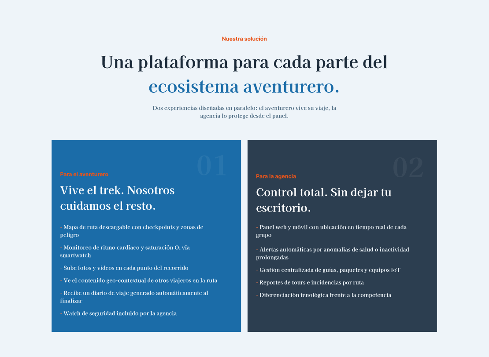

## 4.3 Landing Page UI Design
###  4.3.1 Landing Page Wireframe

Para la landing page se realizaron low-fi Wireframes de cada una de las pantallas del sitio:

Pantalla 1:

Pantalla 2:

Pantalla 3:

Pantalla 4:

Pantalla 5:

Pantalla 6:

Pantalla 7:

Pantalla 8:

Pantalla 9:

### 4.3.2 Landing Page Mock-up

**Estructura general y lineamientos visuales**

El Mock-Up de la landing page de VitalTrek se desarrolla con un nivel de fidelidad alta, empleando contenido real, imágenes representativas y componentes visuales funcionales, siguiendo una línea gráfica moderna orientada al turismo de aventura y la seguridad tecnológica.

**Aplicación del Branding**

Se incorporan los elementos de identidad visual de VitalTrek, como el logotipo, la paleta cromática institucional y el mensaje principal enfocado en aventura segura. El logotipo se ubica en la parte superior izquierda dentro de la barra de navegación, fortaleciendo el reconocimiento de marca.

La propuesta visual transmite confianza, innovación y conexión con la naturaleza mediante el uso de colores oscuros combinados con tonos azules y acentos naranjas, asociados con tecnología, seguridad y energía.

**Estructura visual:**

- **Zona superior:** barra de navegación con enlaces principales (Solución, Tecnología, Features, Cómo funciona, Nosotros) y botón de llamada a la acción “Únete”.

- **Sección principal** (Hero): mensaje central de alto impacto: “La montaña no espera. Pero tú siempre sabrás dónde está tu grupo.”, acompañado por imagen de excursionistas en montaña, reforzando la propuesta de valor.

- **Sección problema:** presentación del contexto actual del turismo de aventura en Perú, mostrando estadísticas relevantes y resaltando el vacío tecnológico existente en el sector.

- **Sección solución:** explicación de la plataforma para agencias y viajeros, mediante bloques comparativos que detallan beneficios para cada tipo de usuario.

- **Sección tecnología IoT:** presentación del smartwatch inteligente como dispositivo principal de monitoreo, mostrando funciones como alertas, checkpoints, signos vitales y emergencias.

- **Sección funcionalidades:** tarjetas informativas que resumen herramientas clave del ecosistema VitalTrek (rutas offline, salud en ruta, GPS grupal, alertas, diario automático, mapas con memoria, etc.).

- **Sección proceso:** explicación del funcionamiento del servicio en cuatro pasos simples, facilitando la comprensión del usuario.

- **Sección nosotros:** presentación de la visión, misión y valores corporativos, destacando el origen del proyecto y su propósito social.

- **Testimonios:** opiniones de agencias y aventureros que validan la utilidad de la solución.

- **Zona de contacto:** formulario de interés para potenciales clientes o aliados estratégicos.

- **Zona inferior** (Footer): redes sociales, datos de contacto, navegación rápida y enlaces legales.

**Aplicación de guía de estilos:**

- **Tipografía:** combinación de serif elegante para títulos y sans-serif moderna para textos secundarios, generando contraste visual y profesionalismo.

- **Jerarquía tipográfica:**

  - Títulos principales: 38–48 px
  - Subtítulos: 26–32 px
  - Texto base: 16–18 px

- Paleta cromática:
  - Azul oscuro (#24384C) como color principal institucional.
  - Azul claro (#AFC6D9) para fondos suaves.
  - Naranja (#F26A21) como color de acento y llamados a la acción.
  - Blanco y gris claro para equilibrio visual.

- Layout: estructura modular basada en grillas de 2 y 3 columnas en versión desktop, con espaciado amplio y buena respiración visual.

**Principios de diseño y arquitectura de la información:**

El contenido se distribuye jerárquicamente para conducir al usuario desde el problema hasta la solución ofrecida. La navegación superior permite acceso rápido a secciones clave. Se prioriza la claridad del mensaje, el uso estratégico del contraste y una lectura escaneable mediante bloques cortos y secciones diferenciadas.

Los botones de acción destacan por color, ubicación y tamaño, incentivando conversiones como registro o solicitud de información.

**Diseño inclusivo:**

El Mock-Up considera principios de accesibilidad mediante contrastes adecuados, textos legibles, botones visibles y estructura adaptable a distintos dispositivos. Asimismo, se emplean etiquetas claras en formularios e íconos reconocibles para mejorar la experiencia de todo tipo de usuarios.

